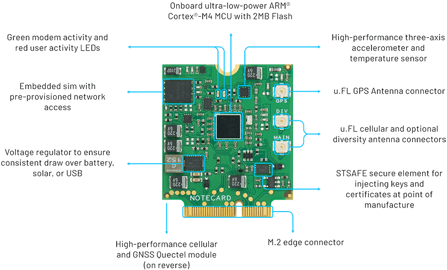

# 20,000,000 and Counting

*Notecards have now sent more than 20M events to Notehub.io (and beyond)!*

It's been less than a year since the curtains were pulled back on Blues Wireless and we introduced a new way to tackle cellular IoT, that being the [Notecard](/products/notecard/).

As a device-to-cloud data pump with a developer-friendly [JSON-based API](https://dev.blues.io/#sneakpeek), the Notecard has helped many IoT solutions realize the promise of cellular. From the [Airnote](/products/airnote/) (providing remote air quality data) to ??? (???) to ??? (???), in less than a year the Notecard has proven itself a secure, reliable, and trusted component in a wide variety of IoT deployments.

## Why Cellular?

While you can draw a line between the Fukushima nuclear disaster, the subsequent on-the-ground communication issues, and the creation of Blues Wireless (which is a [fascinating read](/blog/soul-of-a-new-machine/)), it's otherwise long been known that adding cellular access is a tedious process to say the least.

The advantages of utilizing cellular connectivity for the IoT are numerous:

- **Coverage:** Cellular networks are ubiquitous, mature, and reliable.
- **Global Reach:** There is no other network technology with the reach of cellular.
- **Security:** SIM-based authentication and utilization of private VPN tunnels makes cellular the most secure option.
- **Installation:** Works out-of-the-box without requiring local installation or technical expertise.
- **Low/No Power:** The Notecard consumes ~8mA when idle, and networks are still available in the case of a power outage.

But that doesn't mean the Blues Wireless journey starts and ends with cellular. We're well aware that many of you rely on Wi-Fi and LoRa for your IoT solutions. For now let's just say: "stay tuned" as we start to emphasize the "Wireless" in Blues Wireless in 2022 😉.

## 20,000,000 Events

As of this writing (October 2021), Notecards from around the world have successfully delivered more than 20,000,000 events to the Blues Wireless cloud service, [Notehub.io](/services/).

Notehub.io exists not as an end point for anyone's data, but rather as a thin layer to:

- **Securely route data** from a Notecard to any cloud, off the public Internet;
- Optionally process and **optimize data** when routing;
- Provide device and **fleet management**;
- Perform remote, cloud-based, device and MCU **firmware upgrades**.

Unlike other providers, Blues Wireless doesn't want to lock you into keeping your data on Notehub.io. We'd rather you experienced success by seeing your data end up where it matters:

## Join us for 100,000,000

Here at Blues Wireless, we're just getting started. While our primary concern is making wireless easy for developers and affordable for all, we are keenly aware of other pain points you experience. Hence the creation of the most extensible Feather-compatible MCU on the market, [Swan](/products/swan/), and the aforementioned air quality monitoring solution, [Airnote](/products/airnote/).

So join us as Notecards globally march towards delivering **100,000,000 events** (or more!?) in 2022. [Grab your own starter kit](https://shop.blues.io/) and join our [growing community](https://discuss.blues.io/).

Happy Hacking! 👩‍💻