# Monitor Indoor Air Quality with Blues, IFTTT, Adafruit IO and a Hue LED Strip

If you're working an office job, you're...in an office. Whether that's in your home or not, I'm going to hazard a guess that it's also indoors - and being indoors for an extended period of time without well-ventilated spaces can legitimately lead to low air quality (and in theory health issues).


Now, I'm not hear to spread fear and make you all think you're dying a slow death by breathing in your co-worker's exhalations. However, I am here to show off an **easy way to build a cloud-connected indoor air quality system** with:

1. A variety of Adafruit air quality sensors.
1. A [Blues Notecard](https://shop.blues.com/products/notecard-cellular) to cloud-connect the project with LTE connectivity.
1. [Adafruit IO](https://io.adafruit.com/) to visualize air quality data and integrate with other services.
1. A [Philips Hue LED strip](https://www.philips-hue.com/en-us/products/smart-light-strips) to provide real-time visuals for low air quality alerts.

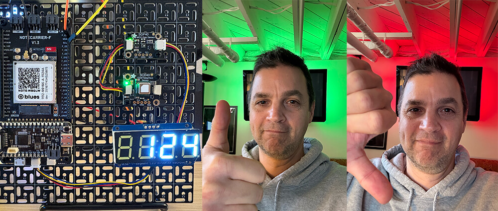

## The Hardware Components

Let's start with the sourcing and assembly of our distinct hardware components.

### Air Quality Sensors from Adafruit

[Adafruit](https://www.adafruit.com/) is my go-to source for components when prototyping a new project. So, inspired by TJ VanToll's project on [Monitoring Home CO2 Levels with LoRaWAN](https://www.hackster.io/tjvantoll/monitoring-home-co2-levels-with-lorawan-0b53a3), I started with the [Adafruit SCD40 sensor](https://www.adafruit.com/product/5187) to measure temperature, humidity, and CO2 levels.

INSERT PART

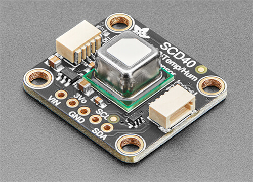

Next, I wanted to find an easy way to **measure VOC levels** (volatile organic compounds). [Adafruit's SGP40 gas sensor](https://www.adafruit.com/product/4829) provides just that, with the supported library giving access to "raw" gas levels and an algorithm to output a VOC index.

INSERT PART

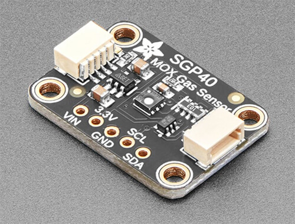

As an aside, I also used a [7-segment display](https://www.adafruit.com/product/1001) to show the most recently calculated VOC index, locally:

INSERT PART

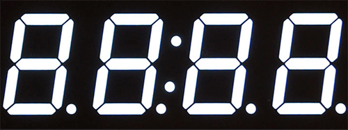

### Cloud Connectivity from Blues

I knew I needed **more than just a local display of a single value** on that 7-segment display. I wanted to create a true cloud-connected system that let me use a cloud service like **Adafruit IO** to visualize data, send alerts, and interface with other "smart home" devices.

That journey started and ended with [Blues](https://blues.com/) and the [Notecard Cellular](https://shop.blues.com/products/notecard-cellular).

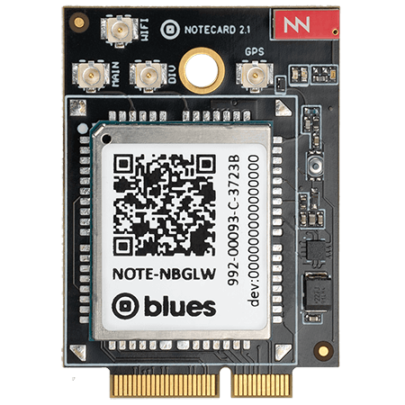

While even saying the word "cellular" can be scary to some, Blues simplifies cellular by hiding that archaic AT command syntax behind a [robust JSON-based API](https://dev.blues.io/api-reference/notecard-api/introduction/). Not to mention, there are no monthly SIM fees with Notecard - just a one-time charge for the hardware that **includes 500MB of data and service in 140+ countries**.

### Host MCU and Carrier Board

To bring all the components together, I chose to use an STM32-based host MCU (the Feather-compatible [Blues Cygnet](https://shop.blues.com/collections/feather-mcu/products/cygnet)) and another Blues-provided component, the [Notecarrier F](https://shop.blues.com/products/notecarrier-f). Notecarrier F provides a (physical) development platform on which you can mount a Notecard, a Feather-based host MCU, and wire up your sensors and other peripherals.

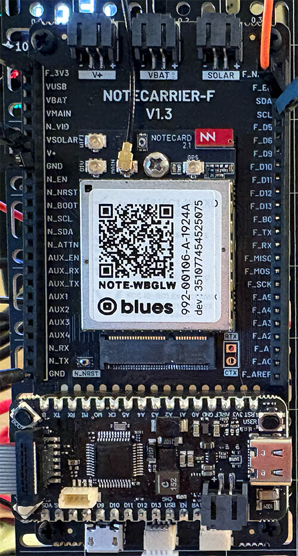

### Final Hardware Results

Wiring the 7-segment display was as simple as providing power and attaching ground, SDA, and SCL wires. Thanks to the convenience of STEMMA QT/Qwiic connectors, the other two Adafruit air quality sensors were attached via a few cables:

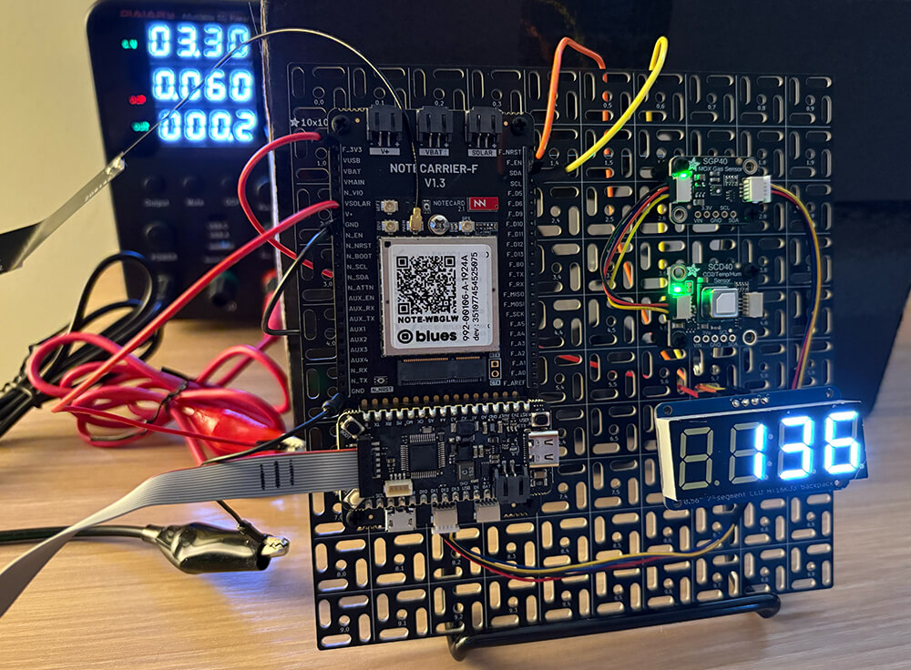

## Writing the Firmware

I generally flip back and forth between writing Arduino/C and CircuitPython. For this project I chose Arduino/C - only because CircuitPython support for the Blues Cygnet is *not quite ready*. However, either way, there is robust support for both languages provided by the Adafruit sensor libraries and [Blues Python](https://dev.blues.io/tools-and-sdks/firmware-libraries/python-library/) or [Blues Arduino](https://dev.blues.io/tools-and-sdks/firmware-libraries/arduino-library/) SDKs.

The full source code is [available here on GitHub](https://gist.github.com/rdlauer/8be390f39462117631d8e1b215b4d359). However, here are a few highlights:

### Air Quality Sensor Data

Aside from some necessary ceremony to initialize the air quality sensors, actually 
pulling the values out is a matter of a few commands:

```
scd40.measureAndReadSingleShot(co2, temp, humid);
sraw = sgp.measureRaw(temp, humid);
vocIndex = sgp.measureVocIndex(temp, humid);
```

### Coding Cellular Connectivity

Again, Blues makes it incredibly easy to cloud-connect this project. In fact, it's only two commands to send local sensor data to the cloud.

The first destination for our data is the [Blues cloud service Notehub](https://notehub.io/), which acts as a **secure cloud proxy for Notecard** and will eventually route collected sensor data to Adafruit IO.

1. Using the `hub.set` API:

   The [hub.set API](https://dev.blues.io/api-reference/notecard-api/hub-requests/latest/#hub-set) tells the Notecard to which Notehub cloud project it should send data.
   
   After setting up a (free) Notehub project, you're given a globally unique `ProductUID`:

   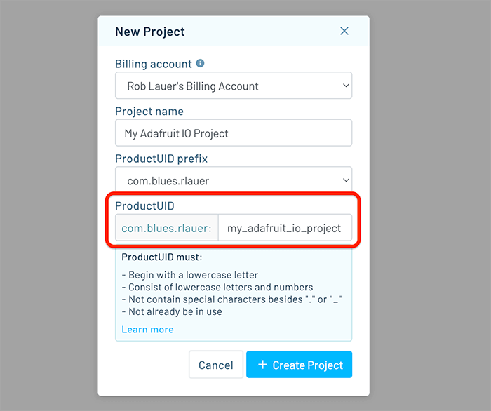

   And the supporting code block:

   ```
   {
      J *req = notecard.newRequest("hub.set");
      if (req != NULL)
      {
         JAddStringToObject(req, "product", PRODUCT_UID);
         JAddStringToObject(req, "mode", "continuous");
         notecard.sendRequest(req);
      }
   }
   ```

1. Using the `note.add` API

   Every time we want to sync accumulated sensor data with the cloud, we call the [note.add API](https://dev.blues.io/api-reference/notecard-api/note-requests/latest/#note-add). This creates an event (or a [Note](https://dev.blues.io/api-reference/glossary/#note) in Blues lingo) full of all our sensor data.

   ```
   {
      J *req = notecard.newRequest("note.add");
      if (req != NULL)
      {
        JAddStringToObject(req, "file", "sensors.qo");
        JAddBoolToObject(req, "sync", true);
        J *body = JAddObjectToObject(req, "body");
        if (body)
        {
          JAddNumberToObject(body, "temp", temp);
          JAddNumberToObject(body, "humid", humid);
          JAddNumberToObject(body, "co2", co2);
          JAddNumberToObject(body, "raw", sraw);
          JAddNumberToObject(body, "voc", vocIndex);
          JAddNumberToObject(body, "voltage", voltage);
        }
        notecard.sendRequest(req);
      }
   }
   ```

   And the resulting data appears in the Notehub project like so:

   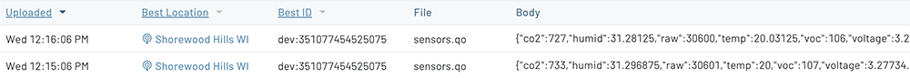

## Cloud Connectivity

At this point we are **gathering sensor data locally and sending it periodically to the cloud**
over cellular.

Cool!

However, now we need to *do something meaningful* with this data, and that's where [Adafruit IO](https://io.adafruit.com/) comes into play. With a generous free tier, this cloud service provides a ridiculously easy way to **visualize data (dashboards), create alerts (actions), and even integrate with third-party services (power-ups)**.

### Adafruit IO Feeds

After setting up an Adafruit IO account, head to the **Feeds** section to create one feed for each data element you want to use:

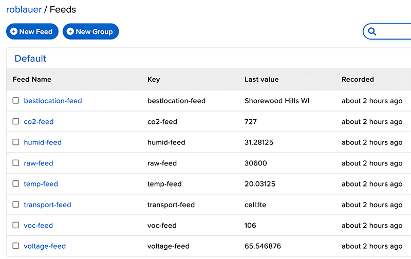

### Blues Notehub

Next, we need to head *back to Notehub* to create a **route** which will tell Notehub how to deliver events to Adafruit IO!

From the **Routes** menu option, choose **General HTTP/HTTPS Request/Response** which lets us send data to the Adafruit IO HTTP APIs.

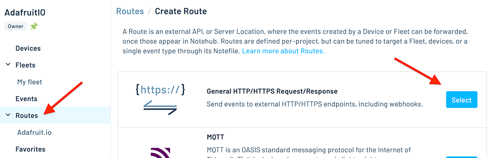

To set up the rest of the route:

1. The **URL** will be: `https://io.adafruit.com/api/v2/{username}/groups/{group}/data`
   
   Where `{username}` is your Adafruit IO username and `{group}` is the name of the group that encapsulates your feeds. (This is probably `default`.)

1. Under **HTTP Headers** you'll have to add your Adafruit IO key (which is available back in your Adafruit IO account).
   
   `X-AIO-Key` is the name and your Adafruit IO key is the value.

1. Under **Filters** you'll want to send the sensor data associated with this project and ignore other session and health info that Notecard sends.
   
   Therefore, under the **Notefiles** section, choose **Selected Notefiles**, and then `sensors.qo` (which is the [name of the Notefile used in code](https://gist.github.com/rdlauer/8be390f39462117631d8e1b215b4d359#file-main-cpp-L76)).

1. Lastly in the **Data** section, we'll need to edit or *transform* the JSON payload sent from the device before it's delivered to Adafruit IO. Every cloud service has a certain format of data they expect, and Adafruit IO is no different!

   In essence we need to create a set of key-value pairs, one for each data element we are sending. Something like...

   ```
   {
     "key":"co2-feed",
     "value":body.co2
   }
   ```

   How is this accomplished? Through the magic of [JSONata](https://jsonata.org/) expressions! JSONata lets you transform JSON objects on the fly.

   **TIP:** The [JSONata Exerciser](https://try.jsonata.org/) is a great way to test out JSONata expressions!

   Here's the full JSONata expression I used, with an image of this expression in the aforementioned JSONata Exerciser:

    ```
    {
      "feeds":[
         {
               "key":"bestlocation-feed",
               "value":best_location
         },
         {
               "key":"co2-feed",
               "value":body.co2
         },
         {
               "key":"humid-feed",
               "value":body.humid
         },
         {
               "key":"raw-feed",
               "value":body.raw
         },
         {
               "key":"temp-feed",
               "value":body.temp
         },
         {
               "key":"transport-feed",
               "value":transport
         },
         {
               "key":"voc-feed",
               "value":body.voc
         },
         {
               "key":"voltage-feed",
               "value":body.voltage/5*100
         }
      ],
      "created_at":$fromMillis(when * 1000),
      "location":{
         "lat":best_lat,
         "lon":best_lon
      }
    }
    ```

   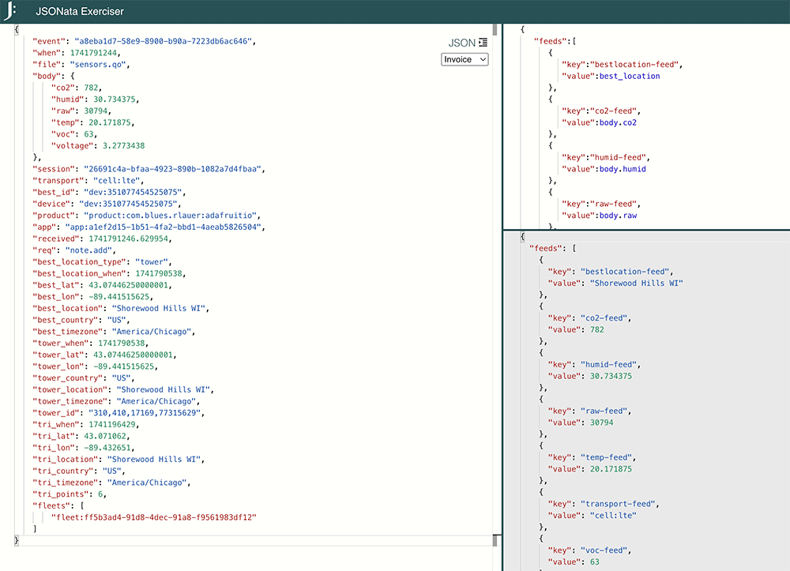

1. Finally, save the route (making sure it's enabled) and watch as the next event comes in. You should see a little green check under the status column in the **Event** view, which tells you the event was successfully routed to Adafruit IO!

   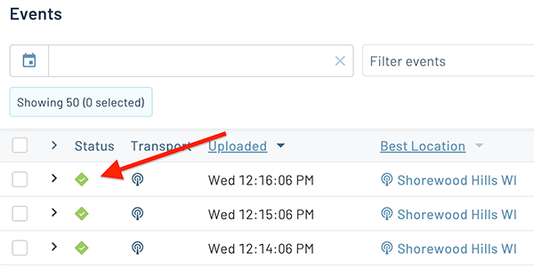

### Adafruit IO Dashboard

Now that we have data flowing into Adafruit IO, let's create a dashboard.

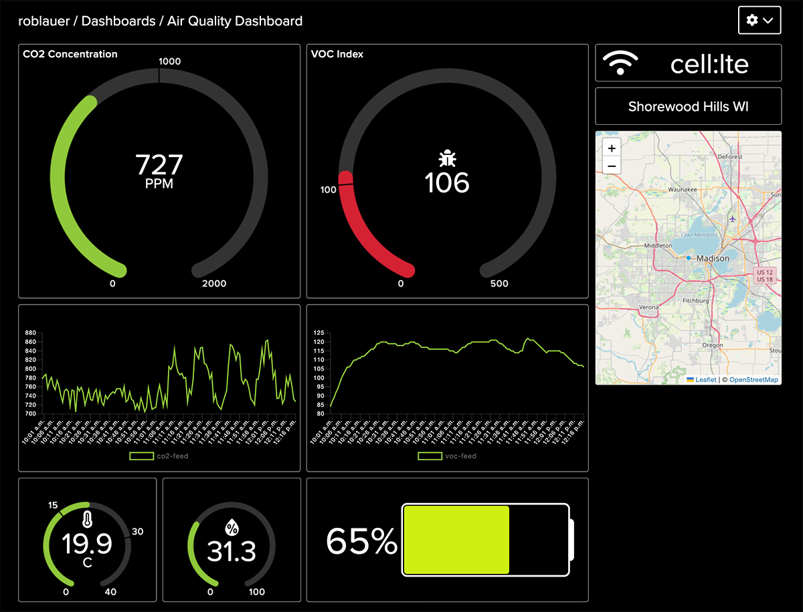

1. Head to the **Dashboards** menu option in Adafruit IO and create your first dashboard.

1. Using the intuitive UI provided, create one or more **blocks** for each **feed**. For example, using the VOC index data feed, I created a **gauge** to show the most recent reading and a **line chart** to show historical readings:

   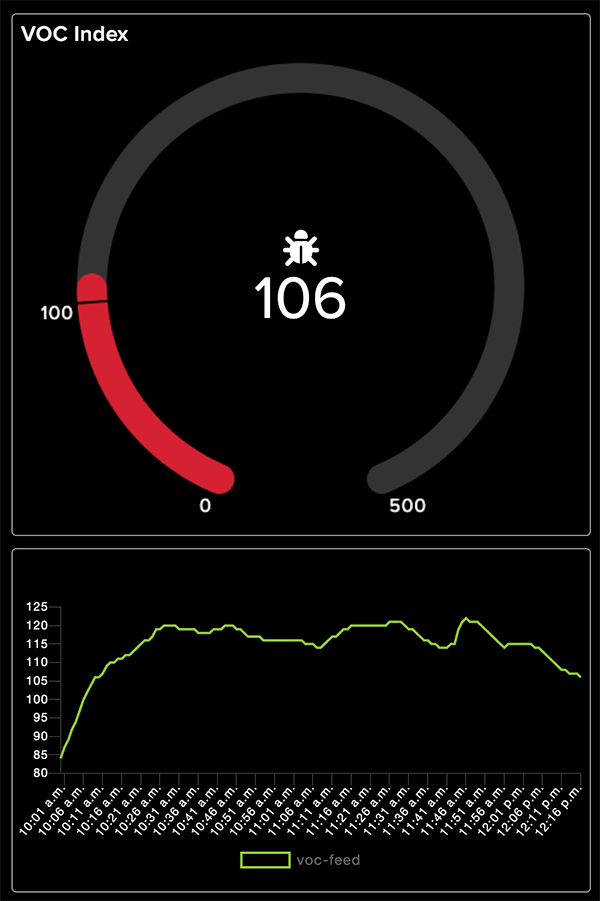

1. Now, **repeat the previous step** for every data element you want to visualize. It's that simple!

### Adafruit IO Actions

Next up, I thought it would be handy to **receive an email alert** every time my VOC index went above 100 (generally a point when air quality goes from good to not-so-good!).

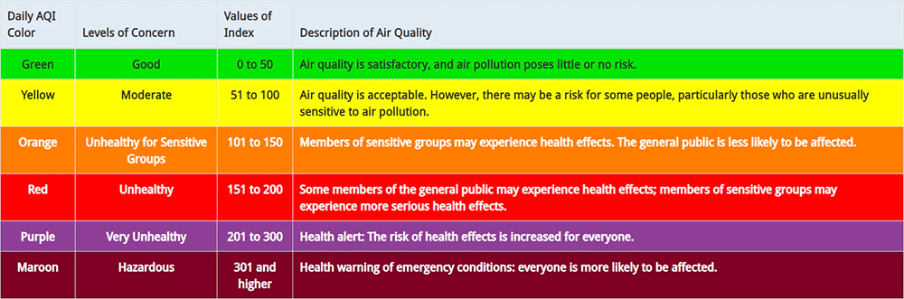

1. Head to the **Actions** menu option in Adafruit IO.

1. Create a new action using either a form or the "Blockly" editor (which feels a bit like programming in [Scratch](https://scratch.mit.edu/)!).

1. Here's what my email alert looks like in the **Blockly editor**:

   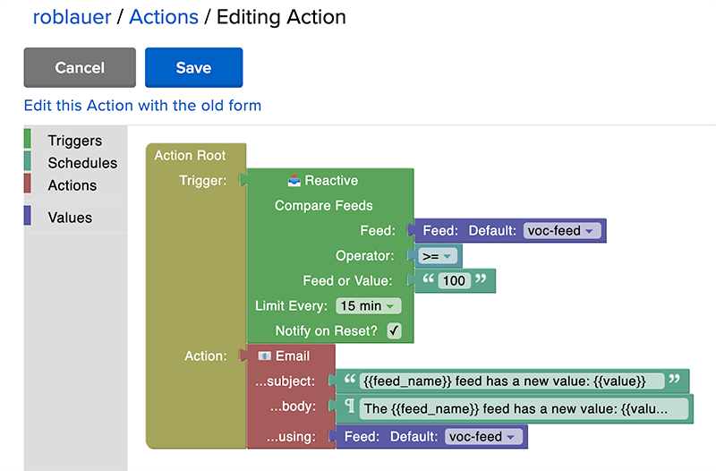

1. And the alerts? Pretty slick:

   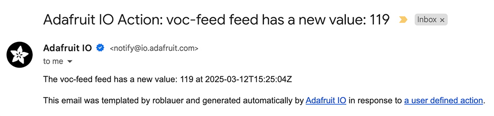

### Adafruit IO Power-Ups

Now it's time to get serious with **Adafruit IO Power-Ups**!

These are robust integrations with third party services like IFTTT, Zapier, and SMS for messaging (among other services).

Personally I thought it would be pretty neat to use [IFTTT](https://ifttt.com/) to integrate with my Philips Hue LED strip and provide some more dramatic feedback when my local air quality (the VOC index) goes wrong!

Remember this image from earlier?


Let's get this set up.

1. Choose the **IFTTT** from the **Power-Ups** menu in Adafruit IO.

1. Log in to your IFTTT account and [create an applet](https://ifttt.com/create).

1. The first step of the applet is to monitor a monitor a feed from Adafruit IO. Search for "Adafruit" and complete the form as needed to set the color to green (e.g. if the VOC value is <= 100).

   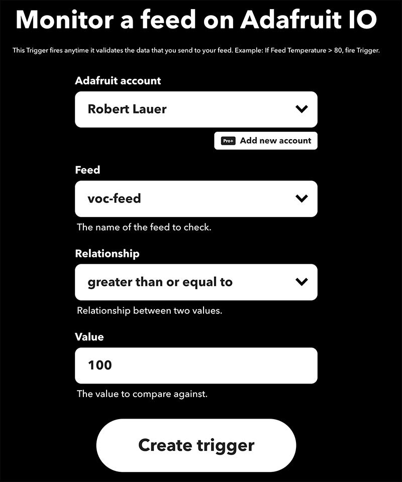

1. Next, in the "then" section, you'll want to connect to your Hue account and select the "change color" action for your HUE light.

   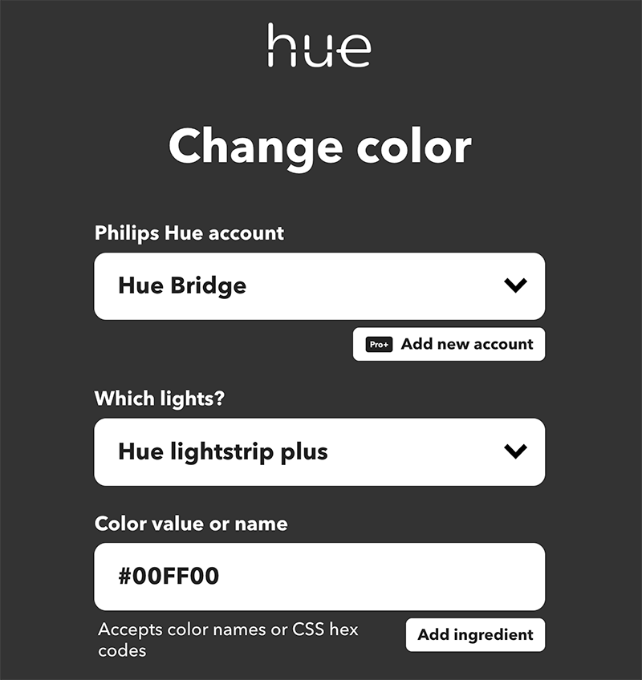

1. The IFTTT applet should then be complete!

   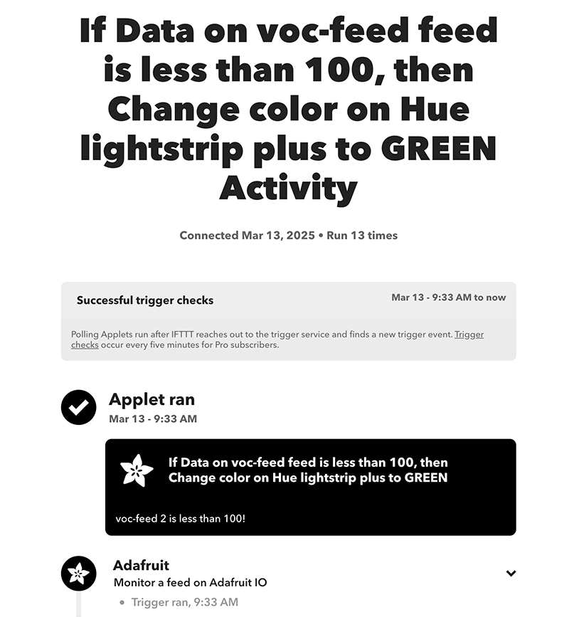

1. You'll want to repeat this process to set the red color, changing the "if" statement to trigger if the VOC value is > 100.

## Final Results

And the results? Great success!

https://youtu.be/pYM0PNfwX8U

*Bonus points if you can spot the cat!*

So I hope you've seen **how easy it can be to build a truly cloud-connected product** that can:

1. Measure indoor air quality.
1. Send that data to the cloud.
1. Visualize that sensor data on a dashboard.
1. Generate email alerts when air quality goes south.
1. Visualize the results on a local smart home device.

Thanks to the simplicity (and power) of **Blues Notecard and Adafruit IO** this project took me only a few hours to piece together - and I hope you can do the same!

Get started with [Adafruit IO here](https://io.adafruit.com/) and get your own [Blues Starter Kit here](https://io.adafruit.com/). The starter kit includes an STM32 host, Notecarrier F, and a Notecard Cell+WiFi. Remember too, the full source code for this project is [available here on GitHub](https://gist.github.com/rdlauer/8be390f39462117631d8e1b215b4d359)!

Happy Hacking!
