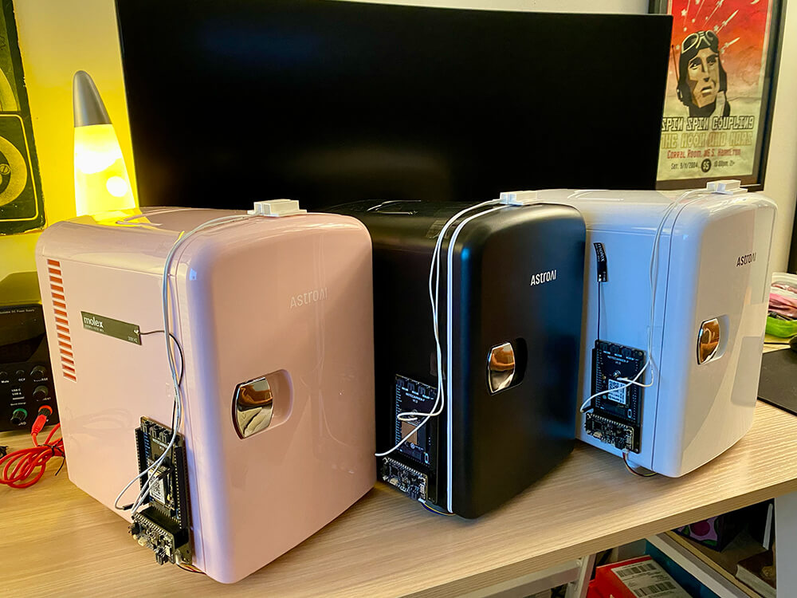
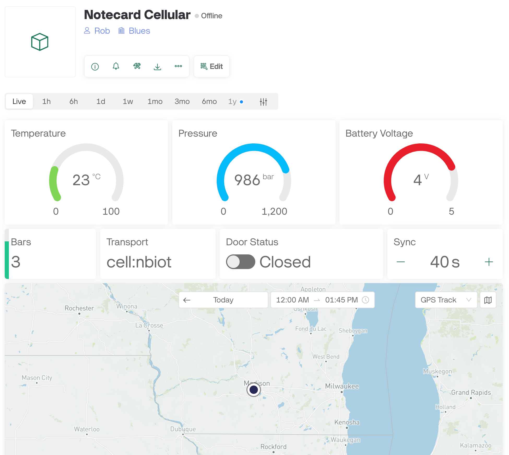
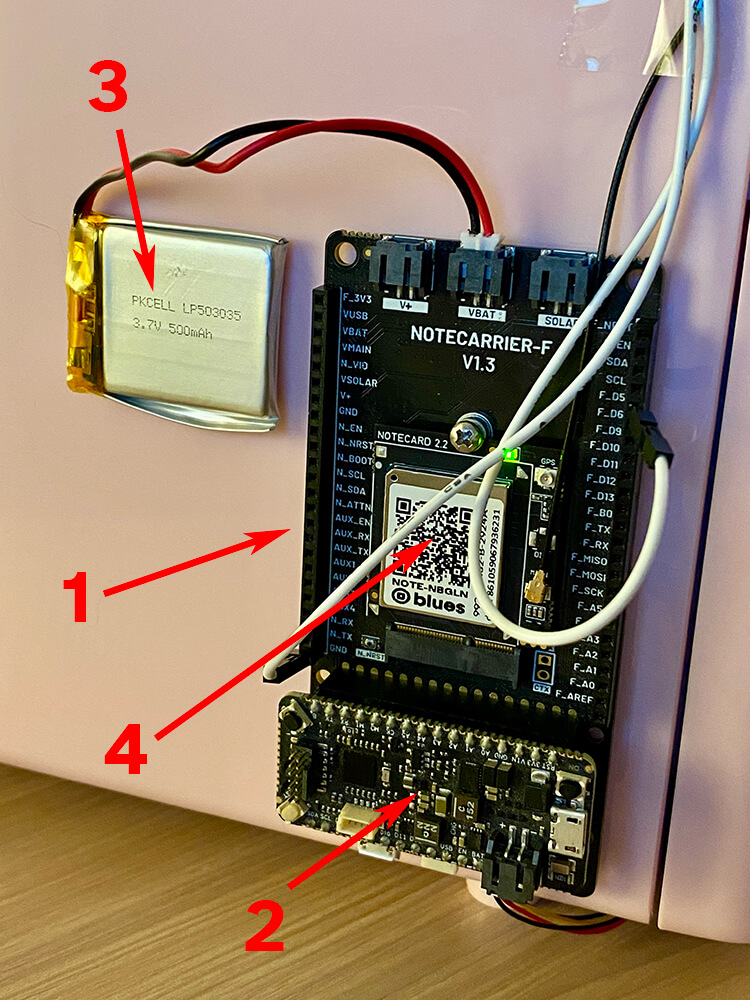
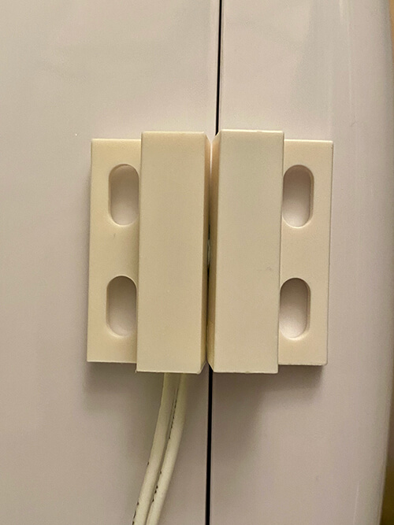
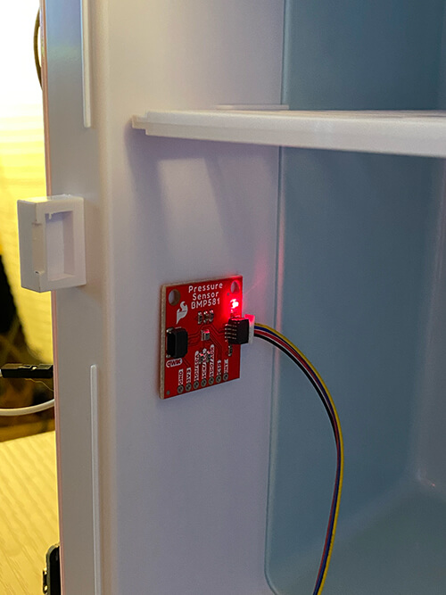
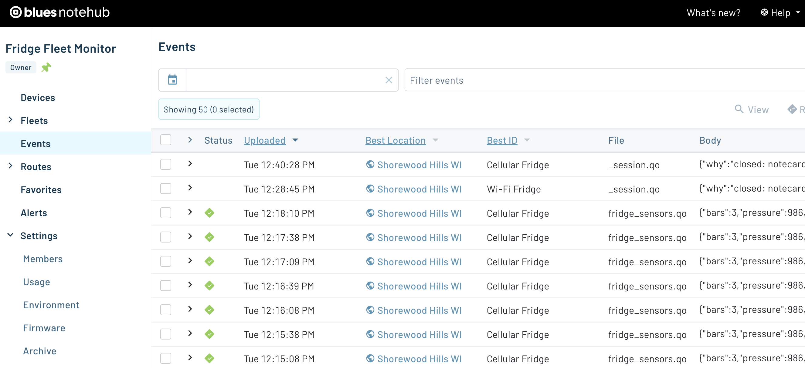
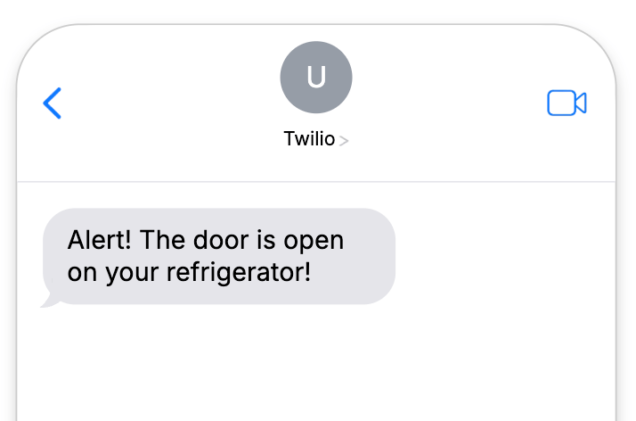
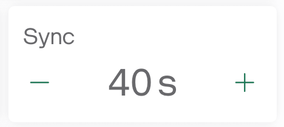
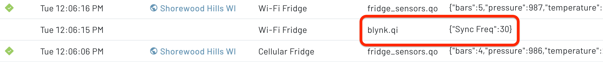
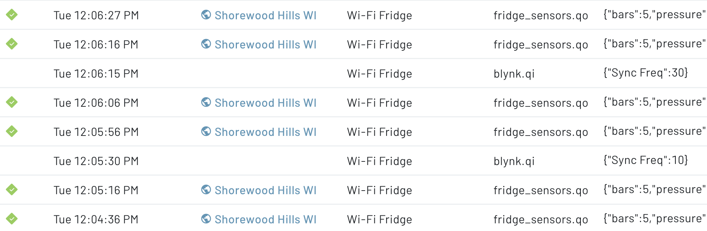

# The Three Fridge Problem

_Use three different radios (Cellular, Wi-Fi, and LoRa) to monitor three different devices, without changing your firmware._

I love experimenting with different radio technologies in the prototypes I build. If it's a stable indoor deployment, I might use **Wi-Fi**. If it's outdoors, I'll probably go with **cellular**. If there's a nearby LoRaWAN gateway and the payload size is small, I may even use **LoRa**. Outside the range of all of the above? I'll even try **satellite** as a failover.

This is the beauty of betting on [Blues](https://blues.com/) (disclaimer - I'm an employee of Blues, but love building around our wireless product, [Notecard](https://blues.com/products/notecard/)). When you choose Blues, you're choosing robust wireless connectivity with **no subscriptions** and **no firmware changes based on the radio you choose**. Also, on the cellular side, the cost of the device comes with 10 years of service and 500MB of global data.

Pretty wild huh?

In this project, I'm going to show off how I built a refrigerator monitoring device x 3 that gathers the following data elements...

1. 🔋 Battery voltage
1. 🌡️ Temperature from inside the refrigerator
1. ☁️ Barometric pressure
1. 📶 Cellular signal strength (cellular only of course!)
1. 🔔 Whether or not the door is open (and send an alert if it's open too long)



I'll also automatically sync all of this data with a device dashboard on the low-code IoT platform, [Blynk](https://blynk.io/).



As a bonus, we'll see how communication with Blynk is bi-directional. I can make a change on my Blynk dashboard to send data _back_ to a Notecard to update the outbound sync cadence of gathered sensor data.

## The Hardware

Everything is assembled using off-the-shelf components, and all three devices are literally identical except for the type of Blues Notecard (e.g. [Cellular](https://shop.blues.com/products/notecard-cellular), [Wi-Fi](https://shop.blues.com/products/wifi-notecard), and [LoRa](https://shop.blues.com/products/notecard-lora)).

The main carrier/development board is the [Notecarrier F](https://shop.blues.com/products/notecarrier-f) (1). It has a slot for a Feather-compatible host (in this case the [STM32-based Blues Swan](https://shop.blues.com/collections/swan/products/swan)) (2). The Notecarrier's power source is a small LiPo battery (3). The Notecard (4) is what can be swapped out for Cellular, Wi-Fi, or LoRa.



There is a [reed switch](https://www.adafruit.com/product/375) mounted to the top of each refrigerator door that lets us read a digital pin. If `LOW` that means the door is closed. If `HIGH` the door is open.



Lastly mounted on the inside of the refrigerator is a [BMP581 sensor from SparkFun](https://www.sparkfun.com/products/20170) (connected via Qwiic).



## The Firmware

Again, the main draw of building out this prototype was to see if we could quite literally write a single version of firmware and load it onto each STM32 Blues Swan, without changing code based on the radio technology in use.

> The full source code is available in [this GitHub gist](https://gist.github.com/rdlauer/bc3e2a9becd20e863a5a41b92b87374b).

Here are some of the highlights:

### Link Notecards with Notehub

The magic of Notecard is exposed through its **seamless connection to the Blues cloud service [Notehub](https://notehub.io/).** The two automatically (and securely) pair without any configuration, other than you telling the Notecard to which Notehub project it should connect!

_Later on, Notehub will also be used to automatically sync data to Blynk for our visualizations._



This configuration, like all other requests, is performed using JSON commands available in the [Notecard API](https://dev.blues.io/api-reference/notecard-api/introduction/). The [hub.set API](https://dev.blues.io/api-reference/notecard-api/hub-requests/latest/#hub-set) is how you pair a Notecard with a Notehub project:

```
J *req = notecard.newRequest("hub.set");
if (req != NULL)
{
    JAddStringToObject(req, "product", "<your-product-uid>");
    JAddStringToObject(req, "mode", "continuous");
    JAddBoolToObject(req, "sync", true);
    notecard.sendRequestWithRetry(req, 5);
}
```

> This code doesn't look much like JSON because it's using the [note-arduino SDK](https://dev.blues.io/tools-and-sdks/firmware-libraries/arduino-library/) provided by Blues!

The `product` is the unique identifier of your Notehub project. Setting `mode` to `continuous` will force the Notecard to maintain a connection to Notehub (if it's able) and not disconnect. The `sync:true` argument also tells the Notecard to automatically pull down any inbound commands it receives from Blynk.

### Set Up Wi-Fi

Even though only one of our Notecards will use Wi-Fi, we can still send the same Wi-Fi configuration request to all three Notecards. If a Notecard doesn't understand a radio-specific command, it'll just ignore it!

```
// set wi-fi credentials (only used on Notecard WiFi)
req = notecard.newRequest("card.wifi");
if (req != NULL)
{
    JAddStringToObject(req, "ssid", "<ssid>");
    JAddStringToObject(req, "password", "<password>");
    notecard.sendRequest(req);
}
```

### Configure Note Templates

Lastly, we need to create a [Note template](https://dev.blues.io/notecard/notecard-walkthrough/low-bandwidth-design/). This is an optional step for Notecard Cellular and Notecard WiFi, but required for Notecard LoRa. Why? Because LoRa is such a data-constrained protocol, we need to save every byte possible and templates allow us to store and send much more data than if they were saved as arbitrary JSON objects.

> [What's a Note?](https://dev.blues.io/api-reference/glossary/#note) It's just a JSON object and you'll see this "Note" and "Notefile" syntax used a lot when you work with Blues.

```
  req = notecard.newRequest("note.template");
  if (req != NULL)
  {
    JAddStringToObject(req, "file", "fridge_sensors.qo");
    JAddNumberToObject(req, "port", 22);
    JAddStringToObject(req, "format", "compact");
    J *body = JAddObjectToObject(req, "body");
    if (body)
    {
      JAddNumberToObject(body, "voltage", 12.1);
      JAddNumberToObject(body, "temperature", 12.1);
      JAddNumberToObject(body, "pressure", 12);
      JAddNumberToObject(body, "bars", 12);
      JAddBoolToObject(body, "door_status", true);
      JAddNumberToObject(body, "_lat", 14.1);
      JAddNumberToObject(body, "_lon", 14.1);
    }
    notecard.sendRequest(req);
  }
```

In the complete firmware, you'll notice two templates. One (above) is used to send sensor data on a specific cadence. The other is used to **send an alert** if the door has been open too long.

In fact, let's move right along to that part!

### Send an Alert

Based on the constants specified in the firmware, we can keep track of how long the reed switch shows the door as being open. If open for >= 10 seconds, we'll send a Note to Notehub alerting us.

```
  if (door_open && !alert_sent && currentMillis - startMillisAlert >= doorOpenAlertPeriod)
  {
    J *req = notecard.newRequest("note.add");
    if (req != NULL)
    {
      JAddStringToObject(req, "file", "fridge_alert.qo");
      JAddBoolToObject(req, "sync", true);
      J *body = JAddObjectToObject(req, "body");
      if (body != NULL)
      {
        JAddBoolToObject(body, "alert", true);
      }
      notecard.sendRequest(req);
    }
    alert_sent = true;
  }
```

You'll notice this is named `fridge_alert.qo`, which, since it'll be separate from the sensor data, can be used to automatically generate alerts.

Here is a slightly abbreviated version of the JSON from a `fridge_alert.qo` Note as it appears on Notehub:

```
{
    "event": "2a5f3489-d962-4b5e-a230-9c64d45f6106",
    "file": "fridge_alert.qo",
    "body": {
        "alert": true
    },
    "session": "cc1d73c8-568e-42d8-8f3f-a9fd177448ec",
    "transport": "cell:nbiot",
    "best_id": "Cellular Fridge",
    "device": "dev:861059067936231",
    "sn": "Cellular Fridge",
    "app": "app:250f5890-e155-4c2e-820b-ee864c93f458",
    "received": 1732562547.73626,
    "req": "note.add",
    "tower_when": 1732562539,
    "tower_lat": 43.074706,
    "tower_lon": -89.43412,
    "tower_country": "US",
    "tower_location": "Wisconsin",
    "tower_timezone": "America/Chicago",
    "tower_id": "310,410,16954,77315643",
}
```

Next, using the [Twilio SMS guide](https://dev.blues.io/guides-and-tutorials/twilio-sms-guide/) provided by Blues, you could send up an SMS alert to notify you that a door has been left open!



### Gather Sensor Data

The main point of the project is to **gather sensor data from the refrigerator**.

Using the [card.voltage API](https://dev.blues.io/api-reference/notecard-api/card-requests/latest/#card-voltage) from the Notecard we can gather the voltage of the attached battery.

We can also get the `bars` (meaning the signal strength) of our Notecard Cellular by using the [card.wireless API](https://dev.blues.io/api-reference/notecard-api/card-requests/latest/#card-wireless). All the other data will come from the [BMP581 library](https://github.com/sparkfun/SparkFun_BMP581_Arduino_Library) and the status of the pin connected to the reed switch.

```
req = notecard.newRequest("note.add");
if (req != NULL)
{
    JAddStringToObject(req, "file", "fridge_sensors.qo");
    JAddBoolToObject(req, "sync", true);
    J *body = JAddObjectToObject(req, "body");
    if (body != NULL)
    {
    JAddNumberToObject(body, "voltage", voltage);
    JAddNumberToObject(body, "temperature", temperature);
    JAddNumberToObject(body, "pressure", pressure);
    JAddNumberToObject(body, "bars", bars);
    JAddBoolToObject(body, "door_status", door_open);
    }
    notecard.sendRequest(req);
}
```

And here is an abbreviated example Note of sensor data as it would appear in Notehub:

```
{
    "event": "2a31ee31-4397-4a96-883e-89b1777a2936",
    "file": "fridge_sensors.qo",
    "body": {
        "bars": 3,
        "pressure": 986,
        "temperature": 23.890625,
        "voltage": 4.0351562
    },
    "session": "5cb59df5-18e8-4897-88d9-56ab53a041a9",
    "transport": "cell:nbiot",
    "best_id": "Cellular Fridge",
    "device": "dev:861059067936231"
}
```

With our data syncing every `30` seconds (as is the default), next lets look at how we can **add some visualizations (and interactivity)** using the low-code IoT platform Blynk.

## Blynk Integration

Another advantage of choosing Blues is that you're [not limited to which cloud application you use](https://dev.blues.io/notehub/notehub-walkthrough/#routing-data-with-notehub). If you're invested in AWS, great. Azure? No problem. Want to use your company's Datacake account? Go for it.

**Any platform that can accept data over HTTP or MQTT works with Blues.** And yes that includes Blynk!

Following the [data routing guide for Blynk](https://dev.blues.io/guides-and-tutorials/routing-data-to-cloud/blynk/), you'll quickly see how easy it is to not only start syncing your data with Blynk, but also building out a nice-looking dashboard.


But we've all seen a million dashboards in our time. What is especially intriguing about using Blynk is that, by default, the integration with Blues allows for _inbound_ data syncing (meaning from Blynk to Notehub). This means you can make small changes to your dashboard to send commands or update system constants.

For example, note this UI element in our dashboards:



Again, by default, if I made a change to this sync frequency, it'll send a message to Notehub for this specific device:



And here is what the full JSON looks like of that inbound data (known as a `.qi` file or an inbound Note):

```
{
    "event": "c7b6b402-82a0-8df3-9a39-5b2e5226f2f5",
    "when": 1732644375,
    "file": "blynk.qi",
    "body": {
        "Sync Freq": 30
    },
    "transport": "api:http",
    "best_id": "Wi-Fi Fridge",
    "device": "dev:4827e21d96d4",
    "sn": "Wi-Fi Fridge",
    "app": "app:250f5890-e155-4c2e-820b-ee864c93f458",
    "received": 1732644375.9009,
    "req": "note.add",
    "fleets": [
        "fleet:eb7a8a0d-fb4a-4d1f-8c0d-e3b97be67fbc"
    ]
}
```

Back in our firmware, we can **poll the Notecard to see if this value has been updated**. If so, we can update our system constant that sets the frequency of how often we sync data like magic! 🪄

```
void updateSensorCadence()
{
  // check for inbound data from Blynk that will set the sensor cadence
  J *req = notecard.newRequest("file.changes");
  if (req != NULL)
  {
    J *files = JAddArrayToObject(req, "files");
    JAddItemToArray(files, JCreateString("blynk.qi"));
    J *rsp = notecard.requestAndResponse(req);

    if (rsp)
    {
      int total = JGetNumber(rsp, "total");

      if (total && total > 0)
      {
        req = NoteNewRequest("note.get");
        if (req != NULL)
        {
          JAddStringToObject(req, "file", "blynk.qi");
          JAddBoolToObject(req, "delete", true);

          rsp = notecard.requestAndResponse(req);

          if (rsp)
          {
            J *body = JGetObject(rsp, "body");

            if (body)
            {
              if (JGetNumber(body, "Sync Freq"))
              {
                sensorReadPeriod = 1000 * JGetNumber(body, "Sync Freq");
              }
            }
          }
        }
      }
    }
  }
}
```

Once the value is updated and processed by the Notecard, the sync cadence will change and will be obvious based on the timestamps recorded on Notehub.



Reminder that the full source code is [available here on GitHub](https://gist.github.com/rdlauer/bc3e2a9becd20e863a5a41b92b87374b).

## Summary

It turns out "The Three Fridge Problem" isn't such a problem after all! When you choose Blues you're opting in to an ecosystem that allows for seamless integration with **Cellular, Wi-Fi, LoRa, and even Satellite connectivity**.

It's a no-brainer and I recommend you kick the tires by getting your own [Blues Starter Kit for Cell+WiFi](https://shop.blues.com/products/blues-global-starter-kit) that provides everything you need to start prototyping your next connected product. 💙
