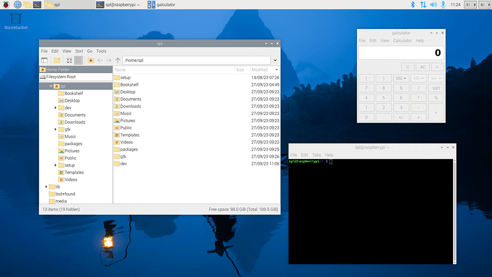
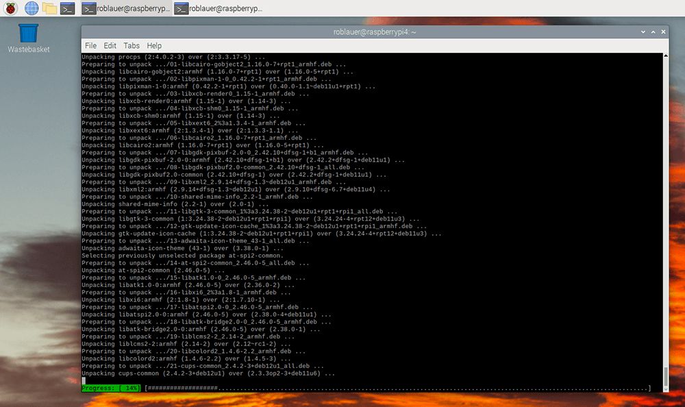
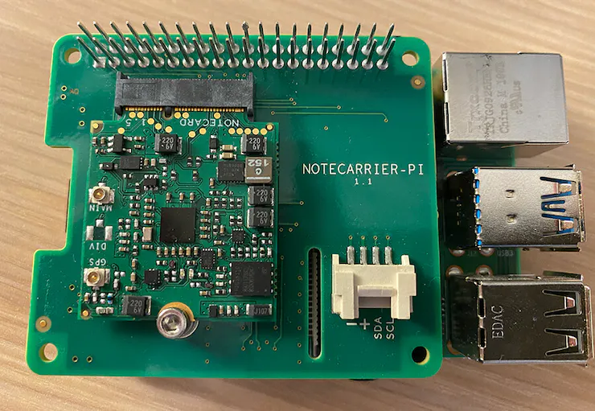

# The Easiest Way to Upgrade Raspberry Pi OS from Bullseye to Bookworm

Welcome to the Blues Developer Blog where we discuss all things wireless connectivity in the IoT...err...alright, yes, this post is a bit of a diversion.

If you're like me, when a new version of an OS comes out (I don't care of it's macOS, Windows, or Raspberry Pi OS) I feel an irrational need to install it. **I'm also exceptionally lazy**, so I usually opt for the upgrade path versus a clean install.


Today I want to take a look at how you can update a Raspberry Pi (or compatible single board computer) to the newly released ["Bookworm" version of Raspberry Pi OS](https://www.raspberrypi.com/news/bookworm-the-new-version-of-raspberry-pi-os/).

WARNING

Let me be crystal clear: This is an **unsupported upgrade path** that is not endorsed by the Raspberry Pi Foundation.

END WARNING

But I also like to live dangerously.


Before continuing, I'm sure at least some of you are wondering: _What exactly is Bookworm?_

## What is Bookworm?

Bookworm is the codename for a [new version of Raspberry Pi OS](https://raspberrytips.com/raspberry-pi-os-versions/). Based on Debian GNU/Linux 12, Bookworm is a significant new release for Raspberry Pi enthusiasts.



Arguably the three most important updates in Bookworm are:

1. A switch from the X11 Windowing System to [Wayland](https://wayland.freedesktop.org/), which improves security and performance (and includes some pleasing desktop UI updates).
2. Adopting [PipeWire](https://pipewire.org/) as the default audio backend (replacing PulseAudio).
3. Use of [NetworkManager](https://networkmanager.dev/) as the default network suite (replacing dhcpcd).

## Bullseye to Bookworm Upgrade Options

The _good news_ is there are multiple upgrade options from Bullseye to Bookworm.

The _bad news_ is there are multiple upgrade options from Bullseye to Bookworm.

- [Easy Upgrade Path]()
- [Better Upgrade Path]()
- [Best "Upgrade" Path]() (the officially recommended path, but that's not why you're here)

WARNING

Regardless of the path you take, be sure to **make a full backup** of the SD card you're using for your current Raspberry Pi installation. Yes, just in case.

END WARNING

## The Easy Upgrade Path from Bullseye to Bookworm

Sorry, one more warning:

WARNING

These instructions are **only valid for upgrading from Bullseye**. If you are currently running Buster, you'll have to install Bullseye first (but at that point, seriously, just install a fresh version of Bookworm and ignore the rest of this blog post, [except for the ending]()).

END WARNING

Ready? Backup finished? Anxious to get started? **Let's begin!**

1. Perform a **full upgrade** of your existing Bullseye installation. Open a Terminal and enter these commands, sequentially:

```
sudo apt update
sudo apt full-upgrade
sudo reboot
```

1. After rebooting, enter the following command to edit `sources.list`, which is how your Pi references the archives for the Debian repositories:

```
sudo nano /etc/apt/sources.list
```

1. Update the first line, replacing `bullseye` with `bookworm` and adding `non-free-firmware` to the end of the line. Your `sources.list` file should end up looking something like this:

```
deb http://raspbian.raspberrypi.org/raspbian/ bookworm main contrib non-free rpi non-free-firmware
```

1. Type `ctrl-x` to exit `nano`, making sure you save the file on exit. Next, you need to open `raspi.list` (to update the Debian Bookworm base) with this command:

```
sudo nano /etc/apt/sources.list.d/raspi.list
```

1. In this file, you only need to change `bullseye` to `bookworm`. Again, hit `ctrl-x`, save your changes, and exit.

1. Perform _another_ full upgrade, but this time sourcing from the Bookworm repositories!

```
sudo apt update
sudo apt full-upgrade
sudo reboot
```

And now you wait. And wait some more.



1. After this final reboot, confirm that you're now running an _almost complete_ version of Bookworm with this command:

```
cat /etc/os-release
```

Success! 🥳

However, while it _looks and feels_ like this is a full upgrade to Bookworm, some smarter people than I have pointed out that changes like PipeWire and NetworkManager may not be properly configured via this route. That's what the "Better Way" is for:

## A Better Way to Upgrade to Bookworm

Yes, there is a better way. It's not for the faint of heart though.

A brave soul on GitHub is actively updating a series of commands for a **full in-place upgrade** from Bullseye to Bookworm [in this gist](https://gist.github.com/jauderho/6b7d42030e264a135450ecc0ba521bd8).

As of the publishing of this blog post in November 2023, here is the full list of commands. Godspeed.

```
### WARNING: READ CAREFULLY BEFORE ATTEMPTING ###
#
# Credit to anfractuosity and fgimenezm for figuring out additional details for kernels
#

# Make sure everything is up-to-date
sudo apt-get update && sudo apt-get dist-upgrade

# Point to bookworm repos instead
sudo sed -i -e 's/bullseye/bookworm/g' /etc/apt/sources.list
sudo sed -i -e 's/bullseye/bookworm/g' /etc/apt/sources.list.d/raspi.list

# Do actual update
sudo apt update && sudo apt -y full-upgrade && sudo apt -y clean && sudo apt -y autoremove

# Reboot
sudo reboot

# Remove old config files after doing sanity checks
sudo apt purge ?config-files

### Switch to the new kernels ###
# Prep
sudo dpkg --purge --force-depends raspberrypi-kernel raspberrypi-bootloader
sudo umount /boot
sudo fsck -y /boot
sudo mkdir /boot/firmware
sudo sed -i.bak -e "s#boot#boot/firmware#" /etc/fstab
sudo systemctl daemon-reload
sudo mount /boot/firmware
sudo apt install raspi-firmware

# Actually install the kernels. Make sure you pick the right version for your Pi
# sudo apt install linux-image-rpi-v8 linux-headers-rpi-v8      # 64bit
# sudo apt install linux-image-rpi-v7l linux-headers-rpi-v7l    # 32bit
# sudo apt install linux-image-rpi-v6 linux-headers-rpi-v6      

# Append auto_initramfs=1 to the bottom of file where it says [all]
sudo sed -i.bak '$ a\auto_initramfs=1' /boot/firmware/config.txt 

# Reboot
sudo reboot

# Verify using "uname -a" (correct as of 10/2023)
# Old kernel
# Linux raspberrypi 6.1.21-v8+ #1642 SMP PREEMPT Mon Apr  3 17:24:16 BST 2023 aarch64 GNU/Linux
# New kernel
# Linux raspberrypi 6.1.0-rpi4-rpi-v8 #1 SMP PREEMPT Debian 1:6.1.54-1+rpt2 (2023-10-05) aarch64 GNU/Linux

# If you are not converted to using NetworkManager, you might lose networking upon reboot. 
# Check the ARP table to see what the new DHCP assigned IP address is. You may have to manually set the IP address again
# Thanks to solsticedhiver for identifying this
#
# Switch to NetworkManager from dhcpcd
sudo systemctl enable --now NetworkManager
sudo systemctl disable --now dhcpcd
#
# Set up static IP. Adjust as necessary 
sudo nmcli -p connection show 
sudo nmcli -p connection show "Wired connection 1"
sudo nmcli con mod "Wired connection 1" ipv4.method manual ipv4.addresses 192.168.1.5/24 ipv4.gateway 192.168.1.1

# Reboot
sudo reboot

#
# Bonus steps
#
# Install btop
sudo apt-get install btop
#
# Update /etc/ssh/sshd_config for up to date, secure by default config. Use ssh-audit to verify
KexAlgorithms sntrup761x25519-sha512@openssh.com,curve25519-sha256,curve25519-sha256@libssh.org
HostKeyAlgorithms ssh-ed25519-cert-v01@openssh.com,ssh-ed25519
Ciphers chacha20-poly1305@openssh.com
MACs hmac-sha2-512-etm@openssh.com,hmac-sha2-256-etm@openssh.com
```

## The Best Way to "Upgrade" to Bookworm

After all we just went through, do you really want to know what I think is the **best way to upgrade to Bookworm**?

Well, it's quite simple and foolproof:

1. Backup all of the directories and files you want to keep from your Pi.
2. Download and install the [Raspberry Pi Imager](https://www.raspberrypi.com/software/).
3. Format an SD card and install a fresh copy of Bookworm.
4. Copy your files back to the Pi.
5. Success! 🥳

## Easy Cellular, LoRa, and Wi-Fi on the Pi

Now that you're done, if you're in the market for a new way to add **swappable Cellular, LoRa, and Wi-Fi to your Raspberry Pi**, take a look at the [Blues Notecard](https://shop.blues.io/collections/notecard) and the [Blues Notecarrier Pi HAT](https://shop.blues.io/products/carr-pi).



The cellular-based Notecards provide **500MB of prepaid data and 10 years of global cellular service**. These are commonly used in edge deployments of Raspberry Pis that don't have access to reliable Wi-Fi connectivity.

Learn more about adding low-bandwidth cellular to the Raspberry Pi in [many of these project tutorials on Hackster](https://www.hackster.io/blues-wireless/projects).

Happy Hacking! 💙