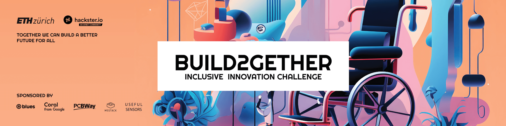
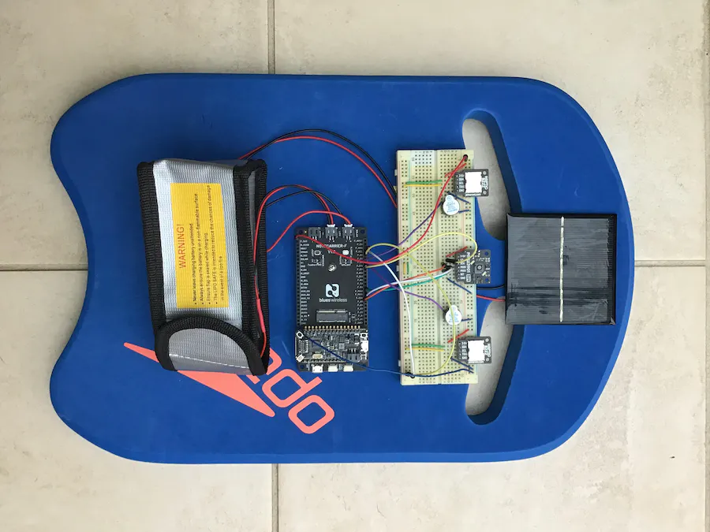
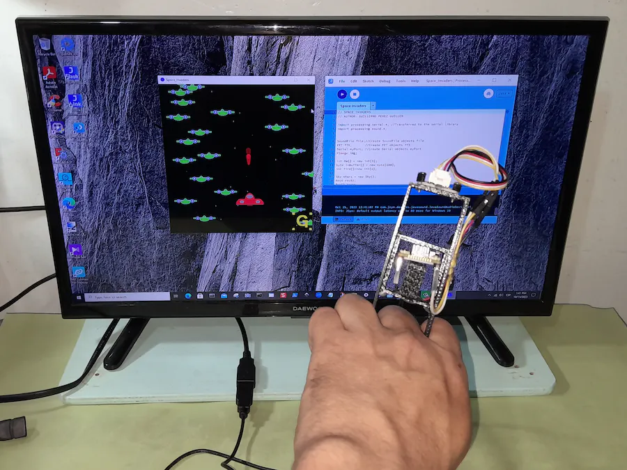
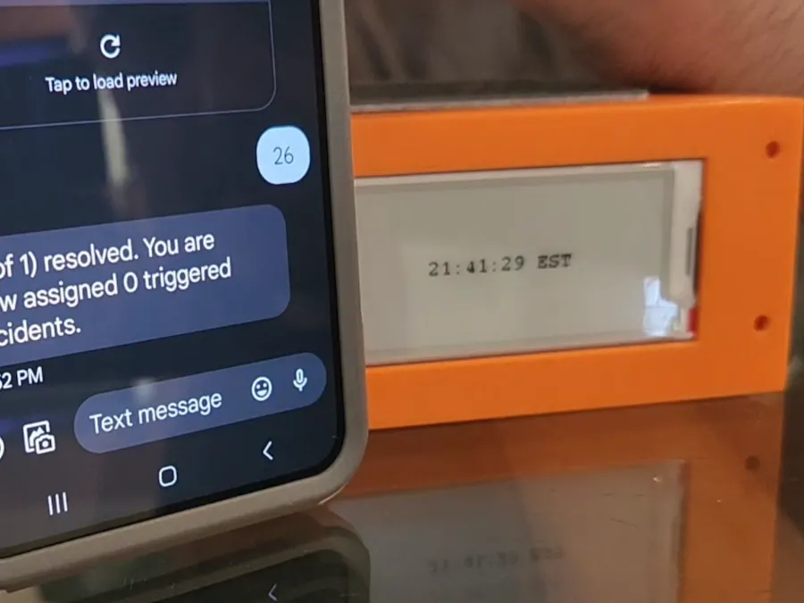
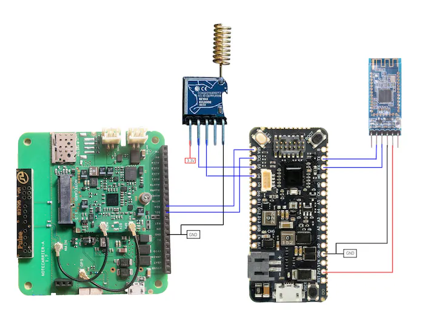

# Blues Award Winners from Hackster's Build2gether Inclusive Innovation Challenge

In the fall of 2023, Blues sponsored a [Hackster](https://www.hackster.io/) challenge focused on inclusivity in technology, specifically on how we can help build products beneficial to people with a variety of disabilities.

The primary goal was to generate prototypes that go beyond your typical tutorial and provide meaningful value for their target audiences.

The project categories were targeted towards three primary areas of improving inclusivity: swimming 🏊‍♂️, gaming 🕹️, and traveling 🏝️.

As part of our sponsorship, Blues donated a massive set of kits for participants that included:

- [Swan STM32 Host MCU](https://shop.blues.com/collections/swan/products/swan)
- [Notecard Cellular](https://shop.blues.com/products/notecard)
- [Notecard WiFi](https://shop.blues.com/products/wifi-notecard)
- [Notecarrier](https://shop.blues.com/collections/notecarrier) A, AL, or F

## The Build2gether Winners

And the results? We couldn't have been happier to see Blues hardware and services used in such creative ways (yes, even underwater!).

> The following projects were designated as winners by the Hackster team, not Blues

### Swimming Projects

The **grand prize for the swimming category** was won by [donutsorelse](https://www.hackster.io/thedonutsorelse) who created a [Haptic Swim Assistant for Low Visibility Swimmers](https://www.hackster.io/thedonutsorelse/haptic-swim-assistant-for-low-visibility-swimmers-877de7). I believe he summed it up best with this introduction to the project:

> Even as someone without low-visibility issues, I wouldn't exactly mind having an automatic warning system so I could just focus on swimming without worrying about concussing myself against a wall. If this can be just universally beneficial, it may as well also get some features that benefit swimmers in general.

You don't want to miss the video published with the project as well:

https://www.youtube.com/watch?v=54eaPFpNsHI

One of the **runner up prize winners** (also in the swimming category) is this [Kickboard for Visually Impaired Swimmers](https://www.hackster.io/CeruleanMars/kickboard-for-visually-impaired-swimmers-wip-37fc69) that used the Swan and Notecarrier F.

An **honorable mention** in the swimming category was [Ultrasonic Ranging and Obstacle Avoidance for Swimming](https://www.hackster.io/michael-ma3/ultrasonic-ranging-and-obstacle-avoidance-for-swimming-689a05) which used the Swan and an ultrasonic sensor to avoid obstacles while swimming.

### Gaming Projects

In the gaming category, one of the **honorable mentions** was given to the [Space Invaders Game Using Blues And Accelerometer](https://www.hackster.io/guillengap/space-invaders-game-using-blues-and-accelerometer-caadc1) project that used the Swan to provide an alternative way of interacting with games.

### Traveling Projects

Another **grand prize winner** was the [Smart Escalating Assistant Communicator](https://www.hackster.io/timo614/smart-escalating-assistant-communicator-8aafba) which is a voice-activated bedside assistant that provides reliable, multi-level caregiver alerts regardless of location.

One of the more creative projects, and a **runner up prize winner** in the traveling category, was [The HandyPager](https://www.hackster.io/pius4109/the-handypager-599458). By creating a wearable device with the Swan, Notecarrier, and Notecard, Pius was able to create a paging device usable by just clicking a single button. Check out the video here:

https://www.youtube.com/watch?v=Lvg2_RH1jG4&t=96s

Another **honorable mention prize** in the traveling category was [An Easily Findable Accessible Toilet using LoRa](https://www.hackster.io/taifur/an-easily-findable-accessible-toilet-using-lora-806a0d) that used the Swan, Notecarrier, and Notecard to make accessible toilets discoverable by allowing the toilet to broadcast their locations.

And yet another **honorable mention prize** included [PortaPillole - a SMART medicine container](https://www.hackster.io/pasquale887/portapillole-a-smart-medicine-container-86b01b), which is a smart pill dispenser powered by the Swan. Check out a short video summary here:

https://www.youtube.com/watch?v=Y4l8NwPwALs&t=51s

## Additional Blues Build2gether Projects

There were a myriad of other project submitted that took advantage of some component of the Blues ecosystem (including even more swimming projects too). Browse through them below and be sure to [check out all the winners on Hackster](https://www.hackster.io/contests/buildtogether).

* 🧑‍🦽 [Auto Wheelchair with Speed Control](https://www.hackster.io/rifqiabdillah/smoothride-auto-wheelchair-with-speed-control-prototipe-1-a2d934)
* 🏊‍♂️ [Waterproof IoT Device for Lap Swimmers](https://www.hackster.io/skruglewicz/b2g-1-swimming-theme-making-waves-with-water-iot-b1699e)	
* ⛈️ [Weather Notifier With Blues](https://www.hackster.io/guillengap/weather-notifier-with-blues-f74b67)
* 🌍 [Blues Wireless Notecard - GPS Home Setter](https://www.hackster.io/alexl678/blues-wireless-notecard-gps-home-setter-486866)	
* 🏊‍♀️ [Assistive swimming technology for the blind](https://www.hackster.io/danielkizit0/aquaguide-5c1b48)
* 🚦 [Smart Traffic Lights](https://www.hackster.io/wesee/smart-traffic-lights-0d3bf9)
* 🏊 [Swimmer Orientation with haptic feedback using ML](https://www.hackster.io/maxwellusually/swimmer-orientation-with-haptic-feedback-using-ml-24dfd7)	
* 🗺️ [Traveling Guide with GPS and Cloud](https://www.hackster.io/michael-ma3/traveling-guide-with-gps-and-cloud-5c2b58)	
* 🐝 [Hive IA control of Honey Bee for person with disability](https://www.hackster.io/davide-cogliati/hive-ia-control-of-honey-bee-for-person-with-disability-0ab4dc)	