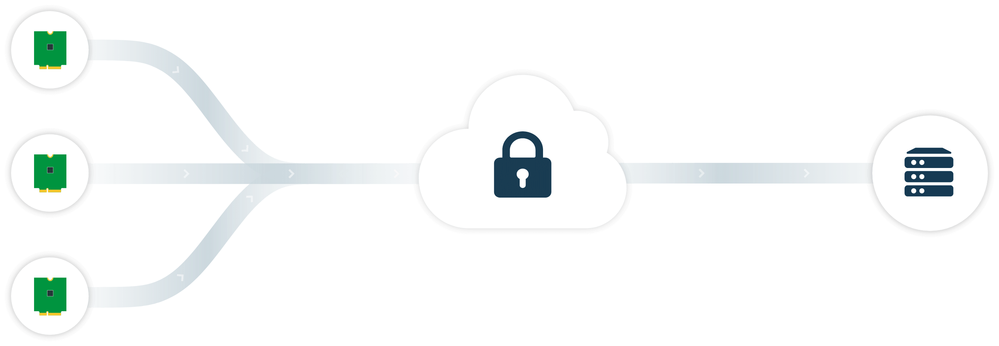

# Encrypt and Securely Deliver Data over Cellular

*You can now encrypt Notecard data before it is securely routed to your cloud application.*

Here at Blues Wireless, security is paramount. The [Blues Wireless Notecard](/products/) and its accompanying cloud service, [Notehub.io](/services/), were built with security at the top of mind.

But at the end of the day, those are just words. Marketing speak that, while true, serves to only try to reassure you about your investment in Blues Wireless.

Instead, in this article I'd like to provide a birds-eye view of what this means
from a more pragmatic perspective: how the Notecard and its JSON-based API provide the ability to transfer data from your device (any MCU or SBC!) to your cloud (any cloud!) in an extremely
secure manner.

To prove this point, we need to look at how the combination of the Notecard and Notehub.io **work together to secure data** at each stage of the journey:

1. From encrypting data on your device,
2. To securely transferring data off the public Internet,
3. To decrypting data on your cloud application.

 

## Encrypting Notecard Data

If your solution requires data to be encrypted on-device, and remain encrypted until it reaches your cloud application, you'll be pleased to learn this is now possible on the Notecard.

The Notecard can encrypt the [body](https://dev.blues.io/reference/glossary/#body) (i.e. the data you supply) of every [Note](https://dev.blues.io/reference/glossary/#note) generated by your host MCU or SBC. These encrypted Notes are then securely delivered to Notehub.io (see "Securing Data in Transit" below), where they can be routed to your cloud application and decrypted.

Starting with [firmware version 1.5.5](https://discuss.blues.io/t/announcing-the-q2-2021-developer-firmware-release/276), the Notecard API adds an optional `key` parameter in the `note.add` request. The `key` stores a reference to a [Notehub environment variable](https://dev.blues.io/reference/glossary/#environment-variable) which stores your public encryption key.

This workflow for implementing end-to-end encryption with the Notecard API involves:

1. Generating an RSA key pair.
1. Adding the contents of your RSA public key to an environment variable in Notehub.
1. Using the `key` parameter with each `note.add` request, providing the name of said environment variable.
1. Creating a [Notehub Route](https://dev.blues.io/get-started/tutorials/route-tutorial/aws-iot-analytics/) to send the encrypted data to your cloud application.
1. Using your RSA private key to decrypt the data upon receipt by your cloud app (e.g. using a Node.js or OpenSSL cloud function).

> **NOTE:** You can find a step-by-step implementation guide here: [Encrypting Data with the Notecard](https://dev.blues.io/notecard/notecard-guides/encrypting-data-with-the-notecard/).

## Securing Data in Transit

With your data encrypted before it leaves the device, and properly decrypted at its final endpoint on your cloud, we should also take a look at **how data is secured in transit**.

On the hardware side, the Notecard includes a factory-installed ECC P-384 certificate provisioned at chip manufacture, an integrated STSAFE Secure Element with hardware crypto, and a true hardware random number generator.

On the communications side, transactional data is secured without any provisioning challenges, using encrypted "off the internet" communication.

To be more specific about the phrase "off the internet", when the Notecard host is set to (the default) of `a.notefile.net` (e.g. Notehub), the Notecard selects an APN where the connection between the cellular network and Notehub is made over a VPN. Internal DNS servers are used to resolve the path to Notehub and the connection itself is encrypted using TLS.

## Try it Yourself

1. Upgrade your Notecard firmware to [1.5.5](https://discuss.blues.io/t/announcing-the-q2-2021-developer-firmware-release/276) (or greater).
2. Follow the [step-by-step encryption guide](https://dev.blues.io/notecard/notecard-guides/encrypting-data-with-the-notecard/).
3. Rest easy knowing your data is encrypted from your device to your cloud! 🔐☁️

