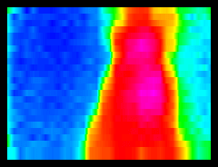

# ID Chicken Eggs with Thermal Images, ML, and Cellular IoT

One thing they don't tell you about raising chickens in the frozen tundra of Wisconsin, is how you're routinely putting your life on the line just to go check for eggs.

Case in point:

https://youtu.be/wR5-HWqkqco

As much as I'm willing to sacrifice my own children in the name of looking for an egg, I'd prefer to **create an ML + IoT solution that can do it for me!** And maybe save a child along the way.

In this two-part project, we will walk through how to create a Machine Learning-based IoT solution to detect the presence of a chicken egg 🐣 using images provided by a thermal IR camera 🔥, relaying those inferences to the cloud using a cellular module 📶, and sending an SMS notification if an egg is detected 📲.


Part one (today) covers the hardware, wiring, and firmware needed to capture a thermal image, save it to an SD card as a PNG, and connecting to the cloud. Sounds simple, but it's deceptively tricky!

*Specifically, in part one we are going to cover:*

- Using an [STM32-based Swan MCU](https://shop.blues.io/collections/swan/products/swan) (but any modern MCU will do);
- Hooking the Swan up to a MLX90640 thermal IR camera;
- Displaying thermal images on a ILI9341 TFT display;
- Saving "screen captures" to an SD card (as PNGs) to use to train our ML model;
- Using a 7-segment display to show an active count of images;
- Relaying image counts to the cloud with a cellular system-on-module, the [Blues Wireless Notecard](https://blues.io/products/notecard/).

Part two (coming soon) is going to focus on what we do with these collected images. We will create an **image classification Machine Learning model with Edge Impulse** based on the saved thermal images. We will also cover how to perform inferencing with the model on the Swan to identify eggs AND use the Notecard to send any "positive" egg identification notifications to us via SMS (using Twilio).

🏁 **Let's get started!** 🏁

## Wiring Up the Components

Luckily part one and part two of this project share the same set of hardware components, so we only have to wire up the solution once!

Unluckily though, the wiring itself is not so simple:


Since the Swan MCU, the MLX90640 camera, and the Notecard all have QWIIC connectors, those components make our wiring considerably easier:


The 7-segment display on the HT16K33 backpack communicates over I2C, so aside from connecting the power and ground pins to the power rail, the `SDA` and `SCL` pins need to be connected to the corresponding `SDA` and `SCL` pins on the Swan:


The SD breakout board and the ILI9341 TFT display both utilize SPI, which for us just means **a lot more wiring**. The pins you connect to on your MCU may differ from these images. I'm using some arbitrary GPIO pins on the Swan that will be configured in the firmware later on:


> **NOTE:** The TFT display above is flipped and reversed to show off the pin labels on the underside.

While not pictured, the **device is line-powered** via a simple Micro-USB wall charger connected to the host MCU. You could also power it via a large-ish LiPo battery if desired.

## Cellular IoT FTW

A nice-to-have component of part one and a **critical component of part two**, the [Blues Wireless Notecard](https://shop.blues.io/collections/notecard) is our plug-and-play cellular IoT connectivity solution.


This 👆 is the Notecard. It's a cellular IoT device that comes **prepaid with 500MB of data and 10 years of global cellular service** baked into the cost of the device. No subscription fees and no data plans. No monthly data caps either.

But the Notecard is only half of the story. The other half is the [Blues Wireless cloud service, Notehub](https://blues.io/products/notehub/). The two work together to form a **device-to-cloud data pump**. The Notecard knows how to connect to Notehub out-of-the-box, securely, via private VPN tunnels.

Your data doesn't live longterm on Notehub though. A primary value of Notehub is the ability to **securely route your data** to virtually any cloud provider or IoT platform you want (AWS, Azure, GCP, Datacake, Ubidots, and so on).


At the bottom of the Notecard you may notice it uses an M.2 edge connector. The easiest way to prototype with the Notecard is to use a carrier board called a [Notecarrier](https://blues.io/products/notecarrier/) which makes it easy to access pins on the Notecard. Today we are using one option, the [Notecarrier-B](https://shop.blues.io/products/carr-b):


## Using the STM32 Swan with PlatformIO

What can I say, I'm a [PlatformIO](https://platformio.org/) guy when it comes to Arduino development! That being said, using PlatformIO is certainly not a requirement as you can just as easily use [Arduino IDE](https://www.arduino.cc/en/software) or your tool of choice.

Here is the `platformio.ini` configuration file I ended up using, including all the necessary Arduino libraries and configs I needed to work with the Swan:

```
[env:bw_swan_r5]
platform = ststm32
board = bw_swan_r5
upload_protocol = dfu
framework = arduino
build_flags = -D PIO_FRAMEWORK_ARDUINO_ENABLE_CDC
monitor_speed = 115200
lib_deps = 
	Wire
	blues/Blues Wireless Notecard@^1.3.17
	adafruit/Adafruit LED Backpack Library@^1.3.2
	adafruit/Adafruit GFX Library@^1.11.3
	adafruit/Adafruit BusIO@^1.14.1
	https://github.com/Seeed-Studio/Seeed_Arduino_MLX9064x.git
	bodmer/TFT_eSPI@^2.4.79
	arduino-libraries/SD@^1.2.4
	bitbank2/PNGenc@^1.0.1
```

> **NOTE:** Getting started with the Swan is made much easier by [following the quickstart provided by Blues Wireless](https://dev.blues.io/quickstart/swan-quickstart/).

Assuming we now have our development tooling configured and are able to upload a simple sketch to the Swan, let's look more closely at using some of these components.

## Display a Thermal Image on a TFT Display

The first firmware task I want to tackle is to display data from the MLX90640 thermal camera on the attached TFT display. This will let us not only see an active thermal image, but also to **take a screen capture of the display** (the saved images will form the basis of our ML model training).

> **NOTE:** Before going any further, please know that the full source code for this project is [available here on GitHub](https://github.com/rdlauer/chicken-egg-arduino/tree/main/chicken-images).

Our first step is to configure the TFT_eSPI library to utilize the pins to which we have connected the display.

This is all accomplished in the `User_Setup.h` file that will appear after you have installed/built the TFT_eSPI library. [Here is a link to that file](https://github.com/Bodmer/TFT_eSPI/blob/master/User_Setup.h) on GitHub for reference.

Long story short, we can enable some processor-specific optimizations (e.g. like this `define` for the STM32):

```
// Define STM32 to invoke optimised processor support (only for STM32)
#define STM32
```

Scrolling further down in `User_Setup.h`, we arrive at a place to define our pins, recalling this image of the pins on the Swan:


```
#define TFT_SPI_PORT 1 // SPI port 1 maximum clock rate is 55MHz
#define TFT_MOSI PA7
#define TFT_MISO PA6
#define TFT_SCLK PA5
#define TFT_CS D5   // Chip select control pin to TFT CS
#define TFT_DC D6   // Data Command control pin to TFT DC (may be labelled RS = Register Select)
#define TFT_RST D10 // Reset pin to TFT RST (or RESET)
```

Among other tasks, in our `setup()` method we need to use the Wire library to initialize communication with the thermal camera and set its refresh rate:

```
Wire.beginTransmission((uint8_t)MLX90640_address);
...
MLX90640_SetRefreshRate(MLX90640_address, 0x05);
```

We also need to initialize the TFT display over SPI:

```
SPI.begin();
Display.begin();
Display.setRotation(2);
Display.fillScreen(C_BLACK);
```

> **DISCLAIMER:** I'm going to get really "hand wavy" with a lot of these code samples, since the full, functional source code is [available here on GitHub](https://github.com/rdlauer/chicken-egg-arduino/tree/main/chicken-images).

In our `loop()` method, we want to continually read data from the thermal camera and update the "range" of temperatures to show on the TFT display.

```
// read data from MLX90640
readTempValues();
setTempScale();
```

The `setTempScale()` method looks like this:

```
void setTempScale()
{
  minTemp = 255;
  maxTemp = 0;

  for (i = 0; i < 768; i++)
  {
    minTemp = min(minTemp, tempValues[i]);
    maxTemp = max(maxTemp, tempValues[i]);
  }

  setAbcd();
  drawLegend();
}
```

The `drawLegend()` method will draw the legend with temperature data and a scale of temperature colors.


```
void drawLegend()
{
  float inc = (maxTemp - minTemp) / 224.0;
  j = 0;
  for (ii = minTemp; ii < maxTemp; ii += inc)
  {
    Display.drawFastVLine(8 + +j++, 292, 20, getColor(ii));
  }

  Display.setTextFont(2);
  Display.setTextSize(1);
  Display.setCursor(8, 272);
  Display.setTextColor(TFT_WHITE, TFT_BLACK);
  Display.print(String(minTemp).substring(0, 5));

  Display.setCursor(192, 272);
  Display.setTextColor(TFT_WHITE, TFT_BLACK);
  Display.print(String(maxTemp).substring(0, 5));

  Display.setTextFont(NULL);
}
```

We then need to visualize these translated values on the TFT display:

```
// draw image to TFT display
drawPicture(false);
drawMeasurement();
```

A condensed version of the `drawPicture()` method shows how we loop through the x and y rows and columns of pixels on the MLX90640 (the output resolution of this camera is 32x24) and draw them on the display:

```
for (y = 0; y < 24; y++)
{
  for (x = 0; x < 32; x++)
  {
    Display.fillRect(8 + x * 7, 8 + y * 7, 7, 7, getColor(tempValues[(31 - x) + (y * 32)]));
  }
}
```

This all let us get the fancy 🟦== 🥶 and 🟥==🥵 pixel-by-pixel output like so:


At this point, the firmware should be functioning well enough to actively display thermal readings on the TFT display.

## Save Image as PNG on SD Card

The next step is to take regular "screen captures" of the TFT display and save those images to the SD card.

Why? We need to create and store as many images as possible, as we will use those images to train our [image classification model with Edge Impulse](https://docs.edgeimpulse.com/docs/tutorials/image-classification). This model, when complete, will perform a simple task: it will be able to tell the difference between an empty nest and one with an egg in it.

*Why PNG and not a bitmap (BMP) image? Two reasons:*

1. While BMPs are easy to write to a file system, they are lossless and therefore quite large.
2. Edge Impulse only supports PNG and JPG image types for model generation.

Also, we will eventually **embed a thermal image in the SMS notifications** we send, which is far easier to do if the image is smaller.

> **NOTE:** In my testing, I found the BMP images saved to be ~85KB versus the lossy PNG images which were about ~8KB!

In our `loop()` method, you'll see we aren't grabbing a screenshot every loop, but rather only when our `period` lapses (which when debugging I set to 1 minute, but when deployed I will change to every 15 minutes):

```
// how often do you want to save a PNG image to SD?
#ifdef IS_DEBUG
const unsigned long period = 1000 * 60 * 1;
#else
const unsigned long period = 1000 * 60 * 15;
#endif
```

...and...


```
  if (currentMillis - startMillis >= period)
  {
    // draw image to TFT display, but use interpolation to get PNG colors right
    drawPicture(true);
    // write compressed PNG image to SD card
    generatePNG();

    startMillis = currentMillis;
    ...
```

What's different about the `drawPicture()` method this time? This time we are passing `true` instead of `false`. When writing a PNG to the SD card, we need to **enable interpolation** due to the way the [PNGenc library](https://github.com/bitbank2/PNGenc) expects its inputs.

PNGenc output with interpolation (left) vs without interpolation (right):


Finally, writing the PNG file involves a lot of code I barely understand! Except for:

```
uint16_t WIDTH = 240;
uint16_t HEIGHT = 184;
```

...which sets the width and height of the captured area (because in our case we don't want to save the legend).

We also don't want to overwrite any previously written PNG files on the SD card, so here's a short and sweet code block to guarantee unique sequential file names:

```
char filename[13] = "image000.png";
imgCount++;
sprintf(filename, "image%03d.png", imgCount);

SD.begin(chipSelect);

while (SD.exists(filename))
{
  imgCount++;
  sprintf(filename, "image%03d.png", imgCount);
}
```

Among another 30 lines of code, this one stands out, as it lets us set the compression level on the PNG (I used `9` which is the maximum level):

```
rc = png.encodeBegin(WIDTH, HEIGHT, PNG_PIXEL_TRUECOLOR, 24, NULL, 9);
```

So far so good? The next two steps are optional, but I like the idea of including a 7-segment display as it provides **instant visual feedback** from a project deployed in the field.

I'm also going to set up the Notecard to **send an event to the cloud every time an image is created**.

## Update 7 Segment Display Value

The 7 segment display is optional, but I like it as it provides a clear visual of the total number of images captured and saved to the SD card.

To use the 7-segment HT16K33 backpack, we use the [Adafruit LED Backpack](https://github.com/adafruit/Adafruit_LED_Backpack) library and initialize it with one line of code in our `setup()` method, passing in the I2C address:

```
matrix.begin(0x70);
```

Then, whenever the image counter goes up in our `loop()` method, we display the updated value with:

```
matrix.print(imgCount);
matrix.writeDisplay();
```


## Send Events to Cloud over Cellular

Since the chicken coop is outside the range of Wi-Fi, cellular is the only realistic option we have for cloud connectivity. Plus, the [Notecard's JSON-based API](https://dev.blues.io/reference/notecard-api/introduction/) makes it simple to establish and maintain a cellular connection (and to sync data with the cloud).

At this stage, the Notecard is only useful to let us know (remotely) that images are being captured and saved on the device. In part two though, Notehub becomes a critical component in [sending SMS notifications with Twilio](https://dev.blues.io/guides-and-tutorials/twilio-sms-guide/).

To make the most out of the Notecard, we are using the [note-arduino library provided by Blues Wireless](https://dev.blues.io/tools-and-sdks/libraries/arduino-library/).

To properly use the Notecard and its accompanying cloud service Notehub, we need to associate the Notecard with a project on Notehub.

To do so, we are going to use the Notecard's [hub.set API](https://dev.blues.io/reference/notecard-api/hub-requests/#hub-set). Here is how that's done with `note-arduino`:

```
J *req = notecard.newRequest("hub.set");
JAddStringToObject(req, "product", PRODUCT_UID); // this is the Notehub project id
JAddStringToObject(req, "mode", "continuous");
notecard.sendRequest(req);
```

We can also explicitly tell the Notecard to *initiate a sync over cellular with Notehub* via a call to [hub.sync](https://dev.blues.io/reference/notecard-api/hub-requests/#hub-sync):

```
req = notecard.newRequest("hub.sync");
notecard.sendRequest(req);
```

Finally, in our `loop()` method, we send an event (i.e. a [Note](https://dev.blues.io/reference/glossary/#note) using Blues Wireless terminology) to Notehub every time an image is captured with the [note.add API](https://dev.blues.io/reference/notecard-api/note-requests/#note-add):

```
J *req = notecard.newRequest("note.add");
JAddStringToObject(req, "file", "egg-image.qo");
J *body = JCreateObject();
JAddNumberToObject(body, "count", imgCount);
JAddNumberToObject(body, "temp", centerTemp);
JAddItemToObject(req, "body", body);
notecard.sendRequest(req);
```

The `centerTemp` is the recorded temperature of the very center point of the thermal camera.

This data appears in Notehub over time as distinct events that are periodically synced. Here is an example of some of the events logged from this prototype deployment in action:


> **NOTE:** Creating a new Notehub account is free. Every calendar month you are provided with 5,000 "consumption credits" (1 credit == 1 event routed OUT of Notehub...inbound data is free). You can purchase more credits if needed.

## Where Are We At?

With the hardware wired up and the first part of our firmware written, I deployed the device in my neighbor's awesome chicken coop!


I gathered thermal images for a day, leading to mostly empty nests:


A curious chicken:



But also an egg!


Ending up with A LOT of images to feed into my ML model!


## What's Coming in Part Two

We've only just begun!

Here is what you'll find in the dramatic conclusion of this chicken egg ML IoT saga:

1. Using the saved series of PNG images, we will **build an image classification model** with [Edge Impulse](https://edgeimpulse.com/).
2. We will **deploy the model** to the host Swan MCU.
3. Using the Edge Impulse runtime, we will write a sketch to **generate inferences on new thermal images** to check for the presence of eggs.
4. If an egg is detected, we will **upload the image and send an SMS notification** with Twilio, thanks to the power of the Notecard and Notehub!

