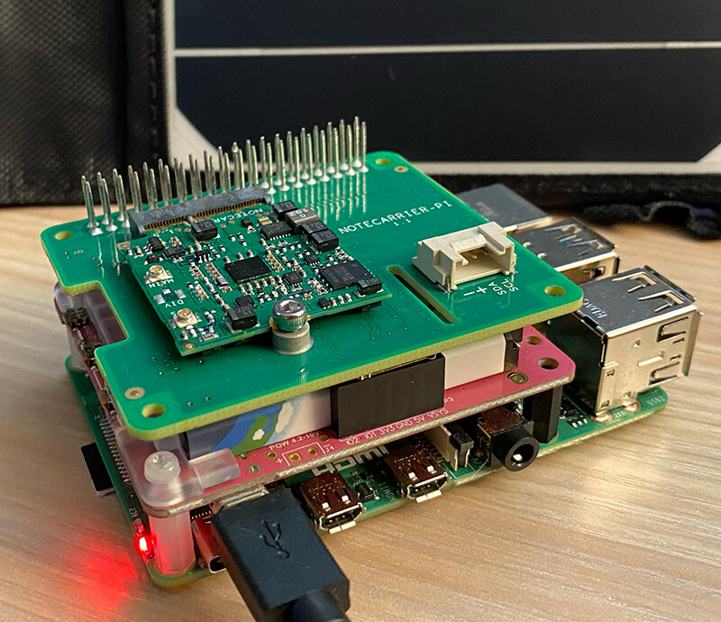

# Create a Solar-Powered Crypto Mining Rig with Raspberry Pi

tags: python, crypto, cellular, iot

Are you ready to cash in on this cryptocurrency thing, but also concerned about the electricity consumed in order to mine your own crypto?

**Well do I have the project for you!**

In this tutorial, we are going to build out a fully-featured cryptocurrency mining solution using:

- [Raspberry Pi 4](https://www.raspberrypi.org/products/raspberry-pi-4-model-b/)
- [PiJuice](https://uk.pi-supply.com/products/pijuice-standard) (for solar management and battery)
- [Notecard and Notecarrier-Pi HAT](https://blues.io/products/) (for portable cellular data)
- [Notehub](https://blues.io/services/) and [Ubidots](https://ubidots.com/) (for a cloud-based dashboard)

Is this prospect of crypto mining with a Raspberry Pi as ridiculous as it sounds? Probably! But let's not let reason stop us from building something fun.

**Ready? Get started over at [hackster.io](https://www.hackster.io/rob-lauer/solar-powered-crypto-mining-with-raspberry-pi-64adee)!**