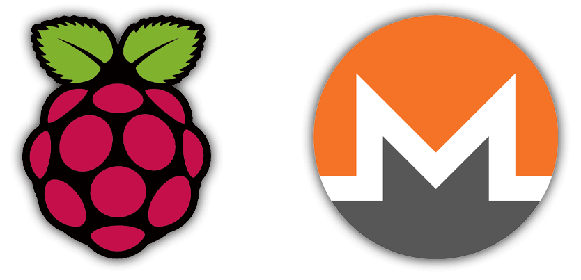
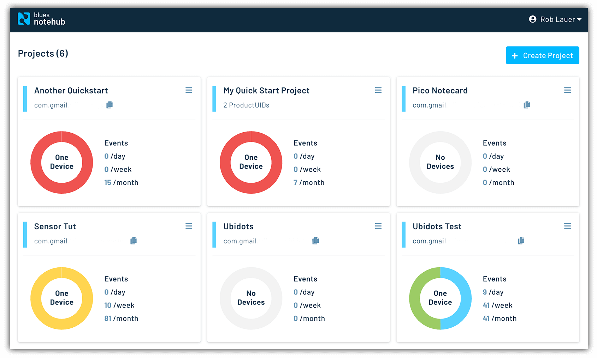

# Solar-Powered Crypto Mining with Raspberry Pi

So you're ready to cash in on this cryptocurrency thing, but you're also concerned about the electricity consumed in order to mine your own crypto?

Well, I have good news and bad news for you.

The **good news** is cryptocurrency mining on solar power is entirely possible. It's also justified, as according to the Sierra Club the annual power consumption of Bitcoin-related activities alone is [comparable to a country the size of Argentina](https://www.sierraclub.org/pennsylvania/blog/2021/03/environmental-impacts-cryptocurrency). Not to mention the associated production of *37+ megatons* of CO2 each year.

The **bad news**? Considering the raw power requirements for cryptocurrency mining AND the fact that we're going to use a Raspberry Pi SBC for this project, we probably won't be rolling like Scrooge McDuck any time soon.

Is this prospect of crypto mining with a Raspberry Pi as ridiculous as it sounds? Probably! But let's not let reason stop us from building something fun.

## Get Your Mining Tools Ready

You've likely heard the phrase, "sunk cost fallacy". This is the concept of throwing good money at a bad idea, only because you've already invested money in said bad idea.

In an ideal scenario, we aren't investing new hardware in crypto mining. Existing hardware is a "sunk cost", because we already own it. If we can collectively pretend this is the case, let's take a look at how we're going to build out a crypto miner on a [Raspberry Pi 4 Model B](https://www.raspberrypi.org/products/raspberry-pi-4-model-b/) and collect some virtual coin.

### Juice for the Pi

We want this solution to function in perpetuity without manual intervention, so running our RPi *exclusively* off of solar is a non-starter. Powering anything that requires consistent voltage off of solar directly is a bad idea, what, with nights and cloudy days to consider.

This is where a cool little product called the [PiJuice](https://uk.pi-supply.com/products/pijuice-standard) comes into play.

PiJuice is a Pi HAT with an onboard 1820mAh battery and a micro-USB connector for managing a solar array. With the PiJuice software, we can define battery charge levels at which to gracefully shutdown *and* boot up our RPi.

Using the [PiJuice calculator](https://learn.pi-supply.com/battery-levels/), it looks like we can expect **at best 1.34 hours** of runtime on a Raspberry Pi 4 off the provided battery alone:

### Powered by the Sun

With the PiJuice in place for power management, we'll then want a sizable solar array to charge the battery on sunny days. I already had a 42w solar array from when I built a [remotely-running ML bird identification system](https://www.hackster.io/rob-lauer/remote-birding-with-tensorflow-lite-and-raspberry-pi-8c4fcc).

Since the array has a micro USB connector, I can connect it directly to the PiJuice HAT. It's really as simple as that!

### Phone Home with Cellular

Cellular? What does cellular networking have to do with this project?

Since this project involves running a headless RPi, I'll have no immediate visual indication of how mining is progressing. I'd also want create a **cloud-based dashboard** of the hash rates generated by my RPi and chart them over time.

I also like the fact that cellular networking makes any cloud-connected project portable!

To accomplish this, I'm going to use the [Notecard](https://blues.io/products/?utm_source=hackster&utm_medium=web&utm_campaign=featured-project) from Blues Wireless. It's a cellular and GPS-enabled device-to-cloud data-pump that comes with 500 MB of data and 10 years of cellular for \$49.

The Notecard itself is a tiny 30mm x 34mm SoM with an m.2 connector. To make integration in an existing project easier, Blues Wireless provides host boards called [Notecarriers](https://blues.io/products/?utm_source=hackster&utm_medium=web&utm_campaign=featured-project#notecarrier). I'll be using the **Notecarrier Pi HAT** for this project.

Also, the Notecard ships preconfigured to communicate with [Notehub.io](https://notehub.io/?utm_source=hackster&utm_medium=web&utm_campaign=featured-project), which enables secure data flow from device-to-cloud. Notecards are assigned to a project in Notehub. Notehub can then route data from these projects to your cloud of choice (e.g. AWS, Azure, Google Cloud, among others).

## Enable Your Virtual Pick Axe

With both the Notecarrier-Pi HAT and the PiJuice HAT installed properly on the Raspberry Pi, we are ready to begin software setup.

As with any Raspberry Pi project, it's a good idea to make sure all of your installed packages are up-to-date:

	sudo apt update
	sudo apt full-upgrade
	sudo apt-get clean

Next, install the PiJuice software:

	sudo apt-get install pijuice-gui

Reboot your Raspberry Pi and then head to **Preferences > PiJuice Settings**.

Click the **Configure HAT** button and make sure the correct battery on your PiJuice is selected in the **Battery** tab:

Next, we'll want to create two new **System Tasks**. One to **shut down** the RPi when the charge is too low and one to **boot it up** when the battery has enough charge again.

Change **Wakeup on charge** to a high value (I'm using 80%) and **Minimum charge** to a low value (I'm using 10%).

## Configure the Miner

Mining cryptocurrency is nothing new, so we can use one of a variety of Linux-compatible CLI crypto miners. I also decided to mine [Monero](https://www.getmonero.org/), which is a cryptocurrency that is still (in theory) profitable to mine with a CPU only.

To start, we need to install `raspbian-nspawn-64`, which requires you to be on the 64-bit kernel of Raspbian.

	sudo apt-get install -y raspbian-nspawn-64

> **NOTE:** If you're not using the official 64-bit kernel, you will be prompted to enable it.

Next, issue the following command to start using the 64-bit container:

	ds64-shell

Now we need to install our miner, [XMRig](https://github.com/xmrig/xmrig), from within this 64-bit shell. Install all of the build dependencies:

	sudo apt-get install git build-essential cmake libuv1-dev libssl-dev libhwloc-dev

Clone the XMRig repo locally:

	git clone https://github.com/xmrig/xmrig.git

Issue the following commands to complete the build (note that the build/make steps may take some time):

	cd xmrig
	mkdir build
	cd build
	cmake ..
	make

Now we can create a `config.json` file to specify some configuration options for the miner.

Use the [XMRig configuration wizard](https://xmrig.com/wizard) to create a starter config file for you. Mine ended up looking like this:

	{
	    "autosave": true,
	    "cpu": true,
	    "opencl": false,
	    "cuda": false,
	    "pools": [
	        {
	            "url": "pool.supportxmr.com:443",
	            "user": "MY_MONERO_WALLET_ID",
	            "pass": "RPi",
	            "keepalive": true,
	            "tls": true
	        }
	    ]
	}

> **NOTE:** You can create your own wallet ID by installing a [Monero wallet](https://www.getmonero.org/downloads/) locally.

In order to enable logging, add the following line to the JSON object:

	"log-file": "/home/pi/Documents/apps/xmrig/build/log.txt",
	
Save this as `config.json` in your `build` directory and create an empty `log.txt` file in the same directory.

If you'd like, you can test out your miner now with this command:

	./xmrig -c "config.json"

Assuming everything is working properly, you should start seeing some activity in your terminal window:

## To the Cloud!

Now that we've proven our mining software functions, we'll want an easy way to monitor the production of our "mining rig". 

By now the `log.txt` file should have a healthy set of data. Let's write a short Python script that will read the log on a periodic basis and pump relevant data to the cloud.

Back on the Raspberry Pi (**NOT** in the 64-bit container), install `python-periphery` (for I2C), `python-dateutil` (for working with dates), and `note-python` (for interfacing with the Notecard):

	pip3 install python-periphery
	pip3 install python-dateutil
	pip3 install note-python

> **NOTE:** The full Python source is available [here on GitHub](https://github.com/rdlauer/picrypto)!

In a new Python file, we'll want to do three things:

1. Init the Notecard and prepare it for cloud communications.
2. Loop through the log file, checking for data we want to report.
3. Send an event (a.k.a. a "note") to the cloud.

We initialize the Notecard by specifying a `productUID` (which is the name of a Notehub project that we'll create in a minute) and setting the cellular connection `mode` to `continuous`.

Normally in battery-conscious environments you would use `periodic` mode to reduce the frequency of cellular connections. However, in this project, the draw of our cellular modem is the least of our concerns since the mining software is going to use the vast majority of our battery.

	productUID = keys.PRODUCT_UID
	port = I2C("/dev/i2c-1")
	card = notecard.OpenI2C(port, 0, 0)
	req = {"req": "hub.set"}
	req["product"] = productUID
	req["mode"] = "continuous"
	rsp = card.Transaction(req)

Here is an example of a log file line that contains the `10s` hash rate (along with a timestamp):

	[2021-04-20 14:55:02.085]  miner    speed 10s/60s/15m 77.37 76.91 n/a H/s max 77.87 H/s

Our `main` function will iterate through the log file to identify data that is relevant to the dashboard we are trying to create. For this project I only care about the ongoing hash rate of my miner.

	def main(start_timestamp):
	    """ loops through log file to get crypto hash rate """
	    with open("/home/pi/Documents/apps/xmrig/build/log.txt") as fp:
	        lines = fp.readlines()
	        for line in lines:
	            # check if this line starts with a valid date and contains "miner"
	            line_timestamp = line[1:19]
	            if is_date(line_timestamp) and "miner" in line:
	                dt = datetime.strptime(line_timestamp, '%Y-%m-%d %H:%M:%S')
	                if dt >= start_timestamp:
	                    send_note(line, dt)
	
	    time.sleep(60)  # check again in 1 minute
	    main(datetime.now() - timedelta(minutes=1))

Finally, we want to send relevant data to the cloud:

	def send_note(line, dt):
	    """ extract 10s H/s value from log and send to notehub.io """
	    hash_rate = line[54:line.find(" ", 54) - 1]
	    ms_time = dt.timestamp() * 1000
	
	    req = {"req": "note.add"}
	    req["file"] = "crypto.qo"
	    req["body"] = {"rate": hash_rate, "time": ms_time}
	    req["sync"] = True
	    rsp = card.Transaction(req)

A discerning eye will notice that everything into and out of the Notecard is JSON-based, making it incredibly developer-friendly.

For example, the generated JSON from the above `note.add` request might look something like this:

	{
	   "req":"note.add",
	   "file":"crypto.qo",
	   "body":{
	      "rate":77.37,
	      "time":1619122680000
	   }
	}

Save the Python script and a `keys.py` file into the same directory as the `log.txt` file.

### Device to Dashboard

Recall that [Notehub](https://notehub.io/?utm_source=hackster&utm_medium=web&utm_campaign=featured-project) enables synchronization of data between your device and the cloud.

*To get started with a free Notehub account:*

1. Navigate to notehub.io and login, or create a new account.
2. Using the **New Project** card, give your project a name and `ProductUID`.
3. Copy that `ProductUID` and enter it in `keys.py`:

	PRODUCT_UID = "com.your.company:projectname"

**That's it!** When the Python script runs, Notecard will associate itself with this Notehub project. Any notes (events) you send will show up in the **Events** panel when received:

Next, we want to *route* our data to a cloud dashboard. I've used [Ubidots](https://ubidots.com/) in the past with success, so I created a new route **from Notehub to Ubidots**.

You can view full instructions for creating a [Notehub to Ubidots route here](https://dev.blues.io/build/tutorials/route-tutorial/ubidots/?utm_source=hackster&utm_medium=web&utm_campaign=featured-project).

## Mine-on-Boot

Since our Raspberry Pi will be cycling between on and off states (depending on the battery charge), we will want to make sure our miner and Python script also start on boot.

You can find the instructions on how to use `systemd` to automatically run `xmrig` and the Python script on the [Raspberry Pi forum](https://www.raspberrypi.org/forums/viewtopic.php?t=305983).

*For reference, here are the two service files I had to create:*

	[Unit]
	Description=PiMiner
	After=multi-user.target
	
	[Service]
	Type=idle
	ExecStart=/usr/bin/ds64-run /home/pi/Documents/apps/xmrig/build/xmrig -c "config.json"
	
	[Install]
	WantedBy=multi-user.target

...and...

	[Unit]
	Description=PiMinerPython
	After=multi-user.target
	
	[Service]
	Type=idle
	ExecStart=/usr/bin/python3 /home/pi/Documents/apps/xmrig/build/crypto-monitor.py
	
	[Install]
	WantedBy=multi-user.target

## Drumroll Please

With my data actively routing to Ubidots, I created a dashboard to view my results:

*And what happened when I deployed this off-grid?*

It was clear that I wasn't going to get too much mining done on a 1820 mAh battery. In fact, I averaged **less than an hour of mining** before the PiJuice stepped in to shut things down (at least until the solar array was able to charge the battery back up a bit).

What about the elephant in the room? How much Monero was I able to earn? After running the miner for a few hours total, I pulled in a whopping 0.00000178 Monero.

That's...$0.0007 in USD.

So maybe we won't be getting rich on crypto with the Raspberry Pi.

I do hope, however, you're able to use the PiJuice and [Notecard](https://blues.io/products/?utm_source=hackster&utm_medium=web&utm_campaign=featured-project) in a future solar-powered project!