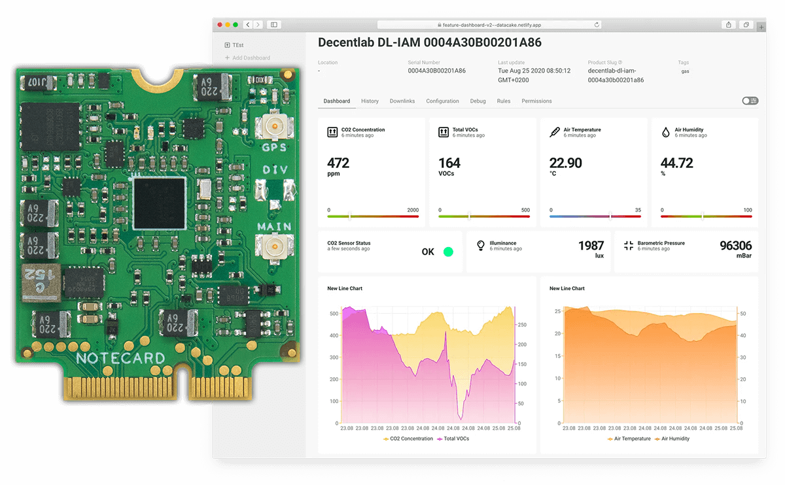
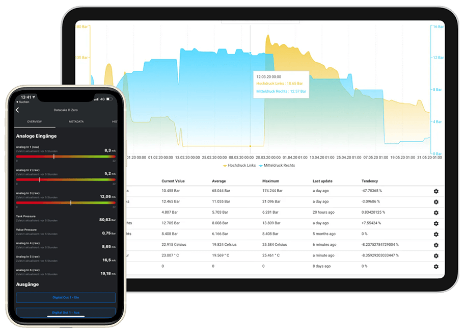
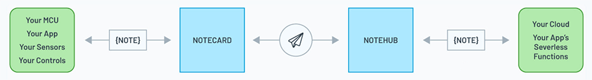

# Visualizing the IoT with Datacake and the Blues Wireless Notecard

*Datacake is a low-code IoT platform that easily consumes data from Notehub.io. Learn more about securely delivering Notecard data to Datacake.*

The wave of self-described "low-code" development solutions has come (and mostly gone) without much fanfare. While there have been some successes, generally speaking, **developers require control above any desire to cut corners**.

We now know the best low-code solutions do enough to get you 70% of the way there, but also provide that bare metal access to customize the final 30% of your project.

This is where the intersection of the [Blues Wireless Notecard](https://blues.io/products/) and the low-code IoT platform [Datacake](https://datacake.co/low-code-iot-platform) come in.

## What is Datacake?

The Datacake website does a fantastic job of describing what the platform is, at a high level:

> Datacake is a multi-purpose, low-code IoT platform that requires no programming skills and minimal time to create custom IoT applications that can be brought into a white label IoT solution at the push of a button.

In practice, Datacake lets you take that IoT data you've been accumulating, and turn it into engaging data dashboards and reporting solutions.

These dashboard reports are created in a straightforward point-and-click manner, with little coding required.

## Route Cellular Data from Notecard to Datacake

The path of data from the Notecard to your cloud application takes a journey such as:

1. Your MCU or SBC **gathers** sensor and/or location data;
2. The Notecard **delivers** it to [Notehub.io](https://blues.io/services/);
3. Notehub.io **securely relays** the data to your cloud provider (e.g. Datacake, AWS, Azure, etc).

"Secure" is a key word for the Notecard. With an integrated [STSAFE Secure Element](https://www.st.com/en/secure-mcus/stsafe-a100.html) with hardware crypto, true hardware random number generator, and a factory-installed ECC P-384 certificate provisioned at chip manufacture, the Notecard takes security to heart.

In addition, all transactions between the Notecard and Notehub.io utilize encrypted "off the Internet" communication protocols with VPN tunneling from cellular provider direct to cloud.

If you'd like to learn more about this Notecard + Datacake integration, take a look at the [complete Datacake routing guide](https://dev.blues.io/build/tutorials/route-tutorial/datacake/) on the Blues Wireless Developer Portal.

## Watch and Learn!

Coming up on [Wednesday, June 16th at 10AM CDT](https://attendee.gotowebinar.com/register/6163880192701280783?source=blues-blog), the Blues Wireless and Datacake teams are presenting **How to Create IoT Asset Tracking Applications with Drag-and-Drop Tooling**. This will be a 45-ish minute webinar covering and end-to-end technical demonstration of:

1. Actively tracking assets with GPS and cellular, with the Notecard.
2. Securely delivering tracking data to the cloud.
3. Building a robust cloud-based reporting application with Datacake.

Be sure to [register early](https://attendee.gotowebinar.com/register/6163880192701280783?source=blues-blog) - hope to see you there!