# .NET Developer? You're an IoT Developer Too!

Like many software engineers, I cut my proverbial teeth on the web. Showing off cutting edge ASP.NET web apps with the occasional AJAX request and JavaScript `mouseover` effect really got heads spinning back in the early `00's!

Eventually my career took a new path as I found myself in the embedded space, writing firmware with Arduino and CircuitPython to control tiny devices with microcontrollers. While I'm still a complete noob, I've had the pleasure of building everything from a [solar-powered crypto miner](https://www.hackster.io/rob-lauer/solar-powered-crypto-mining-with-raspberry-pi-64adee), to a [hot tub water quality monitor](https://www.hackster.io/rob-lauer/debugging-a-hot-tub-time-series-machine-92e44f), to a [speed trap powered by machine learning](https://www.hackster.io/rob-lauer/busted-create-an-ml-powered-speed-trap-b1e5d1).

However, I've always lusted after combining my love for C# with the embedded world.

Lo and behold, I learned about a couple of frameworks geared towards this scenario: [.NET nanoFramework](https://www.nanoframework.net/) and [TinyCLR](https://www.ghielectronics.com/tinyclr/).

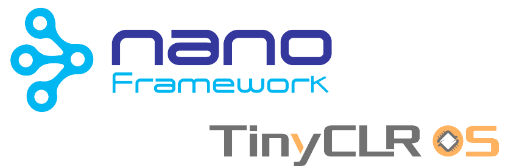

Before we look more closely at these tiny .NET frameworks, let's take a short step back and better define the concepts of "embedded development" and "IoT".

- [What is Embedded Development and the IoT?](#what-is-embedded-development-and-the-iot)
- [The Tiniest .NET Frameworks](#the-tiniest-net-frameworks)
- [The "Tiny" Hardware](#the-tiny-hardware)
- [Getting Started with TinyCLR OS](#getting-started-with-tinyclr-os)
- [Adding IoT to the Mix](#adding-iot-to-the-mix)
- [Next Steps](#next-steps)

## What is Embedded Development and the IoT?

Embedded programming is the concept of writing code for incredibly small computers (a.k.a. microcontrollers) that communicate with sensors (e.g. temperature, gas, humidity) or power servo motors that in turn control other devices. In the embedded space, we often talk about programming "firmware", which is essentially semi-permanent software loaded into non-volatile memory on a device (it's not **soft**ware or **hard**ware, it's **firm**ware!).

*An example programmable microcontroller from Blues Wireless, the Feather-compatible [Swan](https://blues.io/products/swan/?utm_source=iot4all&utm_medium=web&utm_content=dotnetiot):*

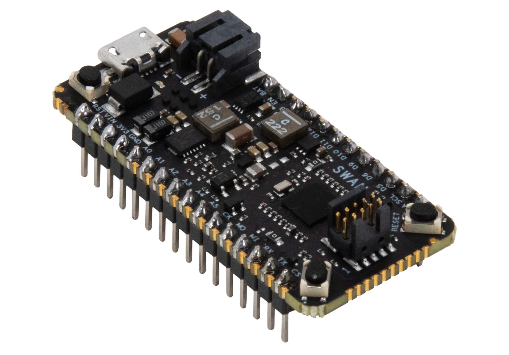

The most common languages used to write firmware for embedded devices are C/C++, Arduino (a simpler form of C), and Python derivatives like [MicroPython](https://micropython.org/) and [CircuitPython](https://circuitpython.org/).

Embedded development is directly related to the Internet of Things (IoT) as these "things" we are building often need an Internet connection to upload the data they are gathering or the calculations they are creating.

For instance a smart...belt?

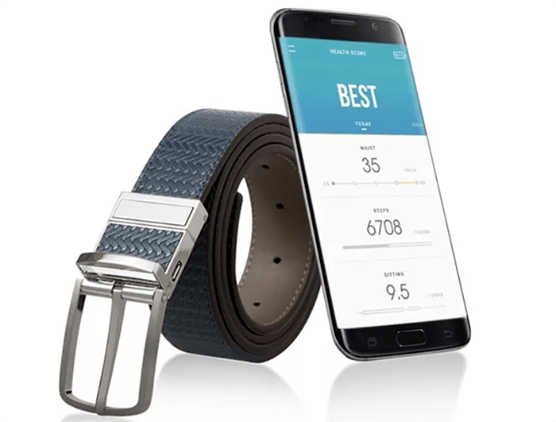

Getting slightly more practical, think about the following common devices, as they are all IoT projects at their core:

- **Irrigation systems** that measure rainfall and only turn on when needed;
- Gas/electric **utility meters** that can relay home energy usage remotely;
- Home health **monitoring devices** that provide insights previously only available in a hospital setting.

This is what makes the IoT so fascinating: there are countless applications for the IoT to impact our lives in positive ways.

**Now let's learn how to build something fun with C#!**

## The Tiniest .NET Frameworks

Both nanoFramework and TinyCLR are free frameworks for building .NET applications meant for deployment on resource-constrained embedded devices. They make it easy (or at least *easier*) to use C# instead of Arduino, C/C++, or a Python derivative when programming firmware on microcontrollers.

For .NET developers, this opens up an entire new world of embedded development. We can use the tools (Visual Studio) and languages (C#) that we've been using for years, all without worrying about the low-level hardware issues that can easily confound even the most dedicated embedded engineer.

It does come with a catch though. Neither nanoFramework nor TinyCLR provide access to the full .NET Common Language Runtime (CLR), and they only provide a subset of the .NET base class libraries and APIs. This is primarily because of the memory constraints on these microcontrollers. Specifically for TinyCLR, you can find a [list of limitations in their docs](https://docs.ghielectronics.com/software/tinyclr/limitations.html).

What about the differences between nanoFramework and TinyCLR? At a high level they boil down down to the following:

**.NET nanoFramework provides:**

- Support for a variety of popular ESP32- and STM32-based microcontrollers.
- A fully open source offering.
- Support from the .NET foundation.

**TinyCLR provides:**

- Tight integration with specific proprietary microcontrollers.
- A superior getting started experience.
- An easier integrated debugging solution.

While I did some experimentation with both platforms, as an IoT and embedded engineer noob, I did find the TinyCLR experience preferable (though I know of plenty of folks who are nanoFramework fans!). Therefore, the rest of this article is going to walk through the experience of getting started with .NET on the TinyCLR OS.

## The "Tiny" Hardware

As just mentioned, TinyCLR OS only runs on microcontrollers (MCUs) provided by GHI Electronics. My MCU of choice is for this exercise is the [FEZ Feather](https://www.ghielectronics.com/sitcore/sbc/):

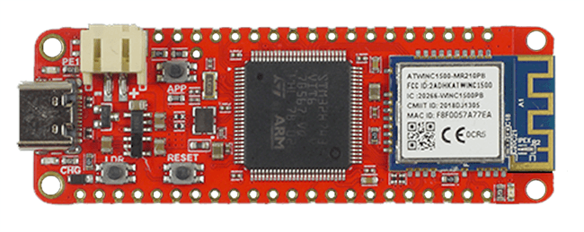

> **NOTE:** The _Feather_ aspect comes from the fact that it is compatible with the [Adafruit Feather specification](https://learn.adafruit.com/adafruit-feather). This means you can connect it to virtually any carrier board with header pins meant to accept a Feather-compatible MCU.

## Getting Started with TinyCLR OS

Let's walk through some (relatively) simple steps to get the TinyCLR OS loaded onto your FEZ Feather microcontroller and write an embedded program using C#.

### Installing the TinyCLR OS

Our first step is to install the latest version of the TinyCLR OS on the device. TinyCLR OS includes the .NET CLR which converts your compiled C# into instructions for the microcontroller. It's also used for interacting with Visual Studio (critical for loading the program onto the device and debugging).

Connect your FEZ Feather to your Windows PC via a USB-C cable:

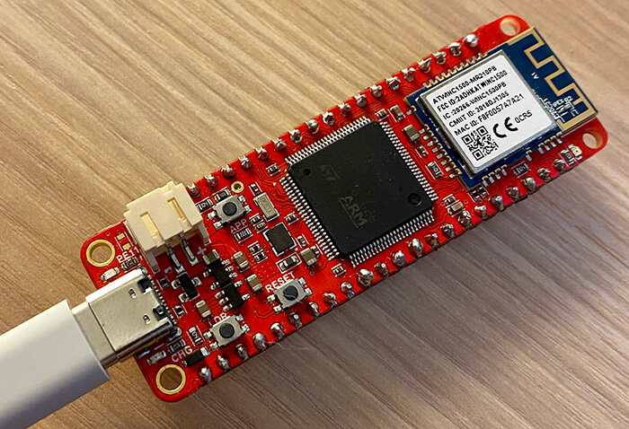

Download the latest version of **TinyCLR Config** and **SITCore SC20xxx** firmware from the [GHI electronics download page](https://docs.ghielectronics.com/software/tinyclr/downloads.html).

Open **TinyCLR Config**, choose the connected device in the **Port** dropdown, and click **Connect**:

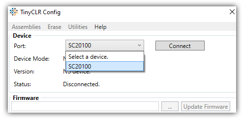

To update the device firmware, click on the `...` button next to the **Update Firmware** button. A dialog will open allowing you to select the firmware file you previously downloaded and click on **Update Firmware** to flash your device:

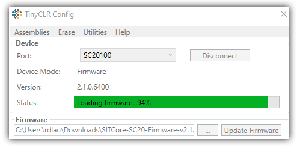

Once it's done, disconnect and reconnect the device and confirm that your firmware was updated:

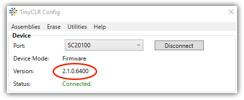

### Setting up Visual Studio

You also need to perform a one-time configuration of Visual Studio (these instructions are compatible with both VS 2019 and 2022 community editions).

> **TIP:** Make sure you've already installed the ".NET Desktop Development" requirements in Visual Studio.

Within Visual Studio, navigate to **Extensions --> Manage Extensions**. Search for "tinyclr" to find and install the **TinyCLR OS Project System**.

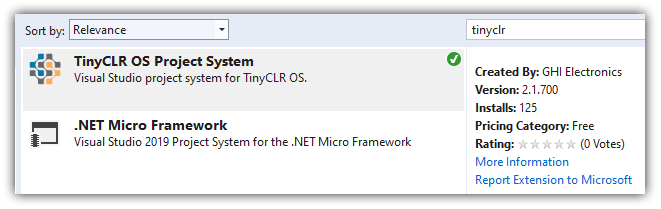

Restart Visual Studio to enable the installer to complete the installation.

### Your First "Tiny" .NET Project

Re-open Visual Studio and create a new project, choosing **TinyCLROS** from the platform dropdown list and selecting the **C# TinyCLR Application** template:

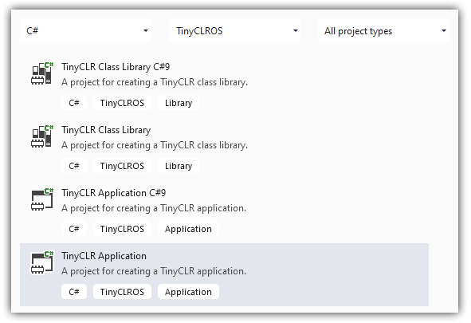

Your project will be pre-loaded with some boilerplate code and a `Program.cs` file. This will be the starting point of your application.

Next, we're going to perform the "Hello World!" of embedded programming: blinking an LED!

Start by replacing *everything* in `Program.cs` with the following code. Have no fear, we'll walk through what's happening in this code:

	using GHIElectronics.TinyCLR.Devices.Gpio;
	using GHIElectronics.TinyCLR.Pins;
	using System.Threading;
	
	namespace TinyCLRApplication
	{
	    class Program
	    {
	        static void Main()
	        {
	            var LED = GpioController.GetDefault().OpenPin(SC20100.GpioPin.PE11);
	            LED.SetDriveMode(GpioPinDriveMode.Output);
	
	            while (true)
	            {
	                LED.Write(GpioPinValue.High);
	                Thread.Sleep(100);
	
	                LED.Write(GpioPinValue.Low);
	                Thread.Sleep(100);
	            }
	        }
	    }
	}

*So what exactly is happening in this code?*

1. In the `Main()` method we are creating a reference to the onboard LED.
2. In `LED.SetDriveMode(GpioPinDriveMode.Output)` we are configuring the LED's pin as an *output*, meaning it'll be in a state to manage the voltage (i.e. lighting) the LED.
3. Next, we get in an infinite loop (don't worry, this is very common in embedded land!) with a `while (true)`.
4. We set the LED pin to `High` (lighting it), wait 100 ms, then set the pin to `Low` (turning it off), and waiting another 100ms, forever. This blinks the LED. 💡

Before you deploy the program to your device, you might notice that there are two NuGet packages to be installed first:

- GHIElectronics.TinyCLR.Devices.Gpio
- GHIElectronics.TinyCLR.Pins

Make sure the device is still plugged into your PC's USB port. Click the **Start** or **F5** button in Visual Studio to compile and deploy the program. If everything works (should take 10-20 seconds) an LED on the board will blink until you unplug it or flash a new program:

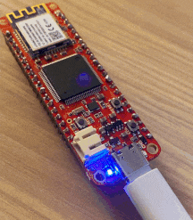

**Congratulations!** You've literally just used C# code to control a microcontroller. This is huge! 💪

## Adding IoT to the Mix

Now that you're (relatively) comfortable with building a simple C# app for deployment on a tiny microcontroller, it's time to take the next step by adding the "I" to your IoT project.

While some embedded systems can get away with storing data on an SD card for later retrieval, it's far more useful to actively transmit data as it comes in. Wi-Fi, LoRa, and Bluetooth are common technologies used in the IoT, but there is no more ubiquitous global solution for remotely transmitting data than cellular.

It's also important to consider not only the raw technical ability of communicating over cellular, but also how you then get this data to a cloud endpoint, such as Microsoft Azure.

### Introducing the Blues Wireless Notecard

Cellular has traditionally scared developers due to its archaic AT command syntax (it's an awful developer experience) and likewise businesses have been afraid of the price (per-device monthly plans add up fast). So the key to cellular success lies in a tiny pre-paid device-to-cloud data pump called a [Notecard](https://blues.io/products/notecard/?utm_source=iot4all&utm_medium=web&utm_content=dotnetiot).

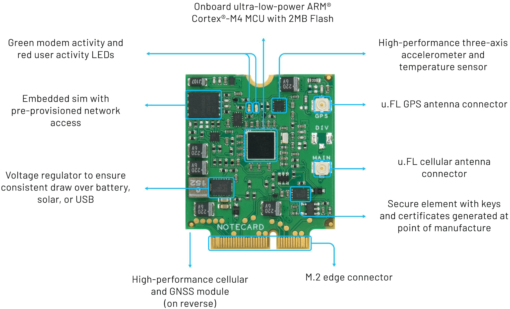

With both cellular and GPS capabilities (and 10 years + 500 MB of data included) the Notecard is a no-brainer for when you want to start pushing data to the cloud over LTE-M, NB-IoT, or Cat-1 cellular.

But what about that strange M.2 edge connector at the bottom of the Notecard? How do you use this with the microcontroller we just programmed? The answer comes in the form of the [Notecarrier](https://blues.io/products/notecarrier/?utm_source=iot4all&utm_medium=web&utm_content=dotnetiot):

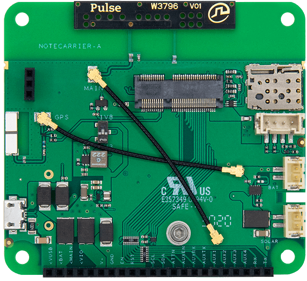

The Notecarrier acts as a *bridge* between your MCU and the Notecard. It includes an embedded antenna, header connectors, and battery ports to allow you to easily connect it to your prototype.

Here is the FEZ Feather wired up to a Notecard + Notecarrier, ready to send data to the cloud over cellular!

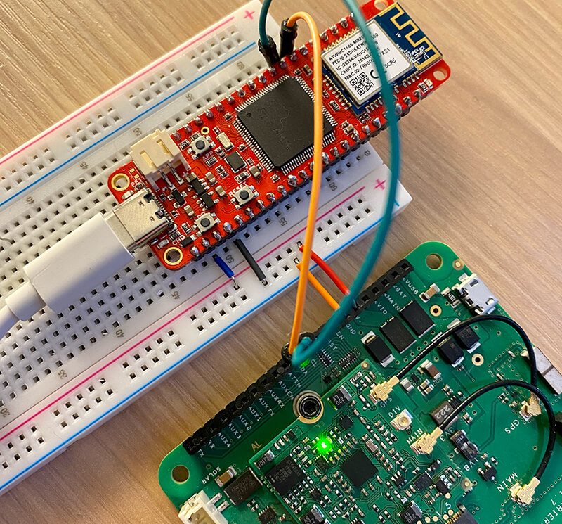

The white board you see is called a breadboard, and is used to quickly create connections between the MCU and the Notecarrier.

If you're following along at home, here are the connections being made with those jumper wires:

- Supplying power to the Notecarrier from the FEZ via the `V+` and `GND` pins (the black/blue and orange/red wires).
- Communicating over I2C by connecting the `SCL` and `SDA` pins (the longer orange and green wires).

### All JSON, All the Time

To me, the real beauty of the Notecard comes from its developer experience. Every command to (and every request from) the Notecard is JSON.

For example, here is an API command that will tell you the current GPS location of a Notecard:

	{"req": "card.location"}

And an example response from the Notecard:

	{
	  "status": "GPS updated (58 sec, 41dB SNR, 9 sats) {gps-active}
	            {gps-signal} {gps-sats} {gps}",
	  "mode":   "periodic",
	  "lat":    42.577600,
	  "lon":    -70.871340,
	  "time":   1598554399,
	  "max":    25
	}

### Adding Wireless Capabilities

Knowing all of this, let's see how easy it can be to send a small packet of data, over cellular, to the cloud.

Once again, you can remove everything in your `Program.cs` file and replace it with the following:

	using Bytewizer.TinyCLR.Drivers.Blues.Notecard;
	using GHIElectronics.TinyCLR.Devices.I2c;
	using GHIElectronics.TinyCLR.Pins;
	using System.Diagnostics;
	
	namespace TinyCLRApplication
	{
	    class Program
	    {
	        static void Main()
	        {
	            // setup I2C bus for Fez Feather
	            var controller = I2cController.FromName(SC20100.I2cBus.I2c1);
	            var notecard = new NotecardController(controller);
	
	            // associate this Notecard with a Notehub.io project
	            var request1 = new JsonRequest("hub.set");
	            request1.Add("product", "com.blues.me:some_project"); // replace this with your product uid!
	
	            var results1 = notecard.Request(request1);
	            if (results1.IsSuccess)
	                Debug.WriteLine(results1.Response);
	
	            // create a mock JSON body object
	            var body = new JsonObject();
	            body.Add("temp", 35.5);
	            body.Add("humid", 56.23);
	
	            // create a "note" with the JSON body from above
	            var request2 = new JsonRequest("note.add");
	            request2.Add("body", body);
	            request2.Add("sync", true);
	
	            var results2 = notecard.Request(request2);
	
	            if (results2.IsSuccess)
	                Debug.WriteLine(results2.Response);
	        }
	    }
	}

If you look carefully, you can see that to program the Notecard, we are simply building JSON objects that correlate to commands available in the [Notecard API](https://dev.blues.io/reference/notecard-api/introduction/?utm_source=iot4all&utm_medium=web&utm_content=dotnetiot):

- The [hub.set](https://dev.blues.io/reference/notecard-api/hub-requests/?utm_source=iot4all&utm_medium=web&utm_content=dotnetiot#hub-set) request associates the Notecard with a project on Notehub.io (more on [Notehub](https://blues.io/services/?utm_source=iot4all&utm_medium=web&utm_content=dotnetiot) in the next section!).
- We are creating a JSON object that stores some mock temperature and humidity data.
- We are sending this data (a [Note](https://dev.blues.io/reference/glossary/?utm_source=iot4all&utm_medium=web&utm_content=dotnetiot#note) in Blues Wireless speak) to the cloud with a [note.add](https://dev.blues.io/reference/notecard-api/note-requests/?utm_source=iot4all&utm_medium=web&utm_content=dotnetiot#note-add) request.

Before running this program, there is one more NuGet package to include:

- Bytewizer.TinyCLR.Drivers.Blues.Notecard

Go ahead and click **Start** or hit **F5** in VS to build and deploy your cellular-connected IoT project!

In the debug output, you should see `{"total":1}` which is the Notecard telling you that there is a single event being sent to the cloud.

### To the Cloud

Yes, I got ahead of myself. We started pushing data to the cloud without fully understanding *where* in the cloud the data was going!

We first need to understand that a **key benefit of the Notecard is security**. The device itself lives off of the public Internet. It's a cellular data pump, meaning it needs to connect to *secure proxy* to deliver data over the Internet.

This is where [Notehub](https://blues.io/services/?utm_source=iot4all&utm_medium=web&utm_content=dotnetiot) comes into play. Notehub is a thin cloud service that securely receives and syncs data with virtually any cloud (think AWS, Azure, Google Cloud, or even your own custom MQTT or RESTful endpoint).

To start, we can simply see this mock data appear in Notehub, ready to be routed to its final home on a big cloud ☁️:

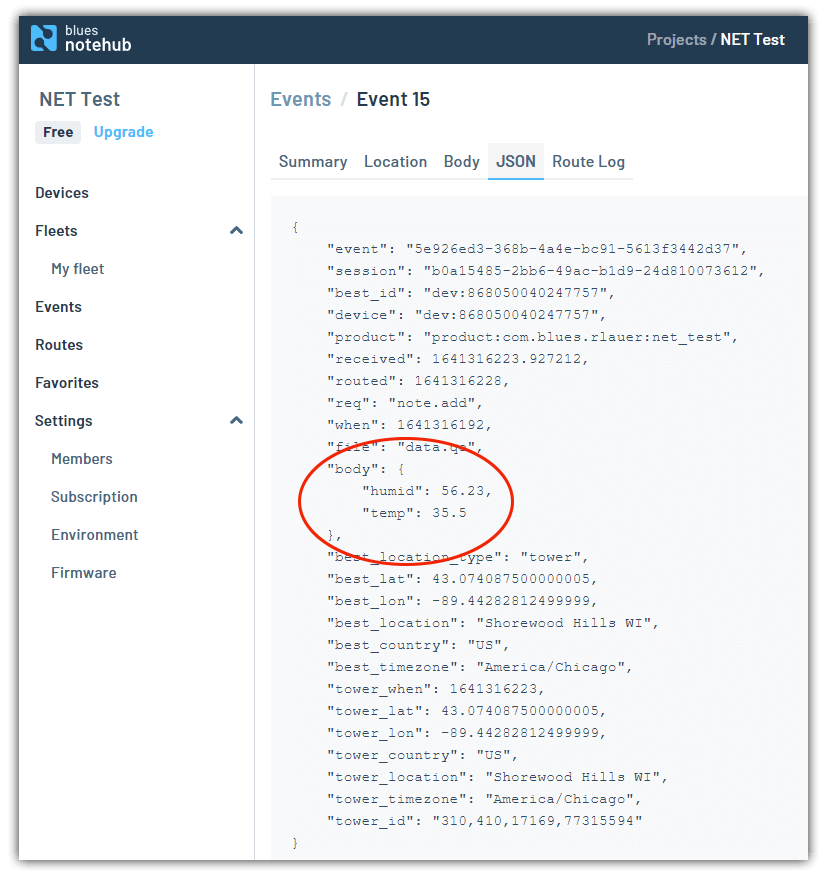

### Routing Data to Azure

Since Notehub is not the final resting place of our data, naturally we will want to automatically sync this data with a big cloud such as Azure.

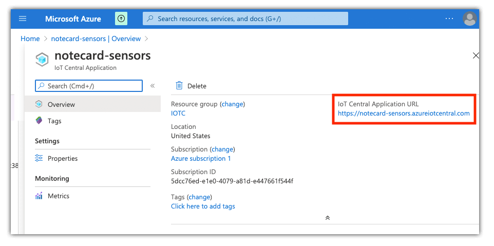

To do so, you can follow the [in-depth routing tutorial for Azure](https://dev.blues.io/guides-and-tutorials/routing-data-to-cloud/azure/?utm_source=iot4all&utm_medium=web&utm_content=dotnetiot) that walks through building your own cloud-based dashboard using data delivered with the Notecard.

Finally, while it's outside the scope of this article, as data is being passed to Azure you can [alter and optimize your JSON payloads with JSONata](https://dev.blues.io/notecard/notecard-guides/jsonata-1-2-3/?utm_source=iot4all&utm_medium=web&utm_content=dotnetiot) on-the-fly. Using JSONata you can write server-side functions that can alter data to conform to whatever structures your endpoint is expecting.

## Next Steps

If this has piqued your curiosity, I highly recommend taking the following steps in your C# IoT journey:

- Read more about what the [.NET nanoFramework](https://www.nanoframework.net/) and [TinyCLR](https://www.ghielectronics.com/tinyclr/) have to offer to .NET developers.
- If you want to follow this tutorial, grab your own [FEZ Feather](https://www.ghielectronics.com/sitcore/sbc/), [Notecard](https://shop.blues.io/collections/notecard/products/note-nbgl-500?utm_source=iot4all&utm_medium=web&utm_content=dotnetiot), and [Notecarrier-AL](https://shop.blues.io/products/carr-al?utm_source=iot4all&utm_medium=web&utm_content=dotnetiot).
- If you want to tinker with cloud connectivity with Python on a Raspberry Pi or by writing some Arduino, check out the [Blues Wireless starter kits](https://shop.blues.io/collections/development-kits?utm_source=iot4all&utm_medium=web&utm_content=dotnetiot).

Happy hacking with C# and the IoT! 👩‍💻