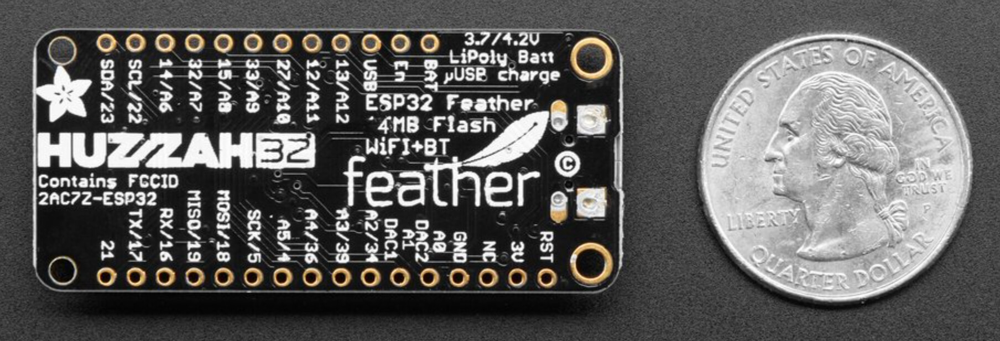
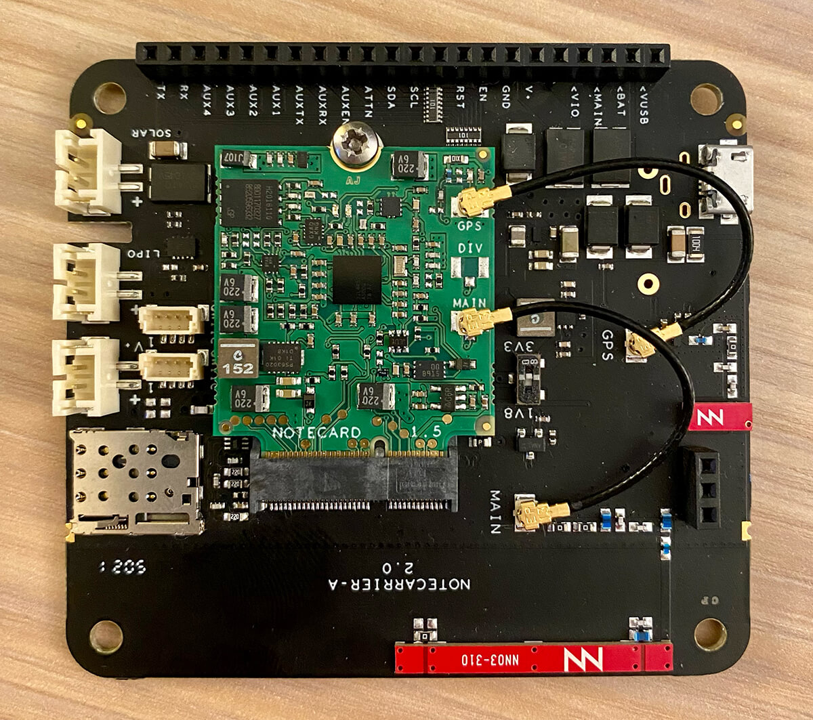
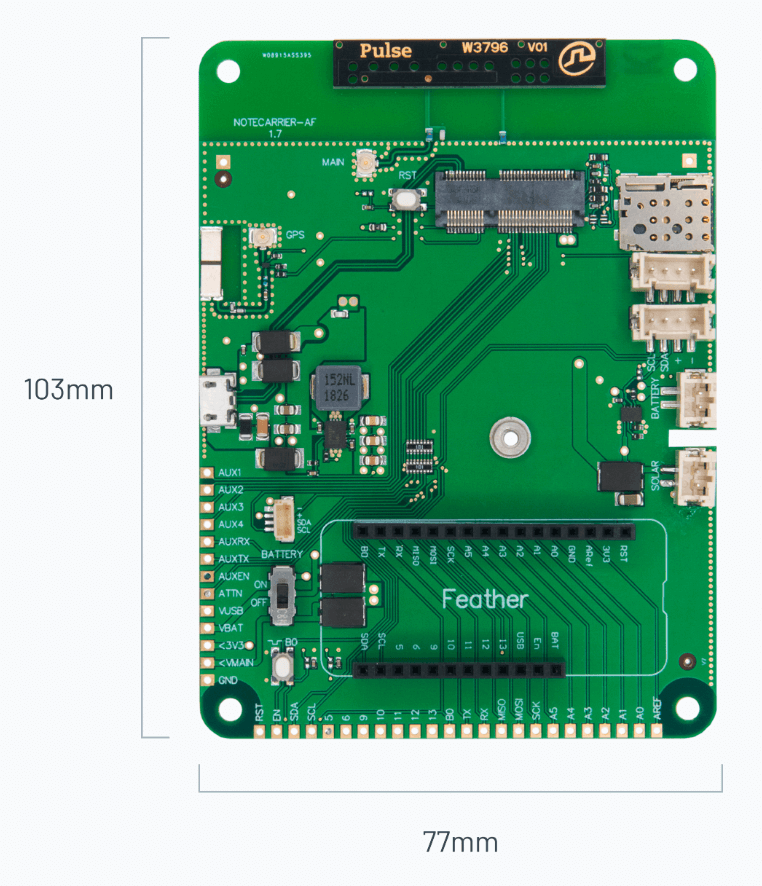
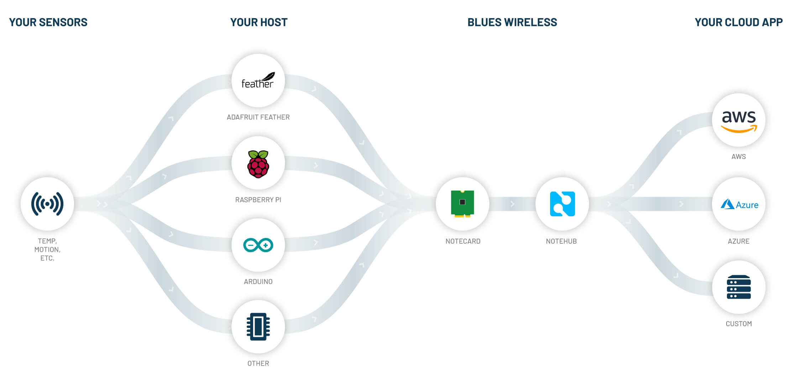
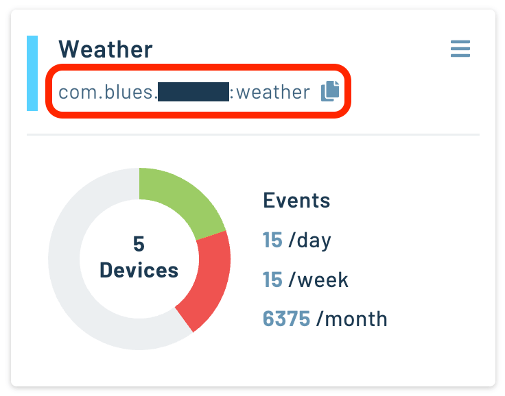
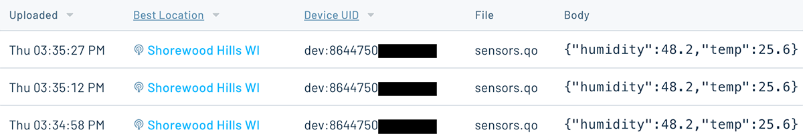
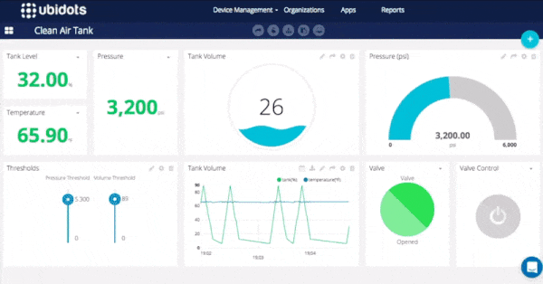

# Easiest Way to Add Cellular to an ESP32 IoT Project

*Learn how to add affordable prepaid cellular to an ESP32-based IoT solution.*

I've come to appreciate the [ESP32](https://en.wikipedia.org/wiki/ESP32) line of microcontrollers from [Espressif Systems](https://www.espressif.com/), mostly due to a combination of low-cost, low-power, yet solid MCU performance. In particular, the ESP32-based [HUZZAH32 Feather from Adafruit](https://www.adafruit.com/product/3405) is a board you'll routinely see in some [tutorials we post on Hackster](https://www.hackster.io/blues-wireless).



_Adafruit_

While Wi-Fi and Bluetooth are integrated into some ESP32 MCUs, adding cellular to the mix broadens the deployment options of any IoT project. Having a [combination of connectivity options](/blog/network-connectivity/) also enables you to use Wi-Fi when available, but fall back on cellular should Wi-Fi be unavailable or the physical location require it.

### Developer-Friendly Cellular with the Notecard

The key to success with cellular IoT connectivity on the ESP32 is a secure and reliable System-on-Module, the [Blues Wireless Notecard](/products/notecard/).


The Notecard is a 30mm x 35mm device-to-cloud data pump. With the included cellular and GPS capabilities (and a [Wi-Fi option](/products/wifi-notecard/)), the Notecard is an easy choice for securely syncing data with the cloud over a variety of global cellular protocols (specifically Cat-1, LTE-M, and NB-IoT).

**And the cost?** The Notecard comes _prepaid_ with 10 years of [global service](https://dev.blues.io/hardware/notecard-datasheet/note-nbgl-500/#cellular-service) and 500MB of data, starting at just \$49.

But...what about the M.2 edge connector on the Notecard? How does that connect to an ESP32 microcontroller?

Probably not like this:


### Easy Integration Options

Let me introduce you to the [Blues Wireless Notecarriers](/products/notecarrier/). These are development boards that make it dead simple to **connect virtually any MCU or SBC to a Notecard**. You place the Notecard into the provided M.2 slot and the Notecarrier exposes all of the pins on the Notecard to the MCU.



Now it gets even easier if you're using a Feather-based ESP32 (like I often do). The [Notecarrier-AF](https://blues.io/products/notecarrier/notecarrier-af/) (part of the [Feather Starter kit](https://shop.blues.io/products/feather-starter-kit)) has a Feather-compatible socket so you can insert your MCU directly onto the board, for wire-free connectivity.



The Notecarrier-AF also includes onboard antennas, two Grove I2C ports, and JST connectors for solar and/or LiPo batteries.

Notecard + Notecarrier-AF + ESP32 = ❤️

### From Device To Cloud, Securely

A key component of the Notecard's security architecture is that it doesn't live on the public Internet. **The Notecard doesn't have a publicly-accessible IP address.** You must use a proxy, accessed via private VPN tunnels, to communicate between the Notecard and your cloud application.

This is where the Blues Wireless cloud service [Notehub](https://blues.io/services/) comes into play.

Notehub is a thin cloud service that securely (over TLS) receives, processes, and **routes data to your cloud endpoint of choice**. This could be a big cloud like AWS, Azure, or Google Cloud - or any IoT-optimized platform like Losant, Datacake, or Ubidots. Your own self-hosted custom RESTful API is fine as well!



As an added bonus, Notehub provides OTA firmware update capabilities along with full device fleet management and [cloud-based environment variables](https://dev.blues.io/notecard/notecard-guides/understanding-environment-variables/) for easily sharing data across fleets of Notecards.

### When to Use Notecard, and When Not

It's important to note that the cellular Notecard is a **low-power, low-bandwidth, and high-latency** device. Its design center is focused on sending small packets of data (e.g. accumulated sensor readings, generated ML inferences, and the like) on an occasional cadence to the cloud.

👍 Scenarios when the Notecard makes sense:

1. Any low-bandwidth transfer of data over Cat-1, LTE-M, or NB-IoT cellular
1. Low-power edge computing deployments (agriculture, smart meters, environmental monitoring, and so on)
1. High-latency remote control solutions
1. When secure and encrypted communications are critical
1. When turnkey cloud integrations are desired

👎 Scenarios when the Notecard doesn't quite work:

1. As an "always connected" drop-in replacement for Wi-Fi
1. When you need sub-millisecond latency
1. Streaming HD video or high res images

### Ready to See How it All Works?

With a [Blues Wireless Feather Starter Kit for ESP32](https://shop.blues.io/products/feather-starter-kit) you can follow the remainder of this blog post for a quick and easy getting started experience.

> Be sure to [browse our full developer site](https://dev.blues.io/) for Notecard datasheets and additional technical information.

After creating a free account at [Notehub.io](https://notehub.io/) and initializing your first project, copy the provided unique [ProductUID](https://dev.blues.io/reference/glossary/#productuid) from the project and save it for the next step.



### Programming ESP32 Firmware

The ESP32 supports commonly used languages like Arduino/C and MicroPython. While I'm an avid Python lover, most ESP32 developers are likely writing Arduino or C/C++, so we'll stick with that path for now.

The [API that powers the Notecard](https://dev.blues.io/reference/notecard-api/introduction/) is completely JSON-based. So technically speaking, it doesn't matter what programming language you use. We provide SDKs for [Arduino, Go, C/C++, and Python](https://dev.blues.io/tools-and-sdks/) and our community has built SDKs for [.NET](/blog/dot-net-developer-iot-too/) and [Rust](https://github.com/gauteh/notecard-rs).

Whichever route you take, open up your preferred IDE and paste in this basic sketch:

```
// Include the Arduino library for the Notecard
#include <Notecard.h>
#define productUID "com.your-company.your-name:your_project"

Notecard notecard;

void setup() {
  delay(2500);
  Serial.begin(115200);
  notecard.begin();

  J *req = notecard.newRequest("hub.set");
  JAddStringToObject(req, "product", productUID);
  JAddStringToObject(req, "mode", "continuous");
  notecard.sendRequest(req);
}

void loop() {
  J *req = notecard.newRequest("note.add");
  if (req != NULL) {
    JAddStringToObject(req, "file", "sensors.qo");
    JAddBoolToObject(req, "sync", true);

    J *body = JCreateObject();
    if (body != NULL) {
      JAddNumberToObject(body, "temp", 25.6);
      JAddNumberToObject(body, "humidity", 48.2);
      JAddItemToObject(req, "body", body);
    }

    notecard.sendRequest(req);
  }

  delay(15000);
}
```

What exactly is happening in this sketch?

- We are using a [hub.set](https://dev.blues.io/reference/notecard-api/hub-requests/#hub-set) request to associate the Notecard with the Notehub project.
- We are sending a JSON object (a [Note](https://dev.blues.io/reference/glossary/#note)) with mock temperature and humidity data to the cloud, over cellular.
- Wait 15 seconds and do it all again!

You can build and upload this sketch to your ESP32 now, then check your Notehub project to see it in the cloud.

### Cellular Data in the Cloud

Once that `note.add` request is initiated, your Note is queued on the Notecard for syncing with the cloud. Since we are keeping this example simple, we are also using the `sync:true` option in the `note.add` request to *immediately* initiate a cellular connection and send the data to Notehub ASAP.

Go ahead and head back to Notehub.io and take a look at the recently uploaded events in the **Event** panel for your project:



But we don't want your data to live on Notehub! The most important part of the story is **securely routing your data to any cloud endpoint**. Take a look at our [extensive Routing Tutorials](https://dev.blues.io/guides-and-tutorials/routing-data-to-cloud/) and pick your favorite cloud, such as [Ubidots](https://ubidots.com/), and create an engaging cloud dashboard to interpret your data:



> **TIP:** Communication with the Notecard is _bi-directional_ in nature. This means the Notecard can also _receive_ data from the cloud. See [Inbound Requests & Shared Data Guide](https://dev.blues.io/notecard/notecard-walkthrough/inbound-requests-and-shared-data/) for more details.

### Next Steps

We've barely even started our journey with cellular IoT and the ESP32! Hopefully you've seen that with minimal hardware and minimal firmware, you can easily add cellular connectivity to a new or existing IoT project.

Looking for some good next steps?

- If you haven't already, pick up your own [Feather Starter Kit for ESP32](https://shop.blues.io/products/feather-starter-kit).
- Next, the _real_ [Notecard Quickstart](https://dev.blues.io/quickstart/notecard-quickstart/) does a MUCH better job getting you started.
- Consult the [Notecard API reference](https://dev.blues.io/reference/notecard-api/introduction/) to get a full grasp of the capabilities of the Notecard.
- Check out all the awesome [Blues Wireless projects on Hackster](https://www.hackster.io/blues-wireless) for inspiration.

Happy hacking on the ESP32! 👩‍💻
