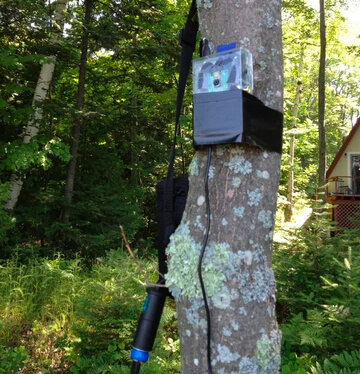
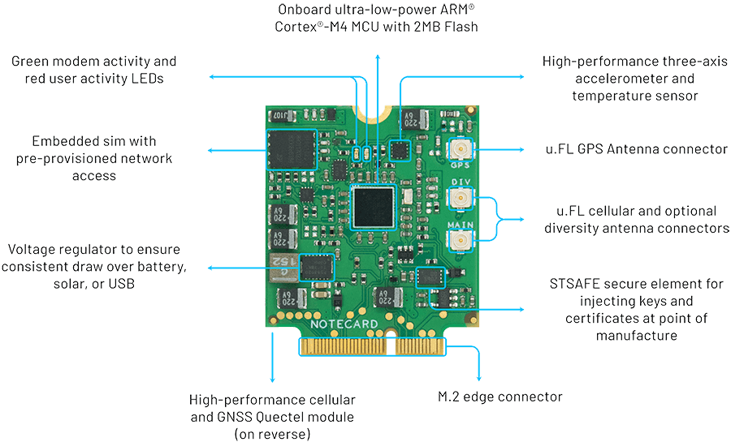
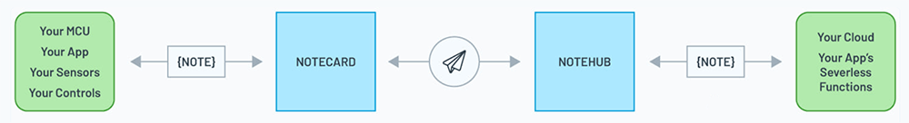
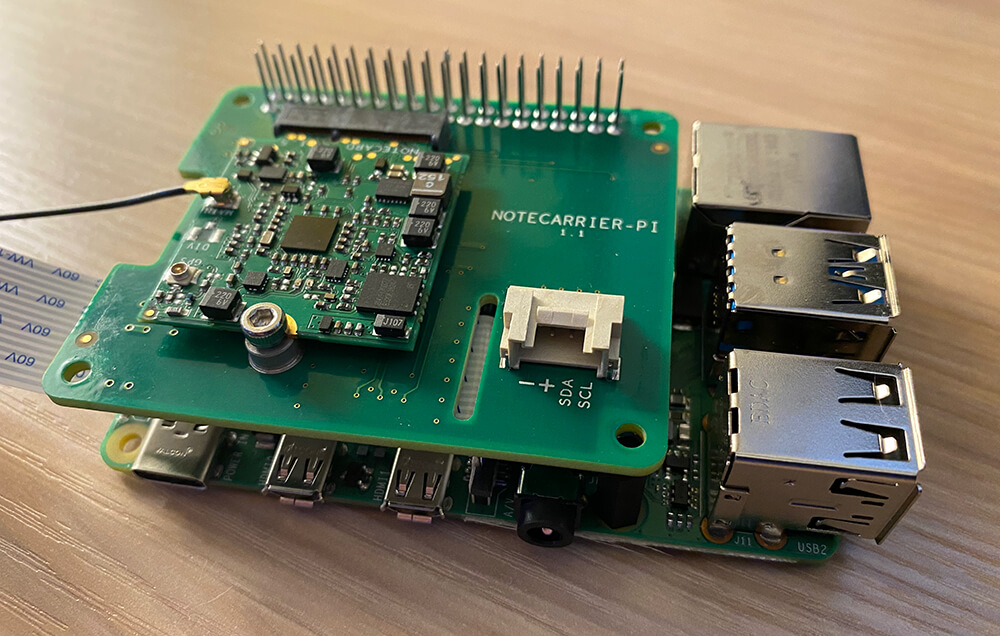
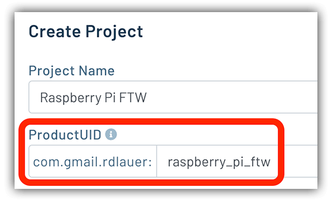
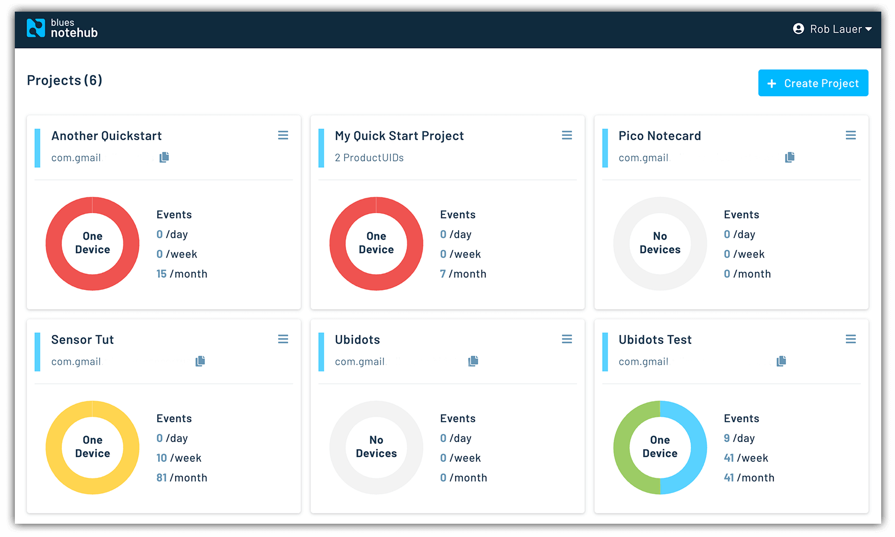
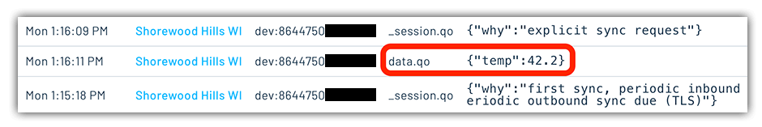
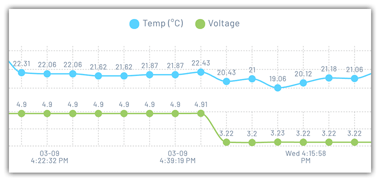
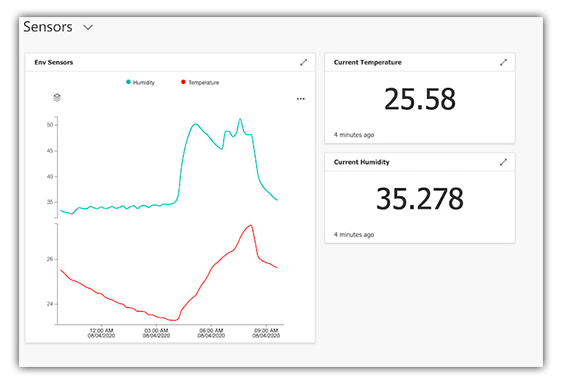

# The Easiest Way to Add Cellular to the Raspberry Pi

The ubiquity of WiFi and broadband Internet has fundamentally altered the way our devices, and thus we, interact with the world. I'm old enough to remember the first consumer-grade modems (and truthfully, racking up a one-month \$900 AOL bill in my teens). We've come a long way since then and now rely on high-speed Internet for many aspects of our personal and professional lives.

When it comes to developing IoT solutions on single board computers like Raspberry Pi, we take WiFi and wired ethernet for granted. It's always there. It's always (well, usually) on. And performance is outstanding. Why then consider adding cellular connectivity to a Raspberry Pi?

If you think about it, there are several scenarios when cellular is a legitimate need:

- WiFi connectivity is spotty or unreliable (e.g. you're in a WiFi "dead spot").
- Your RPi is on a UPS, the power goes out, and so does your WiFi.
- Data security is key, and you feel more comfortable with cellular security.
- You have a remote deployment outside the range of WiFi.

*It's not a real IoT project unless you're using A LOT of duct tape.*

In this article, we will take a step-by-step look at the easiest way to add cellular connectivity to the Raspberry Pi 4. We start with the Notecard from [Blues Wireless](https://blues.io/).

## What is the Notecard?

The [Notecard](https://blues.io/products/) is a cellular and GPS-enabled device-to-cloud data-pump. Connectivity is [available globally](https://dev.blues.io/hardware/notecard-datasheet/note-wbex-500/#cellular-service) (in 136 countries and counting) and it's pre-paid with 500 MB of data and 10 years of cellular for \$49. No activation costs, no monthly charges, no surprise fees.

The Notecard itself is a tiny 30mm x 34mm SoM with an m.2 connector for embedding on your own board. However, to make integration even easier, Blues Wireless provides expansion boards called [Notecarriers](https://blues.io/products/#notecarrier). The Notecarrier Pi is relevant here, as it's a Pi HAT with pass-through headers.

The Notecard is preconfigured to securely communicate with [Notehub.io](https://notehub.io/), the Blues Wireless service that enables secure data flow from device-to-cloud. Notecards are assigned to a project in Notehub. Notehub can then automatically sync/route data from these projects to your cloud application of choice (e.g. AWS, Azure, Google Cloud, InitialState, ThingSpeak, and so on).

## Install the Pi HAT

With your Raspberry Pi and Notecarrier Pi HAT in-hand, installation couldn't be much simpler. Just slide the Pi HAT onto the RPi.

> **NOTE:** Due to the power requirements of the Notecard, some Raspberry Pi 2 and 3 models include a current-limiting fuse that will power-cycle the device when the Notecard's modem is on and transmitting. To avoid these issues, we recommend using using only Raspberry Pi 4 devices.

## Initiate a Connection

After setting up an account on [Notehub.io](https://notehub.io/), you'll create a new project (recording your ProductUID).

To use the Notecard with Python on your Raspberry Pi over I2C, you'll want to install the `python-periphery` and `note-python` libraries:

	pip3 install python-periphery
	pip3 install note-python

And with a few more lines of code, you can initialize your Notecard:

	import notecard
	from periphery import I2C
	
	productUID = "your-notehub-ProductUID"
	port = I2C("/dev/i2c-1")
	card = notecard.OpenI2C(port, 0, 0)
	req = {"req": "hub.set"}
	req["product"] = productUID
	req["mode"] = "periodic"
	req["outbound"] = 120  # sync every 120 secs
	rsp = card.Transaction(req)

This associates your Notecard with the project you created on Notehub.io.

### JSON FTW

If you print out the `req` variable you'll see requests and responses between Notecard and Notehub are pure JSON:

	{
	   "req":"hub.set",
	   "product":"your-notehub-ProductUID",
	   "mode":"periodic",
	   "outbound":120
	}

In lieu of archaic AT commands that many cellular solutions force you to deal with, everything to and from the Notecard is human-readable JSON.

## Send Your First Request

With your Notecard configured, it's time to make your first request to Notehub.

Requests are called "notes". Each note signifies an event that you want to send to Notehub from your Notecard. For example, maybe you took a temperature sensor reading and would like to log that data. The entire JSON object can be sent to Notehub in a note like this:

	{
	   "req":"note.add",
	   "body":{
	      "temp":42.2
	   }
	}

> **TIP:** Multiple notes can be sent in one request from Notecard to Notehub in a single [notefile](https://dev.blues.io/reference/glossary/#notefile).

We don't have to manually create that JSON object. We can let the `note-python` library do it for us:

    req = {"req": "note.add"}
    req["file"] = "data.qo"
    req["body"] = {"temp": 42.2}
    rsp = card.Transaction(req)

## View Your Data

The next time your Notecard syncs with Notehub (which it should do every 120 seconds based on the `outbound` parameter supplied above), you'll see it appear as an event:

Anything additional you might want to know about devices and events can be manually inspected in Notehub, including:

- Data usage,
- Firmware versions (and DFU capabilities),
- [Environment variables](https://dev.blues.io/build/notecard-guides/understanding-environment-variables/),
- Device fleet management,
- Default temp/voltage reports,
- and plenty more!

## From Notehub to the Cloud

Does it end there? Not at all! The beauty of Notehub comes not in the storage and display of raw data, but rather in the routing capabilities. Every event that comes into Notehub can be [routed to a third-party cloud provider](https://dev.blues.io/build/tutorials/route-tutorial/initialstate/) for further action.

Say, for instance, you'd like to provide a dashboard display of incoming data in **Azure**. There's a [routing tutorial for that](https://dev.blues.io/build/tutorials/route-tutorial/azure/)!

What about sending an automated SMS with **Twilio**? [Try this tutorial.](https://dev.blues.io/build/routing-guides/twilio-route/)

Or creating an engaging data visualization with an IoT platform like **Ubidots**? [Check it out.](https://dev.blues.io/build/tutorials/route-tutorial/ubidots/)

## Next Steps

Hopefully you've seen how quickly and easily you can get up and running with adding cellular connectivity to your Raspberry Pi.

*Interested in some next steps with the Notecard?*

1. Visit the [Blues Wireless developer portal](https://dev.blues.io/) for additional information and quickstart tutorials.
2. [Use this link](https://shop.blues.io/discount/5JM00D2M3SA2_BLOG) for 10% off your purchase of Notecards, Notecarriers, or Development Kits from the Blues Wireless store.