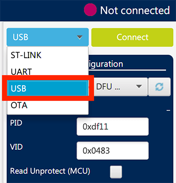
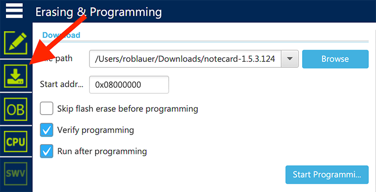

# Manually Update Notecard Firmware

Hi folks! As you may know by now, the Q1 release from Blues Wireless includes updated firmware for your Notecard devices. While we recommend you use [Notehub](https://notehub.io/) to update device firmware, some of you may want to manually update over USB. Here are some (relatively) quick instructions on how to do so.

## Prerequisites

- Serial terminal emulator software (e.g. the web-based terminal available at [dev.blues.io](https://dev.blues.io/notecard-playground/), [CoolTerm](https://freeware.the-meiers.org/), or [TinyTerm](https://www.censoft.com/products/tinyterm-plus-terminal-emulator.php)).
- [STM32CubeProgrammer](https://www.st.com/en/development-tools/stm32cubeprog.html) (download the appropriate version for your OS).
- A fresh Notecard binary file (attached to this post).

## STM32CubeProgrammer Installation Notes

STM32CubeProgrammer is a bit finicky when it comes to installation:

### Windows

> Note: If you're on a version of Windows older than Windows 10, you'll first need to install the [STM32 Virtual COM Port Driver](https://www.st.com/en/development-tools/stsw-stm32102.html).

Download and extract the zip package and run the installer (ignoring the security issues from Windows of course!).

### macOS

Download and extract the zip package.

Using your terminal app of choice, navigate to the extracted directory and launch the installer in CLI mode (as of this writing, the latest version of STM32CubeProgrammer is 2.6.0):

	./SetupSTM32CubeProgrammer-2.6.0.app/Contents/MacOs/SetupSTM32CubeProgrammer-2_6_0_macos

### Linux

Prior to installation, make sure you have the following packages installed:

- libusb-1.0-0-dev
- unzip

If you are using a USB port to connect to the STM32 device, install the libusb1.0 package by typing the following command:

	sudo apt-get install libusb-1.0.0-dev

To use ST-LINK probe or USB DFU to connect to a target, copy the rules files located under `Driver/rules` folder in `/etc/udev/rules.d/` on Ubuntu (`sudo cp *.* /etc/udev/rules.d`).

> Note: libusb1.0.12 version or higher is required to run STM32CubeProgrammer.

Download and extract the zip package and execute:

	SetupSTM32CubeProgrammer-2.6.0.linux

## Firmware Update Process

Connect your Notecard device to your computer via USB. Verify that your terminal emulator (e.g. [dev.blues.io](https://dev.blues.io/notecard-playground/), [CoolTerm](https://freeware.the-meiers.org/), or [TinyTerm](https://www.censoft.com/products/tinyterm-plus-terminal-emulator.php)) is able to connect to the device by sending the `card.version` command:

	{"req": "card.version"}
	
The `body` of the response should look similar to this:

	{
	    "org":"Blues Wireless",
	    "product":"Notecard",
	    "version":"notecard-1.2.3-v11",
	    "ver_major":1,
	    "ver_minor":2,
	    "ver_patch":3,
	    "ver_build":9950,
	    "built":"May 20 2020 17:11:56"
	}

Launch the built-in bootloader firmware by sending the `bootloader` command via your terminal emulator. You'll know the Notecard is in bootloader mode when the LED turns red.

> Note: In Windows Device Manager, this causes Notecard to disappear as a "Ports (COM & LPT)/USB Serial Device (VID 0x30A4, PID 0x0001)" and to reappear as a "Universal Serial Bus devices/STM32 BOOTLOADER (VID 0x0438, PID 0xDF11)".

Now, you have two choices as to how to proceed. You may update the Notecard firmware via the STM32CubeProgrammer CLI or GUI.

### CLI Method

Make sure `STM32_Programmer_CLI.exe` is in your PATH (or provide its absolute path in the command below). The program should have been installed in the same directory as `STM32CubeProgrammer.exe`.

Run the following command, substituting the path to your desired `.bin` firmware file:

	STM32_Programmer_CLI --connect port=USB1 --write [path/to/binary.bin] 0x08000000 --verify --go 0x08000000
	
> Note: On Windows be sure to reference `STM32_Programmer_CLI.exe` as the executable in the above command.

### GUI Method

Open the STM32CubeProgrammer application.

Select "USB" from the dropdown menu provided in the upper-right corner:

Select the port corresponding to your Notecard in the "Port" dropdown menu (likely "USB1").

> Note: You may need to click the button next to the port dropdown to refresh the list.

Click the "Connect" button and the log should update and display `Data read successfully`.

Next, access the "Erasing & Programming" screen by clicking the menu button with the arrow pointing down:

Follow the other configuration options in the image above:

- Select the appropriate firmware `.bin` file.
- Check the "Verify programming" box.
- Check the "Run after programming" box.

Finally, click the "Start Programming" button. After a few seconds of commands displayed in the log, you should see multiple dialog warnings/notifications to click through and confirm.

### Results

With either the CLI or GUI method, once the update process is complete, your Notecard will reset and reconnect. You can verify the firmware process was successful by executing another `card.version` request and inspecting the `version` parameter.

Run into trouble? Let us know by replying in this thread!

