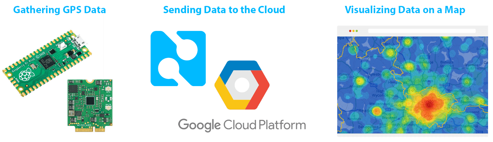
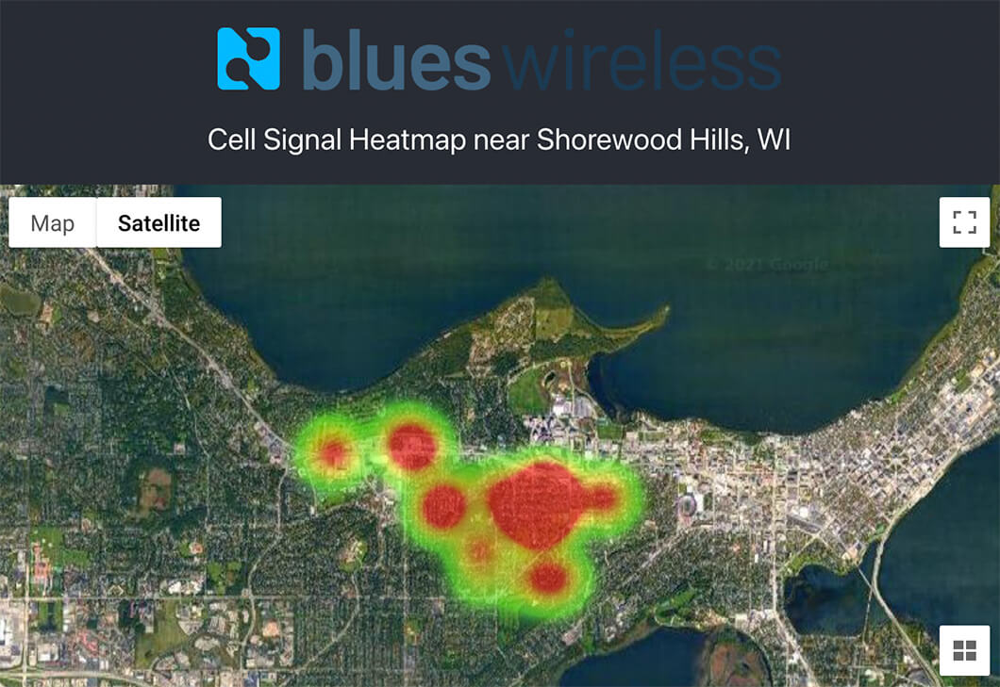

# Create a Google Map Heatmap with Cellular and GPS Data

A heatmap overlaid on satellite imagery is one of the more tantalizing means of displaying map-based data. Considering my newfound love for the Raspberry Pi Pico, and having seen how easy it can be to [add cellular connectivity to the Pico](https://www.hackster.io/brandonsatrom/adding-cellular-to-the-raspberry-pi-pico-b8a4b6), why not combine these loves in a new project?

In this tutorial, we are going to build a cellular- and GPS-enabled IoT solution that collects cell signal strength and location data at defined intervals, stored in the cloud, with a web app to display said data in a heatmap.

*Specifically we will be developing with:*

1. [Raspberry Pi Pico](https://www.raspberrypi.org/products/raspberry-pi-pico/) (any compatible MCU works fine too).
2. [Notecard and Notecarrier](https://blues.io/products/?utm_source=devto&utm_medium=blog&utm_campaign=featured-project) from Blues Wireless (for cellular connectivity and GPS).
3. 1602 LCD module (for displaying in-action status updates).
4. [Google Cloud Platform](https://cloud.google.com/) (for cloud functions, storage, and maps)

If you'd like a quick 1.5 minute overview of the project, check out this video:

https://youtu.be/aFaDIDqyjCE

The final result on the web will look something like this:

**Ready? Get started over at [hackster.io](NEED LINK)!**