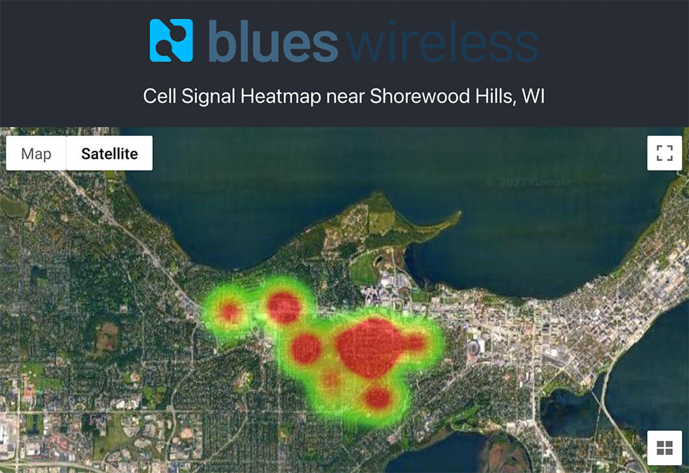
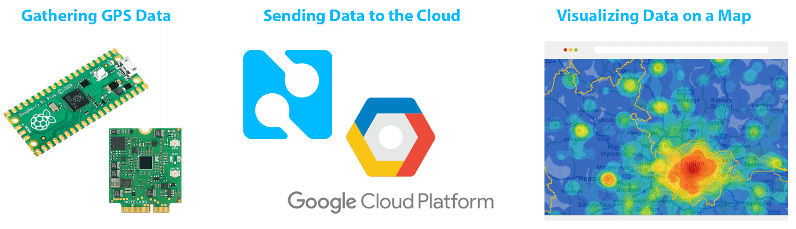
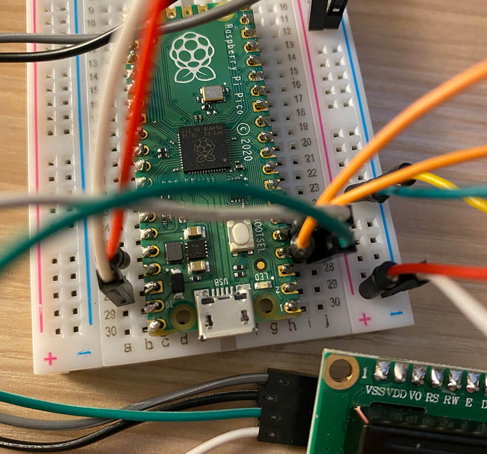

# Create a Cellular Heatmap with Raspberry Pi Pico and GPS Geofencing

A heatmap overlaid on satellite imagery is one of the more tantalizing means of displaying map-based data. Considering my newfound love for the Raspberry Pi Pico, and having seen how easy it can be to [add cellular connectivity to the Pico](https://www.hackster.io/brandonsatrom/adding-cellular-to-the-raspberry-pi-pico-b8a4b6), why not combine these loves in a new project?

Today we are going to build a cellular- and GPS-enabled IoT solution that collects cell signal strength and location data at defined intervals, stored in the cloud, with a web app to display said data in a heatmap.

*A "heatmap" is a visual representation of data where values are translated into colors.*

If you'd like a quick two-minute overview of the project, check out this video:

https://www.youtube.com/watch?v=oEFy60qA7Ao

*Specifically we will be developing with:*

1. [Raspberry Pi Pico](https://www.raspberrypi.org/products/raspberry-pi-pico/) (any compatible MCU works fine too).
2. [Notecard and Notecarrier](https://blues.io/products/?utm_source=hackster&utm_medium=web&utm_campaign=featured-project) from Blues Wireless (for cellular connectivity and GPS).
3. 1602 LCD module (optional, for displaying in-action status updates).
4. [Google Cloud Platform](https://cloud.google.com/) (for cloud functions, storage, and maps)

> **TIP:** If Google Cloud Platform is a turnoff, you can absolutely swap in your cloud provider of choice for most of the functionality covered. 🤗

So at the highest level we are:

In this guide, we will cover each of these sections in full detail.

**Ready? Let's get started!**

## GPS, Cellular, and Geofencing 🗺️

If our goal is to collect cell signal strength AND location data at defined intervals, we need a hardware solution that can handle both *while also* providing geofencing capabilities. All the while being aware that GPS can be very power-hungry.

In our case, we want to measure cell signals in a series of geofenced areas that we will create and measure on-the-fly.

We can handle this with the [Notecard](https://blues.io/products/?utm_source=hackster&utm_medium=web&utm_campaign=featured-project) from Blues Wireless. The  Notecard is a cellular and GPS device-to-cloud data pump that comes with 500 MB of data and 10 years of service for \$49. No activation charges, no monthly fees.

To make things even easier, Blues Wireless also provides a series of expansion boards (called Notecarriers) to host the Notecard. For this project, we will use the [Notecarrier-A](https://shop.blues.io/products/carr-al?utm_source=hackster&utm_medium=web&utm_campaign=featured-project), a board with pre-soldered female headers allowing access to all the pins on the Notecard edge connector.

*Now here is the really important part:*

The Notecard ships preconfigured to communicate with [Notehub.io](https://notehub.io/?utm_source=hackster&utm_medium=web&utm_campaign=featured-project), the Blues Wireless service that enables secure device-to-cloud data flow. Notecards are assigned to a project in Notehub, which then routes data to your cloud of choice (in our case, that'll be Google Cloud Platform).

## Let's Build! 🏗️

Here's a quick look at what we are going to build:

Our Raspberry Pi Pico can supply all the power our Notecarrier needs. Use jumper wires to connect `3V3(OUT)` and `GND` on the Pico to a power rail on the breadboard. Next, connect the power rail to `BATT` and `GND` on the Notecarrier.

We'll be using the I2C bus for communication between devices, so we can connect `SCL` (the clock line) and `SDA` (the data line) pins on the Notecarrier to any open I2C headers on the Pico (I used pins 4 and 5 which place the Notecarrier on I2C1).

The one downside of the Raspberry Pi Pico is the lack of labels on the top of the board. Therefore, it's always worthwhile to keep a pinout handy.

Next up is the LCD module. I really like using the 1602A LCD because it has a pre-soldered backpack making I2C and power connections a snap.

Connect `GND` and `VCC` on the LCD to the appropriate spots on your breadboard's power rail. The Pico can only supply 3.3V out, but the LCD works best (brightest) with 5V. So, while you *can* connect the LCD to the same power rail that the Pico is powering, the screen will be fairly dim.

A better solution is a battery-powered breadboard power supply. I like using this with a 9V battery as it can supply 5V of regulated power to whichever rail you want (in this case the **opposite** rail that the Pico is already powering).

So now we can supply 3.3V to the Notecarrier and 5V to the LCD! 🔌

Finally, the LCD is going to use the same I2C bus as the Notecarrier. Connect `SDA` and `SCL` from the LCD module to the same pins you used for the Notecarrier.

**And that's it!** Refer to the completed hardware assembly image above if need be.

## Let's Write Some (Micro)Python! 🐍

With our physical hardware configured properly, it's time to program our Pico with some MicroPython.

> **TIP:** Want to skip the step-by-step code writing exercise? You can always [view this repository](https://github.com/rdlauer/notecard-heatmap) with the completed assets.

### Set Up Your Pico for MicroPython

The Pico supports MicroPython, just not out of the box. So if you haven't already, you'll need to flash your Pico's firmware.

To install MicroPython, just follow the instructions provided under "Getting Started with MicroPython" in the [Raspberry Pi docs](https://www.raspberrypi.org/documentation/rp2040/getting-started/#getting-started-with-micropython).

### Start Your IDE

Boot up your favorite code editor. I gravitate towards [Visual Studio Code and the Pico-Go extension](https://dev.to/blues/your-first-steps-with-raspberry-pi-pico-and-visual-studio-code-4jbd), but [Thonny](https://thonny.org/) is a great little IDE as well.

Create two files: `main.py` and `keys.py`. You can probably guess that `main` will store our application logic and `keys` will store sensitive data that we don't want to commit to public source control.

Our `keys.py` file is only going to store one key, and that's the Notecard's `ProductUID`. This associates our Notecard with our cloud-based Notehub project. We'll come back to this in a bit, but for now, just add this line:

	PRODUCTUID = "com.company.name:project"

### Grab Some External Libraries

Our project is going to use three external libraries. Two for communicating with the LCD and one for communicating with the Notecard.

Download the [latest note-python library](https://github.com/blues/note-python). Create a `lib` directory on your Pico and copy the `notecard` directory in there.

Next, download `lcd_api.py` and `machine_i2c_lcd.py` from the [completed project's source repo](https://github.com/rdlauer/notecard-heatmap/tree/main/pico). These can be copied to the Pico next to `main.py`.

Our completed file and folder structure on the Pico should look like this:

	/lib
	  /notecard
	    card.py
	    env.py
	    ...
	keys.py
	lcd_api.py
	machine_i2c_lcd.py
	main.py

### Imports and Constants

Open up `main.py` and add the following import statements to the top of the file:

	from machine import I2C, Pin
	from machine_i2c_lcd import I2cLcd
	from time import sleep
	import keys
	import notecard

Create two variables that will hold constants for the app:

	GEOFENCE_METERS = 50
	PRODUCTUID = keys.PRODUCTUID

The `GEOFENCE_METERS` variable tells our program how far from the center of our geofence circle we should be before capturing a new set of coordinates.

In theory this will allow us to create a heatmap that includes touching or overlapping geofenced areas, something like this:

### Initialize Our Components

Next we need to initialize the I2C bus, our LCD module, and the Notecard.

Since I used GPIO pins 2 and 3 for I2C (which correspond to the I2C1 bus), I can initialize I2C with:

	i2c = I2C(1, sda=Pin(2), scl=Pin(3))

We need to figure out the I2C address of the LCD module. To do so, there is a helpful `scan` method we can use. I'm referencing the 2nd device on the I2C bus with `[1]` as the Notecard has a lower I2C address (`0x17` vs `0x27` if you're curious):

	lcd_i2c_addr = i2c.scan()[1]

Finally, we initialize the LCD (2 rows with 16 characters on each row):

	lcd = I2cLcd(i2c, lcd_i2c_addr, 2, 16)
	lcd.clear()

Next we'll want to set up our Notecard. The note-python library comes with a handy `OpenI2C` method that does the dirty work for us:

	card = notecard.OpenI2C(i2c, 0, 0, debug=True)
	print("Successfully Connected to Notecard!")

Optionally, we can perform a quick reset of the Notecard. I find this convenient when prototyping a lot of different projects that share the same Notecard!

	req = {"req": "card.restore", "delete": True}
	rsp = card.Transaction(req)
	sleep(2)

Next up, let's configure this Notecard to speak with Notehub (recall that Notehub is the Blues Wireless cloud service that is going to route data to our cloud application).

	req = {"req": "hub.set"}
	req["product"] = PRODUCTUID
	req["mode"] = "periodic"
	req["inbound"] = 120
	req["outbound"] = 15
	rsp = card.Transaction(req)

**What's going on here?** We are creating a `hub.set` request to set some Notecard <-> Notehub syncing parameters. We are setting the `ProductUID` and defining a `periodic` cellular connectivity mode. The `inbound` parameter means the Notecard will connect to Notehub once every 120 minutes to check for any data it needs to download. More importantly for us, the `outbound` parameter tells Notecard to send collected data to Notehub every 15 minutes (but only if there is data to send).

We can now set up the appropriate GPS mode on the Notecard. Since our program relies on a continuous stream of GPS data, we'll want to use `continuous` mode.

	req = {"req": "card.location.mode", "mode": "continuous"}
	rsp = card.Transaction(req)

> **NOTE:** The Notecard provides the option of a `continuous` mode for both cellular and GPS, but you can't use them both in that mode simultaneously.

Finally, we need a boolean variable that tells us whether or not GPS is active and receiving latitude and longitude coordinates:

	is_gps_active = False

### Functions for Days

At the bottom of `main.py` we need to add a `while` loop and associated function that will keep checking to see if GPS is active:

	def check_gps(rsp):
	    """ checks if gps module is active with location """
	    if ("{gps-sats}" in rsp["status"] and "lat" in rsp):
	        return True
	    else:
	        return False
	
	while not is_gps_active:
	    """ if gps module is active, start tracking location """
	    req = {"req": "card.location"}
	    rsp = card.Transaction(req)
	
	    if check_gps(rsp):
	        is_gps_active = True
	        lcd_msg("GPS ACTIVATED")
	        track_location(rsp["lat"], rsp["lon"])
	    else:
	        lcd_msg("GPS INACTIVE")
	        sleep(20)

> **NOTE:** Make sure the `while` loop remains at the bottom of `main.py` as we add additional functions.

*We know that GPS is active if:*

1. "{gps-sats}" is returned from a [card.location](https://dev.blues.io/reference/complete-api-reference/card-requests/?utm_source=hackster&utm_medium=web&utm_campaign=featured-project#card-location) request, signifying one or more GPS satellites have been found.
2. The `lat` key is found in the JSON response.

If GPS is active, we display a message on the LCD module with the `lcd_msg` function (`print` is nice to use when debugging):

	def lcd_msg(msg):
	    """ displays a message on the lcd screen """
	    lcd.clear()
	    sleep(0.5)
	    lcd.putstr(msg)
	    print("*****" + msg + "*****")
	    sleep(0.5)

Continuing forward, when GPS is active we are ready to set our first geofence! We set the geofence AND continue tracking our location with the `track_location` and `set_geofence` functions:

	def track_location(lat, lon):
	    """ if gps is active and location has changed significantly, create a note in notehub """
	    set_geofence(lat, lon)
	    loc_changed = False
	
	    while not loc_changed:
	        req = {"req": "card.location"}
	        rsp = card.Transaction(req)
	
	        # double check that gps is still active!
	        if check_gps(rsp) and rsp["max"] >= GEOFENCE_METERS:
	            loc_changed = True
	            lcd_msg("GPS LOC CHANGED")
	            new_lat = rsp["lat"]
	            new_lon = rsp["lon"]
	            # get the current cell signal measure
	            bars = get_cell_bars()
	            add_note(new_lat, new_lon, bars)
	            # reset and start tracking location again!
	            track_location(new_lat, new_lon)
	        else:
	            lcd_msg("NO GPS CHANGE")
	            sleep(5)
	            
	def set_geofence(lat, lon):
	    """ sets a new geofence with center point on provided lat/lon """
	    req = {"req": "card.location.mode", "mode": "continuous", "minutes": 0,
	           "lat": lat, "lon": lon, "max": GEOFENCE_METERS}
	    rsp = card.Transaction(req)
	    lcd_msg("GEOFENCE SET")

There is a lot going on in these functions, so let's focus on the important parts:

1. We are setting a new geofence using the provided lat/lng coordinates with the `set_geofence` function, which uses the Notecard's [card.location.mode](https://dev.blues.io/reference/complete-api-reference/card-requests/?utm_source=hackster&utm_medium=web&utm_campaign=featured-project#card-location-mode) API.
2. We double check that GPS is still active (can never be too careful!) and see if the `max` value is >= to our `GEOFENCE_METERS` value. `max` is the approximate distance between the center of the geofence and our current location.
3. We get the cell signal strength in the `get_cell_bars` function (see below) and send data to Notehub with the `add_note` function (also below).
4. Finally, we set a new geofence by calling `track_location` with the updated lat/lng coordinates.

*Here are the two remaining functions referenced above:*

	def add_note(lat, lon, bars):
	    """ uploads the note/event to notehub.io """
	    req = {"req": "note.add"}
	    req["file"] = "bars.qo"
	    req["start"] = True
	    req["body"] = {"lat": lat, "lon": lon, "bars": bars}
	    rsp = card.Transaction(req)
	    lcd_msg("NOTE SENT!")
	
	def get_cell_bars():
	    """ gets the cell signal strength from card.wireless """
	    req = {"req": "card.wireless"}
	    rsp = card.Transaction(req)
	    return rsp["count"]

> **TIP:** The Blues Wireless Developer Portal provides thorough documentation of [all the Notecard APIs](https://dev.blues.io/reference/complete-api-reference/introduction/?utm_source=hackster&utm_medium=web&utm_campaign=featured-project).

**And that's it!** The program on our Pico should be 100% complete and ready to start gathering data.

Before we put it into action, let's see how we finish hooking up Notecard to Notehub and what we then can do with our gathered GPS data.

## Pumping Data to the Cloud ☁️

### Cloud Part I: Notehub

Recall that [notehub.io](https://notehub.io/?utm_source=hackster&utm_medium=web&utm_campaign=featured-project) is the Notecard-optimized service that enables synchronization of data between our Notecard devices and cloud applications.

While we already went over Notehub and it's role in our project, the high level workflow bears repeating:

1. GPS data is **gathered and processed** on the Notecard.
2. Notecard **sends** this data to Notehub over cellular.
3. Notehub **routes** this data to our cloud of choice.

Let's look at how we configure Notehub in a few simple steps.

1. Create your free account on [Notehub.io](https://notehub.io/?utm_source=hackster&utm_medium=web&utm_campaign=featured-project).
2. Using the **New Project** card, give your project a name and `ProductUID`.
3. Copy that `ProductUID` and paste it in `keys.py` on your Pico.

**Done? Great!** When the program runs, Notecard will automatically associate itself with this Notehub project. Any notes (events) sent to Notecard will travel over cellular and show up in the **Events** panel when received:

The last thing we need to create in Notehub is a new **route**. However, we are going to wait to create the route until after our Google Cloud Platform instance is set up.

### Cloud Part II: Google Cloud Platform

Google Cloud Platform (GCP) is Google's answer to Amazon's AWS and Microsoft's Azure. Providing a comparable set of features, GCP is an intriguing third option of big cloud providers. Personally I find AWS and Azure to be more powerful, but GCP more user-friendly. Your mileage may vary.

*We need three things from GCP:*

1. A place to store our accumulated GPS data.
2. A means of accepting said data from Notehub.
3. An API key for using Google Maps.

We can check the first two requirements off with [Cloud Firestore](https://cloud.google.com/firestore/docs) and [Cloud Functions](https://cloud.google.com/functions), respectively.

Let's kick off our Google Cloud Platform journey by creating an account at [console.cloud.google.com](https://console.cloud.google.com/).

Create a **new project**, naming it whatever you'd like:

> **NOTE:** In Google's documentation you'll see references to both "Google Cloud" and "Firebase" that reference the same products and functions. It's confusing, but some features from Firebase are also available in GCP. 🤷

#### Cloud Firestore

Firestore is used for storing, querying, and syncing data. It's a fast and relatively easy-to-use NoSQL database. There are certainly other options you could use though, like Firebase's Realtime Database and the GCP Cloud SQL relational databases.

Navigate to the **Firestore** menu item (not to be confused with **Filestore**!).

Assuming this is the first time you've created a Firestore instance, you'll be prompted to choose between "Native" and "Datastore" mode. You're welcome to [read about the differences](https://cloud.google.com/datastore/docs/firestore-or-datastore), but generally speaking you're best off with "Native":

Choose a geo location close to you and create your database.

Lastly, you'll be prompted to create your first collection (or "table" for you relational db folks). Name your collection something memorable (e.g. "mapdata").

NoSQL databases, you either love 'em or hate 'em! One big advantage of NoSQL databases is that we don't have to pre-define any additional fields in the data stored...so that's all the Firestore configuration we have to do!

#### Cloud Functions

Google Cloud Functions are serverless functions you write (in almost any language) that are hosted and executed in Google's cloud. This provides a great way for us to send JSON data from Notehub to GCP.

Navigate to the **Cloud Functions** menu item and create your first function.

Name it whatever you like and leave all of the defaults as-is, except to check "Allow unauthenticated invocations" under **Authentication**. In our case, access to this function will not be publicly known outside of Notehub, allowing us to avoid authentication struggles.

Copy that "Trigger URL" as you'll need it later.

On the next page, you may have to enable "Cloud Build API". You then can choose the language runtime. Since we started in MicroPython on the Pico, we might as well be consistent and choose Python. This will populate two files automatically, `main.py` and `requirements.txt`.

By default, Python cloud functions have access to numerous [pre-installed packages](https://cloud.google.com/functions/docs/writing/specifying-dependencies-python#pre-installed_packages). In our case, ironically the one missing is `google-cloud-firestore`. Open up `requirements.txt` and add:

	google-cloud-firestore==2.0.2

Next, in `main.py` we are going to replace the default function with one super simple function called `add_data`:

	from google.cloud import firestore
	
	def add_data(request):
	  request_json = request.get_json()
	  db = firestore.Client()
	  db.collection(u'mapdata').document().set(request_json)
	  return '', 200

**What's happening here?** The `request` parameter is literally going to be the JSON payload we send from Notehub. Here is an example payload Notehub will send:

	{
	  "bars": 1,
	  "lat": 43.09266,
	  "lon": -89.49021,
	  "location": "Shorewood Hills, WI"
	}

We are then adding a single document (a "record" for you relational folks again) in the `mapdata` collection with `document().set(request_json)`.

Lastly, we return a `200` status code to let Notehub know all went well with the transfer.

> **NOTE:** Best practice dictates we should catch errors and gracefully fail instead of assuming every request ends in a 200!

Be sure to change the "Entry Point" to be the same name as the function, `add_data`, and then **Deploy**!

If you so desire, you can test the function and paste in the example JSON payload listed above. If you navigate back to Firestore, you should see your test data appear like magic. 

#### Google Maps

While we are still in the GCP console, let's take a moment to enable access to Google Maps.

Scroll all the way down to the **Google Maps Platform** menu option.

Select and enable the **Maps JavaScript API**:

To enable access to Google Maps, you'll need to create a new API key. Navigate to the **APIs & Services > Credentials** menu option. Choose **Create Credentials** at the top of the screen and select **API Key**. You'll need this key for when you configure access to Google Maps in the web app later on.

### Cloud Part III: Back to Notehub

Remember the "Trigger URL" for your Cloud Function? Great, because we need to head back to Notehub to create a **route** for our data to travel from Notehub to GCP.

Navigate to the **Routes** menu option and click on **Add Route**.

Provide a name for your route and choose "Google Cloud Function" as the **Route Type**. Paste in the Trigger URL as the **Route URL**.

Under **Notefiles** choose "Select Notefiles". In the field provided, enter `bars.qo` (or whatever the note file name you specified in `main.py` on your Pico). We do this because we *only* want notes sent to GCP that are relevant to the data we want to display.

Next, we are going to use [JSONata](https://jsonata.org/) to create an expression that will allow us to format and process our JSON on the fly.

Why? The full JSON sent as part of the note contains extra data that we don't need to send along to GCP:

	{
	    "event": "dbfb2474-4a4a-4d3d-a171-b122be5f1f",
	    "session": "ed8aee23-1f30-4e33-b252-0fd5a5d761",
	    "device": "dev:798357841085845",
	    "product": "product:com.xxx.yyy:proj",
	    "received": 1616534703.063639,
	    "routed": 1616534707,
	    "req": "note.add",
	    "when": 1616534635,
	    "file": "bars.qo",
	    "body": {
	        "bars": 1,
	        "lat": 43.092329999999993,
	        "lon": -89.48977
	    },
	    "where_olc": "86MG3GR6+X2Q4",
	    "where_lat": 43.0924525,
	    "where_lon": -89.48988671875,
	    "where_location": "Middleton, WI",
	    "where_country": "US",
	    "where_timezone": "America/Chicago",
	    etc...
	}

This is where JSONata comes in handy. The **JSONata Expression** will be this:

	{"bars":body.bars, "lat":body.lat, "lon":body.lon, "location": where_location}

Make sure your route is enabled and save the changes.

**We're almost done!** So far we have:

1. Collected GPS data on the device.
2. Sent the data to Notehub.
3. Used Notehub to process the data and deliver it to a Cloud Function on GCP.

Last up is creating the web app to display our heatmap with Google Maps.

## Displaying our Heatmap on the Web 🔥 

Let's wrap up our project by architecting a relatively simple React web app that will use Google Maps to generate a heatmap of our cell signal data.

Again, you can find all of this code [in the GitHub repository](https://github.com/rdlauer/notecard-heatmap/tree/main/web) if you want to skip the narrative!

### Initializing the React App

The defacto means of starting a new React app is by using [Create React App](https://reactjs.org/docs/create-a-new-react-app.html#create-react-app). This CLI is a great way to bootstrap a new app. To install, use:

	npx create-react-app map-app
	cd map-app

Next, add the `react-google-maps/api` and the `firebase` libraries to access Google Maps and Cloud Firestore respectively:

	yarn add @react-google-maps/api
	yarn add firebase

### React Components

Generally speaking, React apps are made up of multiple function and class components.

Our React app has three components:

- `App.js` is our root-level component.
- `MapContainer.js` loads the Google Maps script and provides a host container for...
- `Map.js` which shows our map.

In the interest of space (and time) we aren't going to cover every single aspect of the web app (especially since the full source is [available here](https://github.com/rdlauer/notecard-heatmap/tree/main/web)). However, we should cover a few critical aspects.

### Firebase?

Right. `yarn add firebase` is an example of the Firebase vs Google Cloud Platform confusion. As noted above, both Firebase and GCP offer access to Firestore. The APIs for accessing Firestore are in the Firebase SDK.

We are going to use the Firebase SDK to access our data from Firestore. For example, to pull in all of the data from our `mapdata` collection, we use this code in the `Map.js` component:

	let mapData = db.collection('mapdata');
	let allPoints = await mapData.get();

### Map Container

Our `MapContainer.js` component is the host of our map. Why do we have to use separate components? Welcome to asynchronous JavaScript land!

`MapContainer.js` loads the Google Maps script. But you can't use it until it's loaded, right? Luckily for us, the `react-google-maps/api` library exposes `LoadScript` which plays a key part in lazy-loading `Map.js`:

	<LoadScript
		googleMapsApiKey={getGoogleMapsKey}
		libraries={['visualization']}
	>
		<Suspense fallback={
Loading...
}>
			<Map></Map>
		</Suspense>
	</LoadScript>

### The Map

Finally, our `Map.js` component exposes the core Google Map, allowing us to set the `center` of the map (shortcut alert: we are just using the first record from the `mapdata` collection for the center) and the `HeatmapLayer` which exposes the Google Maps heatmap API.

	<GoogleMap
		mapContainerStyle={containerStyle}
		center={this.state.center}
		zoom={13}
		mapTypeId={'satellite'}
	>
		<HeatmapLayer data={this.state.mapPoints} options={options} />
	</GoogleMap>

The `data` property of the `HeatmapLayer` is an array of all the returned data points from Firestore.

A single object in the array is made up of a `location` (lat/lng coordinates) and a `weight` integer (signal strength). The higher the weight, the more intense the heatmap color.

	let point = {
	  location: new google.maps.LatLng(doc.get('lat'), doc.get('lon')),
	  weight: doc.get('bars'),
	};

We can also tweak the display of the heatmap points by supplying `options` to the `HeatmapLayer` element. In our case, we can specify the `radius`, or how far we want our heatmap colors to spread around a point.

	const options = {
	  radius: 40,
	};

### Running the Web App

With our web app built, in our terminal we can:

- Install dependencies with `yarn install`.
- Run the app with `yarn start`.

Since at this point we don't have any real data accumulated, we can test out our map by using the `testPoints` array in `Map.js` instead of the data pulled from GCP.

## Go Gather Some Data 🚗

We are ready to take our project on the road! I attached a portable battery pack to my Pico and placed the solution on my car's dashboard (the GPS antenna needs an unobstructed view!).

### Now Run the Web App

Back home with our accumulated data, it's time to try out the map with some real world results.

### GPS Gotchas

If you run into any issues gathering GPS data, be patient, as GPS can be very fickle. It's important to remember that the Notecard is a very power-conscious piece of hardware, and GPS is very power-hungry, so don't expect the same results as using a dedicated GPS receiver.

Take note of these "gotchas" when working with GPS:

1. Regardless of the `mode` you are using, the GPS module will only be activated when it's moving.
2. The GPS module will only activate itself *after* the cellular modem has acquired a signal. It can take 2-3 minutes before a reliable signal is acquired.
3. The Notecarrier-A (used in this project) has a relatively weak GPS antenna compared to the [other Notecarriers](https://shop.blues.io/?utm_source=hackster&utm_medium=web&utm_campaign=featured-project) (which can also use active external GPS antennas).

## Next Steps

Did you make it this far with me? If so, congrats as there is A LOT to comprehend when building out a full solution containing components from device to cloud to web.

Even if you just skimmed through, I hope it was evident how easily we can now take on-device sensor data and utilize a modern cellular/GPS device to efficiently move data to our cloud application of choice.

**Want some next steps?**

1. Check out the extensive developer documentation at [dev.blues.io](https://dev.blues.io/?utm_source=hackster&utm_medium=web&utm_campaign=featured-project).
2. Grab your first Notecard or Notecarrier Dev Kit (and [take 10% off with this link](https://shop.blues.io/discount/5JM00D2M3SA2_BLOG?utm_source=hackster&utm_medium=web&utm_campaign=featured-project)).
3. Build your own cellular- and GPS-enabled solution and [tell us about it](https://twitter.com/blueswireless).

Happy hacking...and mapping! 🔥🗺️
