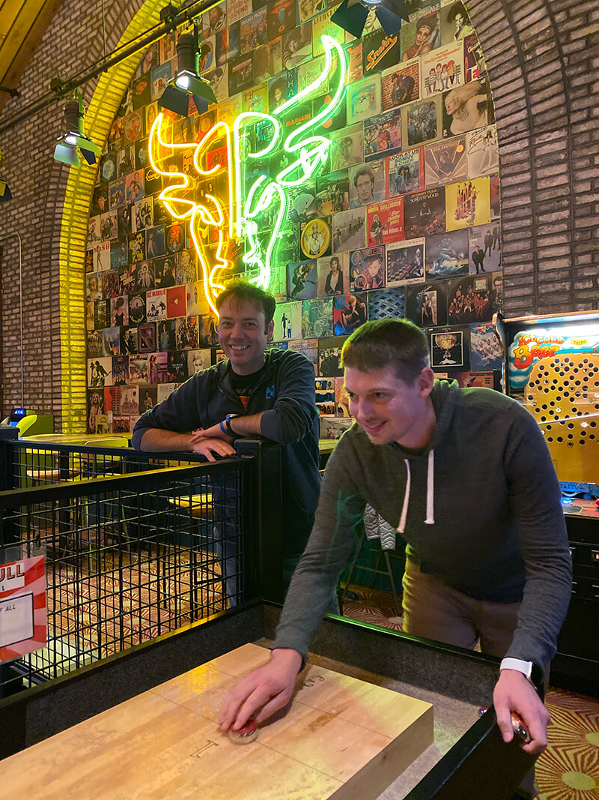
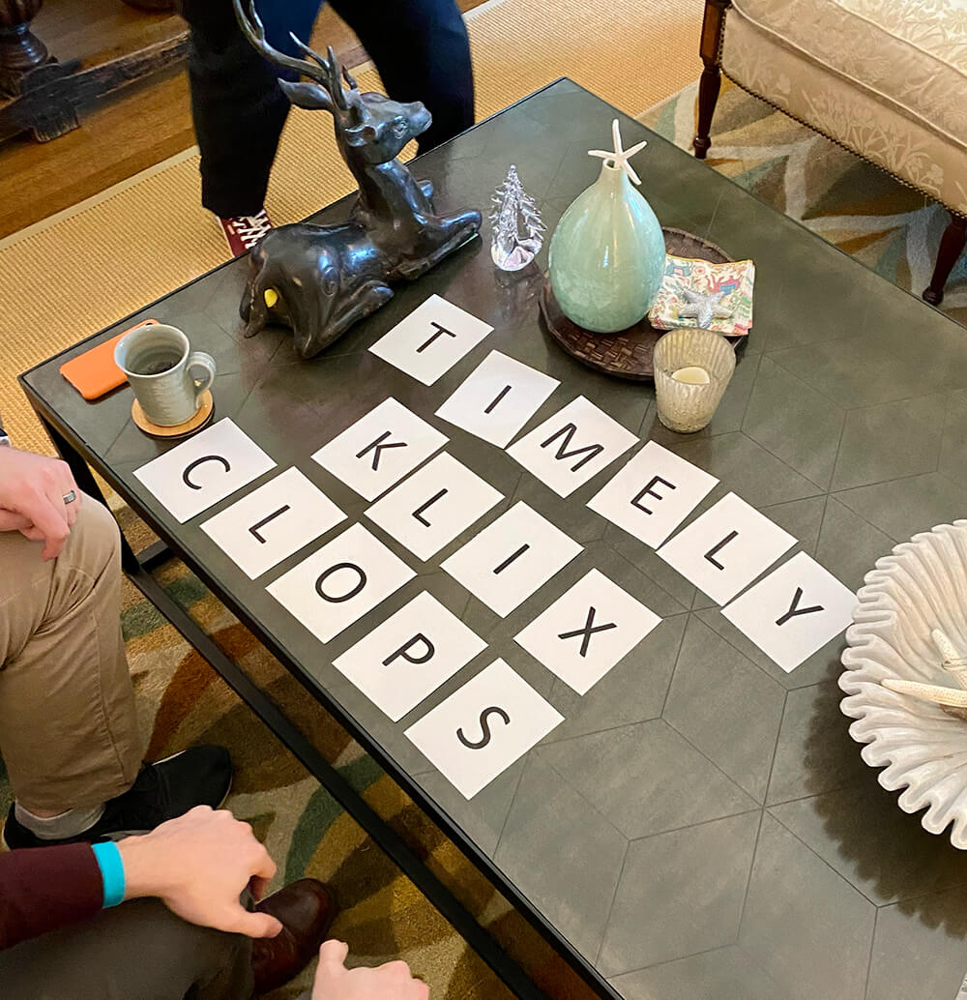
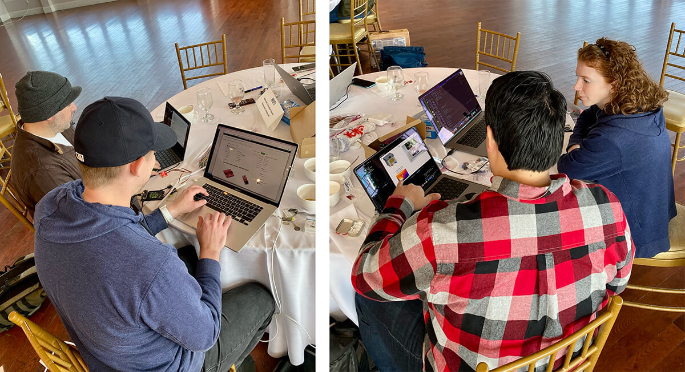

# Hack-o-ween with Blues

When you work within a distributed team, like the ones we have here at Blues Wireless, it's important to get together in-person every once in a while (primarily to continue some heated shuffleboard rivalries!).

But also to fail miserably at word-find team-building activities:

Recently the Developer Experience and Cloud Services teams of Blues Wireless met up in Boston to recap, review, and set the stage for 2023. We also hosted a one-day internal hackathon to see what sorts of connected projects we could build in a relatively short amount of time.

While it's one thing to hear the pain points that customers tell us about, it's another thing to *experience* those pain points yourself - especially in a time-constrained hackathon setting!

## The Hackathon Projects

Teams of 2-4 built nine amazing projects, all using the Swan MCU, Notecard, and Notecarrier in creative ways (with a surprising number using [Edge Impulse](https://edgeimpulse.com/) to build TinyML models!).

1) 🫣 A Machine Learning-based fall detection and alerting system (inspired by [this Hackster project](https://www.hackster.io/naveenbskumar/fall-detection-system-with-edge-impulse-and-blues-wireless-a4dbba)).

2) 🐝 A bee hive temperature and humidity monitoring/reporting system.

3) 🕷 A "jump-scare" spider, using a gesture recognition ML model to trigger the spider.

VIDEO

4) 🪞 "Portals" that send low-res images to each other over cellular (alas without [GLaDOS](https://en.wikipedia.org/wiki/Portal_(video_game))).

5) 🚶‍♀️ A Machine Learning-based person counter for walkways and trails.

6) 🔪 The world's slowest guillotine (_also_ using a gesture recognition ML model).

VIDEO

7) 🏥 A system to track patients who may walk off unbeknownst to their care providers.

8) 🐦 A project that can detect woodpeckers *before* they start damaging your house.

9) 😁 A high-powered ML-based face detection system powered by the Jetson Nano.

These projects also inspired another ["jump-scare" skeleton tutorial on Hackster](TODO). Just in time to scare your neighborhood kids on Halloween! 👻

> **Look like fun?** Blues Wireless is growing [and hiring](https://jobs.lever.co/BluesInc)!

Happy Hack-o-ween! 🎃

