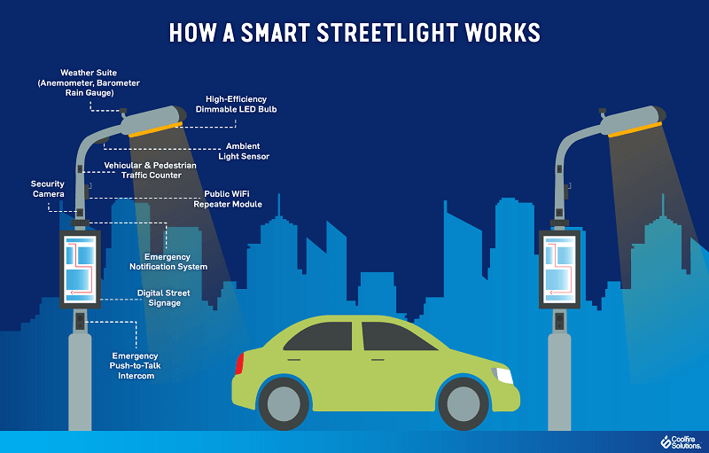
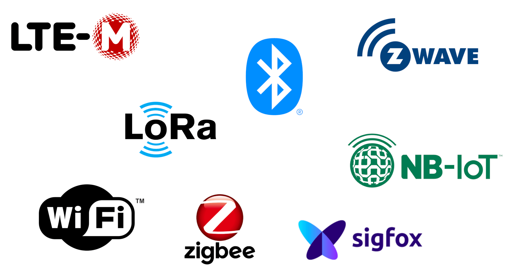
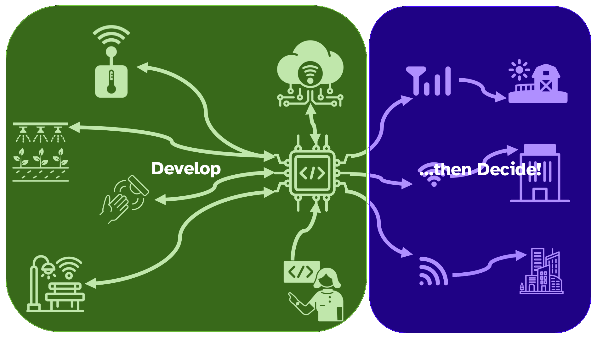
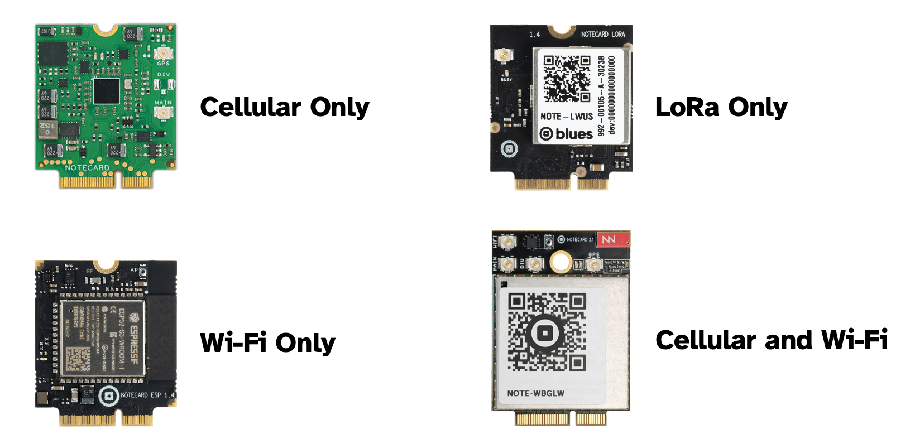
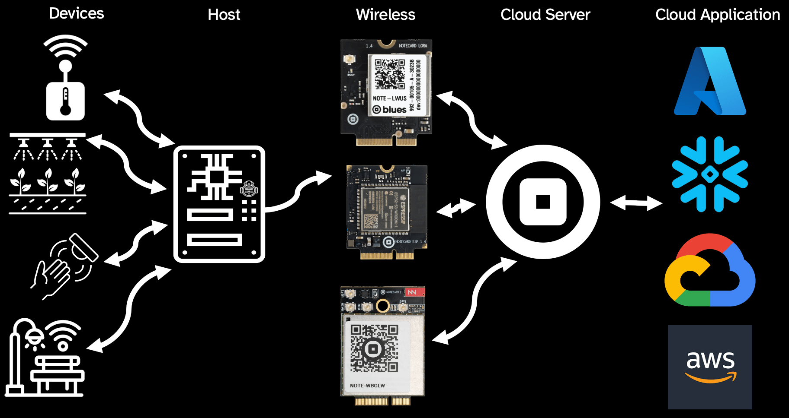

# Building a Sustainable City Requires Wireless Harmonization

Cities, industries, offices, and homes - they are all getting smarter on the daily. We are bringing new devices online, retrofitting existing devices to gather new intelligence, and enabling two-way communication with devices previously considered "dumb".

And who would've thought making a cloud-connected streetlight would be a thing?

*Image credit Lincoln Institute of Land Policy.*

The problem we encounter across every industry is **one size never fits all**. Especially in connected city applications, every physical location, every geographical region, every building has differing needs. When adding wireless connectivity, **we end up having to consider physical deployment before anything else**. This means:

1. Designing the physical product around a form factor required for a specific RAT (Radio Access Technology).
2. Choosing the right battery technology to optimize performance with that RAT.
3. Programming firmware that targets a specific RAT.

Seeing a trend here? Most wireless "smart city" applications require an up-front choice between Cellular, Wi-Fi, and LoRa whether it's because of incompatibilities between radios, provisioning, and deployment models - or if it's dealing with government projects that are cost-sensitive, requiring a crystal ball to pick the "correct" RAT on day one.

At the end of the day, do we really care THAT much about LoRaWAN vs. Cellular vs. Wi-Fi vs. Satellite or do we just want to get this thing connected!?

## Wireless Harmonization

This is why the concept of "wireless harmonization" is critical for building sustainable cities. This is the idea of product designers being able to choose the right RAT to build wirelessly-connected solutions without making up-front commitments and without painting themselves (or their development teams) into virtual corners.

In a harmonized world, **choosing a RAT can be deployment-time decision**, instead of a development one. So you can develop a given solution and then when it comes time to deploy, make the choice of **Cellular, Wi-Fi or LoRa** based on the specific needs of the actual deployment destination.

## Building a Sustainable City with Blues

How does [Blues](https://blues.com/) approach this concept of wireless harmonization? Blues is a wireless connectivity company that allows you to write code once, and deploy across Prepaid Cellular, Wi-Fi, and LoRa/LoRaWAN. This starts with the [Blues Notecard](https://blues.com/products/notecard/).

When you choose or change a wireless technology, you should have confidence that they are fully swappable (whether that means the physical footprint or the APIs themselves). Likewise, you want to future-proof your deployments. When 4G sunsets, you want to bank on a company that has a replaceable module in the **same footprint and API as what you've already deployed**.

When you choose Blues, you’re not just choosing the Notecard. With Blues your single solution with its multiple disparate deployments still has the benefit of communicating with a [single harmonized cloud service](https://blues.com/products/notehub/), and a single pipeline to your ultimate cloud application (whether that's AWS, Azure, Snowflake, Datacake, and so on).

Learn more about how Blues is making wireless harmonization a reality at [blues.com](https://blues.com/). Developers should check out our comprehensive technical resources at [blues.dev](https://blues.dev/).
