# Next-Level ML & IoT Workshop with Hammer of Blues (Wireless)

With in-person developer events back in style (I didn't just jinx it did I? 😬), it's time to release two years of our pent-up creative energy! I'd like to introduce you to the Hammer of Blues, likely (in my opinion) the greatest piece of workshop hardware ever created:

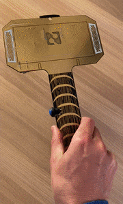

Available exclusively to attendees of upcoming in-person workshops run by [Blues Wireless](https://blues.io/?utm_source=hackster&utm_medium=web&utm_campaign=featured-project&utm_content=hammer), the Hammer of Blues showcases a variety of sensors and capabilities tied together with the [Feather-compatible Swan microcontroller](https://blues.io/products/swan/?utm_source=hackster&utm_medium=web&utm_campaign=featured-project&utm_content=hammer), all laid out on an amazing Thor hammer-inspired PCB.


_Thor Ragnarok_

The beauty of this board is not just the variety of sensors provided (or the form factor 🔨), but the fact that you can build practical projects that tap into a variety of high-value IoT use cases. In our workshops, we walk folks through building machine learning models with [Edge Impulse](https://edgeimpulse.com/) and how to use the [Cellular Notecard](https://blues.io/products/notecard/?utm_source=hackster&utm_medium=web&utm_campaign=featured-project&utm_content=hammer) to send generated inferences (the output of ML models) and sensor data to the cloud.

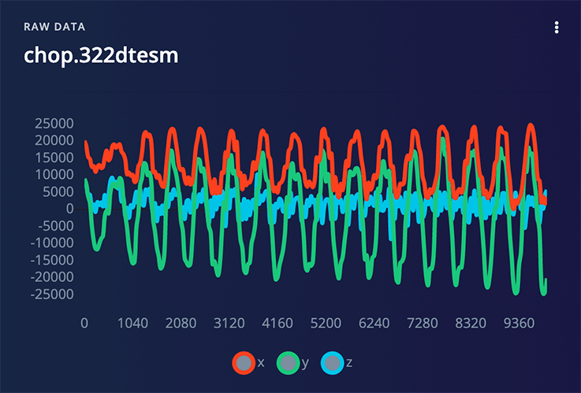

While we look forward to seeing many of you at an upcoming event like [NDC Copenhagen](https://ndccopenhagen.com/) (May 2022), [That Conference Wisconsin](https://that.us/events/wi/2022/) (July 2022), or [NDC Oslo](https://ndcoslo.com/) (Sept 2022), we fully realize many of you won't be able to make it. So we can help you piece together your own!

## What's in the Box?

Let's start with a list of sensors and components involved with the creation of the Hammer of Blues:

What's a genuine piece of workshop hardware without an [OLED display](https://smile.amazon.com/gp/product/B08L7QW7SR/ref=ppx_yo_dt_b_asin_title_o00_s01?ie=UTF8&th=1)? Adding interactive behavior requires some kind of on-device feedback, so we've included a small display...

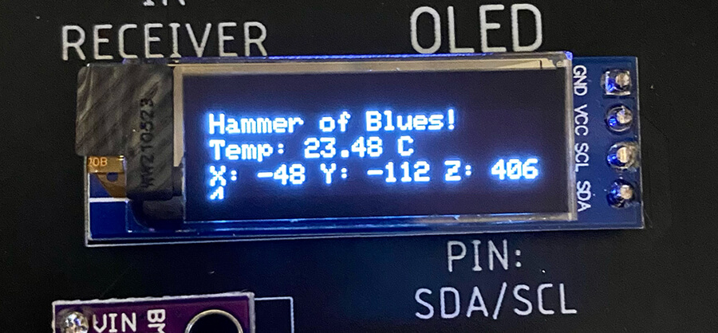

...and NeoPixels on the back for some extra visual feedback (and pizazz 🎉):

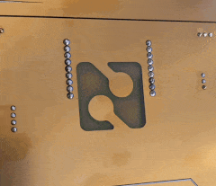

What's the first thing you want to do with a hammer? Well, you probably want to swing it, so we've included an [Adafruit LIS3DH accelerometer](https://www.adafruit.com/product/2809) for tracking movement. The LIS3DH also includes two Qwiic ports for adding even more peripherals:

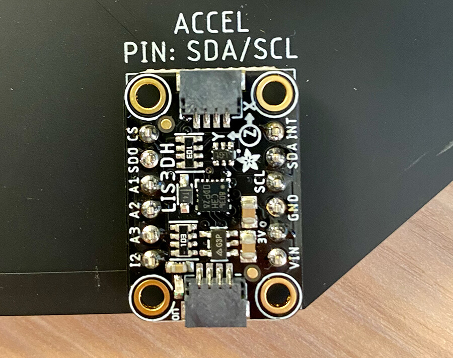

Also included is a [BME280](https://smile.amazon.com/gp/product/B07V5CL3L8/ref=ppx_yo_dt_b_asin_title_o00_s01?ie=UTF8&psc=1) for measuring temperature, humidity, and pressure. Two different push buttons are available as well ([one a "toggle" switch](https://smile.amazon.com/gp/product/B01E38OS7K/ref=ppx_yo_dt_b_asin_title_o00_s00?ie=UTF8&psc=1) and the other [a momentary button switch](https://smile.amazon.com/gp/product/B07F8GBWGG/ref=ppx_yo_dt_b_asin_title_o00_s01?ie=UTF8&psc=1)).

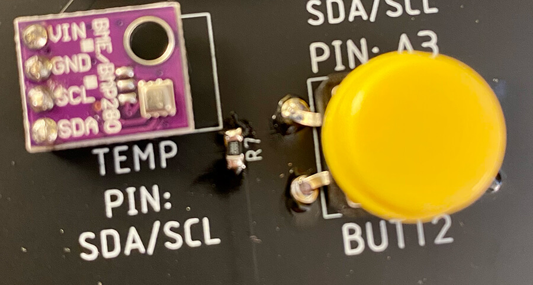

To annoy your pets, partner, and/or kids we've also included a [buzzer](https://smile.amazon.com/gp/product/B07MPYWVGD/ref=ppx_yo_dt_b_asin_title_o00_s01?ie=UTF8&psc=1). To add additional interactivity options there is an [IR transmitter and receiver](https://smile.amazon.com/gp/product/B0816P2545/ref=ppx_yo_dt_b_asin_title_o00_s00?ie=UTF8&psc=1) at the top.

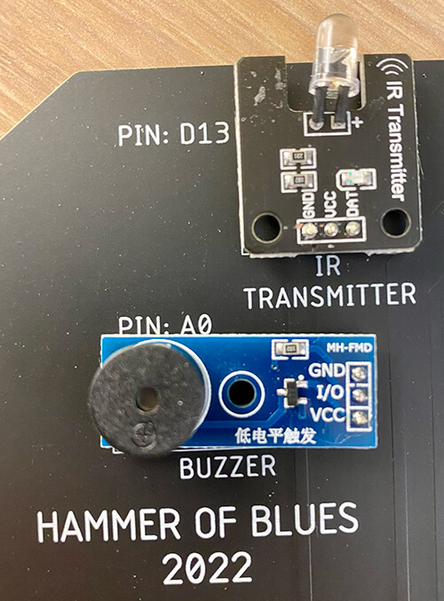

What's the IoT without the "I"? The Hammer of Blues is nothing without the [Blues Wireless Notecard](https://blues.io/products/notecard/?utm_source=hackster&utm_medium=web&utm_campaign=featured-project&utm_content=hammer) and its host carrier board, the [Notecarrier-B](https://blues.io/products/notecarrier/notecarrier-b/?utm_source=hackster&utm_medium=web&utm_campaign=featured-project&utm_content=hammer).

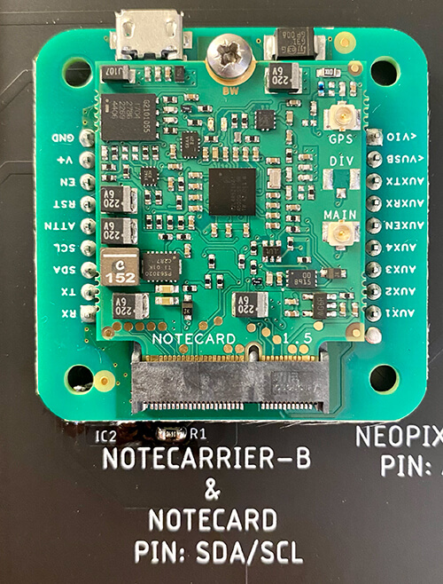

The Notecard provides **prepaid global cellular connectivity** including 500MB of data and 10 years of service across 130+ countries. The Notecarrier-B allows you to easily utilize the M.2 edge connector on the Notecard and access all the pins on the Notecard.

Finally, tying it all together is the most extensible Feather-compatible MCU on the market, the [Feather-compatible Swan](https://blues.io/products/swan/?utm_source=hackster&utm_medium=web&utm_campaign=featured-project&utm_content=hammer), at the base of the handle:

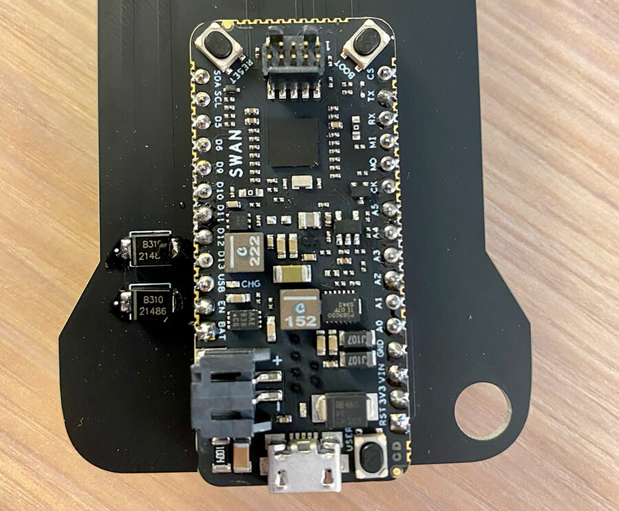

## Assembling Your Own Hammer

Like every prototype I've ever put together, building a Hammer of Blues prototype is going to get a little messy. Yes, it may resemble a bowl of spaghetti:

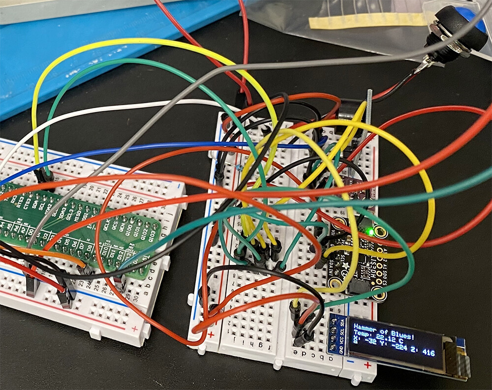

However, the [Hammer of Blues repository on GitHub](https://github.com/blues/hammer-of-blues) should give you all you need to wire up your own Hammer of Blues the way we intended.

- The Notecard and Notecarrier are wired up to the I2C bus (SDA/SCL).
- The BME280, LIS3DH accelerometer, and OLED display are also on the I2C bus.
- The IR transmitter is on `digital pin 13` and the receiver is on `digital pin 9`.
- The buzzer is on `analog pin 0`, NeoPixels on `analog pin 1`, the momentary push button on `analog pin 2`, and the remaining button on `analog pin 3`.

To *really* finish off the Hammer of Blues, you'll want the gorgeous custom PCB! We provide [all of the schematics on GitHub](https://github.com/blues/hammer-of-blues/tree/main/hardware).

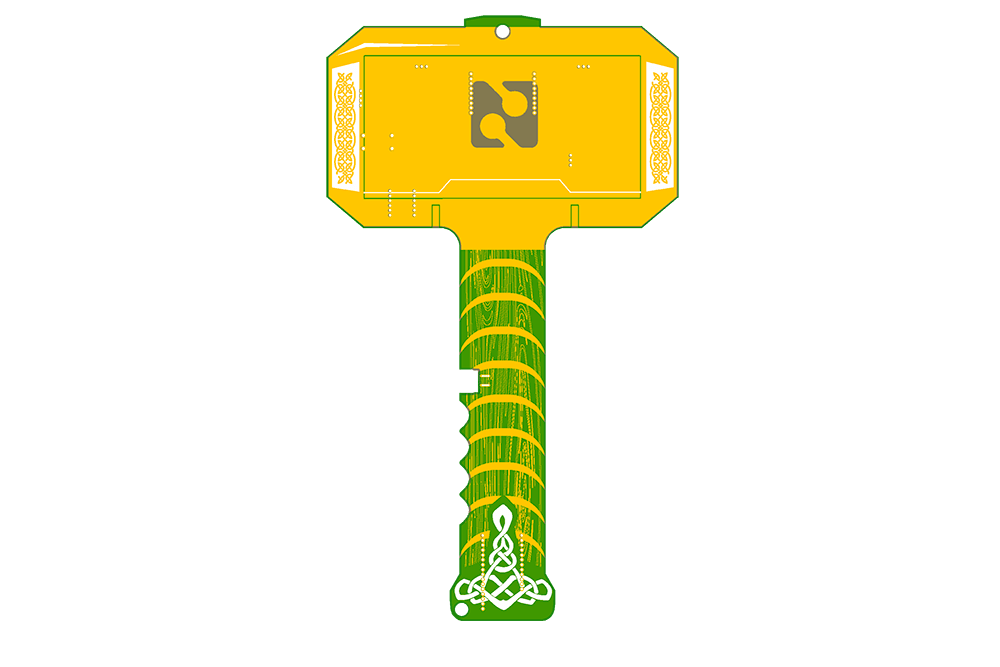

## Running the Hammer

In order to verify the functionality of the Hammer, we provide a [complete bring-up sketch on GitHub](https://github.com/blues/hammer-of-blues/blob/main/firmware/hammer-bringup/src/main.cpp). This will help to validate that every component is wired correctly and functional.

```
#include <ButtonDebounce.h>
#include <Wire.h>
#include <Adafruit_GFX.h>
#include <Adafruit_SSD1306.h>
#include <Adafruit_Sensor.h>
#include <Adafruit_BME280.h>
#include <Adafruit_LIS3DH.h>
#include <IRremote.hpp>
#include <Adafruit_NeoPixel.h>
#include "pitches.h"

#define SIDE_BUTTON_PIN A2
#define BACK_BUTTON_PIN A3
#define BUZZER_PIN      A0
#define IR_SEND_PIN     D13
#define IR_RECEIVE_PIN  D9
#define NEOPIXEL_PIN    A1

#define NUM_PIXELS 2

#define SCREEN_ADDRESS 0x3C
#define BME280_ADDRESS 0x76
#define LIS3DH_ADDRESS 0x18

// Buzzer implementation note
// notes in the melody:
int melody[] = {
  NOTE_C4, NOTE_C5, NOTE_C6, NOTE_C7, NOTE_C8, NOTE_C7, NOTE_C6, NOTE_C5, NOTE_C4
};

ButtonDebounce sideButton(SIDE_BUTTON_PIN, 200);
ButtonDebounce backButton(BACK_BUTTON_PIN, 200);

#define SCREEN_WIDTH 128 // OLED display width, in pixels
#define SCREEN_HEIGHT 32 // OLED display height, in pixels

Adafruit_SSD1306 display(SCREEN_WIDTH, SCREEN_HEIGHT, &Wire, -1);
Adafruit_BME280 bmeSensor;
Adafruit_LIS3DH lisSensor = Adafruit_LIS3DH();
Adafruit_NeoPixel pixels(NUM_PIXELS, NEOPIXEL_PIN, NEO_GRB + NEO_KHZ800);

void sideButtonChanged(const int state) {
  if (state == 1) {
    Serial.println("Button Verified: " + String(state));
    digitalWrite(LED_BUILTIN, HIGH);
  } else {
    digitalWrite(LED_BUILTIN, LOW);
  }
}

void backButtonChanged(const int state) {
  if (state == 0) {
    Serial.println("Button Verified: " + String(state));
    digitalWrite(LED_BUILTIN, HIGH);
  } else {
    digitalWrite(LED_BUILTIN, LOW);
  }
}

void theaterChase(uint32_t color, int wait) {
  for(int a=0; a<10; a++) {  // Repeat 10 times...
    for(int b=0; b<3; b++) { //  'b' counts from 0 to 2...
      pixels.clear();         //   Set all pixels in RAM to 0 (off)
      // 'c' counts up from 'b' to end of strip in steps of 3...
      for(int c=b; c<pixels.numPixels(); c += 3) {
        pixels.setPixelColor(c, color); // Set pixel 'c' to value 'color'
      }
      pixels.show(); // Update strip with new contents
      delay(wait);  // Pause for a moment
    }
  }
}

void setup() {
  Serial.begin(115200);
  delay(2500);
  Serial.println("Hammer of Blues Verification");
  Serial.println("============================");

  pinMode(LED_BUILTIN, OUTPUT);
  digitalWrite(LED_BUILTIN, HIGH);

  if(!display.begin(SSD1306_SWITCHCAPVCC, SCREEN_ADDRESS)) {
    Serial.println(F("SSD1306 allocation failed"));
    for(;;); // Don't proceed, loop forever
  }
  Serial.println("Screen Connected");

  display.setRotation(2);
  display.clearDisplay();

  noTone(BUZZER_PIN);
  tone(BUZZER_PIN, 0, 500);
  delay(250);

  noTone(BUZZER_PIN);

  for (int thisNote = 0; thisNote < 9; thisNote++) {
    tone(BUZZER_PIN, melody[thisNote], 500);

    delay(250);
    noTone(BUZZER_PIN);
  }
  delay(250);

  noTone(BUZZER_PIN);

  IrSender.begin(IR_SEND_PIN);
  IrReceiver.begin(IR_RECEIVE_PIN);

  pixels.begin();
  pixels.show();

  display.setTextSize(1);
  display.setTextColor(SSD1306_WHITE);
  display.setCursor(0,0);
  display.println(F("Hammer of Blues!"));
  display.display();

  unsigned bmeStatus = bmeSensor.begin(BME280_ADDRESS, &Wire);
  if (!bmeStatus) {
    Serial.println("Could not find a valid BME280 sensor, check wiring, I2C address");
  } else {
    Serial.println("BME280 Connected");
  }

  display.setCursor(0,10);
  display.print("Temp: ");
  display.print(bmeSensor.readTemperature());
  display.println(" C");
  display.display();

  if (!lisSensor.begin(LIS3DH_ADDRESS)) {
    Serial.println("Could not find a valid LIS3DH Sensor, check wiring, I2C address");
  }
  Serial.println("LIS3DH Connected");

  lisSensor.setRange(LIS3DH_RANGE_8_G);
  lisSensor.read();
  display.setCursor(0,20);
  display.print("X: ");
  display.print(lisSensor.x);
  display.print(" Y: ");
  display.print(lisSensor.y);
  display.print(" Z: ");
  display.println(lisSensor.z);
  display.display();

  sideButton.setCallback(sideButtonChanged);
  backButton.setCallback(backButtonChanged);

  theaterChase(pixels.Color(  0,   0, 127), 50); // Blue

  digitalWrite(LED_BUILTIN, LOW);
}

uint16_t sAddress = 0x0102;
uint8_t sCommand = 0x34;
uint8_t sRepeats = 0;

void loop() {
  sideButton.update();
  backButton.update();
}
```

In [the full Hammer of Blues repository](https://github.com/blues/hammer-of-blues), you'll see a sneak peek of some of the other projects we walk folks through during the workshop, including the Edge Impulse gesture recognition ML solution that tracks "chops", "waves", and "idle" motions.

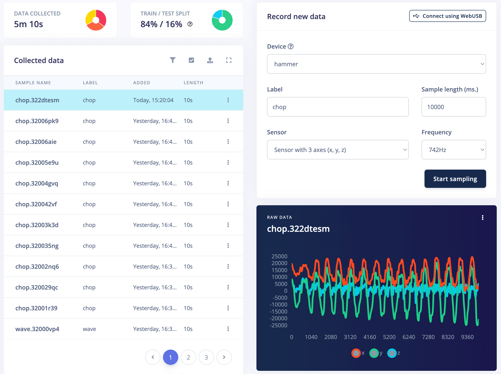
 
## Get a Hammer the Easy Way
 
Not interested in building your own Hammer of Blues? Join the Blues Wireless team at an upcoming workshop where we dive into the intersection of Machine Learning and the Cloud at:

- [NDC Copenhagen](https://ndccopenhagen.com/)
- [That Conference Wisconsin](https://that.us/events/wi/2022/)
- [NDC Oslo](https://ndcoslo.com/)
- ...and more in the future!

Happy Hacking (and Hammering!) 🔨 