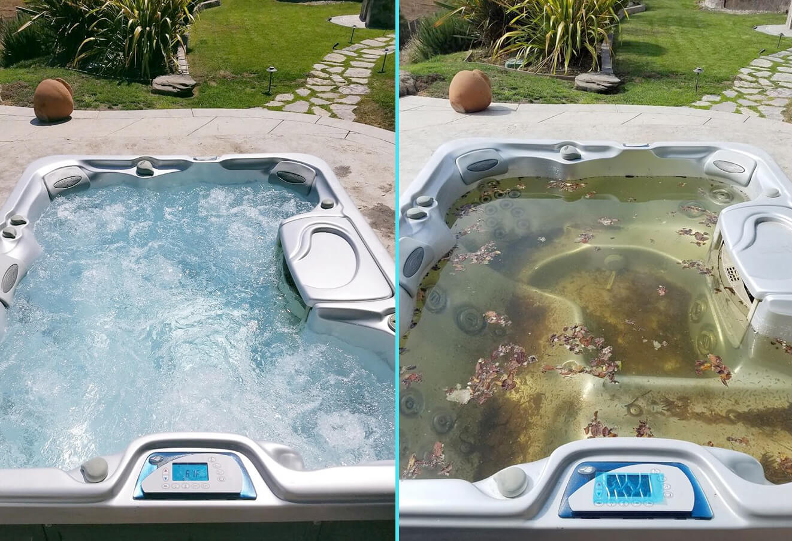
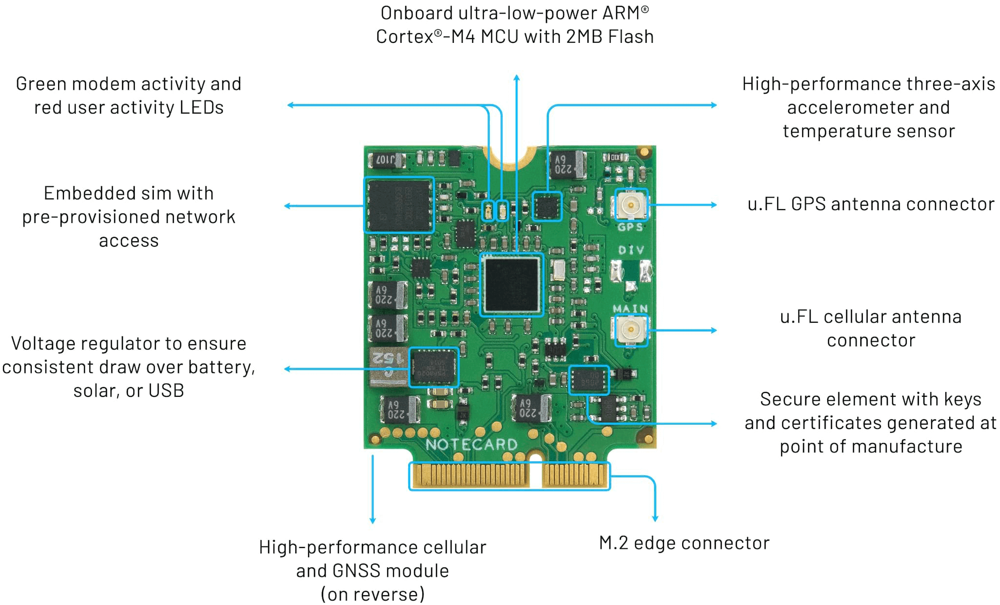

# Debugging a Hot Tub Time (Series) Machine

I don't mean to sound like a prude or anything, but when a neighbor invites me over for a hot tub party, I'm gonna hope the hot tub itself looks a little more like the one on the left, than the one on the right:



You might not know it, but even a clean-looking hot tub or pool can still harbor nasty bacteria. I should know! I had a serious case of "man flu" last year brought on by what I still claim to be [Pontiac Fever](https://www.health.state.mn.us/diseases/legionellosis/pontiac.html) (a flu-like disease caused by exposure to Legionella bacteria, fun!).

So how can we make hot tubs and pools around the world safer, and frankly, more fun? Let's walk through how I built an IoT project with:

- A variety of **water quality sensors**;
- A cool **new microcontroller**;
- A **cellular** device-to-cloud data pump;
- A **cloud-based dashboard** populated by time series data;
- PLUS an **SMS notification** system for chlorine emergencies!

*Interested in a preview of this project? Want to see me half naked in a hot tub!? Check out the project trailer on YouTube:*

VIDEO

Big thanks is due to [DFRobot](https://www.dfrobot.com/?tracking=60f51c53af980) for supplying much of the sensor hardware needed for this project! In fact, I recommend checking out all of their [water quality sensors](https://www.dfrobot.com/blog-1138.html?tracking=60f51c53af980).

## The Dirty Hot Tub

Let me introduce you to my neighbor's hot tub. Sure, it looks clean and tidy, but what you don't know is there are small children who frequent this hot tub on the regular. You've heard the warning phrase "code brown" right? (Hint: 💩). Let's just say it's my opinion that this hot tub is in dire need of active water quality monitoring.


## The Goal

While I hope by now my goal with this project is clear, let me shout it loud for those in the back: As an owner (or even user) of a hot tub, **it's a pain to keep your water clean**. You have to maintain the proper chlorine and pH levels by regularly sampling the water, running tests, waiting for the results, adding chlorine, sampling again, and repeating until your levels stabilize appropriately.

This is a process that is dying for automation using off-the-shelf hardware and water quality sensors. The beauty of the IoT too, is that we can take a semi-traditional sensor project and build it out into a robust cloud-based dashboard with proactive SMS text messages for alerting.


## The Hardware Puzzle Pieces

While it's always intimidating to start a new IoT project from scratch, I generally like to do some research into the individual hardware "puzzle pieces" and see how they physically fit together as my step 1A.

### Water Quality Sensors

At first, the only thing I knew I wanted to measure was "water quality". Well, since there isn't a single "water quality" sensor out there, I had to do a little research to identify *what* precisely I should be monitoring.

And the answer?

- **pH:** Maintaining a pH level between 7.2 and 7.8 is ideal for a hot tub, making sure the water doesn't get too basic or too acidic.
- **ORP (Oxygen Reduction Potential):** This measures the ability of the water to break down organic material that you don't want in the water.
- **TDS (Total Dissolved Solids):** Do I need to describe what a "solid" might be in a hot tub or pool? Basically this provides a measure of the amount of, um, "organic solids" present.

And since I knew that I would be charting this data over time, I thought it would be ideal to map this sensor data against both the water temperature and the ambient air temperature.

The above data was all gathered using the following sensors from DFRobot:

- [Analog pH Sensor](https://www.dfrobot.com/product-2069.html?tracking=60f51c53af980)
- [Analog TDS Sensor](https://www.dfrobot.com/product-1662.html?tracking=60f51c53af980)
- [Analog ORP Sensor](https://www.dfrobot.com/product-1071.html?tracking=60f51c53af980)
- [Digital Waterproof DS18B20 Sensor](https://www.dfrobot.com/product-1354.html?tracking=60f51c53af980) 

### The Right Microcontroller

While almost any MCU will do for a project like this, I went with the [Swan from Blues Wireless](https://blues.io/products/swan/?utm_source=hackster&utm_medium=web&utm_campaign=featured-project&utm_content=hottub). Why Swan?

- It's the most extensible Feather-compatible MCU on the market.
- It uses a fast, yet low-power microprocessor from STM (the STM32L4+ to be exact).
- It [supports Arduino and CircuitPython](https://dev.blues.io/start/swan/swan-quickstart/?utm_source=hackster&utm_medium=web&utm_campaign=featured-project&utm_content=hottub), making it usable for most IoT builders.


### Cellular Data Pump

Since this would be an outdoor deployment and well outside the range of the home's Wi-Fi, I felt the best choice was to go with a low-power cellular device-to-cloud data pump: the [Blues Wireless Notecard](https://blues.io/products/notecard/?utm_source=hackster&utm_medium=web&utm_campaign=featured-project&utm_content=hottub).



The Notecard (and its companion [Notecarriers](https://blues.io/products/notecarrier/?utm_source=hackster&utm_medium=web&utm_campaign=featured-project&utm_content=hottub)) allow for fast prototyping of cellular IoT solutions with little risk (read that: global connectivity, no monthly fees, no connectivity charges). With 500MB of data and 10 years of service included, it's a great option for adding cellular to any IoT project.

As a developer, every interaction with the [Notecard's API](https://dev.blues.io/reference/notecard-api/introduction/?utm_source=hackster&utm_medium=web&utm_campaign=featured-project&utm_content=hottub) is based on JSON. For example, to send a packet of data over cellular, I would use the provided `note.add` API:

```
{
  "req": "note.add",
  "file": "sensors.qo",
  "body": {"temp": 72.22 },
  "sync": true
}
```

Since I had already chosen to use a Feather-compatible MCU, the logical choice to bridge the hardware between the Notecard and the Swan was the [Notecarrier-AF](https://blues.io/products/notecarrier/notecarrier-af/?utm_source=hackster&utm_medium=web&utm_campaign=featured-project&utm_content=hottub). This development board provides an M.2 slot for the Notecard and Feather-compatible pins for the Swan (and plenty of I/O to connect my sensors!).


While security wasn't the biggest concern for *this* project, it's reassuring that the Notecard is built to securely transfer data off of the public Internet (via private VPNs) to its [companion cloud service Notehub.io](https://blues.io/services/?utm_source=hackster&utm_medium=web&utm_campaign=featured-project&utm_content=hottub), and on to the endpoint of the cloud app I choose.

And that endpoint? I've been itching to try out [Losant](https://www.losant.com/) for some time now, so this was the perfect opportunity.


### Time Series Dashboard

A "time series" dashboard is just a fancy way of saying that we want to build a set of charts that represent snapshots of data taken over a given time period. They allow us to quickly identify trends in data over time, and even drill into specific time periods if needed.


Losant provides a low-code approach for ingesting data from IoT devices. What sets it apart from its competition is its usage of a Node-RED-like UI for constructing low-code workflows.


*More on Losant a bit later!*

### The Hardware Prototype

With my puzzle pieces of hardware in-hand, I started off with the appropriate spaghetti mess of wires and sensors on my desk:


But after *a little* tidying up (still far from my best work!), I put together an ok-looking solution almost ready to hit the tub:


Oh, but I probably need to write some code first 🤦‍♂️.

## The Code

Time to build some firmware! Luckily for me, DFRobot and Blues Wireless both provide a lot of [quality API docs and code samples](https://dev.blues.io/reference/notecard-api/introduction/?utm_source=hackster&utm_medium=web&utm_campaign=featured-project&utm_content=hottub) for use with each piece of hardware. Copy-and-paste firmware development FTW.

> **NOTE:** I'm glossing over some details in the code samples below to keep this section more succinct. If you want to view the entire Arduino sketch, [check out this repository on GitHub](https://github.com/rdlauer/hot-tub-time-series-machine).

### Water Temperature

Using the aforementioned DS18S20 digital sensor, I was able to use the [OneWire library](https://www.arduino.cc/reference/en/libraries/onewire/) to interface with it and use a relatively simple function to retrieve the current water temp:

```
float getWaterTemp(){
  // returns the water temp from the DS18S20 sensor
  byte data[12];
  byte addr[8];

  ds.reset();
  ds.select(addr);
  ds.write(0x44,1); // start conversion, with parasite power on at the end

  byte present = ds.reset();
  ds.select(addr);
  ds.write(0xBE); // Read Scratchpad

  for (int i = 0; i < 9; i++) { // we need 9 bytes
    data[i] = ds.read();
  }

  ds.reset_search();

  byte MSB = data[1];
  byte LSB = data[0];

  float tempRead = ((MSB << 8) | LSB);
  float TemperatureSum = tempRead / 16;

  return TemperatureSum;
}
```

### Ambient Air Temperature

Gathering the air temperature was a surprisingly easy task! The Notecard includes an onboard temperature sensor, accessible via the `card.temp` Notecard API. This was nice to use, as I didn't have to wire up yet another external sensor for this project.

Since the way to interface with the Notecard is all JSON, I wrote a simple function that uses the `card.temp` API:

```
float getAmbientTemp(){
  // returns the ambient temp as measured by the temp sensor on the notecard
  float temp = 0;
  J *rsp = notecard.requestAndResponse(notecard.newRequest("card.temp"));
  if (rsp != NULL) {
      temp = JGetNumber(rsp, "value");
      notecard.deleteResponse(rsp);
  }
  return temp;
}
```

### pH, TDS, and ORP Values

The rest of the water quality sensors are the really important ones. Since these are all analog sensors, it is critically important to make sure they are consistently powered, share a common ground, and all have [analog signal isolators](https://www.dfrobot.com/product-1621.html?tracking=60f51c53af980) to ensure reliable operation and avoid any electrical interference between the sensors themselves.

Now the best way to sample all of these readings is not to take a single reading and call it good, but rather to take numerous readings over a short period of time and average them (i.e. you want to remove any outliers that may be related to stray voltage or some other unexplained reason). 

So each of the measures below queries the sensor once every 100ms, forty (40) times in a row, and returns the mean as the result.

Below is a simplified version of the deployed code:

```
  // get 40 samples of each measurement, separated by 100ms
  for (int i = 0; i < sampleLength; i++) {

    // gather ORP sensor data
    orpArray[orpArrayIndex++]=analogRead(orpPin);
    
    if (orpArrayIndex==sampleLength) {
      orpValue=((30*(double)VOLTAGE*1000)-(75*averageArray(orpArray, sampleLength)*VOLTAGE*1000/1024))/75-OFFSET;
      orpArrayIndex=0;
    }

    // gather TDS sensor data

    gravityTds.setTemperature(waterTemp);
    gravityTds.update();

    tdsArray[tdsArrayIndex++]=gravityTds.getTdsValue();
    
    if (tdsArrayIndex==sampleLength) {
      tdsValue=averageArray(tdsArray, sampleLength);
      tdsArrayIndex=0;
    }

    // gather ph sensor data

    phVoltage = analogRead(PH_PIN)/1024.0*5000;
    phArray[phArrayIndex++]=ph.readPH(phVoltage,waterTemp);
    
    if (phArrayIndex==sampleLength) {
      phValue=averageArray(phArray, sampleLength);
      phArrayIndex=0;
    }

    delay(100);
  }
```

Again, if you want to see the completed Arduino sketch, [check out this GitHub repository](https://github.com/rdlauer/hot-tub-time-series-machine).

## The Cloud

So what do we do with the data _after_ we've made our readings? This is where the cellular capabilities of the Notecard and the Losant workflow/dashboard application come into play!

### Cellular Connectivity

Whoa whoa whoa, let's take a step back here. If we want to deliver some data over cellular, surely we have to initialize our cellular modem with some assembly-looking AT commands, right?

```
ATDTnWn
ATDTWn@
ATDTn!n
AT&G0
```

Wrong!

IMO a primary advantage of the Blues Wireless Notecard is its JSON-based API. For example, the `hub.set` API request is what associates the Notecard with the Blues Wireless cloud service Notehub.io (which lets us route our data to Losant, and is covered in the next section).

You can also specify cellular connection frequency parameters and dictate how often you sync data based on voltage levels to save on battery life (e.g. you may want to sync data less frequently as your voltage decreases).

```
{
  "req": "hub.set",
  "product": "[your notehub product uid]",
  "mode": "periodic",
  "voutbound": "usb:30;high:60;normal:90;low:120;dead:0"
}
```

Since my firmware will be accumulating small sets of sensor data, I want to deliver this timestamped data to my cloud. Using Notecard terminology, a packet of sensor data like this is a [note](https://dev.blues.io/reference/glossary/?utm_source=hackster&utm_medium=web&utm_campaign=featured-project&utm_content=hottub#note). And again, recall it's all JSON-based, so an example set of sensor data I may be sending to Losant via Notehub.io will look like this:

```
{
    "ambient_temp": 22,
    "orp_value": 36.2356,
    "ph_value": 7,
    "tds_value": 494.158,
    "voltage": 3.76305,
    "water_temp": 39.5
}
```

How do I actually send that data though? It's super simple.

1. I use the `note.add` [Notecard API](https://dev.blues.io/reference/notecard-api/note-requests/?utm_source=hackster&utm_medium=web&utm_campaign=featured-project&utm_content=hottub#note-add).
2. I add this data to a [notefile](https://dev.blues.io/reference/glossary/?utm_source=hackster&utm_medium=web&utm_campaign=featured-project&utm_content=hottub#notefile) called "hottub.qo".
3. I append some sensor data parameters to the `body` of the request.
4. I send the request!

*The aforementioned steps, in code:*

```
  J *req = notecard.newRequest("note.add");
  if (req != NULL) {
      JAddStringToObject(req, "file", "hottub.qo");
      J *body = JCreateObject();
      if (body != NULL) {
          JAddNumberToObject(body, "ambient_temp", ambientTemp);
          JAddNumberToObject(body, "water_temp", waterTemp);
          JAddNumberToObject(body, "orp_value", orpValue);
          JAddNumberToObject(body, "tds_value", tdsValue);
          JAddNumberToObject(body, "ph_value", phValue);
          JAddNumberToObject(body, "voltage", voltage);
          JAddItemToObject(req, "body", body);
      }
      notecard.sendRequest(req);
  }
```

That's it! When the Notecard next syncs with Notehub.io over cellular, the data will appear like so:


But Notehub.io isn't where I want the data to live, **I want the data in MY cloud app**.

### Routing Data

Before we start routing data from Notecard ➡️ Notehub.io ➡️ Losant, we should take a moment to visualize this entire process in action:


Notehub.io acts as a thin layer between the Notecard and your cloud app of choice. Why does there need to be a layer at all? Valid question! Notehub.io allows you to:

1. **Securely route** (and optionally transform) data to any cloud endpoint without touching code.
2. **Manage fleets** of Notecard devices.
3. Perform **cloud-based DFU** of Notecards and certain microcontrollers.
4. Create and manage [environment variables](https://dev.blues.io/notecard/notecard-guides/understanding-environment-variables/?utm_source=hackster&utm_medium=web&utm_campaign=featured-project&utm_content=hottub) which allow for **remote configuration** of Notecards.

Using Notehub.io I quickly set up a [route](https://dev.blues.io/reference/glossary/?utm_source=hackster&utm_medium=web&utm_campaign=featured-project&utm_content=hottub#route) to relay data from my Notecard to Losant. While [Blues Wireless provides routing tutorials](https://dev.blues.io/start/tutorials/route-tutorial/?utm_source=hackster&utm_medium=web&utm_campaign=featured-project&utm_content=hottub) for popular providers like AWS, Azure, and Google Cloud, you can also route data to literally any RESTful endpoint.

Within Notehub.io, I created two routes for my data. One that takes in accumulated sensor data, optimizes and transforms the data, and then delivers this small packet to Losant.

This optional, but very powerful, feature is this ability to use [JSONata](https://jsonata.org/) to transform JSON objects *before* they get sent to your cloud application. You can use JSONata to execute JavaScript functions to perform calculations, optimize payload size, and to better outline *exactly* what the JSON payload will be when it hits your cloud.

In my Losant route, I used the following JSONata expression to specify what I wanted to send:

```
{
    "ambient_temp": body.ambient_temp,
    "water_temp": body.water_temp,
    "orp_value": body.orp_value,
    "tds_value": body.tds_value,
    "ph_value": body.ph_value,
    "voltage": body.voltage,
    "time": when * 1000
}
```

> **NOTE:** Blues Wireless provides a [JSONata guide](https://dev.blues.io/notecard/notecard-guides/jsonata-1-2-3/?utm_source=hackster&utm_medium=web&utm_campaign=featured-project&utm_content=hottub) and it's worth reading up on all of the features available at [JSONata.org](https://jsonata.org/).

The other route sends a text message via Twilio to proactively notify me (or my neighbor) when any reading goes far outside of some bounds that I set:

- ORP < 650mv
- TDS > 1500ppm
- pH < 7 or pH > 8

> **NOTE:** I'm going to skip the full SMS setup here, as there is a full tutorial for [sending SMS text messages with Twilio](https://dev.blues.io/notehub/routing-guides/twilio-route/?utm_source=hackster&utm_medium=web&utm_campaign=featured-project&utm_content=hottub) on the Blues Wireless developer site.

### Cloud Dashboard Setup

The last big rock to handle was to set up a cloud-based dashboard. There are five distinct steps to tackle when building out a means of ingesting and reporting on data within Losant.

1. Set up an Application
2. Set up a Device
3. Create a Webhook
4. Create a Workflow
5. Create a Dashboard

Losant provides numerous application templates to bootstrap your development process. For this project, I just started with a "Blank Application".


The next step was to add a [device](https://docs.losant.com/devices/overview/). In Losant land, a device represents a "thing" in your application (in this case the "thing" is the Notecard). I chose to create a "Standalone" device.

Each device then has a series of [attributes](https://docs.losant.com/devices/attributes/), or data elements that it will be supplying to the workflow engine of Losant. I specified all of the data attributes that I knew would be coming from the Notecard (see the JSONata expression above).


Next up, I needed to create a [webhook](https://docs.losant.com/applications/webhooks/) in Losant that would trigger a workflow to process the incoming data. When the webhook is created, you are provided a "trigger URL" that serves as the base URL used in the Notehub.io route mentioned above, like so:

```
https://triggers.losant.com/webhooks/XDQL2H4oaEfd3SD...
```

Next, I needed a [workflow](https://docs.losant.com/workflows/overview/) to process the incoming data. My favorite part of Losant is their Node-RED inspired workflow engine. The workflow I created was fairly simple:


- The **Webhook** trigger is attached to the webhook I created in a previous step.
- The **Device: State** output lets me get the state of the device (i.e. read the attributes).
- The **Debug** output is useful for, you guessed it, viewing debugging output.

Last up was to create a dashboard! Each dashboard is comprised of one or more blocks. While every dashboard is unique, I chose to create blocks with thermometer gauges for showing the latest temperature, a battery for the latest voltage reading, and some dials for the TDS, ORP, an pH values.

All to create one FINE looking dashboard! 📊

*Here is an example dashboard from Losant to whet your appetite:*


## The Deployment

With the hardware pieced together and firmware written and deployed to the Swan, I was ready to deploy the sensors in the wilds. Or was I? 🤔

Before plopping sensors in some foreign body of water, they all needed to be calibrated. Otherwise the data returned may look valid, but it could be off in a way that makes you want to empty the hot tub and re-fill it with bleach.

Luckily the folks at DFRobot have made the calibration steps a snap for all of the analog sensors (the ORP, TDS, and pH sensors to be more specific).

To facilitate this process, I also purchased some calibration solutions from Atlas Scientific. These provide a guaranteed analysis of, for instance, pH level, that I could then use to properly calibrate the pH readings.


With calibration complete, we're ready for deployment:


With the Notecard configured with power-sipping settings, the device was set to capture and relay data every 30 minutes. Time to throw a hot tub party and watch the data roll in...

That is until I needed to do some "live debugging" of some loose connections!


## The Results

As with every IoT deployment, there is always a moment of panic when you wonder whether or not things are actually working as planned. But low-and-behold, we start seeing some data appear on the Losant dashboard:


While an SMS alert wasn't necessary in production, I did have to at least *test* one out with some fake data!


All-in-all, while the full project still has some bugs to be ironed out (the biggest issue I had was providing adequate power to the sensors and their analog signal isolators...which caused some screwy data to appear on my dashboard!), this kind of a project allows your average IoT developer to quickly bootstrap a set of sensors, relay accumulated data over cellular (from anywhere in the world), to the cloud. *With a nice side effect of being able to maintain a cleaner hot tub or pool!*

Thanks again to [DFRobot](https://www.dfrobot.com/?tracking=60f51c53af980) for providing the sensors - and you can grab your own [cellular-enabled Notecard starter kit from Blues Wireless](https://shop.blues.io/collections/development-kits?utm_source=hackster&utm_medium=web&utm_campaign=featured-project&utm_content=hottub).

Happy hacking...and hot tubbing! 🛁