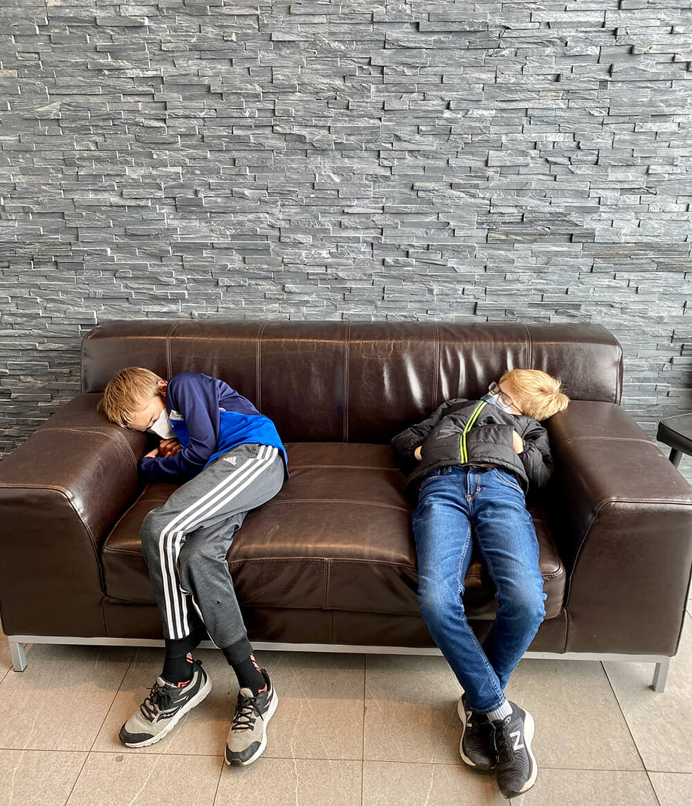
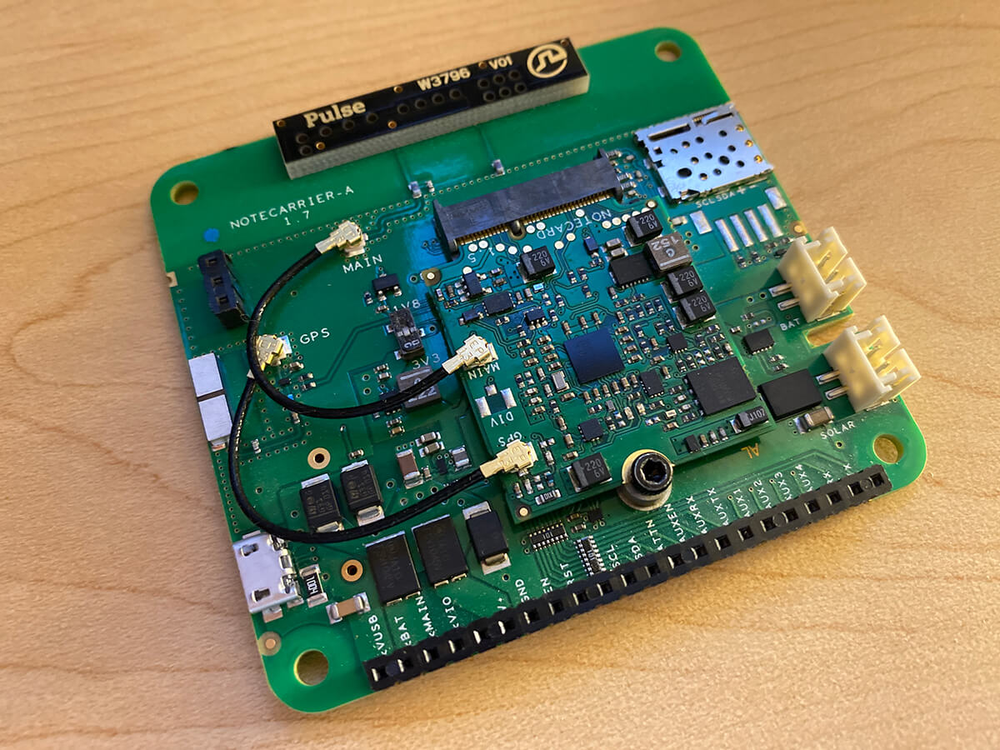
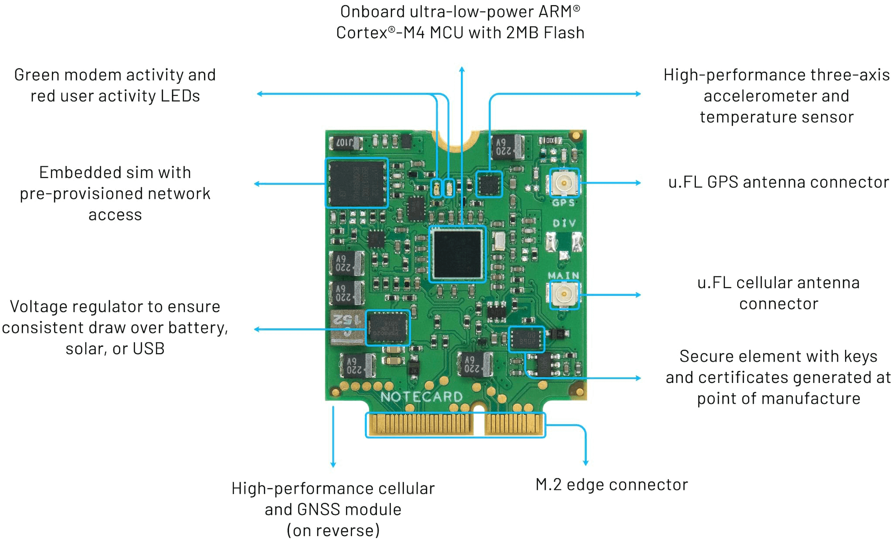
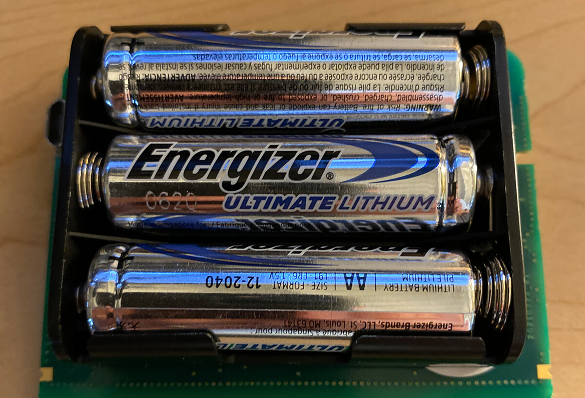
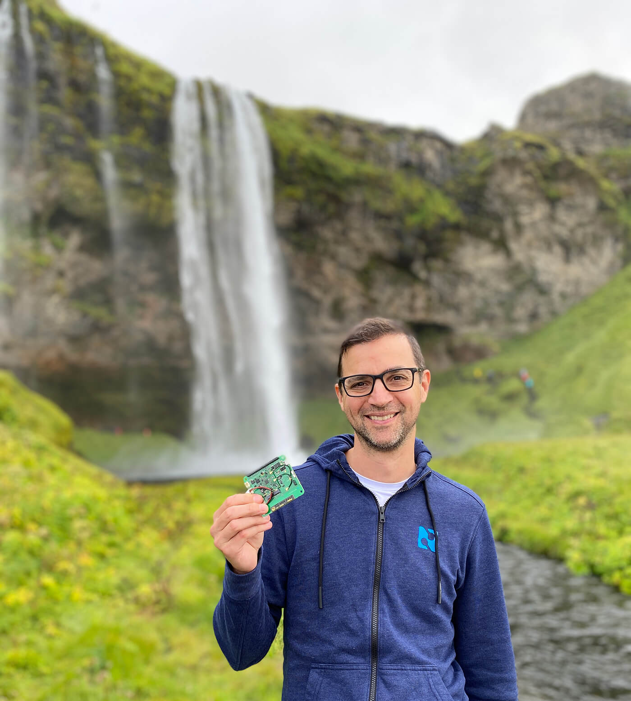
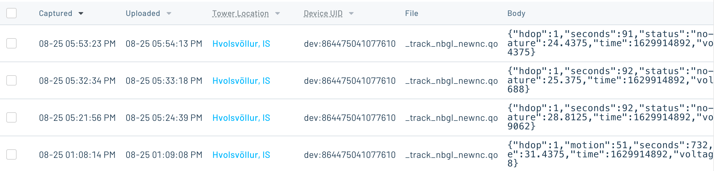
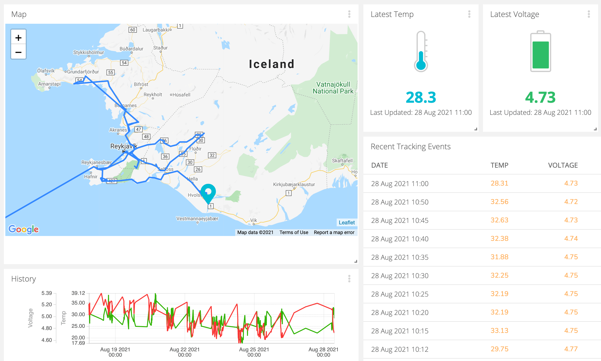

# Vacationing with a GPS Asset Tracker

*Follow a Notecard's journey to Iceland and set up your own standalone GPS asset tracker with the Notecard and Notecarrier.*

*Title image credit [Theodor Vasile](https://unsplash.com/@theodorrr) on Unsplash.*

For reasons we are all tired of talking about, planning a vacation these days can feel like far more work (and more risk) than it may be worth. And when you finally kick off a long-planned trip to Iceland, you start out jet lagged in a discount car rental office.



*Image credit Rob Lauer*

But yet we persevere! So to make the most out of this fully-vaccinated, COVID-tested, socially-distanced, and arduous overseas journey, I decided to test out the *global* nature of the [Blues Wireless Notecard](/products).

To do so, I set up a Notecard and [Notecarrier](/products#notecarrier) as a standalone asset tracker to quite literally track my location while traveling. By "standalone" I mean using the Notecard *without* an attached microcontroller:



*Image credit Rob Lauer*

## Asset Tracking with Blues Wireless

We have documented these standalone asset trackers in the past with a [step-by-step guide](https://dev.blues.io/notecard/notecard-guides/asset-tracking/) and two Hackster tutorials:

- [Low Code GPS Asset Tracker and Map Display](https://www.hackster.io/paige-niedringhaus/low-code-gps-asset-tracker-and-map-display-b10419)
- [Reindeer Recon - A Notecard-Powered Tracker](https://www.hackster.io/brandonsatrom/reindeer-recon-a-notecard-powered-tracker-97cded)

As documented in the aforementioned guide, configuring your Notecard/Notecarrier as a standalone asset tracker involves a simple set of Notecard API requests:

	{"req":"hub.set","mode":"periodic","product":"com.veritas.delivery-fleet.tracker"}
	{"req":"card.location.mode","seconds":3600,"mode":"periodic"}
	{"req":"card.location.track","start":true,"hours":1,"heartbeat":true}

With these three commands executed, in seconds your Notecard is ready to start tracking and securely relay data to Notehub (and [beyond](https://dev.blues.io/get-started/tutorials/route-tutorial/)).

However, I wanted to test the limits of a traditional asset tracker by sampling GPS location and pushing data to the cloud at a relatively high rate (while still taking into account low power consumption AND creating a cloud-based dashboard of the data!).

## Global Tracking

It's not often that I have the opportunity to leave my home country and put to test the [global nature of the Notecard](https://dev.blues.io/hardware/notecard-datasheet/note-nbgl-500/#cellular-service). In particular, this trip involved leaving North America and heading to Iceland for a two-year delayed trip full of wonder, rain, and rental car mishaps!

Luckily the Notecard comes in four flavors, each optimized for individual locations and use cases:

| Name | Bands | General Region | Data Networks | Modem |
| ---- | ----- | -------------- | ------------- | ----- |
| [**NBGL**](https://dev.blues.io/hardware/notecard-datasheet/note-nbgl-500/) | **NB** - Narrowband | **GL** - Global | LTE-M / NB-IoT / GPRS | Quectel BG95-M3 |
| [**NBNA**](https://dev.blues.io/hardware/notecard-datasheet/note-nbna-500/) | **NB** - Narrowband | **NA** - North America | LTE-M                    | Quectel BG95-M1 |
| [**WBEX**](https://dev.blues.io/hardware/notecard-datasheet/note-wbex-500/) | **WB** - Wideband | **EX** - EMEA (Europe, Middle East, Africa) | LTE Cat-1 / WCDMA / GPRS | Quectel EG91-EX |
| [**WBNA**](https://dev.blues.io/hardware/notecard-datasheet/note-wbna-500/) | **WB** - Wideband | **NA** - North America | LTE Cat-1 / WCDMA        | Quectel EG91-NAX |

For this trip, I chose the NBGL (narrowband + global) for obvious reasons as I'm not pushing much data (essentially just GPS location) and I needed it to work in both North America and Europe.



## Power-Conscious Configurations

My next consideration was a critically important one for remotely-functioning solutions (and especially those that are mobile): power consumption ⚡️.

Luckily the Blues Wireless Notecard was crafted with power-conscious hardware and [low-power configuration capabilities](https://dev.blues.io/notecard/notecard-walkthrough/low-power-design/). The Notecard was designed to operate on battery power, be "always-on", and maintain time and location while drawing less than ~8µA when idle.

Likewise the integrated GPS module uses an LIS2DTW accelerometer allowing for power-optimized motion awareness (i.e. don't try to acquire GPS coordinates if you're not moving!).

And while you can certainly power a Notecarrier with a LiPo battery, I chose to play it safe and use 3xAA lithium batteries to ensure a long and healthy life of my tracker, considering I was about to frequently sample and report location data.



*Image credit Rob Lauer*

## High-Frequency Tracking

A beauty of the Notecard API is its flexibility when it comes to configuring GPS, cellular, and data syncing operations. This allows you to create the exact balance of communications with power-optimizations to accommodate your solutions' requirements.

Since I was testing the limits (to a reasonable extent) of the tracking capabilities, I was less concerned with power optimization and more concerned with accessing location data every five minutes (likely massive overkill for most tracking implementations).

Without further ado, let's pull back the curtain on the set of Notecard API requests I used to configure my tracker.

## Tracking Config

It never hurts to start by restoring your Notecard to factory defaults with the [card.restore](https://dev.blues.io/reference/notecard-api/card-requests/#card-restore) API.

```
{
   "req":"card.restore",
   "delete":true
}
```

Entirely optional, but I decided to set the serial number of my device so I could easily identify it in Notehub by setting an [environment variable](https://dev.blues.io/notecard/notecard-guides/understanding-environment-variables/) with [env.set](https://dev.blues.io/reference/notecard-api/env-requests/#env-set).

```
{
   "req":"env.set",
   "name":"_sn",
   "text":"NBGL-NotecarrierAA"
}
```

Using the [hub.set](https://dev.blues.io/reference/notecard-api/hub-requests/#hub-set) API, I associated my Notecard with a specific project in Notehub via the `product` parameter. I use `periodic` mode to create a cellular connection only when one is needed. I set `outbound` to `60` meaning only connect via cellular once every 60 minutes and ONLY if there is data to be synced!

I also check for `inbound` requests at least once per day (every `1440` minutes). Finally by using the `align:true` parameter I could tell the Notecard to look at the current UTC time and when it's an even multiple of `outbound`, perform a sync.

```
{
   "req":"hub.set",
   "product":"my.product.uid",
   "mode":"periodic",
   "outbound":60,
   "inbound":1440,
   "align":true
}
```

By issuing a [card.voltage](https://dev.blues.io/reference/notecard-api/card-requests/#card-voltage) request, I specified default voltage thresholds based on how the Notecard would be powered (in my case with L91 AA batteries).

```
{
   "req":"card.voltage",
   "mode":"l91"
}
```

I also wanted the accelerometer to be more sensitive to movement than the default of 7.808G by using the [card.motion.mode](https://dev.blues.io/reference/notecard-api/card-requests/#card-motion-mode) API to set it to 3.904G.

```
{
   "req":"card.motion.mode",
   "sensitivity":2
}
```

Next, the [card.location.mode](https://dev.blues.io/reference/notecard-api/card-requests/#card-location-mode) API allowed me to specify how often I sample GPS location. Note that acquiring GPS satellite signals is very power- and time-consuming, so this is a critical request to get right!

By using `periodic` mode (meaning only try to acquire a GPS signal when motion is detected) and attempting said connection every `300` seconds, I had the makings of a high-frequency tracker at the ready.

```
{
   "req":"card.location.mode",
   "mode":"periodic",
   "seconds":300
}
```

Finally, using the [card.location.track](https://dev.blues.io/reference/notecard-api/card-requests/#card-location-track) API I was able to `start` tracking immediately, issue a `heartbeat` every 12 hours (meaning, send a note to Notehub even if no motion is detected for 12 hours), and `sync` data with Notehub as soon as a tracking event is acquired (another power-hungry configuration that can be disabled and default back to the periodic syncing as defined in the `hub.set` request above). I also (optionally) decided to name my [notefile](https://dev.blues.io/reference/glossary/#notefile) `_track_nbgl_newnc.qo`.

```
{
   "req":"card.location.track",
   "start":true,
   "heartbeat":true,
   "hours":12,
   "sync":true,
   "file":"_track_nbgl_newnc.qo"
}
```

With my tracker configured, I was ready to hit the road (and pose in front of some very attractive waterfalls!).



*Image credit Rob Lauer*

## Cloud-Based Reporting

With the tracker properly configured, the first "wow" moment of the project was to see tracking events show up in Notehub!



By default, a tracking event contains a lot of useful data such as date/time stamps for when events are created and sent to Notehub, the temperature of the Notecard, battery voltage, and the location of the device and nearest cell tower.

Here is an abridged version of a typical tracking event:

```
{
    "sn": "NBGL-NotecarrierAA",
    "product": "product:my.product.uid",
    "received": 1629914938.165482,
    "routed": 1629914947,
    "req": "note.add",
    "when": 1629914894,
    "file": "_track_nbgl_newnc.qo",
    "updates": 1,
    "body": {
        "hdop": 1,
        "motion": 51,
        "seconds": 732,
        "temperature": 31.4375,
        "time": 1629914892,
        "voltage": 4.6523438
    },
    "where_olc": "99MXPWF6+QH8P",
    "where_when": 1629914895,
    "where_lat": 63.7244175,
    "where_lon": -20.088542968749998,
    "where_location": "Hvolsvöllur",
    "where_country": "IS",
    "where_timezone": "Atlantic/Reykjavik",
    "tower_when": 1629914937,
    "tower_lat": 63.7039125,
    "tower_lon": -20.062796875,
    "tower_country": "IS",
    "tower_location": "Hvolsvöllur",
    "tower_timezone": "Atlantic/Reykjavik",
    "tower_id": "274,2,800,45880"
}
```

While this is great to see, the next step was to configure a more functional cloud-based dashboard to view the incoming data in real time. To do so I created a route in Notehub to securely sync data with [Ubidots](https://ubidots.com/).

**Og þar ferðu!**



## Power and Cellular Data Usage

After more than a week of tracking my location across the wilds of Iceland, what did my power and cellular data usage look like?

For data usage, I used up 1,185 KB of my allotment of 512,000 KB. However, I was adding a lot of extraneous logging data during this project, so I could easily have cut my data usage by more than 50%.

For power consumption, the voltage levels of my AA lithium batteries remained a consistent 4.5-5.2V the entire time, making me curious to know how long these might actually last if I let it keep running!

## Build Your Own Tracker

Curious about building your own GPS asset tracker? Using the Notecard and Notecarrier from Blues Wireless is a great place to start!

1. Buy a [starter kit](https://shop.blues.io/collections/development-kits/products/feather-starter-kit) or individual [Notecard](https://shop.blues.io/collections/notecard) and [Notecarrier](https://shop.blues.io/collections/notecarrier);
2. Follow our provided [asset tracking guide](https://dev.blues.io/notecard/notecard-guides/asset-tracking/);
3. [Route your data](https://dev.blues.io/get-started/tutorials/route-tutorial/) to your cloud application of choice.

Happy tracking! 🗺️