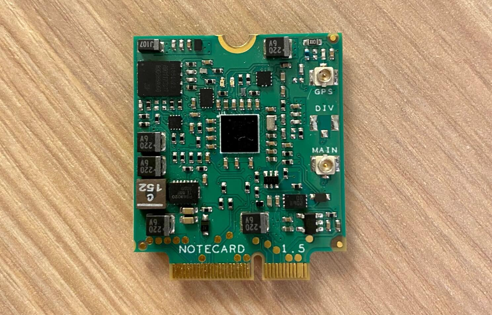
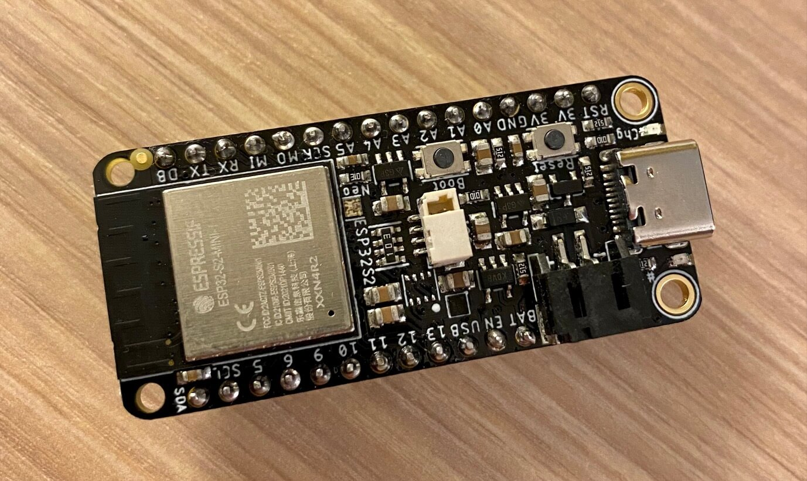
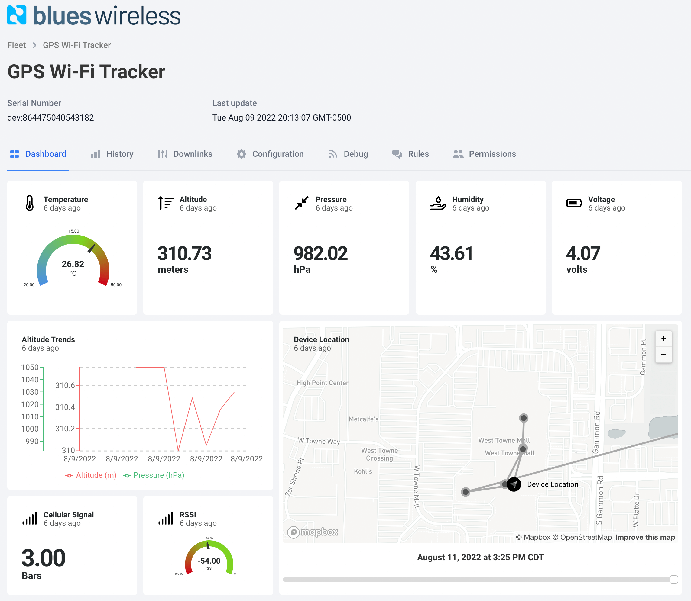

# Indoor Asset Tracking using Wi-Fi Triangulation

In the IoT, when someone says "asset tracking", you likely think of monitoring the state and location of a package, container, or vehicle. Usually this involves one or more environmental sensors to track temperature, humidity, or atmospheric pressure. Maybe an accelerometer to track motion and sudden movements.

Of course, asset tracking also involves **tracking a location** in a physical space. This is typically performed with GNSS/GPS which is far and away the most consistent and reliable means of ascertaining a physical location outdoors.


However, what if the device enclosure prevents you from getting GPS data due to a physical barrier? What if trying to get a GPS satellite fix consumes too much power? Or (and here's the real kicker) what if your goal is to **track an asset indoors**?

Have no fear, I've got a solution for you today! Well, at least a proof-of-concept 😅.

By using our old friend from trigonometry and geometry classes (triangulation), we can build a fully-functional **indoor asset tracking solution** built upon on the [Blues Wireless Notecard](https://blues.io/products/notecard/?utm_source=hackster&utm_medium=web&utm_campaign=featured-project&utm_content=indoor-asset-tracking).

We can also tap into a commonly used sensor to measure altitude, giving us the ability to ascertain the building floor and provide true "3D asset tracking" with x/y/z positioning.

**Ready to dive in?** Let's start with the high level requirements of this indoor tracking solution.

## Requirement: Location Data without GPS

GPS should *always* be the first choice when attempting to ascertain physical location. But it's good to have a backup in case getting a GPS satellite fix fails (which can often be the case inside a building).

You may already know that triangulation is the process of determining a location by forming triangles to a point of interest, from a series of other known points.


In this project, the Notecard is going to allow us to use both GPS _or_ triangulation to accurately ascertain a device's position.

## Requirement: Use Altitude to Track Floor

Tracking an asset on a 2D map is so last year 😊.

We can easily use data from a BME280 sensor to calculate a reasonably accurate altitude. What you may not know is, those altitude readings are based on a standard sea level pressure measure of 1013.25 hPa.

Wouldn't it be cooler to **actively query the sea level pressure** for a known location *before* asking the sensor to calculate the altitude? This provides for a much more accurate reading, letting us roughly calculate the floor of the building we are on.

## Requirement: Device-to-Cloud Data Pump

We need a means of syncing our gathered location and altitude data to the cloud. I already gave away our secret component: the Blues Wireless Notecard.

The [Notecard is a prepaid cellular system-on-module](https://blues.io/iot-connectivity-firmware-for-engineers/?utm_source=hackster&utm_medium=web&utm_campaign=featured-project&utm_content=indoor-asset-tracking), especially useful for low bandwidth cellular IoT communications. It comes preloaded with 500MB of data and 10 years of global cellular service, starting at $49 USD.


Even though the Notecard is a cellular device, you actually have to program the modem with archaic AT commands. The [Notecard API is all JSON](https://dev.blues.io/reference/notecard-api/introduction/?utm_source=hackster&utm_medium=web&utm_campaign=featured-project&utm_content=indoor-asset-tracking), all the time. For instance, say you wanted to query the last known location on the Notecard, you'd use the [card.location API](https://dev.blues.io/reference/notecard-api/card-requests/?utm_source=hackster&utm_medium=web&utm_campaign=featured-project&utm_content=indoor-asset-tracking#card-location):

```
// Request
{ "req": "card.location" }

// Response
{
  "status": "GPS updated (58 sec, 41dB SNR, 9 sats),
  "mode":   "periodic",
  "lat":    42.577600,
  "lon":    -70.871340,
  "time":   1598554399
}
```

Even more importantly, security and cloud integration is turnkey. The Notecard communicates "off the public Internet" through private VPN tunnels, using the [Blues Wireless cloud service Notehub](https://blues.io/products/notehub/?utm_source=hackster&utm_medium=web&utm_campaign=featured-project&utm_content=indoor-asset-tracking).

Notehub is _also_ our secret sauce when it comes to providing location data via triangulation. As we'll see later on, when we supply known Wi-Fi access point data to Notehub and enable the [card.triangulate API](https://dev.blues.io/reference/notecard-api/card-requests/?utm_source=hackster&utm_medium=web&utm_campaign=featured-project&utm_content=indoor-asset-tracking#card-triangulate), Notehub can actually look up shockingly accurate location data.

## Requirement: Power-Conscious

Any IoT solution that is battery-powered has to be power-conscious. Thankfully the Notecard is low-power by default (to the tune of ~8uA when idle) and includes an on-board accelerometer, which allows us to calculate an asset's location only when it has detected motion!

*With all of these requirements in mind, let's assemble our hardware.*

## The Hardware

The Cellular Notecard is the core of our solution, providing onboard GPS, an accelerometer for motion detection, and cellular connectivity to relay collected data to the cloud.



Since I'm not willing to give up on GPS (even for an indoor deployment) I'm going to use a small active GPS antenna alongside an LTE antenna for cellular data.


For gathering environmental data and calculating altitude, I'm including the venerable BME280 sensor from Bosch.


For a host microcontroller, I went with the [ESP32-S2 Feather](https://learn.adafruit.com/adafruit-esp32-s2-feather). I chose this MCU primarily because of its onboard Wi-Fi module and support for CircuitPython. Even though we aren't using Wi-Fi for connectivity, we _can_ use it to gather public Wi-Fi access point data.



So how do we bring all the pieces together? That's what the new [Blues Wireless Notecarrier-F](NEED LINK) is for!

[Notecarriers](https://blues.io/products/notecarrier/?utm_source=hackster&utm_medium=web&utm_campaign=featured-project&utm_content=indoor-asset-tracking) are carrier boards that allow you to quickly prototype IoT solutions that use the Notecard. The Notecarrier-F is a great option for Feather-compatible MCUs and provides two Qwiic ports for adding peripherals (like the BME280) and JST connectors for connecting LiPo batteries.


And here is the final hardware setup, all connected and ready to be programmed:


## The Firmware

I'm an unabashed Python fan, so [CircuitPython](https://circuitpython.org/) was an easy choice for me.

**Why CircuitPython?** Valid question! In my humble opinion, CircuitPython has helped to open up the IoT to a new breed of developers who grew up with Python. Like its "parent" MicroPython (upon which CircuitPython is based), being able to use the uber-popular Python language to program these "things" and connect them to the world has broadened the reach and scope of IoT solutions.

*So let's write some CircuitPython firmware!*

> **NOTE:** The full CircuitPython source code is available in [this Github repository](https://github.com/rdlauer/indoor-tracker-circuitpython).

### Python Libraries and Imports

The only external dependencies we have are the Notecard and BME280 sensor. Both have well-supported Python libraries that work great with CircuitPython: [note-python](https://github.com/blues/note-python) and [adafruit-circuitpython-bme280](https://github.com/adafruit/Adafruit_CircuitPython_BME280).

The final set of imports looks like this:

```
import board
import busio
import notecard
from adafruit_bme280 import basic as adafruit_bme280
import utils
import keys
import time
from time import sleep
```

### Device Initialization

We need to initialize access to our peripherals. Both the Notecard and BME280 communicate over I2C, making our init steps quite simple:

```
# initialize the Blues Wireless Notecard (blues.io)
i2c = busio.I2C(board.SCL, board.SDA)
card = notecard.OpenI2C(i2c, 0, 0, debug=True)

# create reference to BME280
bme280 = adafruit_bme280.Adafruit_BME280_I2C(i2c)
```

In order to calculate an accurate altitude, we need to know the current sea level pressure at our given location. More on this later on, but we're going start by supplying the sensor with a standard sea level pressure measure of 1013.25 hPa. 

Later on, when using a remote service to gather pressure data, we will need to use latitude/longitude coordinates. We can program in some defaults and later update them if/when GPS becomes available:

```
bme280.sea_level_pressure = 1013.25
lat_def = 43.05769554337394
lon_def = -89.5070545945101
```

Next, we need to associate the Notecard with a cloud-based project on the Blues Wireless cloud service Notehub. This enables the Notecard to securely transmit data to a known location in the cloud:

```
# associate Notecard with a project on Notehub.io
req = {"req": "hub.set"}
req["product"] = "your-notehub-product-uid"
req["mode"] = "periodic"
rsp = card.Transaction(req)
```

We then want to enable the GPS module on the Notecard. Again, this is not strictly required, but it's certainly a best practice to at least _try_ and gather GPS position if satellites are visible:

```
# enable GPS module on Notecard
req = {"req": "card.location.mode"}
req["mode"] = "periodic"
rsp = card.Transaction(req)
```

Finally, we enable *motion tracking* on the Notecard, which will let us ascertain the location of the device only if it has moved (as opposed to sampling at a regular time interval, even if the device is stationary, unnecessarily consuming power).

```
# enable motion tracking on Notecard
req = {"req": "card.motion.mode"}
req["start"] = True
rsp = card.Transaction(req)
```

> **NOTE:** Curious about these Notecard API requests? Consult the [full Notecard API reference](https://dev.blues.io/reference/notecard-api/introduction/?utm_source=hackster&utm_medium=web&utm_campaign=featured-project&utm_content=indoor-asset-tracking).

### Check for Motion

We'll need a way to detect if the device has moved before attempting to ascertain its location. We can do so by using the [card.motion API](https://dev.blues.io/reference/notecard-api/card-requests/?utm_source=hackster&utm_medium=web&utm_campaign=featured-project&utm_content=indoor-asset-tracking#card-motion).

The `count` parameter in the response tells us how many motion events were registered since it was last checked:

```
def check_motion():
    """ check for Notecard movement to see if we need to update its location """

    req = {"req": "card.motion"}
    rsp = card.Transaction(req)

    if "count" in rsp and rsp["count"] > 0:
        # movement detected since last check!

        using_gps = False
        using_wifi = False

        # attempt to ascertain the current gps location
        using_gps = get_gps_location()

        if using_gps is False:
            # gps location timed out, switch to wi-fi triangulation
            using_wifi = set_wifi_triangulation()

        # send readings from the sensor to the cloud
        send_sensor_data(using_gps, using_wifi)
```

There are a couple other location-based methods mentioned in here, `get_gps_location` and `set_wifi_triangulation`. Let's take a quick look at these.

### Get GPS Location

What follows is a highly condensed version of the Python code used to ascertain a GPS location. The full version is available as part of the [project's Github repository](https://github.com/rdlauer/indoor-tracker-circuitpython) and, long story short, contains additional logic to override the low-power nature of the GPS module.

```
def get_gps_location():
    """ attempt to ascertain the latest gps location """

    # get the latest GPS location
    req = {"req": "card.location"}
    rsp = card.Transaction(req)

    if "lat" in rsp and "lon" in rsp:
        # got an updated gps location
        lat_def = rsp["lat"]
        lon_def = rsp["lon"]
```

Again, since this is an indoor deployment, we will rarely get a valid GPS location. So let's look at using Wi-Fi triangulation instead!

### Set Up Wi-Fi Triangulation

Did you know that our smartphones are constantly gathering data about available Wi-Fi access points, combining that data with lat/lon coordinates, and shipping the data to Apple and Google? Welcome to yet another questionable privacy practice by these big tech companies!

On the bright side, it also allows us to utilize a capability of Notehub to [gather positioning data from nearby Wi-Fi access points](https://dev.blues.io/notecard/notecard-walkthrough/time-and-location-requests/?utm_source=hackster&utm_medium=web&utm_campaign=featured-project&utm_content=indoor-asset-tracking#using-cell-tower-and-wi-fi-triangulation).

By providing a list of Wi-Fi access points to the [card.triangulate API](https://dev.blues.io/reference/notecard-api/card-requests/?utm_source=hackster&utm_medium=web&utm_campaign=featured-project&utm_content=indoor-asset-tracking#card-triangulate), we can tell Notehub to calculate positioning data for us (often with shockingly accurate results).

> **NOTE:** I highly recommend reading the [Cell Tower/Wi-Fi triangulation documentation](https://dev.blues.io/notecard/notecard-walkthrough/time-and-location-requests/?utm_source=hackster&utm_medium=web&utm_campaign=featured-project&utm_content=indoor-asset-tracking#using-cell-tower-and-wi-fi-triangulation). There are additional settings in Notehub that you may need to update based on how often you want to utilize triangulation.

Again, since we're using an ESP32-based MCU, we can use the built-in `wifi` CircuitPython library to create a list of visible Wi-Fi access points. The helper function, `get_wifi_access_points`, is available in the [Github repository](https://github.com/rdlauer/indoor-tracker-circuitpython/blob/main/utils.py) as well.

```
def set_wifi_triangulation():
    """ use the card.triangulate api to set the local wifi access points """

    req = {"req": "card.triangulate"}
    req["mode"] = "wifi"
    rsp = card.Transaction(req)

    all_wifi_aps = utils.get_wifi_access_points()

    if len(all_wifi_aps) > 0:
        req = {"req": "card.triangulate"}
        req["text"] = all_wifi_aps + "\n"
        rsp = card.Transaction(req)
        return True
    else:
        return False
```

### Get Updated Sea Level Pressure

In order to calculate the most accurate altitude possible, we need to know our current location's atmospheric pressure at sea level. The only way to reliably do so is to call a remote weather service to access this data on-demand.

This is where the [OpenWeather API](https://openweathermap.org/) combined with the Web APIs from the Notecard come in handy. OpenWeather provides a developer-friendly way of accessing a variety of weather-related data.

The [Notecard's Web APIs](https://dev.blues.io/reference/notecard-api/web-requests/?utm_source=hackster&utm_medium=web&utm_campaign=featured-project&utm_content=indoor-asset-tracking) allow the Notecard to send/receive data to/from remote RESTful APIs. The method below is abridged for space:

```
def get_sea_level_pressure(card, lat, lon):
    """ get the sea level pressure from openweather api """

    # call openweather api to get latest pressure reading
    weatherURL = "/weather?lat=" + \
        str(lat) + "&lon=" + str(lon) + "&appid=" + keys.WEATHER_API_KEY

    req = {"req": "web.get"}
    req["route"] = "GetWeather"
    req["name"] = weatherURL
    rsp = card.Transaction(req)

    pressure = 0

    if rsp and "body" in rsp and "main" in rsp["body"] and "pressure" in rsp["body"]["main"]:
        pressure = rsp["body"]["main"]["pressure"]

    return pressure
```

Notice the `GetWeather` string called in this method? This is the name of a [Notehub route](https://dev.blues.io/notehub/notehub-walkthrough/?utm_source=hackster&utm_medium=web&utm_campaign=featured-project&utm_content=indoor-asset-tracking#routing-data-with-notehub) which is configured to query a remote service (OpenWeather) and return current weather data for the specified lat/lon coordinates. This particular route looks like this in the Notehub UI:


### Send Data to the Cloud

Once we have the updated sea level pressure, we can update the BME280 sensor with that value and finally send environmental sensing data to Notehub for syncing with a to-be-created Datacake dashboard:

```
def send_sensor_data(using_gps, using_wifi):
    """ send sensor data to the cloud with the Notecard """

    # first get the updated sea level pressure
    sl_pressure = utils.get_sea_level_pressure(card, lat_def, lon_def)

    if sl_pressure <= 0:
        sl_pressure = 1013.25

    bme280.sea_level_pressure = sl_pressure
    sleep(1)

    note_body = {}

    # get 50 readings from the sensor and use the median values
    temp_list = []
    humidity_list = []
    pressure_list = []
    altitude_list = []

    for x in range(50):
        temp_list.append(bme280.temperature)
        humidity_list.append(bme280.relative_humidity)
        pressure_list.append(bme280.pressure)
        altitude_list.append(bme280.altitude)
        sleep(0.1)

    med_temp = utils.get_median(temp_list)
    med_humidity = utils.get_median(humidity_list)
    med_pressure = utils.get_median(pressure_list)
    med_altitude = utils.get_median(altitude_list)

    print("Temperature: %0.1f C" % med_temp)
    print("Humidity: %0.1f %%" % med_humidity)
    print("Pressure: %0.3f hPa" % med_pressure)
    print("Altitude = %0.2f meters" % med_altitude)
    print("Sea Level Pressure = %0.3f hPa" % sl_pressure)

    note_body["temperature"] = med_temp
    note_body["humidity"] = med_humidity
    note_body["pressure"] = med_pressure
    note_body["altitude"] = med_altitude
    note_body["sealevelpressure"] = sl_pressure

    # get the battery voltage
    req = {"req": "card.voltage"}
    rsp = card.Transaction(req)
    note_body["voltage"] = rsp["value"]

    # get the wireless bars and rssi values
    req = {"req": "card.wireless"}
    rsp = card.Transaction(req)
    note_body["bars"] = rsp["net"]["bars"]
    note_body["rssi"] = rsp["net"]["rssi"]

    # deliver note to the notecard and sync immediately
    req = {"req": "note.add"}
    req["sync"] = True
    req["file"] = "indoor_tracker.qo"
    req["body"] = note_body
    rsp = card.Transaction(req)
```
 
Take note (yes, pun intended) of the final request in this method, [note.add](https://dev.blues.io/reference/notecard-api/note-requests/?utm_source=hackster&utm_medium=web&utm_campaign=featured-project&utm_content=indoor-asset-tracking#note-add). A ["Note"](https://dev.blues.io/reference/glossary/?utm_source=hackster&utm_medium=web&utm_campaign=featured-project&utm_content=indoor-asset-tracking#note) is simply a JSON object that includes arbitrary data you want to send to the cloud.

In this case, we are sending the following data elements in the `body` of our Note:

- temperature
- humidity
- pressure
- altitude
- sea level pressure
- voltage (from the connected LiPo battery)
- bars and rssi (connection quality data from the cellular modem)

## The Cloud Dashboard

With the firmware written and deployed to the microcontroller, we can check Notehub to make sure valid data is being collected and synced:


But this data is only somewhat useful being visible in Notehub. What we _really_ need to do is **route this data to a cloud dashboard** to make it digestible (and pretty!).

To do so, I built a fully functional dashboard with [Datacake](https://datacake.co/):



> **NOTE:** There is a full end-to-end tutorial on [building a cloud dashboard on Datacake](https://dev.blues.io/guides-and-tutorials/routing-data-to-cloud/datacake/?utm_source=hackster&utm_medium=web&utm_campaign=featured-project&utm_content=indoor-asset-tracking) available in the Blues Wireless developer site.

Let's zoom in on the map widget though, because I made the ultimate sacrifice by testing this project indoors...at the mall:


*Image courtesy CNN. Not actually the mall I went to...*

After spending about 20 minutes walking from end to end of this indoor shopping monstrosity (admittedly some of the big department starts at the corners were closed unfortunately) I was able to gather Wi-Fi triangulation data to ascertain a shockingly accurate set location points:


Now I made a big deal about using altitude data earlier. While we can't provide a true "3D" visualization of our location on Datacake (or frankly any cloud dashboard that I'm aware of, yet), we can correlate location data on the map with altitude data provided from the BME280 sensor. Setting a "baseline altitude" of floor one (or zero for you folks outside the States) we can roughly track the floor we are on as well based on the relative altitude measured:


## Summary

Let me be crystal clear: you should always *at least attempt* to use GPS when ascertaining device location. It's going to be the most accurate option and, when using the right combination of hardware and firmware, uses a minimal amount of power in a battery-powered device.

However, if needed, it's great to have an option like the Blues Wireless Notecard with Notehub and its triangulation capabilities.

Curious to learn more? Pick up the [Blues Wireless ESP32 starter kit](https://shop.blues.io/products/feather-starter-kit?utm_source=hackster&utm_medium=web&utm_campaign=featured-project&utm_content=indoor-asset-tracking) today!

Happy Tracking! 📍🗺
