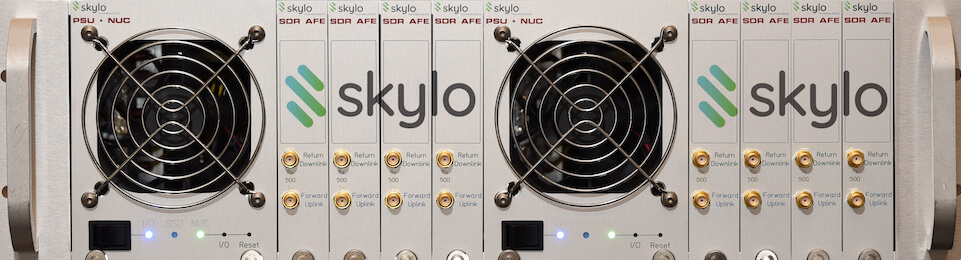
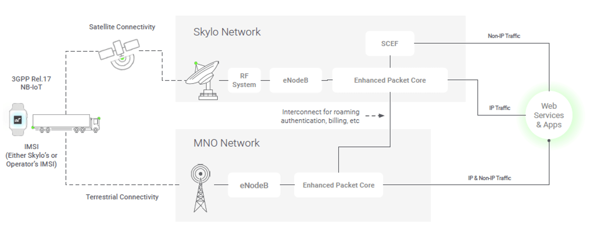
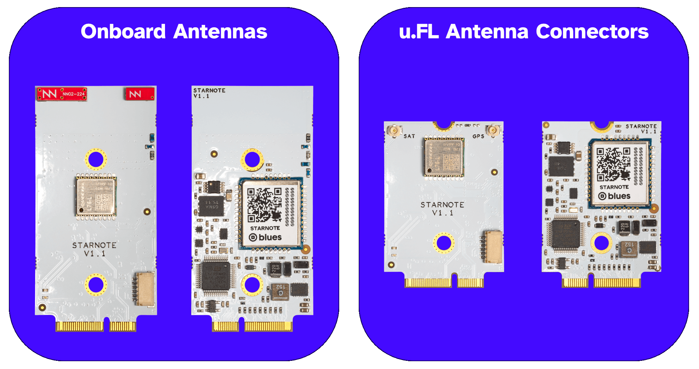
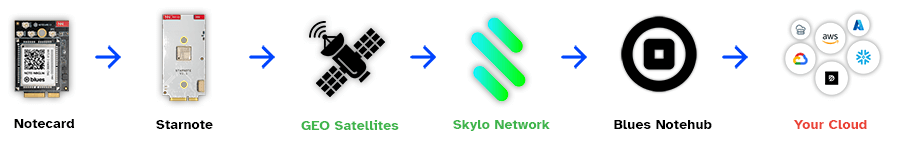

## Narrowband Cellular, Wi-Fi, LoRaWAN? Individually they're all dead. The Future is Multi-RAT.

Let me start by saying I despise prognostication blog posts. "The future is [insert buzz word]!!!" types of articles are too often focused on generating clicks in lieu of providing meaningful insight into the future of our industry.

Wait. That feels like...the exact blog post I'm writing. Well it's different this time, because I know I'm right (at least I'm _pretty_ sure I'm right). And you can trust me, because I once predicted the iPad would be cast aside as "just a big iPhone" (it wasn't) and [Firefox OS](https://en.wikipedia.org/wiki/Firefox_OS) would take over the low end smartphone market (it didn't).

Again, it's different today. I'm older. Wiser. I've seen a lot of tech come and go. I also **couldn't be more confident in the future of the IoT** and the fact that wireless connectivity doesn't begin and end with any single RAT (Radio Access Technology).

**The future is multi-RAT** and the centerpiece RAT for the future? It's satellite, or more specifically Non-Terrestrial Networks (NTN for short).

## NTN? Yeah No Kidding

Yes, the writing has been on the wall for NTN since even before [Starlink](https://www.starlink.com/) made headlines, and direct satellite communications felt within reach. Yet it wasn't until more recently that we hit an inflection point where consumer-accessible satellite networks could _actually_ become a thing. No longer limited to governments or corporations with unlimited budgets, NTN-based communications have become increasingly cheaper and more widely available thanks in part to companies like [Skylo](https://www.skylo.tech/).



## Satellite IoT Today

Let's take a closer look at a company doing things right (in this author's humble opinion), that being the aforementioned Skylo.

### What is Skylo?

Skylo is an **NTN service provider**, an industry leader in the "convergance" of satellite and cellular. The Skylo network helps to connect deployed devices to deployed satellites, effectively functioning very similar to a narrowband roaming network.

Skylo's tech is built on the 3GPP NTN standard. Why is this important? With Skylo and similar providers there is **no need for new or different cellular radios or even antennas**. You continue using what you're using today. This is an extremely important point that bears repeating. (Feel free to read that sentence again!)

Skylo uses a 3GPP standards-focused approach to their network. Since they control the entire stack, from a standard mobile core to their own NTN-capable eNodeB/RAN, they can quickly roll out new features depending on customer need.



## What's the Catch with NTN?

The catch? Great question. While NTN connectivity works incredibly well today, there are two predictable drawbacks:

1. Coverage
1. Bandwidth

### The Coverage Issue

An early lesson I learned with satellite data is that just because a GEO (geostationary) satellite can "see" almost 1/2 of the planet, that doesn't mean it can provide service to almost 1/2 of the planet. Segments of geographic regions (like corridors) need to be enabled by the providers to establish connectivity. That can be a surprisingly expensive endeavor (at least today). This is why, while coverage is excellent in supported regions, you don't get that "blanket" coverage you might be anticipating.

> See [Skylo's coverage map](https://www.skylo.tech/resources/geographical-coverage) for more details.

### The Bandwidth Issue

Bandwidth is another consideration. Yes data is getting cheaper, but that doesn't mean it's inexpensive. NTN isn't (yet) a drop-in replacement for Wi-Fi or narrowband cellular. Payloads should be small, like 50-250 bytes small on average.

Certain providers will really ding you on data overage charges, but this is where (spoiler alert) [Starnote](https://blues.com/starnote/) comes in handy, with its prepaid data allocation and flexible usage beyond that data.

But I'm getting ahead of myself.

## Satellite Today == 1G

Personally, I like how Skylo positions NTN connectivity being no different than the evolution of the terrestrial cellular network that we all witnessed. We started with the "data-sipping" 1G with low coverage and even lower bandwidth capabilities. 2G made the simplest scenarios more palatable (which is why it's still around today), and now we're streaming GBs of data over advanced 5G networks.

So today, we sit here at the "1G phase" of NTN. Does that mean you should sit on the sidelines and wait for things to get better? Not at all. That's because **the multi-RAT future I alluded to is already here**. You just have to be smart with how you implement it!

## The Multi-RAT Future

Back to the main topic of this post, that being our future of multi-RAT technology. To be clear, when I say "multi-RAT" I'm not pointing you towards those inexpensive ESP32 boards with onboard Wi-Fi and BLE. Those are fine and all, but they also have immense limitations in terms of deployments (nobody is setting up Wi-Fi credentials on fleets of devices or relying on their customers to do so).

So let's look at one company who is building this multi-RAT future, today. That should be (no surprise)...it's [Blues](https://blues.com/). You probably know Blues for cellular today, but everyone else will know Blues for cellular, Wi-Fi, LoRa, and satellite soon enough!

## Cellular + Wi-Fi from Blues

Back in 2023, Blues introduced the world to a low-cost embeddable Notecard that provided out-of-the-box functionality to connect to [both cellular and Wi-Fi networks](https://shop.blues.com/products/notecard-cell-wifi). **More importantly, it didn't require the user to program the device to use one or the other.** The Notecard Cell+WiFi automatically falls back from Wi-Fi to cellular when needed, completely transparently to the end device.

This feature is enabled by the [Notecard API](/api-reference/), the fundamental programming interface for the Notecard. The Notecard API is **completely RAT-agnostic**. You can program your prototype using a **Notecard WiFi**, deploy a test fleet with **Notecard LoRa**, and release a production-ready solution using **Notecard Cellular** or **Notecard Cell+WiFi** (or reverse and rework any combination of the above Notecards).

_All without making a single change to your code._

The magic comes from the JSON-based, device-agnostic, language used by the API. For instance, in three statements I can tell the Notecard:

1. Where in the cloud it should send data (specifically which Notehub projects should receive the data).
1. In what order the Notecard should prioritize the RATs in use (let's say Wi-Fi, then cellular, then NTN).
1. What data I want to sync with the cloud (some basic temperature and humidity data for instance).

```
# 1.
{"req": "hub.set", "product": "com.your-company.your-name:your_product"}

# 2.
{"req": "card.transport", "method": "wifi-cell-ntn"}

# 3.
{"req": "note.add", "file": "sensors.qo", "body": {"temp": 72.22, "humidity", 23.6}}
```

> Learn more about the Blues data flow in the Starnote Quickstart Guide.

## Cellular + Wi-Fi (+ Satellite) from Blues

For Blues, the next paradigm in multi-RAT communications is here: [Starnote](https://shop.blues.com/products/starnote).

> Curious to know more about Starnote? Join the Blues and Skylo webinar (or watch a replay).

The Starnote is available for **only $49** which includes **18KB of prepaid satellite data** (enough to send one 50 byte payload every day for a year).

It's available in two variants, with or without onboard antennas, to provide flexibility in deployments:



Starnote is a _Notecard accessory_, meaning it works with a paired cellular or Wi-Fi Notecard as a fallback connectivity option. Just like the Notecard Cell+WiFi allows you to failover from Wi-Fi to cellular (see above), Starnote provides that last option of: "if all else fails, send this data to those little satellites that are always flying overhead".



Satellite data comes at a premium, we all know that. That's why the NTN mode of Starnote allows for incredible data-sipping capabilities, sending UDP packets efficiently (letting you take full advantage of the prepaid data included with the price of the Starnote).

**TIP:** You can actually get started with NTN mode on the Notecard _without using a physical Starnote_. How? Check out the Starnote Quickstart Guide for more information.

You can get your Starnote on the [Blues Shop](https://shop.blues.com/products/starnote).

## What's Next from the Blues Multi-RAT Strategy?

What's next? I honestly don't know. But I also couldn't tell you if I did know (and yes this is also what I would say if I did know, but couldn't tell you anyway!).

However, looking back upon the history of Blues and the massive set of different RAT options you have today (from [Wi-Fi](https://shop.blues.com/products/wifi-notecard), to [LoRa](https://shop.blues.com/products/notecard-lora), to [NB-IoT](https://shop.blues.com/products/notecard), to [LTE-M](https://shop.blues.com/products/notecard), to [Cat-1](https://shop.blues.com/products/notecard), and now even [Cat-1 bis](https://shop.blues.com/products/notecard-cellular)) I believe we will see consolidation. As costs come down, more satellites are available, more data corridors are open, and data becomes ever more a commodity, you're going to see some impressive multi-RAT solutions from Blues.

**Satellite + LoRa + Cellular + Wi-Fi on a single Notecard?** Throw in a user-addressable STM32 host and maybe that's the 2025 version of the Notecard. Why not?

[Sound off in the forum](https://discuss.blues.com/) to let us know what YOU would like to see next from Blues.

Happy Hacking! 💙🛰️💙
