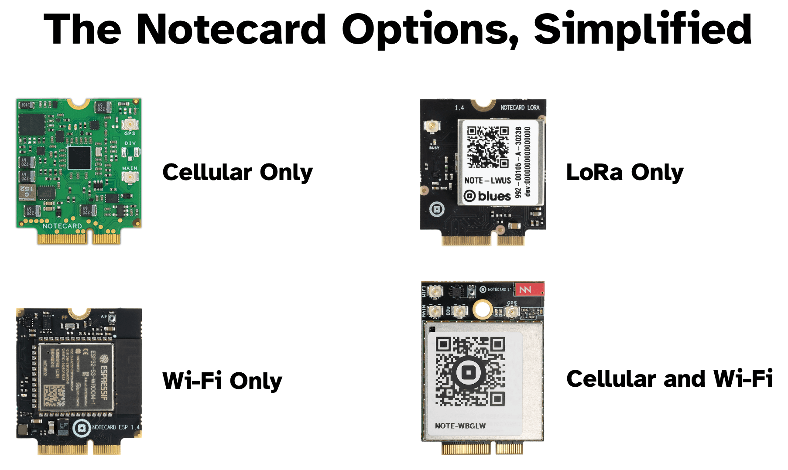
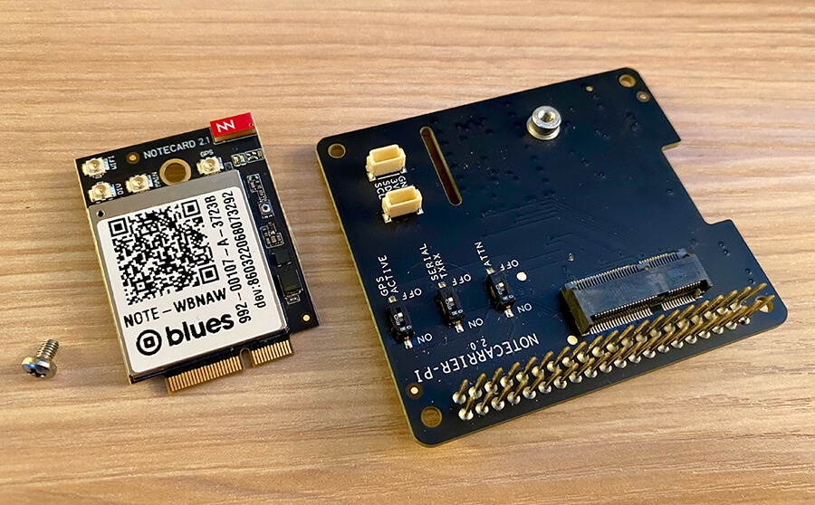
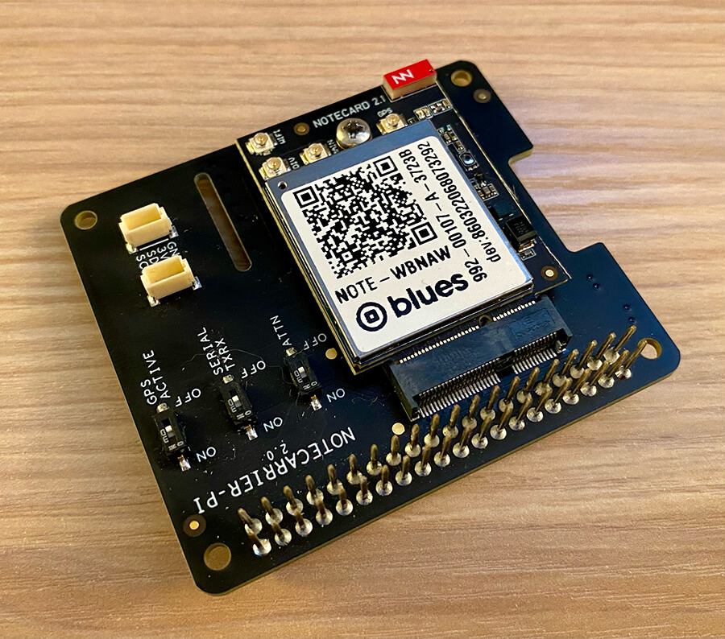
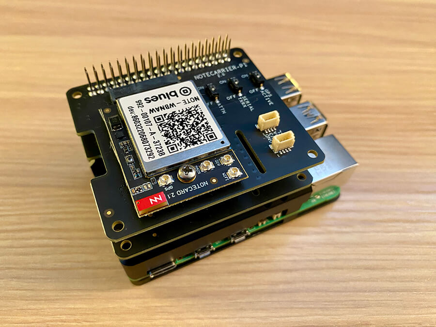
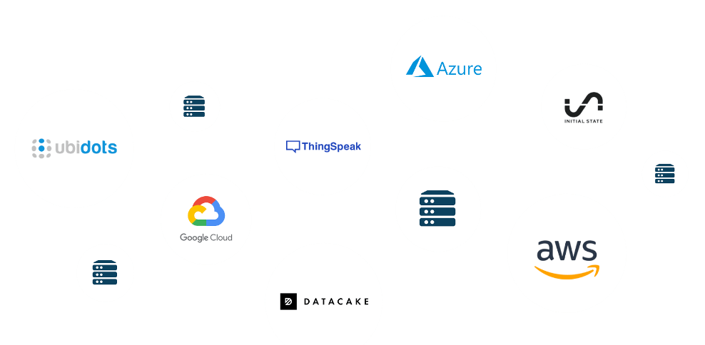
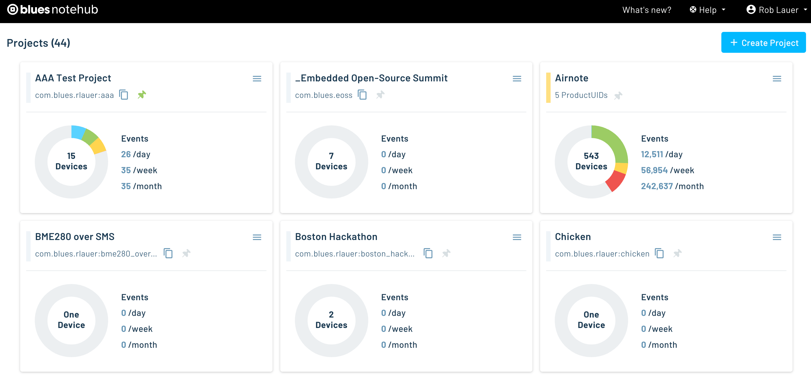
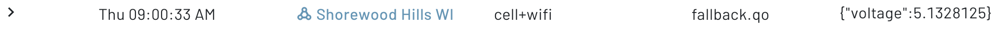

# Building a LoRaWAN -> Wi-Fi -> Cellular Fallback IoT Device

As ubiquitous as cellular networks, public Wi-Fi access points, and even LoRaWAN gateways are becoming, there is still no "one size fits all" when it comes to wireless IoT deployments. Unfortunately when designing a product, we are often forced to pick a single Radio Access Technology (RAT), like one of the above, before any other work can start.

Why is this a problem?

1. We have to **design the product** (e.g. PCB, physical enclosure) around the form factor of a specific RAT component.
2. We have to choose the **right battery technology** to optimize performance with that RAT.
3. And most importantly, we have to **program firmware** that targets a specific RAT.

At the end of the day, I might argue that we shouldn't have to care about whether we are using LoRa or Cellular or Wi-Fi or Zigbee...we just want to get the dang thing connected!

## Wireless Harmonization with Blues

This is why the [Blues Notecard](https://shop.blues.com/collections/notecard) is such a breath of fresh air. By using a [single JSON-based API](https://dev.blues.io/api-reference/notecard-api/introduction/) and building around one form factor, you can design your product without fear of switching from Cellular, to Wi-Fi, to LoRa (and back again). You can even **deploy the same product with different RATs**, without changing a single line of code.



## But Let's Get Crazy

There's the freedom of picking ONE of Cellular, Wi-Fi, or LoRa, **but what if I want to use them all!?**

Today I want to show you a scenario where we build a single product that has the ability to:

1. Start by trying to connect to the cloud via LoRa/LoRaWAN.
2. If LoRa fails, try using Wi-Fi.
3. And if both fail? Fallback to Cellular.

## The Project Hardware

> I want to be doubly clear that even though I'm using a Raspberry Pi with Python for this example, you can 100% accomplish the same thing using any ESP32, STM32, or Nordic (and so on) host with Arduino/C. **It's the same API commands!**

We are going to be using the following hardware:

1. [Blues Notecard LoRa](https://shop.blues.com/collections/notecard/products/notecard-lora) (automatically connects to an available [The Things Network](https://www.thethingsnetwork.org/) gateway).
2. [Blues Notecard Cell+WiFi](https://shop.blues.com/collections/notecard/products/notecard-cell-wifi) (prepaid cellular and Wi-Fi on one board).
3. [Blues Notecarrier Pi Hat](https://shop.blues.com/products/carr-pi) (two of these, each used as a carrier boards for the above Notecards).
4. Raspberry Pi 5 (also works with the 4B and the Zero!).

The Notecard slots into the Notecarrier:



...to...



And the Notecarriers can even stack on top of each other on the Pi:



## How Does the Notecard Sync Cloud Data?

The Notecard is, by default, a [low power](https://dev.blues.io/notecard/notecard-walkthrough/low-power-design/) and "occasionally connected" device. With ~1MB of user-addressable flash on the Notecards, you can store A LOT of data before the Notecard needs to sync its data with the cloud. This allows battery-powered, asset tracking, and condition monitoring solutions that can't be continuously connected.

To be clear, the Notecard isn't meant to be a drop-in replacement for Wi-Fi. It's a low-bandwidth device that lets you send individual JSON-based events (or [Notes](https://dev.blues.io/api-reference/glossary/#note) in Blues lingo) that contain key-value pairs. For example:

```
{
    "event": "a4489717-3ece-4fb6-beab-b40275c8c089",
    "device": "dev:864622044598304",
    "product": "product:com.blues.rlauer:aaa",
    "received": 1704988174.993267,
    "req": "note.add",
    "file": "fallback.qo",
    "body": {
        "voltage": 4.9140625
    },
    "best_location_type": "tower",
    "best_location_when": 1704988171,
    "best_lat": 43.0738875,
    "best_lon": -89.44357812499999,
    "best_location": "Shorewood Hills WI",
    "best_country": "US",
    "best_timezone": "America/Chicago",
    "fleets": [
        "fleet:4d7ccbcb-a410-4730-9ee2-b483b3523b17"
    ]
}
```

The Notecard also knows exactly where to go as soon as it's powered up. You don't have to manage security or rotate keys with the Notecard, everything is handled for you and data is streamed securely from the device to the cloud.

On the cloud side, the [Blues Notehub](https://notehub.io/) acts as the "hub" of data. From Notehub you can [route your data to any cloud platform](https://dev.blues.io/notehub/notehub-walkthrough/#routing-data-with-notehub) like AWS, Azure, Datacake, Ubidots, or your own custom HTTPS or MQTT endpoint.

Notehub handles everything for you. It takes all the headaches out of orchestrating your own infrastructure for merging wireless connectivity with cloud connectivity.



It's important to note that **communication with the Notecard is bi-directional** in nature, so you can initiate an event on your cloud, deliver that to Notehub using the [Notehub API](https://dev.blues.io/api-reference/notehub-api/api-introduction/), and Notehub will securely send that event to one or more Notecard devices (allowing for remote control or remote updating scenarios).

## The Python Code

With those high-level concepts in mind, let's see how to actually build out this **LoRa -> Wi-Fi -> Cellular** communication device.

When building with the Notecard LoRa, it's important to consider it as the "lowest common denominator" of Notecards. Anything you can do with the Notecard LoRa you can ALSO do with the Notecard Cell+WiFI. But the opposite is sometimes not true. There are higher bandwidth activities and location-tracking scenarios that are easily handled with Cellular or Wi-Fi, but not so much with LoRa. Suffice it to say, it makes sense to start with LoRa!

> The complete source code for this project is [available in this gist](https://gist.github.com/rdlauer/167dac59120f2d7ad730b260dd204b59).

### Step 1: Change the I2C Address

Since we are connecting to both Notecards over I2C, they both can't have the same I2C address of `0x17` (which is the Notecard default). This is easily handled using the [card.io API](https://dev.blues.io/api-reference/notecard-api/card-requests/#card-io), which lets us set one of them to a new address of `0x18`:

```
{
  "req": "card.io",
  "i2c": 24
}
```

> You can learn how to connect a Notecard to the in-browser terminal to submit API requests as part of the [Blues Quickstart](https://dev.blues.io/quickstart/blues-quickstart/).

### Step 2: Open the I2C Connections

Once that command is sent to one of the Notecards, we can start programming the Python script. Create a new file, say `main.py`, on your Raspberry Pi.

Since both Notecards are sharing the same I2C bus, we simply have to pass the I2C address of each Notecard in our code:

```
port = I2C("/dev/i2c-1")

nCardLoRa = notecard.OpenI2C(port, 0, 0, True)
nCardCellWiFi = notecard.OpenI2C(port, 0x18, 0, True)
```

### Step 3: Link the Notecards to Notehub

Next we need to issue a command to the Notecards that tell them which project in Notehub to connect to. A "project" is just what you think it is, it's a collection of one or more Notecard devices and provides a logical way to organize events and route them to your cloud endpoint.

Here is an example of some Notehub projects in my account:



Back in `main.py`, use the [hub.set command](https://dev.blues.io/api-reference/notecard-api/hub-requests/#hub-set) on EACH Notecard, specifying a different `sn` (a "serial number") so we can identify the two Notecards when they start syncing data with Notehub:

```
rsp = hub.set(nCardLoRa, product=productUID, mode="periodic", sn="lora")
rsp = hub.set(nCardCellWiFi, product=productUID, mode="periodic", sn="cell+wifi")
```

You'll have to specify your own `productUID` (the unique identifier of your Notehub project).

### Step 4: Set Up Wi-Fi

The next setup task is to make sure the appropriate Wi-Fi credentials are applied to our Notecard Cell+WiFi. Using the [card.wifi API](https://dev.blues.io/api-reference/notecard-api/card-requests/#card-wifi), we can specify the SSID and password required:

```
# update the wifi credentials on the notecard cell+wifi
req = {"req": "card.wifi"}
req["ssid"] = "your-ssid"
req["password"] = "your-password"
rsp = nCardCellWiFi.Transaction(req)
```

FYI, take a look at this article by TJ VanToll for an example of how you might use [multiple Wi-Fi access points in one project](https://dev.blues.io/blog/dynamically-switching-wifi-networks/).

### Step 5: Create Note Templates

A [Note template](https://dev.blues.io/notecard/notecard-walkthrough/low-bandwidth-design/#working-with-note-templates) acts as a hint to the Notecard that allows it to internally store data as fixed-length records rather than as flexible JSON objects, which tend to be much larger. This not only **saves storage** on the Notecard, but also **saves bandwidth** when syncing data with the cloud. Templates are also **required** when working with the Notecard LoRa.

Again, on each Notecard, make sure we are creating the same template. In this project, we're just sending an arbitrary value like the registered voltage on the Notecard, but this could be ANYTHING!

> This is a good point to have you [look at all the amazing projects that the Blues community has created](https://www.hackster.io/blues-wireless/) with the Notecard and Notehub - from Machine Learning to asset tracking to condition monitoring and beyond.

Here is our code for creating that Note templates:

```
# create note template on each notecard
req = {"req": "note.template"}
req["file"] = "fallback.qo"
req["port"] = 10
req["body"] = {"voltage": 12.1}
rsp = nCardLoRa.Transaction(req)
rsp = nCardCellWiFi.Transaction(req)
```

> See [this doc section](https://dev.blues.io/notecard/notecard-walkthrough/low-bandwidth-design/#understanding-template-data-types) for understanding what values you should use for each different data type when creating a Note template.

### Step 6: Get Some Arbitrary Data

Again, this project is keeping things pretty simple. And to extend that, we need _some_ data to send to the cloud, so let's query the Notecard to get a voltage value from the power source:

```
# query one of the Notecards for power supply voltage
# this just gives us some arbitrary data to send!
req = {"req": "card.voltage"}
req["mode"] = "?"
rsp = nCardLoRa.Transaction(req)

voltage = rsp["value"]
```

### Step 7: Sending Data in a Note with Notecard LoRa

Recall that the order of our connectivity preferences is:

1. LoRa
2. Wi-Fi
3. Cellular

So let's create our first Note and try to send that with the Notecard LoRa. Send this request to the Notecard LoRa with the [note.add API](https://dev.blues.io/api-reference/notecard-api/note-requests/#note-add):

```
# create the outbound note
# arbitrary data based on the voltage reported on the Notecard LoRa
reqNote = {"req": "note.add"}
reqNote["file"] = "fallback.qo"
reqNote["body"] = {"voltage": voltage}
reqNote["sync"] = True

# first, try the Notecard LoRa
rsp = nCardLoRa.Transaction(reqNote)
```

Now comes the tricky part. If the Notecard is an "occasionally connected" device, at what point do we agree that the data has been sent or not? In this scenario, we are going to use the (optional) `sync` argument, which tells the Notecard to try and **immediately sync this data**.

We can then use the [hub.sync.status API](https://dev.blues.io/api-reference/notecard-api/hub-requests/#hub-sync-status) after the above `note.add` request was sent! This API allows us to see the status of the most recently-sent Note.

```
# monitor a series of requests to hub.sync.status for one minute
t_end = time.time() + 60
didLoRaComplete = False

while time.time() < t_end and didLoRaComplete is False:
    req = {"req": "hub.sync.status"}
    rsp = nCardLoRa.Transaction(req)
    
    if "completed" in rsp and rsp["completed"] < 3:
        # "completed" tells us how many seconds since the last sync completion
        # by looking for 3, we are asking if the sync was completed in the last 3 secs
        didLoRaComplete = True

    time.sleep(1)
```

Did it work? Well we can check Notehub to see if that voltage data appeared:


Great! Project done!

Well, let's now disconnect my personal LoRaWAN gateway and then see what happens in a `hub.sync.status` request:

```
# request:
{"req":"hub.sync.status"}
# response:
{'sync': True, 'requested': 59, 'status': 'sync in progress {sync}'}
```

Uh oh. Unfortunately we are impatient and since "sync in progress" is going on past one minutes it's time to fall back to Wi-Fi!

### Step 9: From LoRa to Wi-Fi to Cellular

Since we are moving from one Notecard device to another, we first want to **delete the Note on the Notecard LoRa**, because we don't want it to get sent later should that LoRaWAN gateway come back online.

Using the [file.delete API](https://dev.blues.io/api-reference/notecard-api/file-requests/#file-delete), we can clear the Note from the Notecard LoRa:

```
req = {"req": "file.delete"}
req["files"] = ["fallback.qo"]
rsp = nCardLoRa.Transaction(req)
```

Now, let's create a new Note for the Notecard Cell+WiFi (same as the original `note.add` request) and again give it a couple minutes to connect. Here is the complete code block:

```
if didLoRaComplete is False:
    # no luck? now try Notecard Cell+WiFi!
    # this will default to Wi-Fi, but fallback on Cellular AUTOMATICALLY!
    rsp = nCardCellWiFi.Transaction(reqNote)
    
    # while this is running, delete the original note on the Notecard LoRa
    # just in case it comes back online
    req = {"req": "file.delete"}
    req["files"] = ["fallback.qo"]
    rsp = nCardLoRa.Transaction(req)

    # monitor hub.sync.status for a couple of minutes, just for kicks
    t_end = time.time() + 120
    didCellWiFiComplete = False

    while time.time() < t_end and didCellWiFiComplete is False:
        req = {"req": "hub.sync.status"}
        rsp = nCardCellWiFi.Transaction(req)
        
        if "completed" in rsp and rsp["completed"] < 3:
            # "completed" tells us how many seconds since the last sync completion
            # by looking for "3", we are asking if the sync was completed in the last 3 secs
            didCellWiFiComplete = True
            
        time.sleep(1)
```

By default, the Notecard Cell+WiFi will try to use Wi-Fi first. Again using the `hub.sync.status` API, we can see if the Note was delivered:

```
{"status":"wifi disconnected {wifi-disconnected}","mode":"{modem-off}","time":1704984927,"sync":true,"completed":50}
```

Oh no, Wi-Fi isn't working!

But here's the beauty of using the Notecard Cell+WiFi - the **fallback capability to cellular is AUTOMATIC**. There is nothing we need to do. The Notecard will detect that Wi-Fi isn't working and within about a minute will initiate the cellular radio to connect to the nearest cell tower and deliver the data:



## The Result

Back in Notehub, we can look at one of the event details to see how the data comes through (this will effectively be the same whether it was delivered over LoRa, Wi-Fi, or Cellular):

```
{
    "event": "8dffcd30-0ab2-4f2e-a7bd-95d26bdb2f1f",
    "session": "1a1dec6c-b2ee-4226-9758-e7a6399f860f",
    "best_id": "cell+wifi",
    "device": "dev:860322068073292",
    "sn": "cell+wifi",
    "product": "product:com.blues.rlauer:aaa",
    "app": "app:9a442885-d04d-4f5d-bca5-94eb07f7a27f",
    "received": 1704985303.747774,
    "req": "note.add",
    "file": "fallback.qo",
    "body": {
        "voltage": 5.1328125
    },
    "best_location_type": "triangulated",
    "best_location_when": 1704984697,
    "best_lat": 43.071268,
    "best_lon": -89.432769,
    "best_location": "Shorewood Hills WI",
    "best_country": "US",
    "best_timezone": "America/Chicago",
    "tri_when": 1704984697,
    "tri_lat": 43.071268,
    "tri_lon": -89.432769,
    "tri_location": "Shorewood Hills WI",
    "tri_country": "US",
    "tri_timezone": "America/Chicago",
    "tri_points": 6,
    "fleets": [
        "fleet:4d7ccbcb-a410-4730-9ee2-b483b3523b17"
    ]
}
```

In fact, you can drill into the **Session** data from a Notecard event to see the **RAT** that was used (unfortunately this information isn't available for Notecard LoRa though).

Now what? With data synced with the cloud, the next obvious step is to route that data to your cloud endpoint. In your solution, you'll probably want to use one of the aforementioned cloud providers. And luckily [there's probably a guide for you](https://dev.blues.io/guides-and-tutorials/routing-data-to-cloud/)!

## Next Steps

Learn more about the Notecard API and discover other Blues technical resources on [blues.dev](https://dev.blues.io/). Otherwise if you're ready to get started, grab your own [Blues Starter Kit](https://shop.blues.com/collections/blues-starter-kits) OR if you're looking to follow this project exactly, you'll need the [Notecarrier Pi Hat](https://shop.blues.com/products/carr-pi) along with the [Notecard Cell+WiFi](https://shop.blues.com/products/notecard-cell-wifi), and [Notecard LoRa](https://shop.blues.com/products/notecard-lora).

Happy Hacking with Blues! 💙
