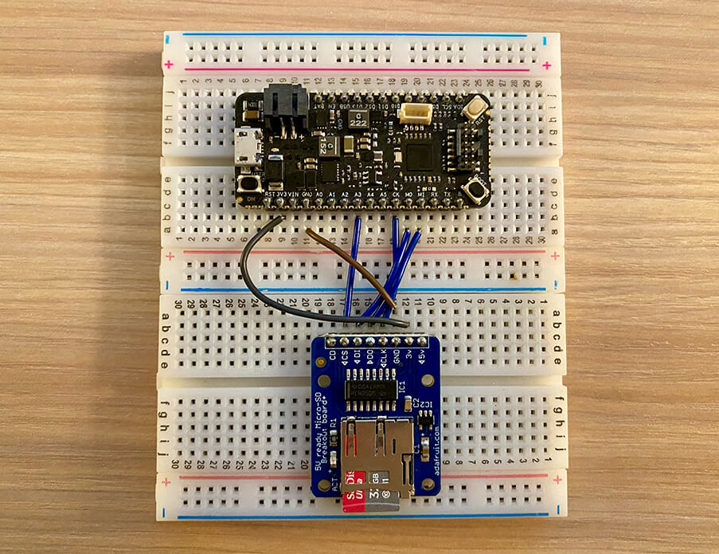
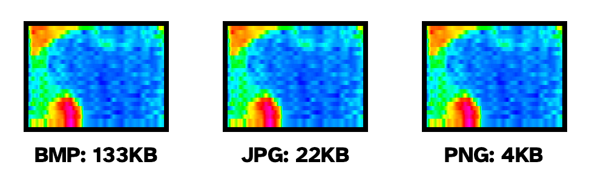

# Read and Write Images and Text Files with a Micro SD Card and Arduino

We've all been there. Well, at least *I've* certainly been there:

I want to perform what I assume to be a simple task with C (Arduino): *"I just want to read and write some data to a Micro SD card! This can't be that difficult can it!?"*

Five searches deep on Google, I realize there are far too many ways to skin this particular cat. Different components, different libraries, and even different libraries for the same components.

Time to take a deep breath and channel my internal Bob Ross...


This article is meant cut out the extraneous info and provide a guide for what I consider to be the easiest way to use a Micro SD card with Arduino to read/write text and image files.

In this mini-project, I'm using the following hardware:

1. [STM32-based Blues Swan](https://shop.blues.io/collections/swan/products/swan).
2. [Adafruit Micro SD breakout board](https://www.adafruit.com/product/254).
3. [SanDisk 32GB Micro SD card](https://www.amazon.com/SanDisk-Ultra-microSDXC-Memory-Adapter/dp/B073JWXGNT).

## Hardware Wiring

Since you're are only wiring a couple of components together this is a relatively simple step, but it's important to get the wiring correct:

| SD Breakout | Blues Swan |
| ----------- | ---------- |
| GND | GND |
| 3v | 3V3 |
| CLK | CK |
| DO | MI |
| DI | MO |
| CS | A3 |

Your wiring should end up looking like something like this:



## Prepping the Micro SD Card

You'll want to make sure the Micro SD card is formatted as either FAT16 (if <= 2GB) or FAT32. If not, simply get ahold of a USB SD card reader and use your PC to format it using the SD Association's Memory Card Formatter ([macOS/Win](https://www.sdcard.org/downloads/formatter/) and [Linux](https://www.sdcard.org/downloads/sd-memory-card-formatter-for-linux/)).

Slide that Micro SD card back in the breakout board and we are ready to write some code.

## Arduino Micro SD Breakout Library

One of the reasons I chose [Adafruit's Micro SD breakout board](https://www.adafruit.com/product/254) (aside from the generally high quality of their hardware) is because they offer well-supported and well-documented libraries. This one is no exception.

> Consult [this GitHub repository](https://github.com/arduino-libraries/SD) for the latest version of the Arduino SD Library.

Let's look at how we might perform some typical file-based tasks with an SD card, in particular:

1. [Writing](#writing-a-text-file) and [reading](#reading-from-a-text-file) text files.
2. [Writing]() and [reading]() images (PNGs).

## Writing a Text File

Using a Micro SD card as a data logger is very common in our industry. They are inexpensive and a relatively stable medium.

> You didn't ask, but if you want my opinion, your data should only be saved to SD as a backup. I'll always recommend you sync data with the cloud using the [Cellular, Wi-Fi, or LoRa-based Notecard](https://shop.blues.io/collections/notecard), but I digress...

The following sketch will initialize the SD card breakout board and write a string to a text file:

```c
#include <SD.h>
 
File textFile;
Sd2Card card;
SdVolume volume;
const int chipSelect = A3;
 
void setup()
{
  Serial.begin(9600);
  
  Serial.println("Starting SD card init...");

  if (!card.init(SPI_HALF_SPEED, chipSelect))
  {
    Serial.println("SD card initialization failed!");
    while (1)
      ;
  }

  // try to open the 'volume'/'partition' - it should be FAT16 or FAT32
  if (!volume.init(card))
  {
    Serial.println("Could not find FAT16/FAT32 partition.");
    while (1)
      ;
  }
  
  SD.begin(chipSelect);
  
  Serial.println("SD initialization complete!");
 
  // open a new file for writing
  textFile = SD.open("hello.txt", FILE_WRITE);
 
  if (textFile) {
    textFile.println("Hello World!");
    textFile.close();
    Serial.println("Completed writing a text file!");
  }
}
 
void loop()
{
}
```

Note that there are a few things to be aware of when working with files:

1. You'll want to keep filenames short and use the 8.3 format (e.g. `MYFILE.TXT`).
2. Filenames are NOT case sensitive, so in code, `myfile.txt` == `MYFILE.TXT`.
3. Always `close()` your files when done to make sure any pending writes are properly saved.

## Reading from a Text File

Now that you've written a simple text file to a Micro SD card, let's see how easy it can be to **read data from an existing file** (specifically the `hello.txt` file we just created).

Add the following code snippet **after the file is created**:

```c
// open the existing file for reading
textFile = SD.open("hello.txt");
if (textFile)
{
  Serial.println("here's the data in hello.txt:");

  // read until there's nothing else in it:
  while (textFile.available())
  {
    Serial.write(textFile.read());
  }
  // close the file:
  textFile.close();
}
```

If you're using the serial monitor to see the output, you may be surprised to see "Hello World!" repeated many times. What's up with that?

```
Starting SD card init...
SD initialization complete!
Completed writing a text file!
here's the data in hello.txt:
Hello World!
Hello World!
Hello World!
Hello World!
Hello World!
Hello World!
```

This is because writing to an existing file *appends data* by default and doesn't overwrite existing data. In my case, I had clearly tested the write sequence a handful of times **before** I read the data out.

To fix this, you can always `remove()` the file first:

```c
SD.remove("hello.txt");
```

### Other Useful Functions When Working with Files on SD

Before writing to a file, you might want to see if it already exists by using the `SD.exists("thefile.txt")` function.

Create directories and subdirectories with the `SD.mkdir("/newdir")` function.

Use the aforementioned `SD.remove("thefile.txt")` function to delete files.

Be sure to consult [Adafruit's full tutorial](https://learn.adafruit.com/adafruit-micro-sd-breakout-board-card-tutorial) for additional information on using this breakout board with a Micro SD card.

## Working with Images

Let's switch gears and ramp up the complexity a little bit by writing and reading images to/from the Micro SD card.

As with every complex Arduino task, we first need to ask: **"Is there library for this?"**. The answer is almost always "yes", and this time is no exception.

When working with image files on host microcontrollers with a relatively small amount of memory and processing power, we usually want to try to work with small files. Bitmap (.bmp) is a good format for lossless, but simple, images. Modern hosts are more often dealing with higher fidelity images that can't reasonably be sent uncompressed over the wire. This is where the usage of a format like JPEG or PNG come in handy.

Choosing the **optimal type of compression to use will depend on the image itself** (e.g. photos usually compress best with JPEG while drawings/line art are best compressed with PNG or WEBP).

*Example of thermal camera images saved as BMP, PNG, and JPG:*



And yes there are libraries for these options as well! [JPGenc](https://github.com/bitbank2/JPEGenc) and [JPGdec](https://github.com/bitbank2/JPEGdec) for encoding/decoding JPG images, and [PNGenc](https://github.com/bitbank2/PNGenc) and [PNGdec](https://github.com/bitbank2/PNGdec) for encoding/decoding PNGs.

> Looking for a functional example of image compression in action? [Check out this project on Hackster](https://www.hackster.io/rob-lauer/id-chicken-eggs-with-thermal-images-ml-and-cellular-iot-748c88) that uses a thermal camera to capture images, show them on a TFT display, and save them to a Micro SD card.

## Writing an Image to a Micro SD Card

While this is a bit of a contrived example, let's strip down a code example to its bare minimum and look at how you might draw a basic image and save it to the SD card.

The following sketch creates a 128x128 image with a green border and green "x" going through it, like so, using the `PNGenc` library:


```c
#include <PNGenc.h>
#include <SD.h>

PNG png;
File myPNG;
Sd2Card card;
SdVolume volume;
const int chipSelect = A3;

void *myOpen(const char *filename)
{
    Serial.printf("Attempting to open %s\n", filename);
    myPNG = SD.open(filename, O_READ | O_WRITE | O_CREAT);
    return &myPNG;
}
void myClose(PNGFILE *handle)
{
    File *f = (File *)handle->fHandle;
    f->close();
}
int32_t myRead(PNGFILE *handle, uint8_t *buffer, int32_t length)
{
    File *f = (File *)handle->fHandle;
    return f->read(buffer, length);
}
int32_t myWrite(PNGFILE *handle, uint8_t *buffer, int32_t length)
{
    File *f = (File *)handle->fHandle;
    return f->write(buffer, length);
}
int32_t mySeek(PNGFILE *handle, int32_t position)
{
    File *f = (File *)handle->fHandle;
    return f->seek(position);
}

#define WIDTH 128
#define HEIGHT 128

uint8_t ucPal[768] = {0, 0, 0, 0, 255, 0}; // black, green
uint8_t ucAlphaPal[256] = {0, 255};        // first color (black) is fully transparent

void setup()
{
    int rc, iDataSize, x, y;
    uint8_t ucLine[WIDTH];
    long l;

    Serial.begin(115200);

    Serial.println("Starting SD card init...");

    if (!card.init(SPI_HALF_SPEED, chipSelect))
    {
        Serial.println("SD card initialization failed!");
        while (1)
            ;
    }

    // try to open the 'volume'/'partition' - it should be FAT16 or FAT32
    if (!volume.init(card))
    {
        Serial.println("Could not find FAT16/FAT32 partition.");
        while (1)
            ;
    }

    SD.begin(chipSelect);

    Serial.println("SD initialization complete!");

    l = micros();

    rc = png.open("/testimg.png", myOpen, myClose, myRead, myWrite, mySeek);

    if (rc == PNG_SUCCESS)
    {
        rc = png.encodeBegin(WIDTH, HEIGHT, PNG_PIXEL_INDEXED, 8, ucPal, 3);
        png.setAlphaPalette(ucAlphaPal);
        if (rc == PNG_SUCCESS)
        {
            for (int y = 0; y < HEIGHT && rc == PNG_SUCCESS; y++)
            {
                // prepare a line of image to create a red box with an x on a transparent background
                if (y == 0 || y == HEIGHT - 1)
                {
                    memset(ucLine, 1, WIDTH); // top+bottom green lines
                }
                else
                {
                    memset(ucLine, 0, WIDTH);
                    ucLine[0] = ucLine[WIDTH - 1] = 1;     // left/right border
                    ucLine[y] = ucLine[WIDTH - 1 - y] = 1; // X in the middle
                }
                rc = png.addLine(ucLine);
            } // for y
            iDataSize = png.close();
            l = micros() - l;
            Serial.printf("%d bytes of data written to file in %d us\n", iDataSize, (int)l);
        }
    }
}

void loop()
{
}
```

*This is a lightly-edited version of the [example sketch from the PNGenc](https://github.com/bitbank2/PNGenc/blob/master/examples/PNGenc_Test/PNGenc_Test.ino) repository.*

> The devil is always in the details when dealing with images, as every project has differing requirements. You likely either have images pre-loaded on an SD card or you are capturing new images with a camera. If using a camera, you'll need a host MCU with enough memory to encode/compress/save the image AND you'll have to find a library specific to the camera you are using.

## Reading an Image from an SD Card

Now that we can write a simple PNG image, let's see how we might **read PNGs** using the `PNGdec` library.

> YMMV, but at the time of this writing, both `PNGenc` and `PNGdec` cannot be used at the same time in the same project.

The following sketch will **read all PNG files from the root directory** of an SD card and load them, one at a time, into memory. Again, this is not very functional because it doesn't actually "do" anything with the images, but it's a good first step:

```c
#include <PNGdec.h>
#include <SD.h>

PNG png;
File myPNG;
Sd2Card card;
SdVolume volume;
const int chipSelect = A3;

void setup()
{

    Serial.begin(115200);

    Serial.println("Starting SD card init...");

    if (!card.init(SPI_HALF_SPEED, chipSelect))
    {
        Serial.println("SD card initialization failed!");
        while (1)
            ;
    }

    // try to open the 'volume'/'partition' - it should be FAT16 or FAT32
    if (!volume.init(card))
    {
        Serial.println("Could not find FAT16/FAT32 partition.");
        while (1)
            ;
    }

    SD.begin(chipSelect);

    Serial.println("SD initialization complete!");
}

void *myOpen(const char *filename, int32_t *size)
{
    Serial.printf("Attempting to open %s\n", filename);
    myPNG = SD.open(filename);
    *size = myPNG.size();
    return &myPNG;
}
void myClose(void *handle)
{
    if (myPNG)
        myPNG.close();
}
int32_t myRead(PNGFILE *handle, uint8_t *buffer, int32_t length)
{
    if (!myPNG)
        return 0;
    return myPNG.read(buffer, length);
}
int32_t mySeek(PNGFILE *handle, int32_t position)
{
    if (!myPNG)
        return 0;
    return myPNG.seek(position);
}

// Function to draw pixels to the display
void PNGDraw(PNGDRAW *pDraw)
{
    uint16_t usPixels[320];

    png.getLineAsRGB565(pDraw, usPixels, PNG_RGB565_LITTLE_ENDIAN, 0xffffffff);
}

// Main loop, scan for all .PNG files on the card and display them
void loop()
{
    int rc, filecount = 0;
    File dir = SD.open("/");
    while (true)
    {
        File entry = dir.openNextFile();
        if (!entry)
            break;
        if (entry.isDirectory() == false)
        {
            const char *name = entry.name();
            const int len = strlen(name);
            if (len > 3 && strcmp(name + len - 3, "PNG") == 0)
            {
                Serial.print("File: ");
                Serial.println(name);
                rc = png.open((const char *)name, myOpen, myClose, myRead, mySeek, PNGDraw);
                if (rc == PNG_SUCCESS)
                {
                    Serial.printf("image specs: (%d x %d), %d bpp, pixel type: %d\n", png.getWidth(), png.getHeight(), png.getBpp(), png.getPixelType());
                    rc = png.decode(NULL, 0);
                    // do something...anything..with the PNG file!
                    png.close();
                }
            }
        }
        entry.close();
    }
}
```

And what does the output look like in the serial monitor?

```
File: TESTIMG.PNG
Attempting to open TESTIMG.PNG
image specs: (128 x 128), 8 bpp, pixel type: 3
```

Success! 🥳

## Summary

Hopefully you've seen how easy your first steps can be when using a Micro SD card to read and write images and text files with Arduino/C.

As mentioned above, every project scenario is different (whether you're just reading images pre-loaded to the SD card, [creating PNGs from a thermal camera module](https://www.hackster.io/rob-lauer/id-chicken-eggs-with-thermal-images-ml-and-cellular-iot-748c88), or most likely taking a picture with an attached camera module and storing them as JPEGs).

Including a Micro SD card as a data logger is a simple and effective way to store data (which **of course** you'll later end up syncing to the cloud via [Cellular, Wi-Fi, or LoRa using the Notecard](https://shop.blues.io/collections/notecard)!).

Happy Hacking! 💙