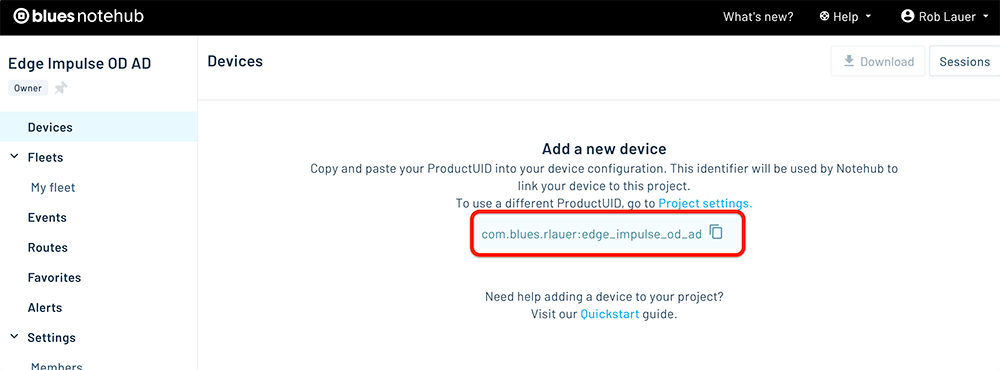

# Multi-Model Edge AI on Raspberry Pi w/ Edge Impulse & Blues

While I certainly don't consider myself a data scientist, over the years I have experimented on a [variety](https://www.hackster.io/rob-lauer/easy-anomaly-detection-alerts-with-edge-impulse-and-blues-f0a416) of [simple](https://www.hackster.io/rob-lauer/id-chicken-eggs-with-thermal-images-ml-and-cellular-iot-748c88) but [powerful](https://www.hackster.io/rob-lauer/thermal-image-anomaly-detection-with-tinyml-36831c) Edge AI [projects](https://www.hackster.io/rob-lauer/busted-create-an-ml-powered-speed-trap-b1e5d1). Why? Likely because the relatively constrained hardware I usually work with lends itself to building simpler, less ambitious products. But with Edge AI we can perform herculean tasks, previously considered impossible on tiny hardware.

An early pioneer of Machine Learning on embedded devices (a.k.a. TinyML or Edge AI), [Edge Impulse](https://edgeimpulse.com/) has grown into a developer favorite when it comes to building, testing, and deploying Machine Learning models that **run on everything from little ESP32s to the latest Jetson Orin Nano Super**.

In this project, I'm taking the next step in my Edge AI journey by showing off **how to build a "multi-model" project**. Since one single ML model can't always perform every calculation or generate every inference we need, we may need to effectively _chain multiple models together_ to fulfill the purpose of our product.

Specifically, we're going to look at how to:

1. Build an **Object Detection model** using Edge Impulse.
1. _Also_ build an **Anomaly Detection model** using Edge Impulse.
1. Write a Python app and **deploy the app + models** to a Raspberry Pi 5.
1. Generate **real-time SMS and email alerts when anomalies are detected**, using Blues Notecard Cellular.

Today, our pretend company manufactures bricks. Specifically, tiny little bricks designed with the Blues logo (nice!). As these new bricks are coming down the conveyor belt, we want to analyze them for issues. We also want instant notifications when "bad bricks" are spotted.

Therefore, we'll see when the app is running, our objects (bricks) will be detected by the Object Detection model, then scanned for anomalies by the Anomaly Detection model. If a specified count of anomalies is met, an alert will be generated and **sent over cellular** to the cloud for both SMS and email notifications (complete with an image of the anomaly!).

> Want to see the project in action? Join us at this webinar on February 27th: [Smart Vision, Smarter Industry: Anomaly Detection with Edge Impulse and Blues](https://blues.com/webinar-smart-vision-smarter-industry/?utm_source=hackster&utm_medium=web&utm_campaign=blues-webinar&utm_content=smart-vision-smarter-industry)


First, let's take a quick look at the two key platforms we will be using today: [Edge Impulse](https://edgeimpulse.com/) and [Blues](https://blues.com/).

## Intro to Edge Impulse


If you're not yet familiar with [Edge Impulse](https://edgeimpulse.com/), they provide a robust platform for building, testing, deploying, and optimizing Edge AI models on constrained devices.

We'll be using [Edge Impulse Studio](https://studio.edgeimpulse.com/) to build both the Object Detection and Anomaly Detection ML models deployed to a Raspberry Pi 5.

## Intro to Blues

[Blues Notecard](https://blues.com/products/notecard/) and its paired cloud service, [Notehub](https://blues.com/notehub/), allow for adding wireless connectivity to virtually any host microcontroller or single board computer (like the Raspberry Pi).

Providing [Cellular](https://blues.com/notecard-cellular/), [LoRa](https://blues.com/notecard-lora/), [Wi-Fi](https://blues.com/notecard-wifi/), and [Satellite](https://blues.com/starnote/) options, Notecard is an easy to use low-power option for IoT projects of all sizes.


Notecard is programmed with a [JSON-based API](https://dev.blues.io/api-reference/notecard-api/introduction/) that works the same across all radio types, along with [SDKs for popular languages](https://dev.blues.io/tools-and-sdks/firmware-libraries/libraries-overview/) like C, Arduino, and Python.

As we will see today, the Blues cloud service Notehub pairs with Notecard to provide secure bi-directional communications. You can send/receive events (or [Notes](https://dev.blues.io/api-reference/glossary/#note) in Blues speak) and _route_ those outbound Notes to any cloud service (which today will be AWS).

Ok, let's get to building!

## Building the Object Detection Model

Our first step is to acquire enough images to build an ML model that can accurately identify bricks on a conveyor belt.


We can start with [this Python script](https://github.com/rdlauer/multi-model-ml/blob/main/image-acquisition.py) that uses the Pi Camera module to take pictures of a moving conveyor belt every 1.5 seconds.

> **NOTE:** The full Python source for this project is [available here on GitHub](https://github.com/rdlauer/multi-model-ml) and the Object Detection Edge Impulse project is [available here](https://studio.edgeimpulse.com/studio/623388).

Allow the Python script to run and save enough images of bricks in different positions on the conveyor belt (I started with about 100). With the images saved to the Pi, it's time to **create a new project** in [Edge Impulse Studio](https://studio.edgeimpulse.com/).

Head to the **Data acquisition** tab and upload all of the images you just saved. Note that it will automatically separate your images into training and testing sets. (We'll come back to the testing aspect a little later.)


Next, each image needs to have every brick labelled as such. This is a bit tedious, but the tooling inside Edge Impulse Studio does make this a relatively painful process!


Next step is to create your "impulse" (which Edge Impulse uses to describe the full ML pipeline). Head to the **Impulse design** tab and follow the default options provided (Edge Impulse is _awfully_ smart when helping you pick the right options based on the data you've already supplied!).


You'll then head to the **Image** tab to **Generate Features** from your labelled images. In our case, we only created one feature: "brick".


Next, visit the **Object detection** tab to train your model. All training happens in the cloud, so no local tooling or fancy GPUs are required!


Once your model is trained, head to the **Model testing** tab. Remember the images that were allocated to the testing set? Well, since those are labelled but NOT used to train the model, they are perfect candidates for a quick test of the model.


You should find that 80-90% of your objects (bricks) are detected successfully!


You can now download the model file on your Raspberry Pi. Consult the Edge Impulse docs for instructions on how to [set up the Edge Impulse CLI on your Pi](https://docs.edgeimpulse.com/docs/edge-ai-hardware/cpu/raspberry-pi-5).

To login to Edge Impulse and download the model file just created, you'll use a command like this on your Pi:

```
edge-impulse-linux-runner --download odmodel.eim
```

## Building the Anomaly Detection Model

At this point we have a functioning Object Detection model that will identify bricks on the conveyor belt. Great, but now we need to **closely inspect each brick for anomalies**.

Same as with the last model, our first step is to acquire images of bricks. Unfortunately we can't use the same images from the previous step, as we need these new images to be specific to bricks themselves without any other surrounding context.


Luckily for you (and me) Louis Moreau at Edge Impulse built out a [Flask-based python app](https://github.com/edgeimpulse/example-multi-impulse-python) that lets us use the Object Detection model we just created to save individual images of bricks.

> **NOTE:** [This Python script](https://github.com/rdlauer/multi-model-ml/blob/main/app.py) was forked from the aforementioned project. This version contains some slight tweaks, but all credit goes to Louis! Also, you can find my version of this ML project [here in Edge Impulse Studio](https://studio.edgeimpulse.com/studio/623776/).

When you pass the `--save-images-interval` flag to this Python script, it'll simply save detected object images at the cadence you specify (in seconds):

```
python app.py --save-images-interval 2
```

Open a browser on your Pi and navigate to `http://localhost:5001/`. You should see your camera feed.


Letting some bricks run on the conveyor belt with this Python app running will generate a lot of useful brick images in a short amount of time.

Back in Edge Impulse Studio, **create a new project** for the Anomaly Detection model.

Head to the **Image acquisition** tab and upload all of the images you just saved. This time instead of individually labelling images, you can specify one label (e.g. "no anomaly") to all images when uploading.

Head to the **Impulse** tab and set up your impulse:


After that, it's the same steps as before to complete the model:

1. Head to the **Image** tab to **Generate Features**.
1. Go to the **Visual Anomaly Detection** tab to train your model.
1. Test your model under the **Model testing** tab.


You can click on an individual test sample to see if/why Edge Impulse detected any anomalies in your test images. In the following case, I realized that one small part of the conveyor belt was reflecting a lot of light, leading the model to think that was an anomaly of the brick!


Download the model file using the same command as above, but this time with the `--clean` argument to let you switch to the new project:

```
edge-impulse-linux-runner --clean --download admodel.eim
```

With that, we are done with Edge Impulse. Time to learn more about secure wireless connectivity with Blues!

## Setting up Blues Notecard and Notehub

The beauty of [Blues Notecard](https://shop.blues.com/collections/notecard) and Notehub for this project is the ability to use either Cellular, LoRa, Wi-Fi, or Satellite connectivity while using the same, simple JSON-based API.

Now while many Pi-based projects can use the onboard Wi-Fi, often deployments are either outside the range of Wi-Fi or local IT doesn't want to provision Wi-Fi access to unsecured/unknown devices.

When you choose Notecard and Notehub, you've got a turnkey, fully secured cloud pipeline at your disposal!

### Notecard Hardware Setup

In this project, we'll be using the soon-to-be-released "midband" Notecard Cellular. This Notecard variant uses **LTE Cat-1 bis**, which is a an LTE protocol used to support IoT applications. It provides the same throughput and latency as Cat-1, is supported wherever LTE is supported, but is less expensive and only requires a single antenna design to function.


Notecard slots into a carrier board called a [Notecarrier](https://blues.com/products/notecarrier/). The one in use today is specific to Raspberry Pi-compatible single board computers, called [Notecarrier Pi Hat](https://shop.blues.com/products/carr-pi). This hat then plugs into the Raspberry Pi via the provided header.


### Notecard Software Setup

The API for Notecard is all JSON-based. That means everything you send to (and receive from) a Notecard is JSON. For example, to get a Notecard's GPS location, you would use the [card.location API](https://dev.blues.io/api-reference/notecard-api/card-requests/latest/#card-location):

```
{ "req": "card.location" }
```

...and it sends back the requested data in JSON format:

```
{
  "status": "GPS updated (58 sec, 41dB SNR, 9 sats) {gps-active}
            {gps-signal} {gps-sats} {gps}",
  "mode":   "periodic",
  "lat":    42.577600,
  "lon":    -70.871340,
  "time":   1598554399,
  "max":    25
}
```

However, when using a language like Python, you're better off using the [note-python library](https://dev.blues.io/tools-and-sdks/firmware-libraries/python-library/) to interface with Notecard.

```
pip install note-python
```

In the [provided Python script](https://github.com/rdlauer/multi-model-ml/blob/main/app.py), you'll see that a couple of commands are sent to configure Notecard to communicate with the cloud. Let's take a quick look at those:

First, we use the [hub.set API](https://dev.blues.io/api-reference/notecard-api/hub-requests/latest/#hub-set) to tell Notecard which cloud project to use in Notehub (yes, we'll create a free Notehub project in just a bit):

```
# hub.set API
req = {"req": "hub.set"}
req["product"] = NOTEHUB_PRODUCT_UID # we'll get this value in the next section!
req["mode"] = "continuous"
nCard.Transaction(req)
```

Second, optionally create a [template](https://dev.blues.io/notecard/notecard-walkthrough/low-bandwidth-design/#working-with-note-templates), effectively a "hint" for the Notecard to more efficiently store and send data to Notehub with the [note.template API](https://dev.blues.io/api-reference/notecard-api/note-requests/latest/#note-template):

```
req = {"req": "note.template"}
req["file"] = "anomaly.qo"
req["body"] = {
    "anomalies": 12,
    "image_data": "x"
}
nCard.Transaction(req)
```

**Confused by the syntax?** Those values next to `"anomalies"` and `"image_data"` just act as hints to tell Notecard that **anomaly counts will be 2 byte signed integers** and image data will be **strings** (base64-encoded strings of images).

Further down we'll get to the last Notecard command, and that's the [note.add API](https://dev.blues.io/api-reference/notecard-api/note-requests/latest/#note-add). This will create a Note (or an event) every time an anomalous image is detected and send the count of anomalies (along with the aforementioned base64-encoded string of the binary image data) to the cloud:

```
req = {"req": "note.add"}
req["file"] = "anomaly.qo"
req["body"] = {"anomalies": anomalies, "image_data": base64_str }
req["sync"] = True
nCard.Transaction(req)
```

> **NOTE:** Again, be sure to [consult the full source of this project](https://github.com/rdlauer/multi-model-ml/blob/main/app.py) to better understand these commands in context.

### Notehub Cloud Setup

Head to [notehub.io](https://notehub.io/) to create your free Blues Notehub account.

Create your first project and copy your globally unique product identifier:



This string represents the value of `NOTEHUB_PRODUCT_UID` used in the Python script.

And that's all you need to connect your product to the cloud when you use Notecard and Notehub!

## Running the Python App

Time to get down to business. If you run the Python script at this point, it will do the following:

1. Scan the video feed for objects (bricks).
1. If a brick is found, it'll then use the second ML model to scan for anomalies.
1. If enough anomalies are found within a single image, it'll send an event (a Note) to Notehub.

In fact, you'll see this data start to appear in Notehub:


That's great, but we're still missing an integration with our cloud services, which today are an AWS Lambda function to receive the data from Notehub, and Twilio + SendGrid for SMS and email notifications.

## Creating an AWS Lambda Function

[Lambdas](https://aws.amazon.com/pm/lambda/) are ridiculously easy-to-create cloud functions that let you process inbound data from an arbitrary source (a perfect candidate for routing data from Notehub).

The full source for the Lambda function is [available here on GitHub](https://github.com/rdlauer/multi-model-ml/blob/main/lambda_function.py).


I'll point out some key sections:

### Save Image to S3

When Notehub routes an event to the Lambda, we want to save the base64-encoded string as a jpeg image to an [S3 bucket](https://aws.amazon.com/s3/) (yes, this means you'll also have to set up an S3 bucket in AWS):

```
# Decode the base64 image
image_bytes = base64.b64decode(image_data_base64)

# Generate a unique filename
unique_filename = f"{uuid.uuid4()}.jpeg"

# Upload to S3
s3_client = boto3.client("s3")
s3_client.put_object(
    Bucket=S3_BUCKET_NAME,
    Key=unique_filename,
    Body=image_bytes,
    ContentType="image/jpeg"
)
```

We'll then need to generate a secure URL to that image in S3 so we can pass it to Twilio and SendGrid for our alerts:

```
# Generate a presigned URL for the file
presigned_url = s3_client.generate_presigned_url(
    ClientMethod="get_object",
    Params={"Bucket": S3_BUCKET_NAME, "Key": unique_filename},
    ExpiresIn=3600  # 1 hour
)
```

Lastly, we'll want to use the Twilio and SendGrid SDKs to send SMS and email notifications. 

Here is the code needed for Twilio:

```
# Send SMS/MMS with Twilio
twilio_client = Client(TWILIO_ACCOUNT_SID, TWILIO_AUTH_TOKEN)
sms_message = twilio_client.messages.create(
    body=f"Alert! Number of anomalies detected: {anomalies}",
    from_=FROM_PHONE_NUMBER,
    to=TO_PHONE_NUMBER,
    media_url=[presigned_url]
)
```

> **NOTE:** I am glossing over some requirements for setting up your Twilio and SendGrid accounts. You will need some keys, ids, and tokens from both services to complete this step, so check out the [Twilio docs](https://www.twilio.com/docs/messaging/api) and the [SendGrid docs](https://www.twilio.com/docs/sendgrid/api-reference).

Finally, be sure to **deploy** your Lambda function and copy the **Function URL** from the **Configuration** tab, as you'll need that in the next step.

## Routing Data from Notehub to AWS

Our last step (I promise) is to [configure a route in Notehub](https://dev.blues.io/notehub/notehub-walkthrough/#routing-data-with-notehub) to send events to the Lambda function.

Head back to Notehub and click on the **Routes** tab.

Create a new route, using the "AWS" option:


Be sure **Lambda** is selected in the **Type** dropdown (it's the default), and paste in your function URL into the **URL** field:


Scroll down a bit and make sure your `anomaly.qo` Notefile is selected as the only Note/event that will get routed to your Lambda function (otherwise _all_ events from your Notecard will also be sent to AWS):


Be sure to **save the route** and you're all set!

## Drumroll Please...

Back to your Raspberry Pi and let's run that Python app again:

```
python app.py
```

Open a browser on the Pi and navigate to `http://localhost:5001/`. Start running some objects/bricks/whatever through your camera feed.

Try switching the position of the object, obfuscating some of it, or otherwise manufacture an "anomaly". If you watch the output in your Pi terminal, you should see detected anomalies:


After a significant anomaly detection, within seconds you will see those events show up in Notehub and the image file will appear in your S3 bucket:


And finally, you'll see both SMS and email notifications letting you know that anomalies were detected (along with a helpful image with the anomalies identified on the object itself!):


## Next Steps

I hope you got just a taste of how easy it can be to implement a multi-model Edge AI solution with Edge Impulse - and connect it to the cloud with Blues, AWS, and Twilio + SendGrid.

Get started with Blues today with your own [Notecard](https://shop.blues.com/collections/notecard) and [Notecarrier Pi Hat](https://shop.blues.com/products/carr-pi) (or check out the [Blues Starter Kit for Cell+WiFi](https://shop.blues.com/collections/development-kits/products/blues-global-starter-kit) if you want to work with an STM32-based microcontroller instead).

Happy Hacking!
