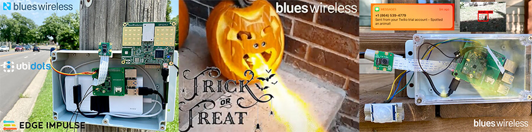
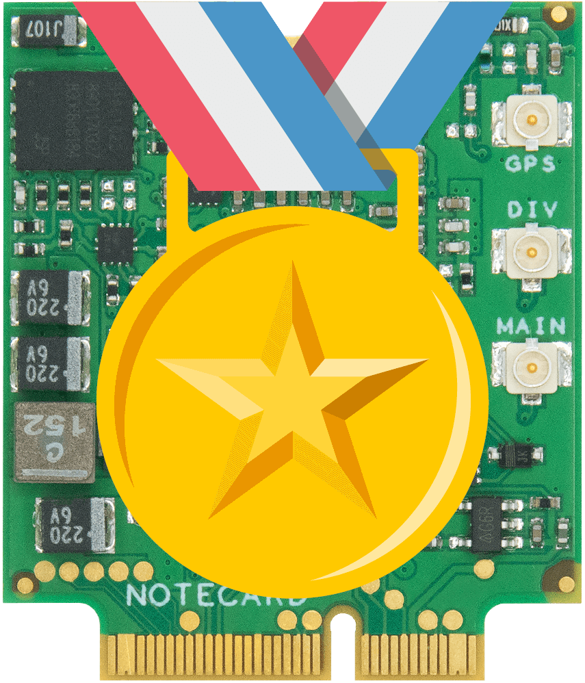

# Blues Wireless "Most Valuable Hackster"

When I'm learning about new products or technologies (especially in the maker and IoT spaces) I rely a lot on [Hackster](https://www.hackster.io/). Between the product reviews, news and blog articles, and in-depth community tutorials, I'm regularly inspired to either replicate or expand upon published projects.

Here at Blues Wireless we think, *actually we know*, a lot of you followed the same journey as an introduction to the Notecard, Notecarrier, Swan, and Notehub.io with [our Hackster tutorials](https://www.hackster.io/blues-wireless). By way of building an [ML-powered speed trap](https://www.hackster.io/rob-lauer/busted-create-an-ml-powered-speed-trap-b1e5d1), a [fire-breathing pumpkin](https://www.hackster.io/zachary_fields/boo-lues-fire-breathing-pumpkin-8639e7), or even a [backyard pest detector](https://www.hackster.io/tjvantoll/what-s-destroying-my-yard-pest-detection-with-raspberry-pi-890c3a), you may have been inspired to add easy wireless IoT connectivity to your own solution.

This is why we are happy to introduce a new community initiative here at Blues Wireless, the **Most Valuable Hackster** program (a.k.a. MVH)!

We are inviting you, our community, to build and publish your own projects to Hackster (and more importantly, **get paid to do so**).

tl;dr: Blues Wireless is offering free hardware and reimbursement ranging from \$500-\$1500 USD for the creation and publishing project tutorials on Hackster. Read on for the full details:

## The MVH Program Workflow

Here is how we envision the MVH program working, from start to finish:

1. You dream up an IoT project that uses a Notecard (check out some use cases below for inspiration).
2. Send us your contact info and project idea [using this form](http://register.blues.io/blues-wireless-most-valuable-hackster-program-signup).
3. We review and approve submissions on a rolling basis.
4. Once approved, we send you a 15% discount code for any Blues Wireless products you need (and you get the other 85% reimbursed later, see below).
5. You write up the project (we will help with editing!) and publish it on Hackster.
6. Once it's been approved and published on Hackster, we reimburse you for the other 85% of your Blues Wireless product cost AND \$500-\$1500 USD for your time (agreed upon before you start the work, based on estimated complexity of the project).

You're not limited to just one project and this program is available globally (reimbursement methods may vary depending on country).

## Hackster Project Requirements

We don't want to create too many requirements per se, as our hope is that your imagination guides you to places we can't even dream! However we do have some basic "guardrails" to make sure the project you're creating is valuable to the broader community:

- The project can be as ridiculous as you want, but at its core it should address a practical issue.
- You must feature Blues Wireless hardware (e.g. Notecard and Notecarrier).
- Utilize Notehub.io if you are routing data to a cloud application.
- Your source code (if any) must be hosted publicly on GitHub.
- Your Hackster writeup must be a full tutorial, grammatically sound, and easy for others to follow and re-build themselves.

> Need help with your writeup? English not your first language? As long as you can put together a well-structured article, we have writers that can help clean up your project as needed.

## Example Use Cases

Looking for some inspiration for your Hackster project? Take a look at the [Blues Wireless projects already published on Hackster](https://www.hackster.io/blues-wireless/projects), consider adding Machine Learning capabilities with [Edge Impulse](https://edgeimpulse.com/) to any "traditional" IoT solution, or check out these high-level ideas for building fun (and useful!) projects with wireless and the IoT:

- Storage Tank Monitoring
- Predictive Maintenance
- Remote Control
- Healthcare Monitoring	
- Safety & Compliance Monitoring
- Creating a Smart City
- Supply Chain Monitoring
- Environmental Monitoring
- Agriculture Management and Crop Tracking
- GPS/GNSS Asset Location Tracking

## Become an MVH

Interested? Want more details? Get started by [filling out this short form](http://register.blues.io/blues-wireless-most-valuable-hackster-program-signup) and we will reach out ASAP.