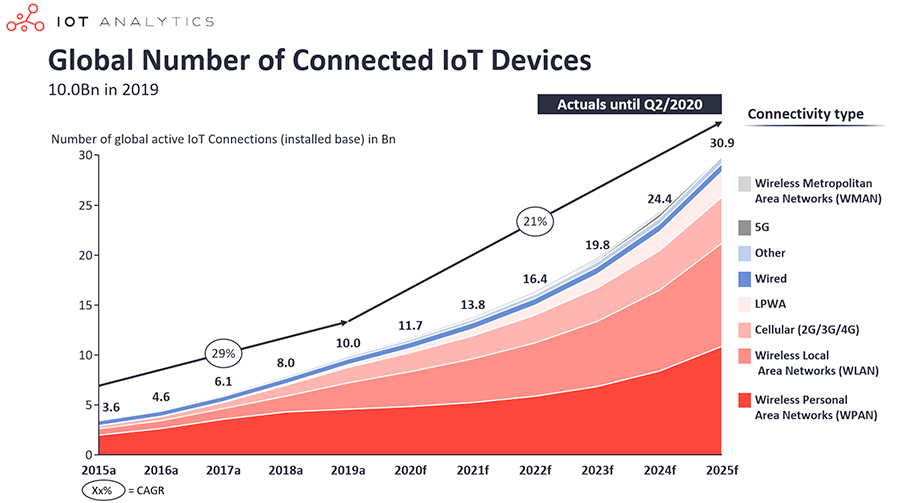
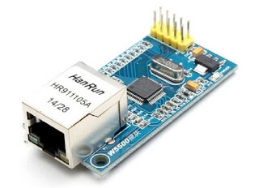
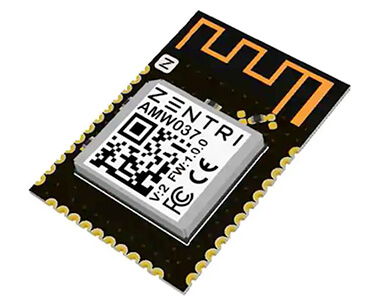

# IoT Network Connectivity - An Unapologetic Comparison of Modern Technologies

# The Right Network Connection for Your IoT Solution

# The Evolution of IoT Network Connectivity

# IoT Network Connectivity - Comparing LoRa, Cellular, WiFi, and Other Relevant Technologies

Let's face it. When it comes to connectivity, we IoT developers are spoiled by a virtual cornucopia of networking options. Granted, "spoiled" is a positive spin on the situation, as others may also classify it as "overwhelming". From modern cellular protocols like NB-IoT and CAT-M1, to established flag-bearers of WiFi and Ethernet, to LoRa and BLE, the options are as plentiful as they are confusing.

What was once an obvious choice may now be more nuanced. For example, in an office setting, WiFi is often the default choice due to its low cost and broad availability. But what happens when the power goes out? If your IoT solution is part of a critical system like HVAC, fire suppression, or intrusion detection, you may need a connectivity option separate from the building infrastructure.

Since every IoT application has its own unique requirements, let's step through each high level connectivity option, outline pros and cons, and see which option (or combination thereof) is right for us.

*Image source [IoT Analytics](https://iot-analytics.com/state-of-the-iot-2020-12-billion-iot-connections-surpassing-non-iot-for-the-first-time/).*

## Key Considerations

Since it is so easy to find ourselves embroiled in a paradox of choice, let's narrow our focus of analysis to some more specific deployment-related scenarios and see how each satisfies requirements such as:

1. Range and Physical Location
2. Power Efficiency
3. High Availability
4. Throughput and Latency
5. End User Setup Experience

## tl;dr

As we start to dive into various network connectivity options, we soon find there is no silver bullet. However, if we layer cellular on top of WiFi, for example, we can check all the boxes. You'll have to read on for this.

|   | Wide Range | No/Low Power | High Availability | Bandwidth | Low Latency | End User XP |
|---|:----------:|:------------:|:------------:|:---------:|:-------:|:-----------:|
| Ethernet |  |  | ✅ | ✅ | ✅ |  |
| WiFi     |  |  | ✅ | ✅ | ✅ |  |
| LoRa     | ✅ | ✅ |  |  |  | ✅ |
| BLE      |  | ✅ |  |  | ✅ |  |
| Cellular | ✅ | ✅ | ✅ |  |  | ✅ |

Let's get started:

## Wired Ethernet

I'm going to go out on a limb and assume you *don't* need a functional explanation of wired Ethernet. It's the most mature, established, and commonly used LAN technology in existence. And while it's not used often in IoT deployments, it's a legitimate option.

*An example W5500 Ethernet module.*

The beloved backbone of our Internet is every IoT developer's connectivity dream in terms of bandwidth, speed, and reliability. However, the story doesn't end there. As seen in the image above, adding an RJ45 ethernet module adds considerable physical bulk and power drain.

### When Does Wired Ethernet Win?

- When indoor deployments provide easy access to reliable wired Ethernet.
- When the solution requires high bandwidth or low latency (e.g. streaming video).
- When RF interference is an issue. Ethernet cable shielding can withstand most interference.

### When Does Wired Ethernet Lose?

- When there are physical space issues:
	- Ethernet add-on modules add considerable bulk to an enclosure.
	- Running cabling to a deployment location can add complexity.
- When your deployment needs to be mobile.
- When you have low power/no power requirements:
	- Typical Ethernet module power consumption is ~130 mA.
	- Local Internet gateways cannot function without power.

## WiFi

Those of us old enough to remember the first WiFi routers can likely also remember the first time we accessed the Internet in a wireless setting. WiFi has fundamentally altered how the average person connects to and interacts with the Internet, and the same applies to IoT deployments.

*An example AMW037 WiFi module from Silicon Labs.*

Today's WiFi routers have come a long way in terms of speed, reliability, and (via upcoming protocols) power consumption. Modern routers commonly support at least one of the latest wireless standards (802.11n, 802.11ac, or 802.11ax).

WiFi for IoT has a flag bearer in the 802.11ah standard with its low power consumption and devices that can cooperate to share signals (making it a potential Bluetooth killer!). However, we are still likely years away from mainstream routers including this standard.

### When Does WiFi Win?

- Like Ethernet, when the solution requires high bandwidth or low latency (e.g. streaming video).
- When there is ample WiFi coverage without the need for switching access points.

### When Does WiFi Lose?

- When deployment/installation is handled by non-technical users. WiFi configuration can be tedious and home routers unreliable.
- When in a low power/no power scenario:
	- Typical WiFi module power consumption is ~50-200 mA (depending on the protocol).
	- A WiFi router cannot function without power.

## Cellular (LTE-M and NB-IoT)

The two most popular cellular IoT technologies are LTE-M and NB-IoT. At a high level, LTE-M is the faster of the two and compatible with existing LTE infrastructure. NB-IoT has a wider range, but requires hardware upgrades on your nearest cell towers.

IMAGE

*An example Notecard cellular module from Blues Wireless.*

**LTE-M** is one of the more advanced cellular connectivity options on LTE. It offers power-saving modes ideal for battery-powered IoT deployments. The data throughput is about 375KB down and 300KB up, making it adequate for relaying most string-based data. Since it's using LTE infrastructure, it also uses the same cell tower handover features, making mobility fully supported across multiple regions.

**NB-IoT** was designed specifically for IoT implementations. It provides long range access, consumes little power, and is known for its reliability and improved indoor penetration. NB-IoT operates on 4G networks (but not on the LTE bands) making it widely available in many countries. The downside? NB-IoT data throughput is far less than LTE-M (60KB down and 30KB up).

### When Does Cellular IoT Win?

- When uptime is essential. Cellular networks are ubiquitous and reliable.
- When seamless global coverage is required.
- When data security is critical. In the case of the Notecard from Blues Wireless, data is passed over cellular and VPN tunnels, not the Internet.
- When utilizing location detection (especially when combined with on-board GPS).
- When in a low power/no power scenario:
	- Cellular add-ons can consume < 8mA of current.
	- Cellular networks are still available should local power go out.
- When the physical deployment location is unpredictable.
- When a turnkey end user setup experience is required.

### When Does Cellular IoT Lose?

- When the solution requires high bandwidth or low latency (e.g. streaming video).
- When trying to support VoLTE for audio/speech transmission.

## LoRa

LoRa stands for "Long Range Radio" and is an open standard networking layer gaining popularity mostly in the EU. Supported by the LoRa Alliance, LoRa aims to solve the traditional IoT dilemma of balancing low power with long range communication requirements.

In ideal conditions, LoRa devices can communicate with LoRa gateways 5km to 15km away. In practice, physical obstacles (trees, buildings, etc) can severely disrupt data transmission. LoRa also requires an adequate network of physical gateways to be effective. Some cities, such as Amsterdam, are investing in LoRa, making it an intriguing option in some urban settings.

> **NOTE:** While other similar LPWAN technologies like SigFox, Ingenu, and Weightless aren't covered in this article, they are worth investigating on their own.

### When Does LoRa Win?

- When security is a necessity (uses AES CCM encryption by default).
- When it's available (e.g. deployments in the EU).
- When, like cellular, you're trying to hit the sweet spot of low power and wide range deployments.
- When low power is critical (data rates can be modulated for ideal battery conservation).

### When Does LoRa Lose?

- When even medium bandwidth is required (data is sent in very small chunks of 51-241 bytes).
- When on a busy LoRa gateway, bandwidth can be severely limited.

## Bluetooth Low Energy

Bluetooth Low Energy (BLE) is a wireless local networking technology allowing for device-to-device communication without a gateway. BLE is not compatible with traditional Bluetooth, but does offer a similar range of communication (~100m at best) while using far less power.

IMAGE

BLE is not a protocol one would use to connect a device directly to the cloud or a remote server. However, it's a reasonable option in scenarios when device-to-device communication is a requirement.

### When Does BLE Win?

- When low power is critical (BLE can use deep sleep modes between transactions).
- When communicating between devices at close range (ideally less than 100m), and in low latency scenarios (~3ms).

### When Does BLE Lose?

- When reliability is a must. BLE has historically been relatively unreliable and difficult to configure.
- When long distance communication is required.
- When security is critical (signals are comparatively open to interception and attack).

## What About a Combination?

Nobody ever said the above options had to work independently!

Imagine a scenario where WiFi is available and reliable, but if the power goes out, you need to maintain a connection on battery. Or your deployment scenarios include a mix of areas that support both LoRa and cellular, but neither is a guarantee.

It's always a reasonable option to use a reliable backup or cooperative network connectivity option.

## Summary

Choosing between network connectivity options for your next IoT project depends largely on the requirements of your devices and what the end goal is. Ultimately, your decision comes down to the inevitable tradeoffs between power, bandwidth, and coverage.

That being said, it's this author's opinion that adding a cellular IoT layer as either the primary or a backup option is finally a legitimate option. LTE-M and NB-IoT protocols have collectively allowed IoT solutions to become a first class citizen on cellular. Designed for reliable, secure, and low power operation, these standards offer an intriguing choice for modern IoT connectivity.

Learn more about how Blues Wireless is making cellular IoT a better choice for developers.