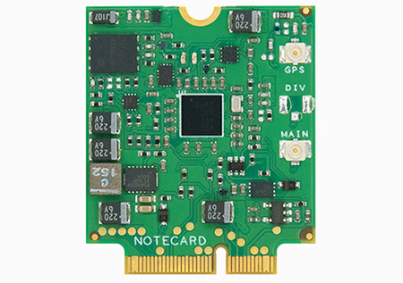
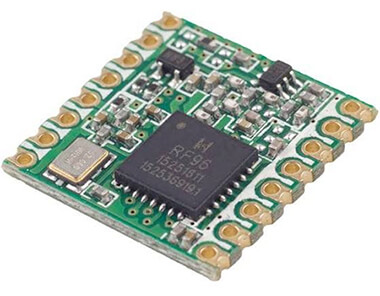
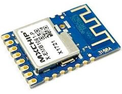
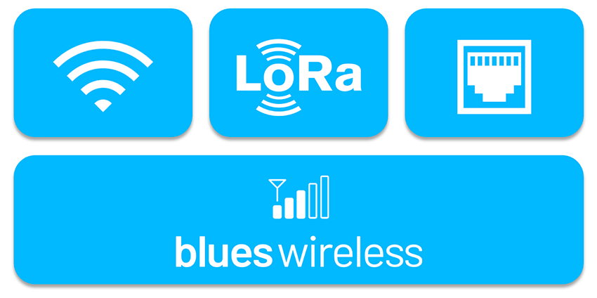

# IoT Network Connectivity - A Comparison of Modern Technologies

# Comparing LoRa, Cellular, Wi-Fi, and Other Relevant IoT Connectivity Options

Let's face it. When it comes to connectivity, we IoT developers are spoiled by a virtual cornucopia of networking options. Granted, "spoiled" is a positive spin on the situation, as others may also classify it as "overwhelming". From modern cellular protocols like NB-IoT and LTE-M, to other LPWAN options like LoRa, to Wi-Fi and Ethernet and the venerable BLE, options are as plentiful as they are confusing.

What was once an obvious choice may now be more nuanced. For example, in an office setting, Wi-Fi is often the default choice due to its low cost and broad availability. But what happens when power is lost? If your IoT solution is key to a critical system like HVAC, fire suppression, or security, you may need a connectivity option separate from the building's infrastructure.

Since every IoT application has its own unique requirements, let's step through each connectivity option at a high level, outline pros and cons, and see which option (or combination thereof) is right for you.

*Image source [IoT Analytics](https://iot-analytics.com/state-of-the-iot-2020-12-billion-iot-connections-surpassing-non-iot-for-the-first-time/).*

## Key Considerations

With this breadth of options we can quickly find ourselves paralyzed by a paradox of choice. Let's narrow our focus of analysis to specific deployment-related considerations and see how each connectivity option satisfies common requirements such as:

**Communication Range**

*How close to a provider's gateway does my device have to be? Are there indoor vs outdoor (or line-of-sight) considerations I need to be aware of?*

**Power Efficiency**

*Is my hardware connected to a consistent and reliable power source? Or is it off-grid and connected to solar or battery? What happens if power is cut completely...can I maintain connectivity in a no-power scenario?*

**High Availability**

*Am I using a mature connectivity option with broad, global support? Is my local Internet gateway reliable enough for my solution? How does my system recover from network instability?*

**Data Throughput and Latency**

*How much data am I pushing/pulling, and how frequently? Does my solution require low latency between the device, the cloud, and beyond?*

**End User Experience**

*How is my solution deployed in the field? Is it a consumer-installable product that requires non-technical setup? What connectivity option provides the most "turnkey" style of installation?*

## tl;dr

As we start to dive into various network connectivity options, we'll soon see there is no silver bullet. However, if you want an overgeneralization of the network options we are about to cover, this table might help:

|   | Range | No/Low Power | Availability | Bandwidth | Low Latency | End User XP |
|---|:-----:|:------------:|:------------:|:---------:|:-----------:|:-----------:|
| Ethernet     | 🔴 | 🔴 | 🟢 | 🟢 | 🟢 | 🔴 |
| Wi-Fi        | 🟡 | 🔴 | 🟢 | 🟢 | 🟢 | 🟡 |
| Cellular IoT | 🟢 | 🟢 | 🟢 | 🟡 | 🔴 | 🟢 |
| LoRa         | 🟢 | 🟢 | 🔴 | 🔴 | 🔴 | 🟢 |
| BLE          | 🔴 | 🟢 | 🟡 | 🔴 | 🟢 | 🔴 |

It's worth reading on though, because the story doesn't end here. There are nuanced differences to be aware of, and a *combination* of connectivity options may actually be the right choice for your project.

## Wired Ethernet

I'm going to go out on a limb and assume you *don't* need a functional explanation of wired [Ethernet](https://en.wikipedia.org/wiki/Ethernet). It's the most mature, established, and commonly used LAN technology in existence. And while it's not terribly common in IoT deployments, it's a legitimate option.

*An example W5500 Ethernet module.*

The beloved backbone of our Internet is every IoT developer's connectivity dream in terms of bandwidth, speed, and reliability. However, as seen in the image above, adding an RJ45 connector on an Ethernet module adds considerable physical bulk (and power consumption).

### When Does Wired Ethernet Win?

- When indoor deployments provide easy access to reliable wired Ethernet.
- When the solution requires high bandwidth or low latency (e.g. streaming video).
- When RF interference is an issue, as Ethernet cable shielding can withstand most interference.

### When Does Wired Ethernet Lose?

- When there are physical environment issues:
	- Ethernet add-on modules add considerable bulk to an enclosure.
	- Running cabling to a deployment location can add complexity.
- When your deployment needs to be mobile.
- When you have low power/no power requirements:
	- Typical Ethernet module power consumption is ~130 mA.
	- Local routers and switches cannot function without power.

## Wi-Fi

Those of us old enough to remember the first [Wi-Fi](https://en.wikipedia.org/wiki/Wi-Fi) routers can likely also remember the first time we accessed the Internet in a wireless setting. Wi-Fi has fundamentally altered how the average person connects to and interacts with the Internet, and the same applies to IoT deployments.

*An example AMW037 Wi-Fi module from Silicon Labs.*

Today's Wi-Fi routers have come a long way in terms of speed, reliability, and (via new protocols) power consumption. Modern routers commonly support at least one of the latest wireless standards (802.11n, 802.11ac, or 802.11ax).

Wi-Fi for IoT has a flag-bearer in the [802.11ah](https://en.wikipedia.org/wiki/IEEE_802.11ah) standard with its low power consumption and ability for connected devices to share signals (making it a potential Bluetooth killer). However, we are still likely years away from mainstream routers supporting this standard.

### When Does Wi-Fi Win?

- Like Ethernet, when the solution requires high bandwidth or low latency (e.g. streaming video).
- When there is ample Wi-Fi coverage without the need for switching access points.

### When Does Wi-Fi Lose?

- When deployment is handled by non-technical users. Wi-Fi configuration can be tedious and home routers unreliable.
- When in a low power/no power scenario:
	- Typical Wi-Fi module power consumption is ~50-200 mA (depending on the standard).
	- A Wi-Fi router cannot function without power.

## Cellular (LTE-M and NB-IoT)

The two most popular cellular IoT technologies are [LTE-M](https://en.wikipedia.org/wiki/LTE-M) and [NB-IoT](https://en.wikipedia.org/wiki/Narrowband_IoT). At a high level, LTE-M is the faster of the two and compatible with existing LTE infrastructure. NB-IoT has a wider range, but requires hardware upgrades on your nearest cell towers.

*An example [Notecard cellular module](https://blues.io/products/) from Blues Wireless.*

**LTE-M** is one of the more advanced cellular connectivity options on LTE. It offers power-saving modes ideal for battery-powered IoT deployments. The data throughput is about 375KB down and 300KB up, making it adequate for relaying small amounts of data. Since it's using LTE infrastructure, it also uses the same cell tower handover features, making mobility fully supported across multiple regions.

**NB-IoT** was designed specifically for IoT implementations. It provides long range access, consumes little power, and is known for its reliability and improved indoor penetration. NB-IoT operates on 4G networks (but not on the LTE bands) making it widely available in many countries. The downside? NB-IoT data throughput is less than LTE-M (60KB down and 30KB up).

### When Does Cellular IoT Win?

- When uptime is essential. Cellular networks are ubiquitous and reliable.
- When seamless global coverage is required.
- When data security is critical. In the case of the Notecard (pictured above), data is passed through cellular and VPN tunnels, not the Internet.
- When utilizing location detection (especially when combined with on-board GPS).
- When in a low power/no power scenario:
	- Cellular add-ons can consume < 8mA of current.
	- Cellular networks are still available should local power go out.
- When the physical deployment location is unpredictable.
- When a turnkey end user setup experience is required.

### When Does Cellular IoT Lose?

- When the solution requires high bandwidth or low latency (e.g. streaming video).
- When trying to support VoLTE for audio/speech transmission.

## LoRa and LoRaWAN

[LoRa](https://en.wikipedia.org/wiki/LoRa) stands for "Long Range Radio" and is an open standard networking layer gaining popularity in the EU. Supported by the [LoRa Alliance](https://lora-alliance.org/), LoRa aims to solve the traditional IoT dilemma of balancing low power with long range communication requirements. (LoRa is the physical layer and LoRaWAN is the network layer.)

*Example LoRa transceiver module.*

In ideal conditions, LoRa devices can communicate with LoRaWAN gateways 5km to 15km away. In practice, physical obstacles (trees, buildings, etc) can disrupt data transmission. LoRa requires an adequate network of physical gateways to be effective as well. Some cities, such as Amsterdam, are investing in LoRaWAN, making it an intriguing option in some urban settings.

> **NOTE:** While other LPWAN technologies like [SigFox](https://www.sigfox.com/en) and [Ingenu](https://www.ingenu.com/) aren't covered in this article, they are worth investigating on their own.

### When Does LoRa Win?

- When security is a necessity (uses AES CCM encryption by default).
- When it's widely available (e.g. deployments in the EU).
- When, like NB-IoT, you're trying to hit the sweet spot of low power and wide range deployments.
- When low power is critical (data rates can be modulated for ideal battery conservation).

### When Does LoRa Lose?

- When even medium bandwidth is required (data is sent in very small chunks of 51-241 bytes).
- When your deployment is outside of the EU.

## Bluetooth Low Energy

[Bluetooth Low Energy (BLE)](https://en.wikipedia.org/wiki/Bluetooth_Low_Energy) is a wireless local networking technology allowing for device-to-device communication without a direct Internet gateway. BLE is not compatible with traditional Bluetooth, but does offer a similar range of communication (~100m at best) while consuming far less power.

*Example BLE module.*

BLE is not a protocol one would use to connect a device directly to the cloud or a remote server. However, it's a reasonable option in scenarios when device-to-device communication is a requirement.

### When Does BLE Win?

- When low power is critical (BLE can use deep sleep modes between transactions).
- When communicating between devices at close range (ideally < 100m), and in low latency scenarios (~3ms).

### When Does BLE Lose?

- When reliability is a must. BLE can be unreliable and difficult to configure.
- When long distance communication is required.
- When security is critical (signals are comparatively open to interception and attack).

## Using a Fallback Connection

Maybe you've gotten this far and the analysis makes sense at a high level, but you've found an edge case wherein the network options provided don't check all the boxes.

Nobody ever said these connectivity options have to work independently! In fact, maybe your best bet is to use two in tandem, or in a fallback scenario. **This is where the global availability of cellular shows its true advantage.**

Imagine a situation where Wi-Fi is available and reliable, but if the power goes out, you need to maintain a network connection on battery. Or your deployment scenarios include a mix of areas that support both LoRa and cellular, but neither is a guarantee.

These are some of the more common scenarios we are encountering: when IoT deployments need to maintain a network connection regardless of their physical location and power availability.

## Summary

Choosing between network connectivity options for your next IoT project depends largely on the requirements of your devices and what the end goal is. Ultimately, your decision comes down to the inevitable tradeoffs between power, bandwidth, and coverage.

In the right scenario, LoRa and LoRaWAN can be fantastic. Wi-Fi or Ethernet may be a no-brainer. Likewise, modern cellular protocols have finally made global connectivity a reality for IoT solutions.

Learn more about how the Notecard from Blues Wireless is [making cellular IoT a better choice](https://blues.io/products/) for developers.