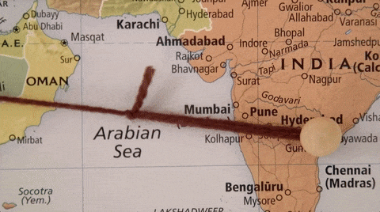
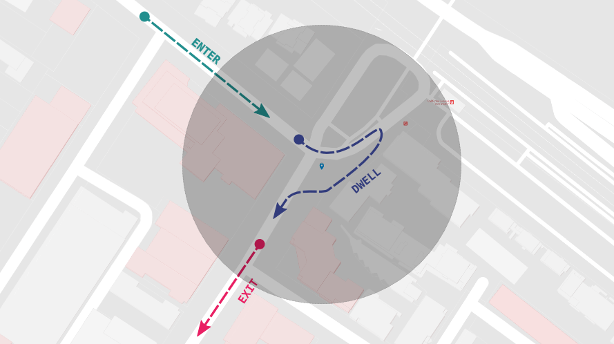
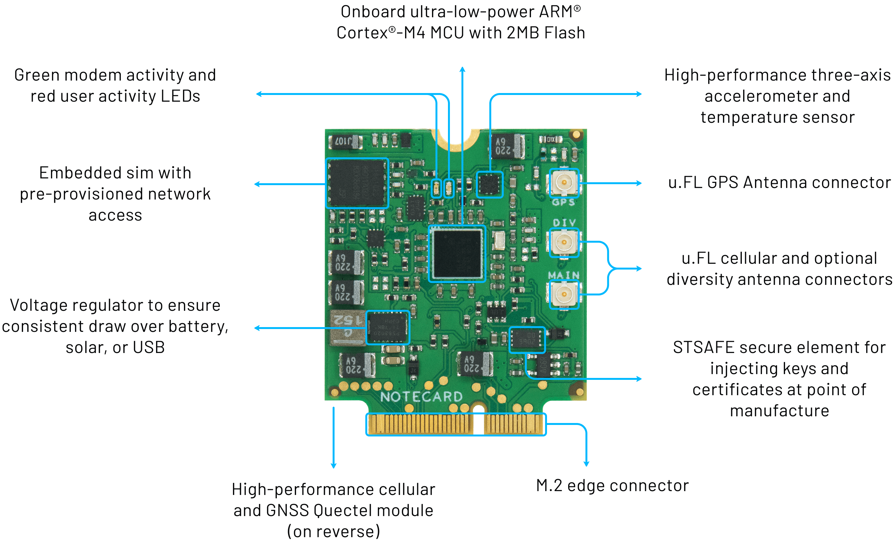
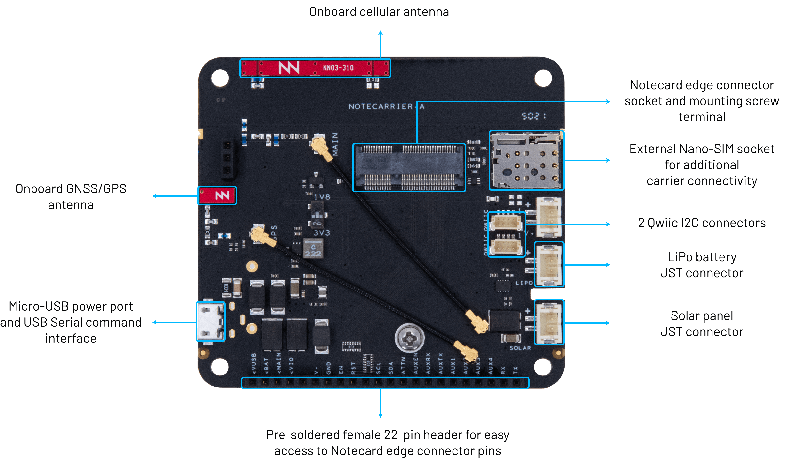
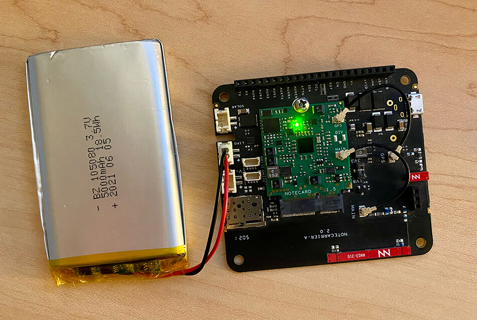
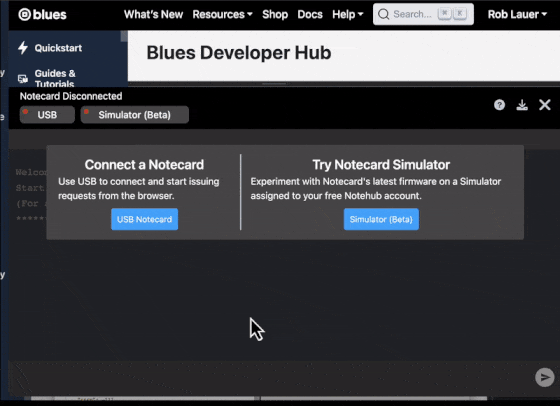
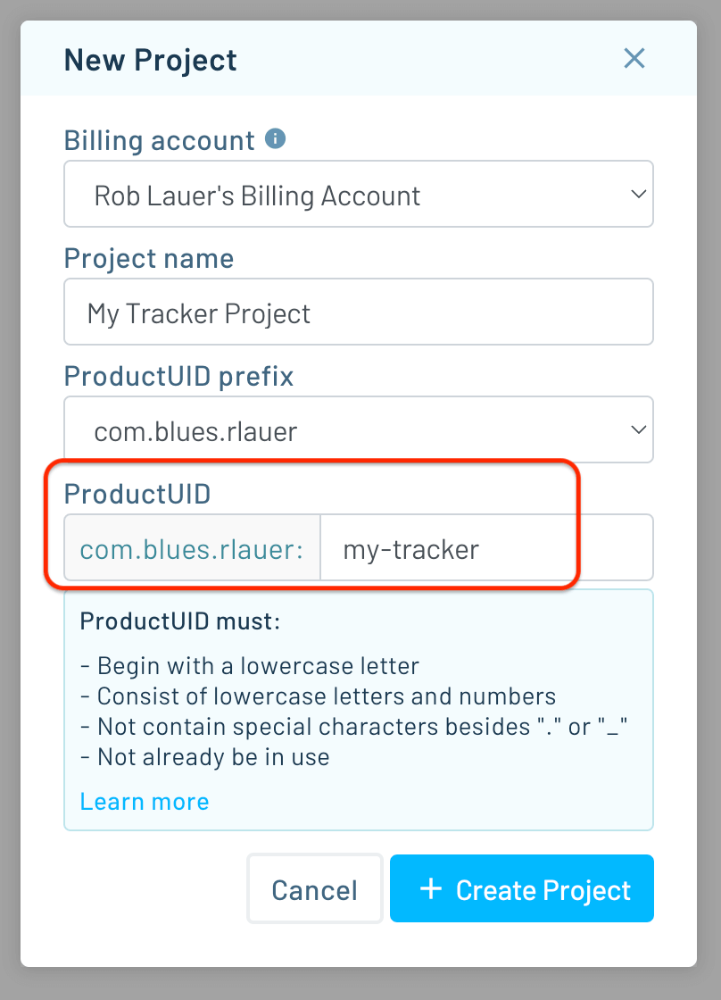
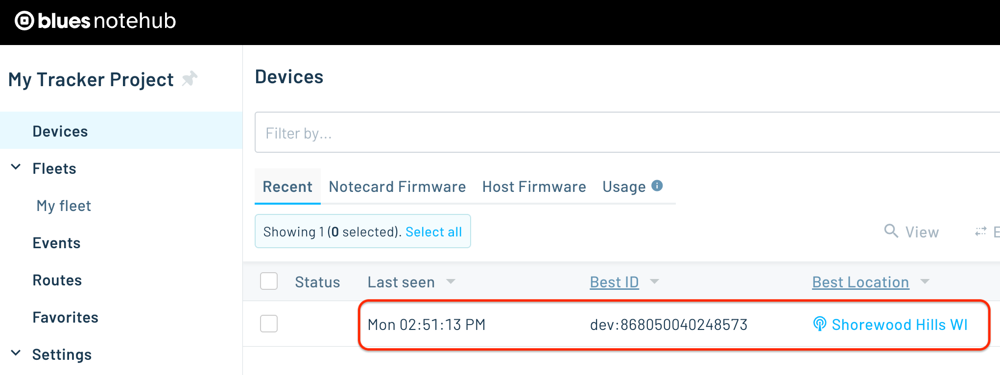
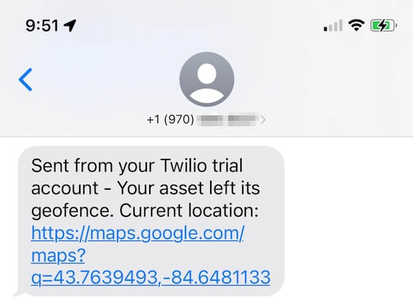
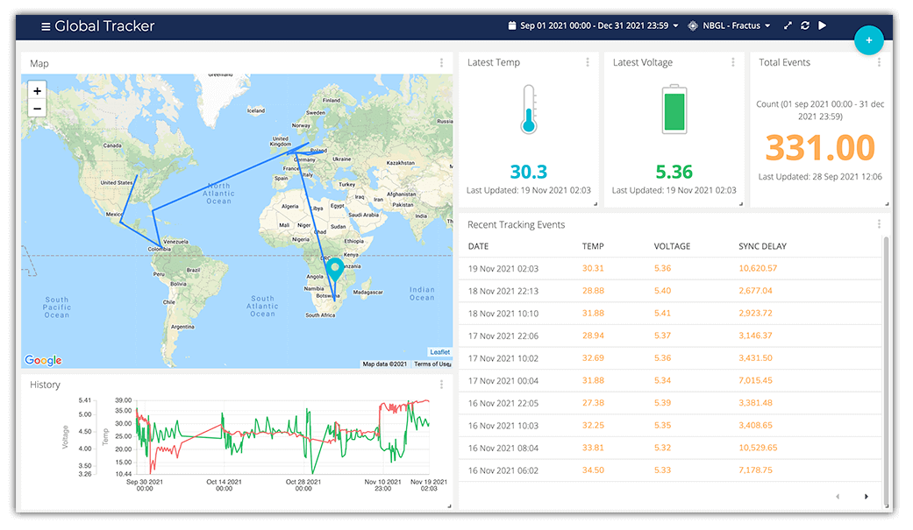

# Build a Cellular Cargo Tracker with Geofencing and SMS Alert

*This is a cellular-based system for tracking the location of an asset, sending GPS/GNSS data to the cloud and using geofencing to issue SMS alerts.*

Asset tracking is not a new thing in the IoT, nor would I say it's *even close* to being a solved problem.



I've published a couple of "asset tracking" projects on [global tracking](https://www.hackster.io/rob-lauer/sending-a-cellular-gps-tracker-around-the-world-literally-4b830c) and [indoor asset tracking](https://www.hackster.io/rob-lauer/indoor-asset-tracking-using-wi-fi-triangulation-5c5963) - primarily because there are so many different scenarios to tackle in this space.

Today I want to introduce you to yet another concept useful in asset tracking - that being **geofencing**.

> BTW, this app is one of 50+ [Blues Accelerators](https://dev.blues.io/accelerators/) - a free set of purpose-built open source IoT applications that you can clone and start using today.

## What is a Geofence?

A "geofence" can be thought of as a virtual fence around a physical location. It can be any shape or size, and is most commonly are used to detect if/when an asset has crossed a virtual boundary.



## How Can Geofencing Help with Asset Tracking?

It's one thing to track the movement of your cargo and its location. It's another to get an **alert** when that cargo has crossed some threshold, like leaving the transport facility or checking to make sure a package does not leave a set boundary.

This app introduces the concept of geofencing to asset tracking. Using Twilio and an AWS Lambda function, it can be configured to send a one-time notification that the asset has left the geofenced area, or send repeated notifications until the asset returns.

## Cellular-Powered, Low-Power, Cloud-Powered

Depending on the scenario, asset trackers may be power-hungry (i.e. using GPS frequently) and line-powered. Others may only check for location on a daily basis and be powered off small LiPo batteries.

In this project, we are focusing on the latter scenario by using the [low-power cellular + GPS Notecard from Blues](https://blues.io/products/notecard/).

The beauty of using the Notecard for asset tracking is you **don't need a separate host MCU** to run the tracker (more on this later).



We will use the Notecard along with one of the Blues carrier boards, the [Notecarrier A](https://blues.io/products/notecarrier/notecarrier-a/):



The Notecarrier A includes **onboard LTE and GPS antennas from Ignion**, making it an affordable and compact solution for asset tracking.

The Notecard is also extremely low-power (idles at ~8uA), comes prepaid with 500MB of global cellular data, and provides turnkey cloud integration with the [Blues cloud service Notehub](https://blues.io/products/notehub/).

## Setting up the Tracker Hardware

Everything we need to configure the tracker includes what was just described, along with a small power source:

1. The NBGL Notecard (global cellular module with GPS/GNSS) - [Datasheet](https://dev.blues.io/datasheets/notecard-datasheet/note-nbgl-500/)
2. The Notecarrier A carrier board - [Datasheet](https://dev.blues.io/datasheets/notecarrier-datasheet/notecarrier-a/)
3. A LiPo battery



*Assembly is straightforward too:*

1. The Notecard gets slotted into the Notecarrier A.
2. The cellular and GPS antennas are attached via the U.FL connectors on the Notecard.
3. The LiPo battery connects to the `LIPO` connector on the Notecarrier.

Now we're ready to configure the Notecard. BUT...how do we program the Notecard to function as an asset tracker *without* a host MCU? The answer is in the [JSON-based Notecard API](https://dev.blues.io/api-reference/notecard-api/introduction/).

## Configuring the Asset Tracker

You program the Notecard by sending it JSON-formatted API requests via serial or I2C. One way to send requests directly to the Notecard, over serial, is using a Chromium-based browser like Chrome or Edge, which allow for usage of the [Web Serial API](https://developer.mozilla.org/en-US/docs/Web/API/Web_Serial_API).

Connect the Notecarrier A to your computer via a Micro USB cable (making sure you're NOT using a charge-only cable!). Access the [In-Browser Terminal](https://dev.blues.io/terminal/) at blues.dev and connect to the Notecard.



Before we cover the commands we will send to the Notecard, let's get set up with the cloud portion of this project.

### Cloud Configuration

[Notehub](https://notehub.io/) is the Blues cloud service that acts as a secure communication proxy for the Notecard. When the Notecard is powered on, it already knows to start communicating with Notehub. All aspects of communication security is handled for you, with no certificate management or key rotation required.

Go ahead and [set up a free Notehub account](https://notehub.io/sign-up) and after signing up, you'll be directed to create your first Notehub project:



Grab the `ProductUID` (the globally-unique identifier for your Notehub project), as we'll need that when we start configuring the Notecard.

### hub.set API

Back in the In-Browser Terminal, the first request we will send to the Notecard is to link it to your newly-created Notehub project.

```
{
   "req":"hub.set",
   "product":"insert-your-productuid",
   "mode":"periodic",
   "outbound":30
}
```

The `hub.set` command sets the Notecard's `ProductUID` (make sure to replace 'insert-your-productuid' with your own `ProductUID`). Setting the `mode` to `periodic` and `outbound` to `30` tells the Notecard to enable the cellular modem once every 30 minutes to sync any pending data.

> **NOTE:** It's important to know that the Notecard can't enable the cellular modem and GPS module at the same time (though you can have concurrent cellular/GPS functionality by using an [external GPS module](https://dev.blues.io/notecard/notecard-walkthrough/advanced-notecard-configuration/#using-aux-track-mode-with-an-external-gps)). This is important to keep in mind, as you'll need to find the right balance of how frequently you gather location data, versus how frequently you send that data to the cloud.

Once this command is sent, the Notecard will return an empty JSON object `{}`, signifying a successful response. The Notecard will then initiate a cellular connection, and within a minute or so you'll see your device appear in Notehub:



### card.location.mode API

Next, the `card.location.mode` command will tell the Notecard to sample its location via GPS every `180` seconds, but ONLY if motion has been detected by the onboard accelerometer (another power-saving feature of the Notecard).

```
{
   "req":"card.location.mode",
   "mode":"periodic",
   "seconds":180,
   "lat":43.07,
   "lon":-89.43,
   "max":200
}
```

It also **sets up a circular geofence** centered at latitude (lat) `43.07` and longitude (lon) `-89.43` (you'll want to adjust this for the geofence center you want to measure).

The `max` argument is critical as it sets the **radius of the geofence in meters**. Whenever the Notecard's GPS location transitions from inside this region to outside it, or vice-versa, the Notecard will *immediately* send an event (a.k.a. a [Note](https://dev.blues.io/api-reference/glossary/#note)) to Notehub.

### card.location.track API

Aside from tracking the movements out of, and into, the geofence, we also want to periodically send Notes that contain GPS coordinates so we can track the Notecard's location. The `card.location.track` API tells the Notecard to sample GPS location every `180` seconds (from the `card.location.mode` request's `seconds` argument above), and then that data gets added to a Notefile called `locations.qo`.

```
{
   "req":"card.location.track",
   "start":true,
   "file":"locations.qo"
}
```

And we're done! 👏

## Testing the Cargo Tracker

With these API commands sent to the Notecard, unplug the Notecarrier's USB connection to force the Notecard to run off the LiPo battery.

The Notecard has an onboard accelerometer, so it will immediately know when it's in motion. Take the Notecard outside, walk around the block, drive to the store, whatever it may be, to start accumulating GPS location data. Just make sure the Notecard has a clear view of the sky so it can see as many GPS satellites as possible.

> **NOTE:** Don't expect data to appear *immediately* in Notehub! Remember the Notecard is configured to *periodically* send data to Notehub every 30 minutes.

Within 30 minutes or so, you will see some `locations.qo` Notes appear in Notehub that contain a `body` field that will look something like this: 

```
"body": {
    "bearing": 28.31218,
    "distance": 11.6662655,
    "dop": 0.7001953,
    "inside_fence": true,
    "jcount": 2,
    "journey": 1692058001,
    "motion": 3,
    "seconds": 131,
    "temperature": 25.1875,
    "time": 1692058194,
    "velocity": 0.08905546,
    "voltage": 4.1875
}
```

Notice in this sample the `inside_fence` field is `true`. This means the Notecard is still **inside the geofence**. When the Notecard moves outside the geofence, the `inside_fence` field won't show up at all. Why? This is an optimization of the Notecard firmware where fields that are 0 (or false) aren't transmitted and can be assumed to be 0. Feel free to [read more about this data-saving feature](https://dev.blues.io/notecard/notecard-walkthrough/json-fundamentals/#how-the-notecard-works-with-json).

What about the GPS location? That data is stored in the higher level JSON object:

```
"best_location_type": "gps",
"best_location_when": 1692058194,
"best_lat": 43.0711275,
"best_lon": -89.43269140625,
"best_location": "Shorewood Hills WI",
"best_country": "US",
"best_timezone": "America/Chicago",
```

## Adding SMS Alerts and Data Visualizations

The true value of orchestrating all of this is not to merely see the data appear in Notehub, but to actually _do_ something with it.

### SMS Alerts with Twilio

Let's start with SMS alerts. Specifically, we likely want to get SMS alerts when our asset tracker leaves a geofenced area. Notehub natively supports [sending SMS notifications with Twilio](https://dev.blues.io/guides-and-tutorials/twilio-sms-guide/), but we can also write a small AWS Lambda function to customize how often the alerts are sent.



Instead of reinventing the wheel, the entire process for setting up and customizing SMS alerts in this scenario is documented in this excellent blog post from TJ VanToll: [How to Build an Asset Tracker With Geofence-Driven Alerts](https://blues.io/blog/how-to-build-an-asset-tracker-with-geofence-alerts/).

### Data Visualizations with Ubidots

Likewise, being able to visualize the location of one or more trackers on a map can be just as useful.

[In this Hackster project](https://www.hackster.io/rob-lauer/sending-a-cellular-gps-tracker-around-the-world-literally-4b830c), I documented how I created an asset tracker that was (literally) sent around the world, including a way to add a map to an Ubidots dashboard.



## Summary

I hope you've gotten a taste of how easy it can be to configure and deploy your own cargo tracker with the Blues Notecard and Notehub.

If you're curious on how to best get started, you can literally buy the same hardware I used in this project:

- [Blues Notecard NBGL](https://shop.blues.io/products/note-nbgl-500)
- [Blues Notecarrier A](https://shop.blues.io/products/carr-al)

...or you can start with a Blues Starter Kit for [North America](https://shop.blues.io/products/blues-starter-kit-for-north-america) or [EMEA](https://shop.blues.io/products/blues-starter-kit-for-emea) (which also includes a Feather-compatible Notecarrier, STM32-based host MCU, and a region-specific wideband Notecard).

Also be sure to check out all the other [Blues Accelerators](https://dev.blues.io/accelerators/).

Happy tracking with Blues! 💙🗺️
