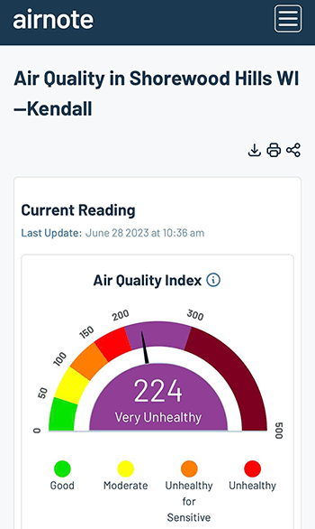
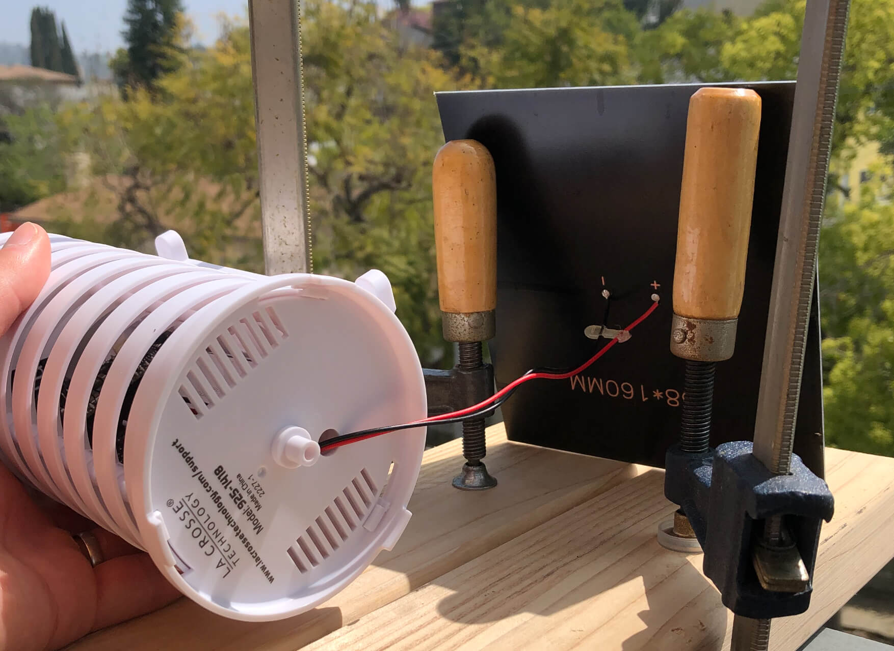
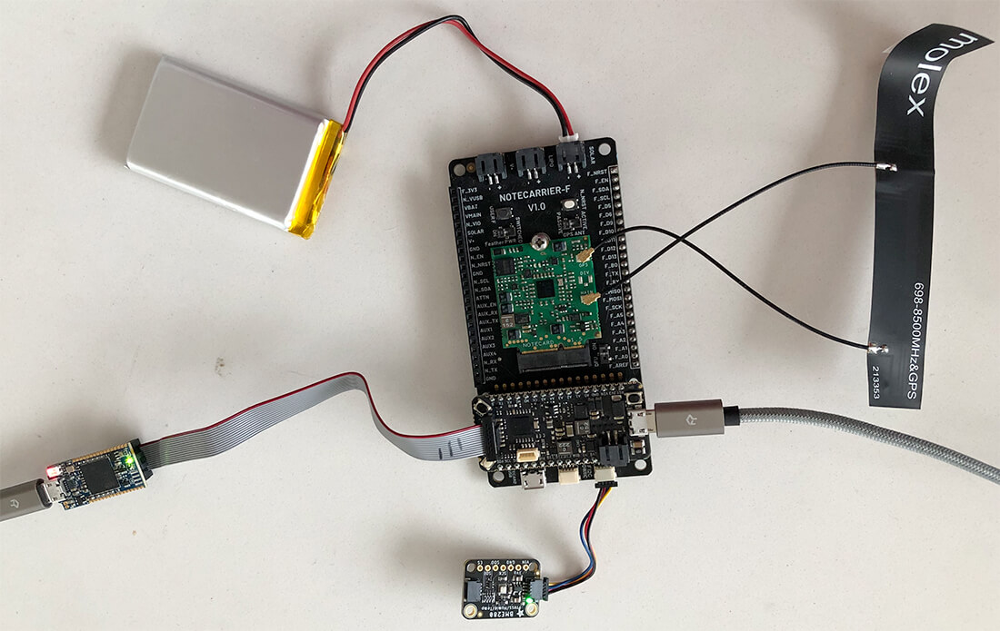
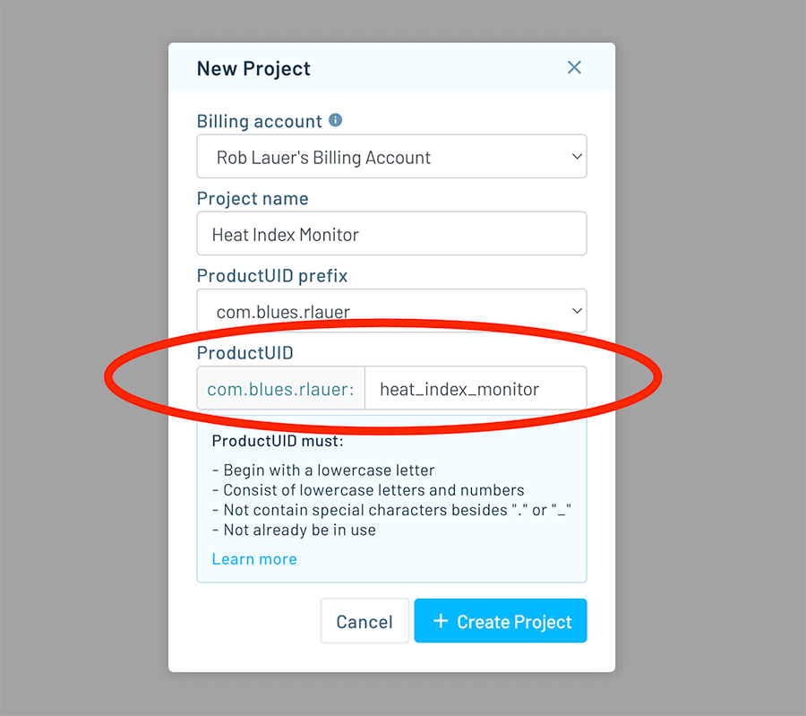
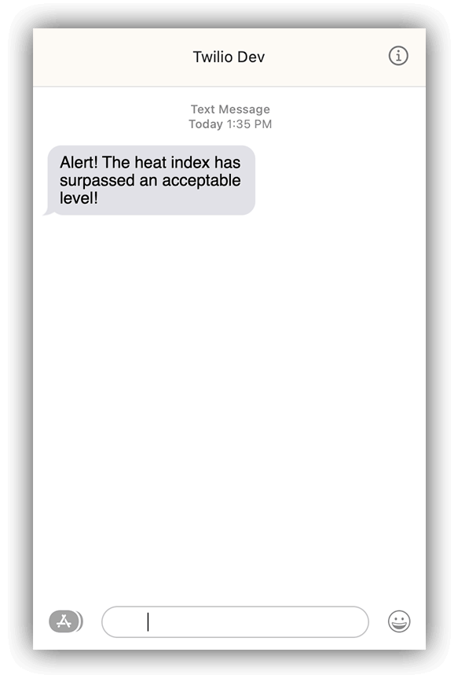
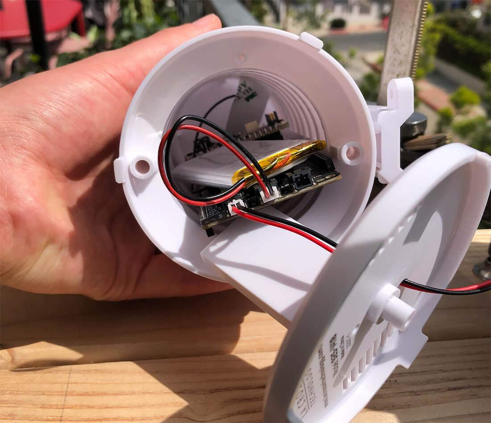
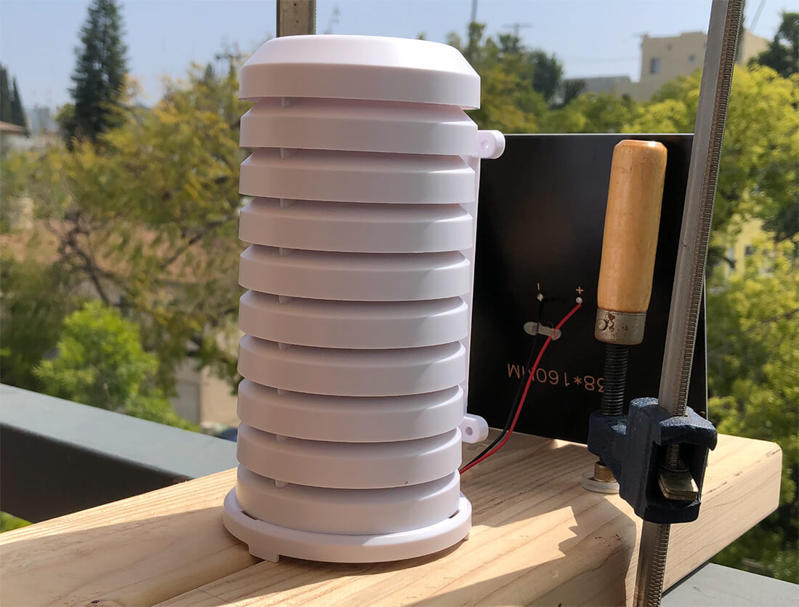

# Build an Outdoor Heat Index Monitoring Solution

*Learn how to create an outdoor heat index monitoring/alerting IoT project using Twilio and the Blues Notecard.* 

Many of us are experiencing surging temperatures due to a brutal combination of climate change and [El Niño](https://oceanservice.noaa.gov/facts/ninonina.html).


Combine these rising temps with spiking air quality index (AQI) levels due to the Canadian wildfires, and this summer is proving to be...a bit on the uncomfortable side.



*The AQI from my personal [Airnote](https://blues.io/products/airnote/) device on a particularly bad day.*

## Why Heat Index is Critical to Monitor

If you haven't heard of the [heat index](https://www.weather.gov/ama/heatindex) before, it's a measurement of the discomfort the "average" person experiences due to the effects of temperature and humidity in the air.

A high heat index can lead to **significant health issues for vulnerable populations**, not the least of which is heat stroke. While it's simple enough to put a thermometer outside a window, temperature can only tell us one thing. The heat index value is a more useful measure of the potential impact on our health.

All this to say, one thing we can do to protect ourselves and our loved ones is to proactively **monitor the outdoor heat index on a hyper-local scale**. By using off-the-shelf sensors and the [Blues Notecard](https://dev.blues.io/datasheets/notecard-datasheet/note-nbgl-500/), we can build an outdoor heat index monitoring solution that includes SMS notifications to let us know when it's safe (or not) to head outside.

## Project Summary

This solution is built around the Notecard, a wireless IoT device from Blues, and **actively monitors the heat index** when deployed outdoors. If the heat index rises above a certain threshold (configurable by the end user) an alert is sent to the cloud which will trigger an SMS via Twilio.

In order to remain operational without mains power, the system will be powered by a LiPo battery which itself is conveniently charged by a small solar panel.



## Easy Cellular IoT with Blues

When designing projects like this, the most confounding aspect is often how to add cellular connectivity. Cellular is hard to do right? AT commands? Wiring up a cellular radio? Acquiring the right SIM card and paying monthly SIM fees?

Thankfully the Notecard from Blues was an easy choice.

The [Notecard is a prepaid cellular system-on-module](https://blues.io/iot-connectivity-firmware-for-engineers/?utm_source=hackster&utm_medium=web&utm_campaign=featured-project&utm_content=indoor-asset-tracking) that ships with 500MB of data and 10 years of global cellular service (starting at $49 USD).


The beauty of the Notecard is that [its API](https://dev.blues.io/api-reference/notecard-api/introduction/) abstracts away all the AT commands, and in their place provides a fully realized JSON-based API.

For instance, if you wanted to query the last known location of a Notecard, you would use the [card.location API](https://dev.blues.io/reference/notecard-api/card-requests/#card-location):

```
// Request
{ "req": "card.location" }

// Response
{
  "status": "GPS updated (58 sec, 41dB SNR, 9 sats),
  "mode":   "periodic",
  "lat":    42.577600,
  "lon":    -70.871340,
  "time":   1598554399
}
```

Security and cloud integration are virtually turnkey with the Notecard. The Notecard communicates "off the public Internet" through private VPN tunnels, using the [Blues cloud service Notehub](https://blues.io/products/notehub/?utm_source=hackster&utm_medium=web&utm_campaign=featured-project&utm_content=indoor-asset-tracking).

Why Notehub? **Notehub acts as a secure proxy for the Notecard**, allowing you to sync data from Notecards and route that data to any cloud-based endpoint (e.g. AWS, Azure, Datacake, MQTT endpoints, and so on).

## Hardware Setup

If you haven't yet, take a close look at the list of hardware requirements provided above. Note that the **housing is not a strict requirement**, but the BME280 sensor will give erroneous measurements if it isn't properly shielded from UV radiation.

*Let's assemble:*

1. **Mount the Notecard on the Notecarrier F** as described in the [Blues quickstart](https://dev.blues.io/quickstart/blues-quickstart/).
2. **Plug the Swan MCU into the Notecarrier F**, aligning the headers.
3. Using a Qwiic cable, **plug the BME280 into an open Qwiic port** on the Notecarrier F.
4. **Connect the Swan to your computer** via a micro USB cable.
5. **Plug the LiPo battery's JST cable into the Notecarrier F** port labeled `LIPO`.
6. **Connect one end of the JTAG ribbon cable** that came with the STLINK to the STLINK and the other end to the Swan.
7. **Connect the STLINK to your computer** with a second micro USB cable.

> **NOTE:** The LiPo battery will automatically start charging when the Swan is connected via USB.

**That's it!** You do not need to connect the solar panel until the project is deployed outside.

Your project should know look something like this and be ready for programming:



## Blues Notehub Setup

[Notehub](https://blues.io/products/notehub/) is the cloud service provided by Blues that allows for seamless transfer of data from a Notecard to your cloud application of choice. It's even free to use for up to 5,000 events routed out to a cloud app per month (data events sent from Notecard to Notehub are always free).

1. Head to [notehub.io](https://notehub.io/) and sign up for a free account.
2. Create a new project and save the generated `ProductUID` as you will need to include that in the firmware.



Next step: firmware!

## Programming with Zephyr

I'll admit that I'm slowly but surely becoming a [Zephyr](https://zephyrproject.org/) convert.


Zephyr is becoming a popular RTOS for embedded developers. It's lightweight, easy to integrate, and has a vibrant developer ecosystem.

Let's get ready to program with Zephyr by making sure we have the right dependencies set up. To build, flash, and debug the Zephyr firmware, you will need to have:

- [Visual Studio Code](https://code.visualstudio.com/)
- [Docker](https://www.docker.com/)
- [VS Code Dev Containers Extension](https://code.visualstudio.com/docs/devcontainers/containers)

> **NOTE:** The [Dev Containers Extension documentation](https://code.visualstudio.com/docs/devcontainers/containers) will take you through the process of installing both Docker and the extension for VS Code.

With tooling set up, let's start by cloning the [Blues Accelerators repo on GitHub](https://github.com/blues/app-accelerators/) (this will clone all of the Accelerators, but we will just be working with `37-heat-index-monitor`):

```
$ git clone https://github.com/blues/app-accelerators.git
```

> **NOTE:** What are the [Blues Accelerators](https://dev.blues.io/accelerators/) you ask? Well...they are 50+ purpose-built IoT applications that are fully open source and demonstrate best practices when using Notecard and Notehub!

From the command line, you'll need to pull in the `note-c` and `notecard-env-var-manager` submodules that the firmware depends on in the project we are building:`37-heat-index-monitor`:

```
$ git submodule update --init 37-heat-index-monitor/firmware/zephyr/src/note-c
$ git submodule update --init 37-heat-index-monitor/firmware/zephyr/src/notecard_env_var_manager
```

While there is a lot going on in the code just cloned, a key function to point out is the heat index calculation:

```
static double calcHeatIndex(double temp, double humid)
{
    double heatIndex = 0.5 * (temp + 61.0 + ((temp-68.0)*1.2) + (humid*0.094));

    if ((heatIndex + temp) / 2 >= 80) {
        heatIndex = -42.379 + 2.04901523*temp + 10.14333127*humid
                    - .22475541*temp*humid - .00683783*temp*temp
                    - .05481717*humid*humid + .00122874*temp*temp*humid
                    + .00085282*temp*humid*humid
                    - .00000199*temp*temp*humid*humid;

        if (humid < 13 && temp > 80 && temp < 112) {
            heatIndex -=  ((13-humid)/4)*sqrt((17-abs(temp-95.))/17);
        }
        else if (humid > 85 && temp > 80 && temp < 87) {
            heatIndex += ((humid-85)/10) * ((87-temp)/5);
        }
    }

    return heatIndex;
}
```

Now we're ready to build the project!

1. In VS Code, select **File > Open Folder**, and pick `37-heat-index-monitor/firmware/zephyr`.
2. Follow the instructions for your specific OS in the [Zephyr SDK docs](https://dev.blues.io/tools-and-sdks/firmware-libraries/zephyr-sdk/#building-the-dev-container).
3. Edit `src/main.c `to associate the firmware with your Notehub project. Uncomment `// #define PRODUCT_UID "com.your-company:your-product-name"` and replace `com.your-company:your-product-name` with your project's `ProductUID` created above.
4. Follow the provided instructions in the ["Building and Running" section](https://dev.blues.io/tools-and-sdks/firmware-libraries/zephyr-sdk/#building-and-running).

Did you successfully deploy the app? If so, the code should be running on the Swan MCU.

If you want to look at the serial logs or debug the code, check out the ["Debugging" section of the Zephyr SDK documentation](https://dev.blues.io/tools-and-sdks/firmware-libraries/zephyr-sdk/#debugging).

## First Run

At this point, you should start to see [Notes](https://dev.blues.io/api-reference/glossary/#note) (i.e. events) show up in Notehub under your project's **Events** view. There are two key Notes to be aware of:

### data.qo

By default, the Swan will publish temperature (in Fahrenheit), humidity (relative humidity, a percentage), and heat index (in Fahrenheit) from the BME280 every two minutes.

For example:

```
{
    "heat_index": 68.018764412,
    "humidity": 26.841796,
    "temperature": 70.05199999999999
}
```

You can change this interval by setting the [environment variable](https://dev.blues.io/guides-and-tutorials/notecard-guides/understanding-environment-variables/) called `monitor_interval`.

> **NOTE:** Environment variables are a convenient way to share state and variables between a Notecard device and the cloud.

The unit for `monitor_interval` is seconds. The firmware reads from the BME280 every 30 seconds, so it's not particularly useful to set `monitor_interval` lower than 30 seconds. If you modify any environment variables, wait at least a minute for the changes to propagate to the Swan.

### alarm.qo

By default, the firmware will send an `alarm.qo` Note in the following situations:

1. The temperature falls outside the range [32, 95]F.
1. The humidity falls outside the range [5, 80]%.
1. The heat index is above 95F.

You can use the following environment variables to change these ranges to match your specific requirements:

- `temperature_min`: Lower bound of temperature range.
- `temperature_max`: Upper bound of temperature range.
- `humidity_min`: Lower bound of humidity range.
- `humidity_max`: Upper bound of humidity range.
- `heat_index_max`: Upper bound for heat index. There is no lower bound.

Here's an example `alarm.qo` Note:

```
{
    "heat_index": {
        "status": "ok",
        "value": 66.226219496
    },
    "humidity": {
        "status": "high",
        "value": 35.042968
    },
    "temperature": {
        "status": "ok",
        "value": 68.072
    }
}
```

The `status` field indicates the reason for the alarm:

- `low` means the value is below the minimum.
- `high` means the value is above the maximum.
- `ok` means the value is in range.

You should only ever see an `alarm.qo` Note if at least one of the values is != `ok` and these Notes are sent at a maximum rate of 1 every 5 minutes.

### Alerting with Twilio

Another advantage of Notehub is the ease of which you can route data to other cloud services. In this case, I'd like to route `alarm.qo` Notes to Twilio to generate an SMS notification any time the alarm is sounded.

Instead of reinventing the wheel here, you can follow the [Blues guide on creating SMS notifications with Twilio](https://dev.blues.io/guides-and-tutorials/twilio-sms-guide/) to set up your own Twilio route.

Make sure you're only routing the `alarm.qo` Notes so you're not spammed with notifications!

You'll likely want to customize your SMS messages based on the data that is being sent. Thankfully Notehub allows you to utilize [JSONata expressions](https://dev.blues.io/guides-and-tutorials/notecard-guides/using-jsonata-to-transform-json/) to [customize the JSON sent to Twilio](https://dev.blues.io/guides-and-tutorials/twilio-sms-guide/#customize-with-placeholder-variables-and-jsonata).



## Outdoor Deployment

With the solution running locally, it's time to move things outdoors.

1. Unplug the STLINK from the Swan. The hardware should now be fully disconnected from your computer.

2. Install the Notecarrier + Notecard, cellular antenna, LiPo battery, and BME280 inside the hardware housing:

   

3. Thread the solar panel's JST connector through the hole in the bottom plate of the housing and plug it into the `JST` port on the Notecarrier F labeled `SOLAR`. The Notecarrier will automatically use the solar panel to charge the connected LiPo.

4. Place the hardware on a smooth surface outside, with the solar panel facing toward the sun:

   

5. Return to your computer and head to the **Events** tab of your Notehub project.

  When a `data.qo` Note appears, you'll be able to see the current heat index. You can double-click the Note and go to the **Body** tab to view the full JSON of the note.

  ```
  {
      "heat_index": 66.34724041500002,
      "humidity": 34.668945,
      "temperature": 68.19800000000001
  }
  ```

6. Click **Devices** in the left-hand menu, double-click your device, and click the **Environment** tab. Add a new variable under **Device environment variables** with the name `heat_index_max` and a value a few degrees below the `heat_index` you just saw in the `data.qo` Note above. Click **Save**. This will force the conditions for an `alarm.qo` note, because the heat index is above the max.

7. Wait about a minute for the environment variable update to propagate to the Notecard. Soon after, you should see an `alarm.qo` Note back on the **Events** tab of your Notehub project:

  ```
  {
     "heat_index": {
        "status": "high",
        "value": 67.56925561999999
     },
     "humidity": {
        "status": "ok",
        "value": 32.02246
     },
     "temperature": {
        "status": "ok",
        "value": 69.422
     }
  }
  ```

## Conclusion

Hopefully you've seen the value of using off-the-shelf sensors along with Twilio and the Blues Notecard + Notehub to create a solution for heat index monitoring. 

*Looking for some next steps?*

Get started with Blues buy getting your own starter kit for [North America](https://shop.blues.io/products/blues-starter-kit-for-north-america) or [EMEA](https://shop.blues.io/products/blues-starter-kit-for-emea) (which include the required Notecard, Notecarrier F, and Swan).

Happy hacking...and stay out of that heat! 🥵