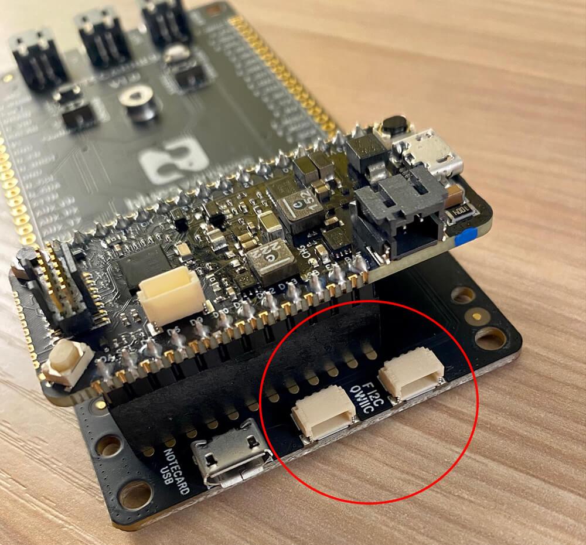

# Introducing the New Feather-Compatible Notecarrier-F

We're excited today to introduce you all to the newest Adafruit Feather-compatible product in the Blues Wireless portfolio, the [Notecarrier-F](TODO).

*Pre-release Notecarrier-F hardware shown.*

More than just a new revision of the original Notecarrier-AF, we re-imagined the Notecarrier-F from the ground up. We spoke with many of you to learn how you were using the AF and learned how we could best improve the design, layout, and performance of this new Feather-compatible Notecarrier.

## Notecarrier-F Features and Benefits

Aside from just *looking amazing*, the Notecarrier-F provides significant enhancements and new features for Feather MCU enthusiasts:

1) The electrical system has been redesigned to be **far more power efficient** than the AF and consume only ~15uA when idle (nearly matching the Notecard's idle consumption of ~8uA).

2) The overall **footprint is considerably smaller** than the Notecarrier-AF, maintaining the same width as a Feather-compatible MCU (like the [Blues Wireless Swan](/products/swan/)) and allowing for more flexible deployments:

*Pre-release Notecarrier-F hardware shown.*

3) We've **added a `V+` JST connector** alongside the existing `SOLAR` and `LIPO` connectors, and oriented them horizontally for easier access.

*Pre-release Notecarrier-F hardware shown.*

4) **Two QWIIC connectors** have been added next to the Micro-USB port (again, mounted horizontally) which allow for easy additions of QWIIC-based I2C peripherals.

*Pre-release Notecarrier-F hardware shown.*

5) All of the **pin labels** on the Notecarrier-F PCB are available on the front AND the back, easing those frustrations when trying to find right pin!

6) Finally, there are **no onboard antennas** on the Notecarrier-F. Wait, this is a benefit!? Actually yes! We've found that most of you are either using your own antennas and the rest will be pleased to know that we will be including a [Molex 213353 LTE+GPS antenna](https://www.molex.com/molex/products/part-detail/antennas/2133530100) which provides outstanding performance in a variety of conditions.

## Get Your Notecarrier-F

The Notecarrier-F is available TODAY in the Blues Wireless store! You can pick it up in one of a variety of configurations:

- [Cellular & Wi-Fi Starter Kit for Feather (Swan)](TODO)
- [Feather Starter Kit for Swan](TODO)
- [Feather Starter Kit for ESP32](TODO)
- [Standalone Notecarrier-F](TODO)