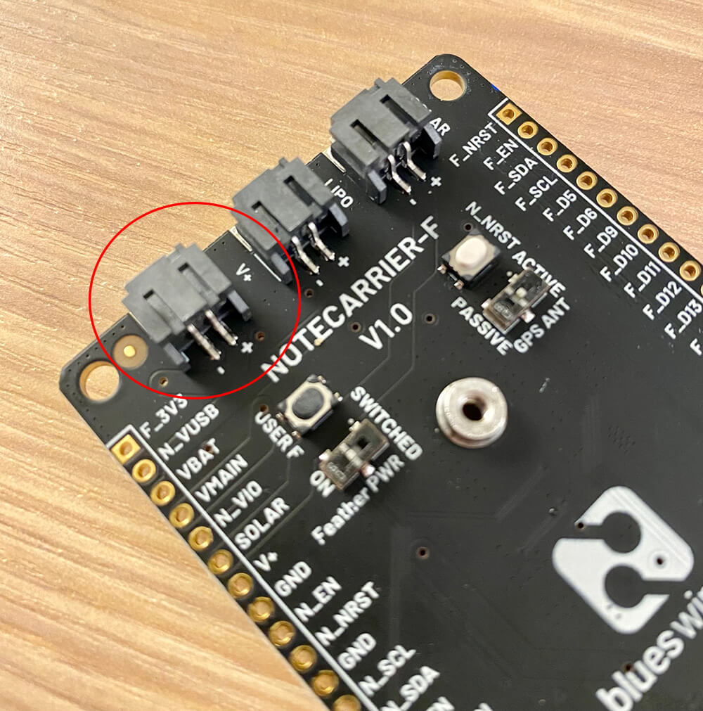

# Introducing the New Feather-Compatible Notecarrier-F

*Meet the new Adafruit Feather-compatible Notecarrier.*

We’re excited to introduce you to the newest Adafruit Feather-compatible product in the Blues Wireless portfolio, the [Notecarrier-F](TODO).

More than just a revision of our previous Feather-compatible Notecarrier (the Notecarrier-AF), we've re-imagined the Notecarrier-F from the ground up. We spoke with many of you to learn how you were using the AF, and learned how we could best improve the design, layout, and performance of this new Notecarrier.

> New to Blues Wireless and curious about *what a Notecarrier even is*? In short, Notecarriers are carrier boards designed to make it easy to prototype and deploy wireless IoT solutions with the [Blues Wireless Notecard](https://blues.io/products/notecard/). Learn more about Notecarriers [here](https://blues.io/products/notecarrier/).

## Notecarrier-F Features and Benefits

Aside from just *looking* amazing, the Notecarrier-F provides significant enhancements and new features for Feather microcontroller users.

> Be sure to consult the [Notecarrier-F datasheet](TODO) for additional technical details.

1) We redesigned the electrical system to be **far more power efficient** than the Notecarrier-AF and consume only ~15uA when idle (nearly matching the Notecard's idle consumption of ~8uA).

2) The overall **footprint is considerably smaller** than the Notecarrier-AF, maintaining the same width as a Feather-compatible MCU (like the [Blues Wireless Swan](https://blues.io/products/swan/)) and allowing for more flexible deployments:

3) We've **added a `V+` JST connector** alongside the existing `SOLAR` and `LIPO` connectors, and oriented them horizontally for easier access.

4) We added **two Qwiic connectors** next to the Micro-USB port (again, mounted horizontally) which allow for easy addition of Qwiic-based I2C peripherals.

5) All of the **pin labels** on the Notecarrier-F PCB are available on the front AND the back, easing those frustrations when trying to find right pin!

6) Finally, there are **no onboard antennas** on the Notecarrier-F. Wait, this is a benefit!? Actually yes! We've found that many of you are using your own antennas, and the rest will be pleased to know that we will be offering a [Molex 213353 LTE+GPS antenna](https://www.molex.com/molex/products/part-detail/antennas/2133530100), which provides outstanding performance in a variety of conditions.

## Get Your Notecarrier-F Today

The Notecarrier-F is available TODAY in the Blues Wireless store! You can pick it up in one of the following configurations:

- [Cellular & Wi-Fi Starter Kit for Feather (Swan)](TODO)
- [Feather Starter Kit for Swan](TODO)
- [Feather Starter Kit for ESP32](TODO)
- [Standalone Notecarrier-F](TODO)

If you have any questions about the Notecarrier-F please [reach out on the Blues Wireless community forum](https://discuss.blues.io/).