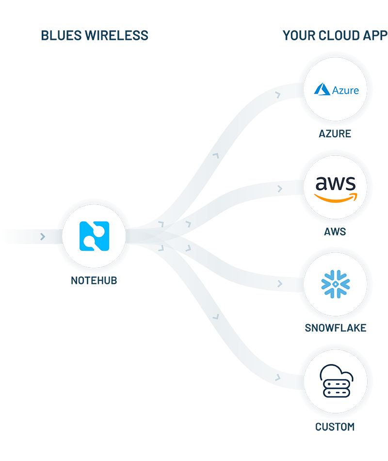

# Improvements to Data Routing with Notehub

Since day one, a key value proposition of the combination of Notecard and Notehub is ease of securely transmitting data from your device (we don't dictate your host or sensors) to your cloud (we also don't dictate your cloud app).

This secure transmission of data often happens using Notehub routes, which help to  obfuscate the complexity of integrating with many popular cloud providers.

> **TIP:** You can _also_ use the [Notehub API](https://dev.blues.io/reference/notehub-api/api-introduction/) to programmatically pull event data out of Notehub.

We have [extensive tutorials](https://dev.blues.io/guides-and-tutorials/routing-data-to-cloud) for routing data to these cloud providers (with more to come):

- [AWS IoT Analytics](https://dev.blues.io/guides-and-tutorials/routing-data-to-cloud/aws-iot-analytics)
- [Azure IoT Central](https://dev.blues.io/guides-and-tutorials/routing-data-to-cloud/azure-iot-central)
- [Datacake](https://dev.blues.io/guides-and-tutorials/routing-data-to-cloud/datacake)
- [General HTTP/HTTPS](https://dev.blues.io/guides-and-tutorials/routing-data-to-cloud/general-http-https)
- [Google Cloud Platform](https://dev.blues.io/guides-and-tutorials/routing-data-to-cloud/google-cloud-platform)
- [Initial State](https://dev.blues.io/guides-and-tutorials/routing-data-to-cloud/initial-state)
- [MQTT](https://dev.blues.io/guides-and-tutorials/routing-data-to-cloud/mqtt)
- [ThingSpeak](https://dev.blues.io/guides-and-tutorials/routing-data-to-cloud/thingspeak)
- [ThingWorx](https://dev.blues.io/guides-and-tutorials/routing-data-to-cloud/thingworx)
- [Ubidots](https://dev.blues.io/guides-and-tutorials/routing-data-to-cloud/ubidots)

**But what happens when your routes fail?** Previously, the opportunity to re-route that data was effectively lost without some sort of manual intervention. 😬

Today we are pleased to announce improvements to Notehub routes that allow for automatic route retries after failures (and an easier way to manually route data).

## What Exactly is a "Failed Route"?

First, it's important to understand precisely what it means for a Notehub route to "fail" to route an event.

Event routing is considered a failure if one of the following occurs:

- Notehub is unable to connect to the remote endpoint after 30 seconds.
- After connecting to the endpoint, Notehub does not receive a response after 30 seconds.
- Notehub receives an invalid HTTP response from the endpoint.
- A 5XX-level HTTP status code is returned from the endpoint.

With that established, let's take a closer look at some of the improvements for event routing.

## Manually Route a Single Event

Previously there was no easy way to test a newly-created route. You set up the route, waited for new events to come in that matched the required parameters of the route, and hoped things just worked. 🤷‍♂️

Today, you can manually route an event to test a route, or even to route an event _after_ the Notehub route was created.

To manually route a single event within the Notehub UI, navigate to the event detail screen and click on the **Route event** button. You'll be offered a modal dialog of routes to use within that Notehub project.

## Manually Route Multiple Events

Either while testing or if you want to manually re-try routing multiple events, Notehub now offers the ability to manually route one or more events. Any events can be selected, regardless of whether or not they were previously routed.

To route multiple events in the Notehub UI, navigate to the **Events** screen and select the event(s) you wish to route. In the modal provided, specify whether you only want to retry routing events that previously failed, or all the events you selected.

## Automatically Retry Failed Routes

If the routing of an event fails for any reason, you may wish to have Notehub **automatically retry the route**. To enable this feature, simply check the "Enable automatic reroute on failure" box when creating or editing a Notehub route.

With this option enabled, Notehub will attempt to retry routing a failed route three times: after 5 seconds, after 1 minute, and after 5 minutes.

> Please note that each attempt at routing an event consumes one [consumption credit](https://blues.io/pricing/), regardless of whether it's the first attempt or a retry.