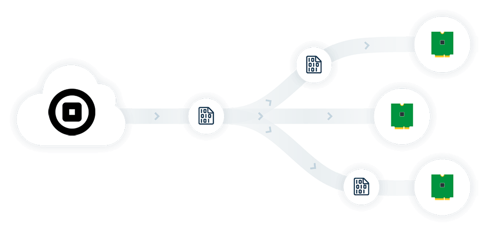
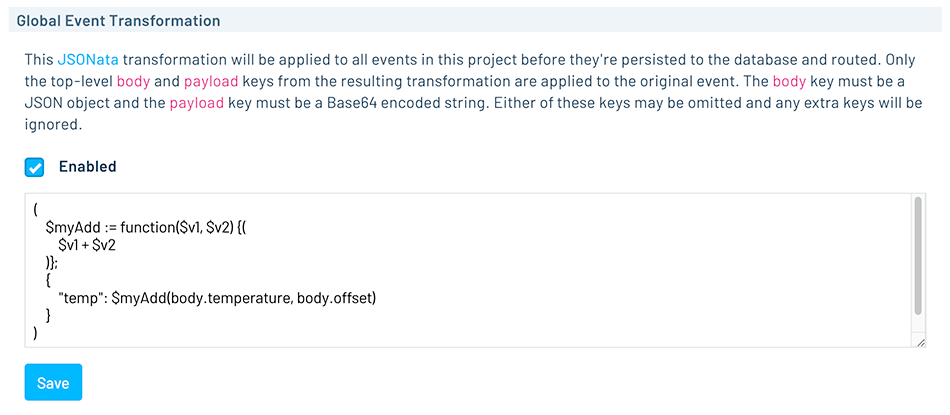
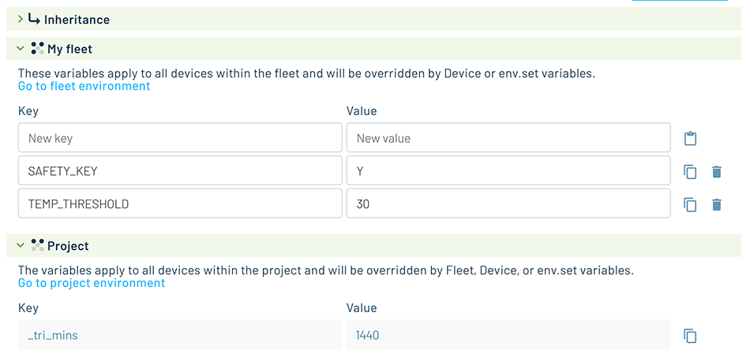

# New Notehub Features You May Have Missed

When you think of Blues, the first thing you *likely* think of is the Notecard. But the true value of the Blues ecosystem is realized via the device-to-cloud integration provided by pairing the Notecard with our cloud service, Notehub.

By far the most popular feature provided by Notehub is the ability to [quickly and securely route data](/notehub/notehub-walkthrough/#routing-data-with-notehub) from the Notecard to virtually any cloud platform. However, over the past few months we've released A LOT of new features that expand upon other key capabilities in Notehub!

Let's take a quick look at some of the recent highlights:

- [Project-Wide JSONata Transformations]()
- [New Environment Variable Inheritance UI]()
- [Updates to the Notehub API]()
- [Improvements to Event Routing]()
- [New Connectivity Assurance Features]()

## Project-Wide JSONata Transformations

As you scale your IoT solution and start to utilize multiple routes, many of you have expressed a desire to **apply a single JSONata transformation to all events** in a project, before they are persisted to Notehub.

This allows for project-wide application (and consistency) of transforms to the `body` and/or `payload`, in lieu of copy-pasting across individual routes.

This feature is available in the **Settings** for each Notehub project and learn more about JSONata in our guide on [Using JSONata to Transform JSON](/guides-and-tutorials/notecard-guides/using-jsonata-to-transform-json/#using-jsonata-to-transform-json).

## New Environment Variable Inheritance UI

Again, as you start to scale your fleets of Notecard devices, you're also often managing multiple levels of [environment variables](/guides-and-tutorials/notecard-guides/understanding-environment-variables/#understanding-environment-variables) and their inheritances (e.g. device-level vs fleet-level vs project-level variables).

You can now configure environment variable inheritance on the device, fleet, or project level using a completely re-worked user interface. This UI is available in both a "basic" (below) or "advanced" view:

Access these screens by navigating to the **Environment** tab for a specific device, fleet, or project. *Note that the updated project UI is coming soon!*

## Updates to the Notehub API

Arguably the most underutilized feature of Notehub is the ability to programmatically access data via the [Notehub API](https://dev.blues.io/api-reference/notehub-api/api-introduction/).

We've recently added additional APIs including the ability to pull route logs, the aforementioned project-wide JSONata transformations, and management of Connectivity Assurance.

TODO: NEED LINKS

There is also a new way to use and test the APIs with the [Postman Collection for Notehub API](/api-reference/notehub-api/api-introduction/#postman-collection-for-notehub-api).

## Improvements to Event Routing

There have been additional improvements to the event routing feature of Notehub, most notably:

1. The addition of a [Slack route](/notehub/configuring-a-slack-route/#configuring-a-slack-route) that supports both webhooks and `chat.postMessage` APIs.
2. A new route that allows for more direct integration with Datacake.

   

3. Support for adding an authorization token to a [Google Cloud route](/guides-and-tutorials/routing-data-to-cloud/google-cloud-platform/).

## New Connectivity Assurance Features

Notehub's [Connectivity Assurance](/notehub/notehub-walkthrough/#managing-connectivity-assurance) feature enables Notecard devices to maintain connectivity, even if their data allocations run out. We've recently made some changes to allow you to **pay for Connectivity Assurance using Consumption Credits**.

You can also now opt-in or opt-out of Connectivity Assurance at the Billing Account, Project, or Device level.

## Let Us Know How Notehub Can Help!

Sound off on the [Blues community forum](https://discuss.blues.io/) to let us know what you need from Notehub, what features could be improved, and/or what's not working for you today.

Happy Hacking with the Notecard...and Notehub! 🧑‍💻💙