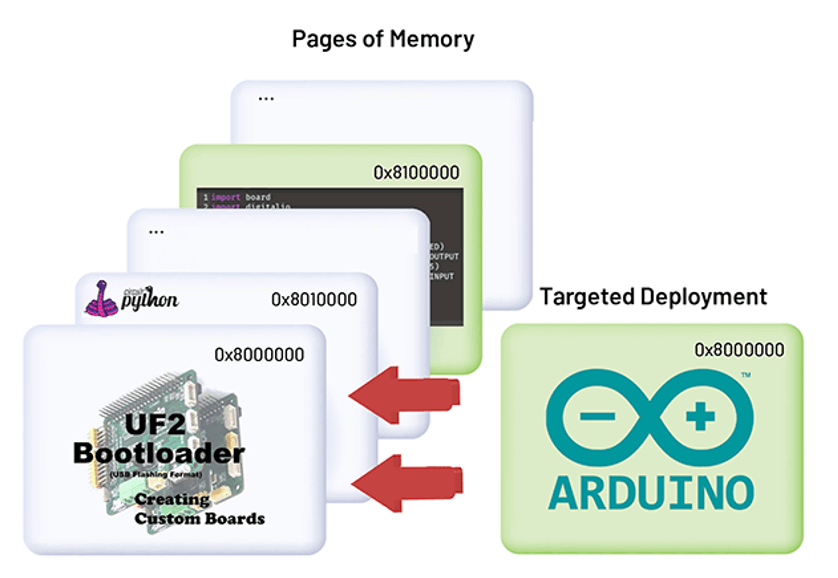
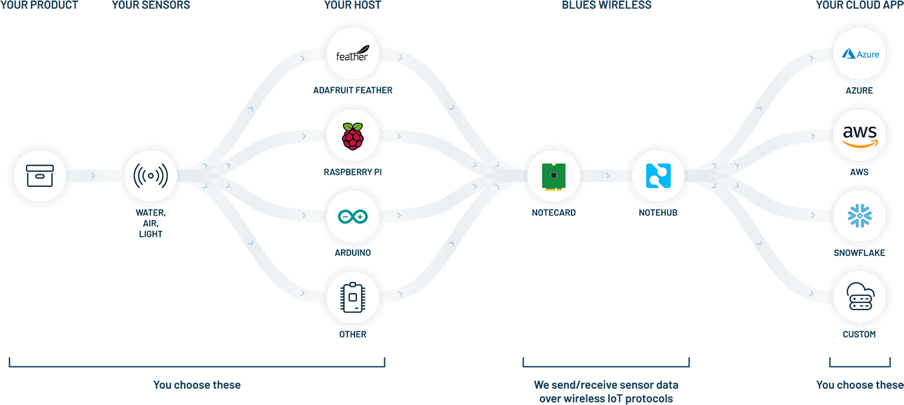
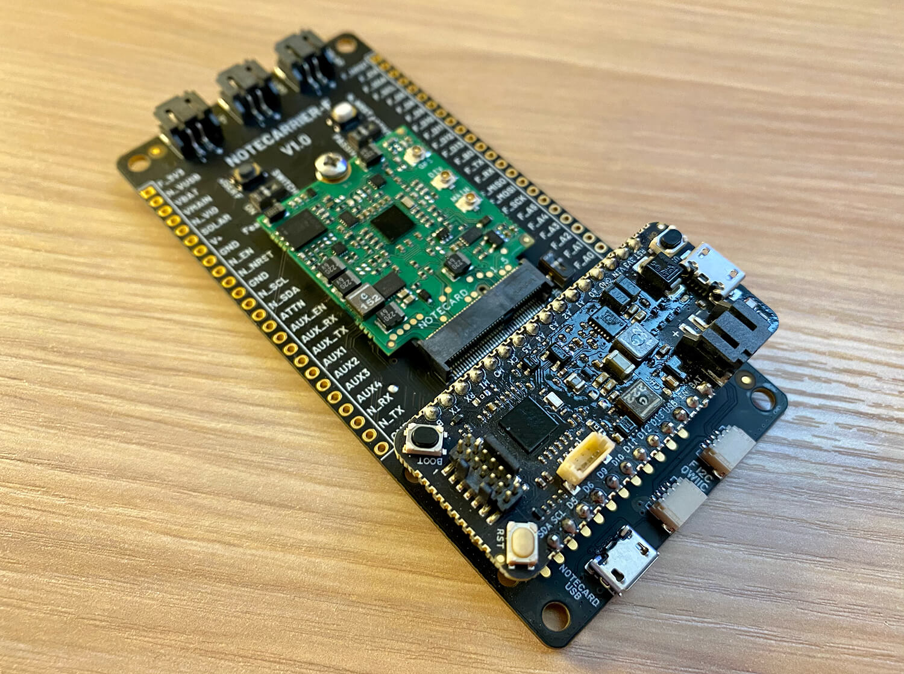
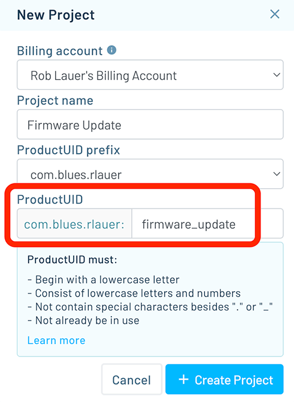
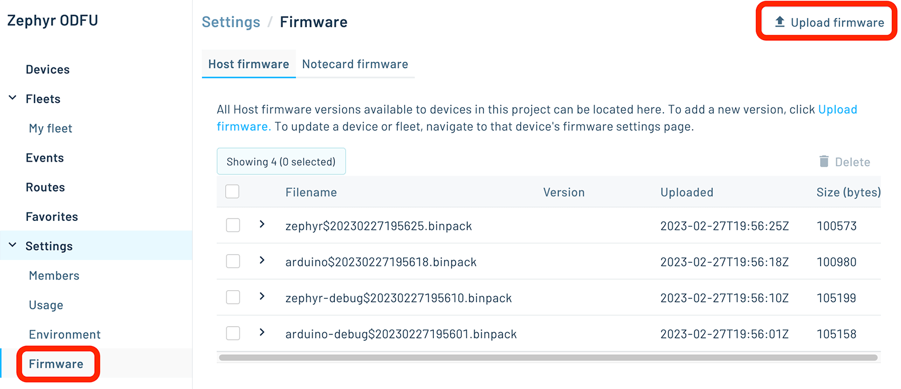
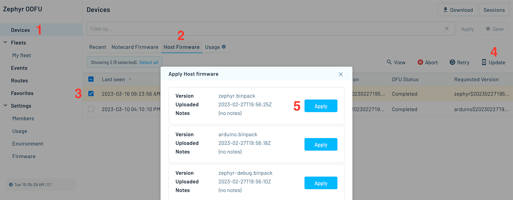
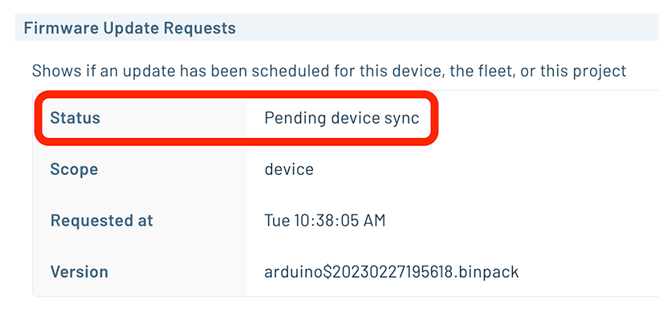

# Remote Firmware Updates that Can't Brick Your Host MCU

Performing remote (over-the-air, or OTA) device firmware updates (DFU) is both a panacea and a pandora's box for the IoT developer.

On the one hand, remotely updating an entire fleet of devices to fix bugs, add features, and update functionality is a critical tool that, in a way, web/mobile/cloud developers have had in their toolbox for years.

On the other hand, bricking (i.e. effectively disabling) your entire fleet by pushing a corrupted binary or *adding* new bugs is...far from ideal.


In this project, we are going to look at a new capability of the [Blues Notecard](https://blues.io/products/notecard/) that provides the best of both worlds: secure remote DFU, but *without* the risk of bricking your devices.

How? It's called [Notecard Outboard Firmware Update](https://blues.io/outboard-firmware-update/).


Want to see a functional overview of Notecard Outboard Firmware Update in action? Check out this video:

https://youtu.be/zkkix1KWHsk

## What is Notecard Outboard Firmware Update?

While the concept of OTA firmware updates is well known, implementation is risky and complex. Developers have to write code that requires a specific bootloader and firmware layout. This process introduces many variables and renders traditional OTA DFU difficult to implement (or in some cases, locks developers into a vendor-specific ecosystem).

The Notecard allows developers to implement remote DFU by writing a minimal amount of code AND is compatible with their programming language, their RTOS, and any modern ESP32- or STM32-based microcontroller.

Think of Notecard Outboard Firmware Update as performing firmware updates "from the outside" (e.g. an outboard motor on a boat):


How is it different from other competing solutions?

- It works **independently of RTOS and programming language**.
- You can **recover bricked devices** (from corrupted firmware, malware, or stuck in a loop).
- **Partial program updates** can be performed, saving cost and bandwidth.
- It functions on all modern **ESP32 and STM32 MCUs**.

## How Does Notecard Outboard Firmware Update Work?

Many modern microcontrollers ship with their primary bootloader in ROM (hence, not modifiable by the end user). When a `RESET` is asserted, the device enters the bootloader and can then load/execute code from a given source.

**What's so exciting about this?** Well, these ROM-based bootloaders allow you to perform firmware updates in a more flexible manner!



The "outboard" part of Notecard Outboard Firmware Update means you **don't involve the firmware running on the host** microcontroller.

The Notecard (with the Notehub cloud service) can update firmware regardless of language or RTOS used (and even switch between them). You can rollback invalid firmware updates, A/B test firmware, and recover bricked devices since the Notecard becomes responsible for delivering and updating the device.

## Wait...What are Notecard and Notehub?

Sorry, I got ahead of myself!

The Notecard is a **prepaid cellular IoT system-on-module** that provides 10 years and 500MB of global prepaid cellular access, starting at $49 (one-time, no monthly fees 🤯).


The Notecard is a secure device, it doesn't have a public IP address. Therefore, it requires a secure cloud-based proxy to operate. That is [Notehub](https://blues.io/products/notehub/), a cloud service provided by Blues that helps administer fleets of devices, relay data to your cloud app of choice, and yes, allows you to remotely update both host firmware and Notecard firmware over-the-air.



Notecard and Notehub work in tandem as a "device-to-cloud data pump". The beauty of working with the Notecard is that it knows exactly where to go as soon as you turn it on. There is no management of the cellular modem required, nor do you have to manage security keys and work with AT commands.

> **TIP:** [Check out the Notecard API](https://dev.blues.io/reference/notecard-api/introduction/) for examples of how you can manage your Notecard with a JSON-based request/response model.

## Notecard Outboard Firmware Update in Action

Let's look at this OTA DFU feature from both the hardware (wiring) perspective and the firmware configurations required.

### Hardware/Wiring Setup

Taking advantage of Notecard Outboard Firmware Update requires you to lay out several connections between the Notecard's AUX pins and the host MCU:

- `AUX3` on Notecard to `B0` or `BOOT` on MCU
- `AUX4` on Notecard to `RST` or `RESET` on MCU
- `AUXRX` on Notecard to `TX` on MCU
- `AUXTX` on Notecard to `TX` on MCU
- `GND` on Notecard to `GND` on MCU

To make it easier, there are some carrier boards that have the required wiring available out of the box, and are ready-made for using Notecard Outboard Firmware Update:

- [Blues Notecarrier-F](https://shop.blues.io/products/notecarrier-f)
- [SparkFun's MicroMod Cellular Function Board](https://www.sparkfun.com/products/20409)

As an example, the Notecarrier-F is nice to use as it is pre-configured to work with Notecard Outboard Firmware Update, but it also has a spot to host your Feather-compatible MCU:



> **NOTE:** To be clear, even if you're not using one of these boards, you can still utilize Notecard Outboard Firmware Update on modern STM32 and ESP32 hosts by connecting the pins in the list above!

### Setting Up a Notehub Project

Visit [Notehub.io](https://notehub.io/) and set up a (free) Notehub account.

Next, create a new project in Notehub, making note of the `ProductUID` (a unique identifier for your project that we will include in the sketch we write):



In this case, my `ProductUID` is:

```
com.blues.rlauer:firmware_update
```

### Talking to (and Configuring) the Notecard

The Notecard API is 100% JSON. That means every request sent TO the Notecard is JSON and every response FROM the Notecard is JSON.

For example, to get the Notecard's location using the onboard GPS module:

```
# Request
{ "req": "card.location" }

# Response
{
  "status": "GPS updated (58 sec, 41dB SNR, 9 sats),
  "mode":   "periodic",
  "lat":    42.577600,
  "lon":    -70.871340,
  "time":   1598554399
}
```

Blues provides [libraries for Arduino and Python](https://dev.blues.io/tools-and-sdks/firmware-libraries/libraries-overview/) (among a variety of other community-supported SDKs) to make it even easier to use the API.

Let's start our sketch with this Arduino/C code showing a basic Notecard setup:

```
#include <Arduino.h>
#include <Notecard.h>

Notecard notecard;

void setup()
{
  Serial.begin(115200);
  Wire.begin();
  notecard.begin();

  J *req = notecard.newRequest("hub.set");
  if (req != NULL)
  {
    JAddStringToObject(req, "product", "com.blues.rlauer:firmware_update");
    JAddStringToObject(req, "mode", "continuous");
    JAddBoolToObject(req, "sync", true);
    notecard.sendRequest(req);
  }
}

void loop()
{
}
```

Note the usage of the `ProductUID` in the [hub.set API request](https://dev.blues.io/reference/notecard-api/hub-requests/#hub-set) above.

Next, **to enable Notecard Outboard Firmware Update** in this sketch, it's as simple as passing this [card.dfu request](https://dev.blues.io/reference/notecard-api/card-requests/#card-dfu) to the Notecard:

```
{"req":"card.dfu","name":"<host_mcu>","on":true}
```

...where `<host_mcu>` is `esp32`, `stm32`, or `stm32-bi` (the latter in the case of the STM32 provided by SparkFun).

This same request might look like this in Python (or CircuitPython or MicroPython):

```
req = {"req": "card.dfu"}
req["name"] = "stm32"
req["on"] = True

card.Transaction(req)
```

...or like this in Arduino, which can be added just after the existing `hub.set` request:

```
req = notecard.newRequest("card.dfu");
if (req != NULL)
{
	JAddStringToObject(req, "name", "stm32");
	JAddBoolToObject(req, "on", true);
	notecard.sendRequest(req);
}
```

**That's all the code you need** to tell the Notecard to watch for firmware updates and apply them to the host. 🤯

### Creating a New Firmware Build for Outboard Update

With the above firmware written and deployed, we can now create a NEW firmware build to distribute OTA to your devices.

Using your preferred IDE, create a new firmware build like you would normally.

Next, we need the [Notecard CLI installed](https://dev.blues.io/tools-and-sdks/notecard-cli/) to use a capability we call "binpack". Binpack is used to create a thin wrapper around your binary, which offers protection and enables optimization of binary installation.

Open up a terminal and navigate to the directory of your binary. Issue this command (assuming you're on an STM32, as the [commands are slightly different for other architectures](https://dev.blues.io/guides-and-tutorials/notecard-guides/notecard-outboard-firmware-update/#wrapping-binaries-using-binpack)):

```
notecard -binpack stm32 0x8000000:myfirmware.bin
```

Once binpack runs, you'll see output something like this:

```
2023-03-06-195216.binpack now incorporates 1 files and is 100980 bytes (14% saved because of compression):

HOST: stm32
LOAD: firmware.bin,0x08000000,0x1c178,0x1c178
```

You'll see that `binpack` also saved us 14% in storage, which is great to save when updating over cellular.

> **TIP:** Notecard Outboard Firmware Update also works with [CircuitPython binaries](https://dev.blues.io/guides-and-tutorials/notecard-guides/notecard-outboard-firmware-update/#circuit-python-example).

At this point we have our binary file that we care about: `2023-03-06-195216.binpack`.

### Uploading Firmware and Performing DFU with Notehub

Next, head back to your Notehub project, click the **Firmware** menu option and then the **Upload firmware** button:



Choose the "binpacked" binary that you created above and supply any notes or additional metadata you want (completely optional):

After your firmware is uploaded:

1. Navigate back to the **Devices** list,
2. Click the **Host Firmware** tab,
3. Click the checkbox next to the device(s) you want to update,
4. Click the **Update** button to update host firmware,
5. Click the **Apply** button next to the firmware binary you want to apply.



Finally, head to the **Host Firmware** tab for a device you are updating. You can watch the DFU process when the Notecard next connects to Notehub.



> **IMPORTANT:** The Notecard is a low-power and low-bandwidth cellular device. Depending on your `hub.set` configuration, the DFU download process may start immediately, or will start when the Notecard next connects to Notehub.

### Watching Paint Dry...I Mean Firmware Updating

To "watch" your firmware updating, can refresh the Notehub **Host Firmware** page to update the firmware binary download status. However, once the firmware has been downloaded, unpacked, and verified, the Notecard will send the updated firmware binary to your host MCU and issue a `RESET`.

And like magic, your device will restart and your updated firmware is available. 🪄

Check out the video again if you'd like to see this in action:

https://youtu.be/zkkix1KWHsk

## Unbricking a Bricked Device

What if the host MCU isn't responding because of buggy or corrupted firmware? How can this DFU process happen if the host is locked up? 😡

Valid question. It's important to remember that Notecard Outboard Firmware Update is **a process that is controlled by the Notecard**. Therefore, if the host is locked up or unresponsive, as long as the Notecard has power and a valid cellular connection, this process will still work!

If you want to revert to a previous firmware revision, simply run through the same steps outlined above. The Notecard will download the firmware and apply it to the host, **even if the host is unresponsive** at the application level.

## Wrapping Up

Hopefully you've seen how easy (and powerful) Notecard Outboard Firmware Update can be. Be sure to [read through our technical documentation](https://dev.blues.io/guides-and-tutorials/notecard-guides/notecard-outboard-firmware-update/) for even more details.

We want you all to experience the power of this feature, so Blues is offering 15% off starter kits using the code [HACKSTER-FIRMWARE-15](https://shop.blues.io/discount/HACKSTER-FIRMWARE-15).

Happy Hacking! 👩‍💻