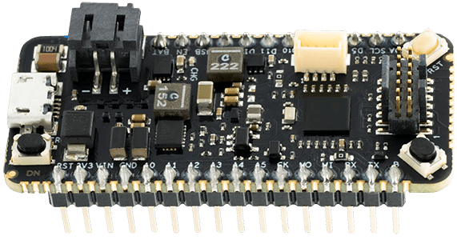
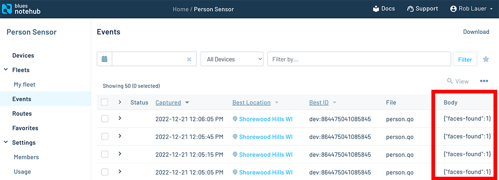

# Building a Cloud-Connected Person Sensor in 30 Lines of Code

Nothing gets me more excited about the IoT and embedded development than the opportunity presented by Machine Learning. Case in point (and shameless plug), I've built a [Raspberry Pi-based birding project](https://www.hackster.io/rob-lauer/remote-birding-with-tensorflow-lite-and-raspberry-pi-8c4fcc), a [speed trap](https://www.hackster.io/rob-lauer/busted-create-an-ml-powered-speed-trap-b1e5d1), and an [anomaly detection project using thermal images](https://www.hackster.io/rob-lauer/thermal-image-anomaly-detection-with-tinyml-36831c) - all using ML.


Well ok, maybe the one thing that *does* get me even more excited is building a connected IoT + ML project in minutes, **writing less code** with what is effectively **plug-and-play** hardware.

In this short tutorial, I'll show you how to use the new [Person Sensor](https://www.sparkfun.com/products/21231) from [Useful Sensors](https://usefulsensors.com/) to relay person-detection data to the cloud using a cellular IoT module: the [Notecard from Blues Wireless](https://blues.io/products/notecard/).

The above hardware pair, combined with a [STM32-based host microcontroller](https://blues.io/products/swan/) and a [secure cloud service](https://blues.io/products/notehub/), combine to form a low code solution for syncing face detection data with the cloud (literally in less than 30 lines of code).


## Introducing the Person Sensor

[Pete Warden](https://petewarden.com/) is considered one of the "founding fathers" of TinyML (ML on constrained devices). He spent years working on [TensorFlow Lite](https://www.tensorflow.org/lite) at Google and only recently left to form a new company called Useful Sensors.

Their first hardware product is, ahem, an *awfully useful sensor*:


The Person Sensor brings ML vision capabilities to virtually any product, in a low code manner. The device itself is pre-programmed with algorithms to detect faces via its on-board camera. These face-detection inferences are returned to a host MCU via an easy to use programming model - and the board itself connects to your host via a Qwiic I2C interface.

Using one of their [provided Arduino sketches](https://github.com/usefulsensors/person_sensor_arduino), you can see facial recognition data fed into your serial monitor:

```
********
1 faces found
Face #0: 99 confidence, (68, 71), 136x193, facing      
```

Let's see how we can add IoT to the mix and relay this data to the cloud, from anywhere in the world.

## Adding Cellular IoT

While I'm a fan of writing code, I'm an even bigger fan of writing *less* code. So, much like the Person Sensor, the [Blues Wireless Notecard](https://shop.blues.io/collections/notecard) is (IMO) the easiest way to add cellular connectivity to an IoT project.


The Notecard is a cellular system-on-module that comes **prepaid with 500MB of data and 10 years of global service**. It combines with the Blues Wireless cloud service, [Notehub](https://blues.io/products/notehub/), to form a secure device-to-cloud data pump.

And how do we program the Notecard? Not with AT commands!

The Notecard and Notehub live and breathe JSON. Since the Notecard also has an onboard GPS module, you can, for example, ascertain the device's location with a single request:

```
// request sent to Notecard 👇
{"req": "card.location"}

// response from Notecard 👇
{
  "status": "GPS updated (58 sec, 41dB SNR, 9 sats),
  "mode":   "periodic",
  "lat":    42.577600,
  "lon":    -70.871340,
  "time":   1598554399
}
```

The easiest way to prototype with the Notecard is to use a carrier board affectionately known as the [Notecarrier](https://blues.io/products/notecarrier/). In this case, we are using the [Notecarrier-A](https://blues.io/products/notecarrier/notecarrier-a/) with Qwiic connectors and onboard antennas:


## The Host Microcontroller

For this relatively simple low code project, you can use virtually any microcontroller or single-board computer you have lying around.

I picked the [Blues Wireless Swan](https://blues.io/products/swan/) for this tutorial, as it's easy to program, inexpensive, supports Arduino and CircuitPython, is the most extensible Feather-based MCU with plenty of I/O, and has a Qwiic connector to connect to the Notecarrier:



Connecting all of the hardware leads to a relatively clean setup (thanks Qwiic!):


## Those 30 Lines of Code

In a simple Arduino sketch we are going to perform a few tasks:

1. Set up the Person Sensor and read face detection data.
2. Initialize the Notecard to communicate with the cloud, over cellular.
3. Send accumulated face detection data to the cloud (Notehub) and beyond.

🥁 Here is the full sketch: 🥁 

```
#include <Wire.h>
#include <Notecard.h>
#include "person_sensor.h"

const int32_t SAMPLE_DELAY_MS = 10000;

#define PRODUCT_UID "<your-notehub-product-uid>"
Notecard notecard;

void setup()
{
  Wire.begin();
  notecard.begin();

  J *req = notecard.newRequest("hub.set");
  if (req)
  {
    JAddStringToObject(req, "product", PRODUCT_UID);
    JAddStringToObject(req, "mode", "continuous");
    notecard.sendRequest(req);
  }
}

void loop()
{
  person_sensor_results_t results = {};
  person_sensor_read(&results);

  if (results.num_faces > 0)
  {
    J *req = notecard.newRequest("note.add");
    if (req)
    {
      JAddStringToObject(req, "file", "person.qo");
      JAddBoolToObject(req, "sync", true);

      J *body = JCreateObject();
      if (body)
      {
        JAddNumberToObject(body, "faces-found", results.num_faces);
        JAddItemToObject(req, "body", body);
      }
      notecard.sendRequest(req);
    }
  }

  delay(SAMPLE_DELAY_MS);
}
```

> **NOTE:** Yeah yeah, it's actually 48 lines of code, not 30. I cheated a little and didn't count curly braces or blank lines 😅. There are also plenty of serial debug outputs you can (and should) add in there when debugging, all provided in this [Person Sensor sketch from Useful Sensors](https://github.com/usefulsensors/person_sensor_arduino/blob/main/person_sensor_arduino.ino).

## From Device to the Cloud

With the aforementioned code written and uploaded to the Swan MCU, let's look more closely at how we are getting data from the device to the cloud.

We start with a `hub.set` API call (FYI all of these commands are documented on [dev.blues.io](https://dev.blues.io/)):

```
J *req = notecard.newRequest("hub.set");
if (req)
{
  JAddStringToObject(req, "product", PRODUCT_UID);
  JAddStringToObject(req, "mode", "continuous");
  notecard.sendRequest(req);
}
```

This tells the Notecard which project on Notehub to connect to (the `PRODUCT_UID` string). We are also setting the cellular modem into `continuous` mode, which tells the Notecard to maintain a constant cellular connection (great for testing, bad for battery life!).

> **NOTE:** The beauty of using the Notecard and Notehub in tandem like this is the Notecard connects to Notehub through private VPN tunnels, **off the public Internet**. No certificate management required on the client or the server. 👍

The only other Notecard command is `note.add`, and this is how we send an event (a.k.a. a [Note](https://dev.blues.io/reference/glossary/#note)) to our cloud service:

```
J *req = notecard.newRequest("note.add");
if (req)
{
  JAddStringToObject(req, "file", "person.qo");
  JAddBoolToObject(req, "sync", true);

  J *body = JCreateObject();
  if (body)
  {
    JAddNumberToObject(body, "faces-found", results.num_faces);
    JAddItemToObject(req, "body", body);
  }
  notecard.sendRequest(req);
}
```

We are naming the event with the `file` argument, sending the event immediately with `sync:true`, and using the `body` of the request to relay the number of faces detected.

> **NOTE:** In a more real-world scenario, we would likely want to append other data to this request like GPS location, timestamps, and other relevant sensor data.

**With this, our barebones device-to-cloud connection is complete!**

Here are some of the face-detection events as they appear in Notehub:



**What can we now do with this data though?** The beauty of Notehub is that we can [securely route this data to any 3rd party cloud](https://dev.blues.io/notehub/notehub-walkthrough/#routing-data-with-notehub) (like AWS, Azure, or GCP), IoT platform (like Datacake, Ubidots, or Losant), or your own MQTT or RESTful HTTPS endpoint.

Blues Wireless provides [extensive tutorials](https://dev.blues.io/guides-and-tutorials/routing-data-to-cloud/) for both routing data and creating visual dashboards on many of these platforms.


## Summary

I hope you've seen how ridiculously easy it can be to quickly prototype what would've *previously* been considered a difficult series of tasks:

1. Building your own face detection ML model? Not trivial.
2. Hand-coding a TensorFlow Lite integration? Doable, but not easy.
3. Rolling your own cellular module and managing connectivity with AT commands? Yikes.
4. Integrating cellular connectivity, securely, with the cloud? Double yikes.

Be sure to get your own [Person Sensor from SparkFun](https://www.sparkfun.com/products/21231) and use this link to [take 10% off your own Blues Wireless Starter kit](https://shop.blues.io/discount/PERSON_SENSOR).

Happy Hacking! 👩‍💻