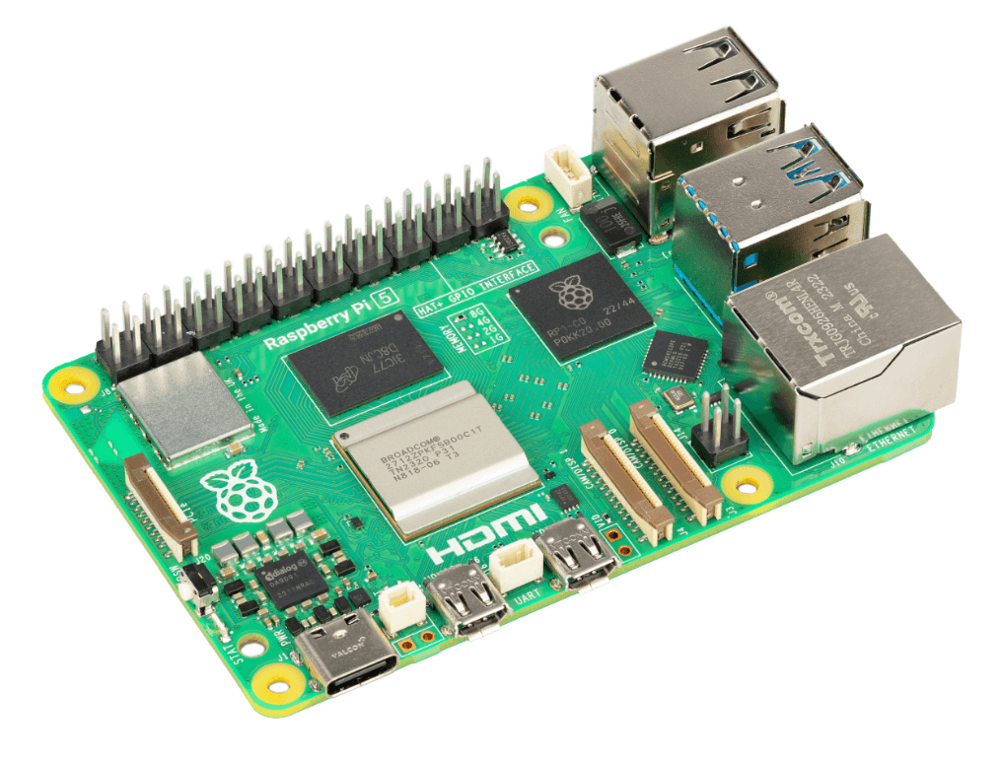

# Hands-On with Cellular IoT on the Raspberry Pi 5

What is now virtually an annual tradition, our friends at Raspberry Pi have released the latest model of their single board computer we all know and love, the [Raspberry Pi 5](https://www.raspberrypi.com/products/raspberry-pi-5/).



Sporting a new board layout, better performance, and new interfaces, the Pi 5 is an exciting product to behold. There's also (finally) a real-time clock on the Pi that can wake up your Pi from sleep mode - and it's programmable - which makes using the Pi in battery-powered edge deployments *slightly* more realistic.

My favorite feature though? The power button 🤗:


While the vast majority of work we perform on our Pis is within access to home/office Wi-Fi, there are plenty of us out there who are using the Pi in remote settings (on the aforementioned "edge" if you will). For example:

- [What’s Destroying My Yard? Pest Detection With Raspberry Pi](https://www.hackster.io/tjvantoll/what-s-destroying-my-yard-pest-detection-with-raspberry-pi-890c3a)
- [Busted! Create an ML-Powered Speed Trap](https://www.hackster.io/rob-lauer/busted-create-an-ml-powered-speed-trap-b1e5d1)
- [Remote Birding with TensorFlow Lite and Raspberry Pi](https://www.hackster.io/rob-lauer/remote-birding-with-tensorflow-lite-and-raspberry-pi-8c4fcc)

In these scenarios, access to Wi-Fi is difficult or impossible and the only valid connectivity options tend to be either cellular (too expensive!) or LoRaWAN (too rare!). **Hmmm, what to do!?**

Enter the [Blues Notecard](https://blues.com/products/notecard/). Designed around low-power and low-bandwidth connectivity scenarios, the Notecard provides an easy (yet powerful) way to add wireless connectivity via **prepaid Cellular, Wi-Fi, or LoRa** to virtually any physical device (yes, the Pi included).


> If you're interested, last year we put together this video on utilizing cellular on the Raspberry Pi 4, Zero, and Pico:

https://www.youtube.com/watch?v=4zE6mM0TX9M

## Cellular on the Raspberry Pi 5 in Action

In this project, I'm going to create a Python application that acts as both a **person counter** and a **temperature/pressure/humidity tracker**. We'll use the Blues Notecard to sync data with the cloud. We can then use the [Datacake](https://datacake.co/) platform to generate a cloud-based dashboard of the routed data.

*The app workflow looks something like this:*

1. **Detect a person's face** using the Pi's camera and OpenCV.
2. Keep a count of the **number of faces detected**.
3. Send the count of faces along with **temp/pressure/humidity data** to the cloud every minute.
4. Show a **report of accumulated data** on a cloud-based dashboard.

Yes, it's a bit of a contrived project, BUT it also demonstrates how easy it can be to gather data, send it to the cloud over cellular, and create a dashboard to view accumulated data:


## The Project Hardware

I'll be using the following hardware for this project:

1. [Raspberry Pi 5](https://www.raspberrypi.com/products/raspberry-pi-5/) (this also works with a Pi 4 or a Pi Zero 1 or 2)
2. [Raspberry Pi Camera Module v2](https://www.raspberrypi.com/products/camera-module-v2/)
3. [Blues Notecard Cell+WiFi](https://shop.blues.com/products/notecard-cell-wifi)
4. [Blues Notecarrier Pi Hat](https://shop.blues.com/products/carr-pi)
5. [Adafruit BME280 Temp/Pressure/Humidity Sensor](https://www.adafruit.com/product/2652)

There isn't any wiring involved, as the Notecard slots into the Notecarrier Pi Hat and the BME280 attaches to the Notecarrier via one of the provided Qwiic ports:


## Cellular (or Wi-Fi or LoRa) with the Notecard

The Notecard is ideal for this project, as it was built to send and receive small packets of JSON data (known as [Notes](https://dev.blues.io/api-reference/glossary/#note) in Blues parlance). This is great for scenarios like Machine Learning on the edge, where the **processing is done on the device** and the only data that needs to be relayed to the cloud are **small payloads that contain generated inferences**. Similarly, the Notecard can handle scenarios where you're gathering sensor data from the physical world and need to deliver that data once an hour, once a day, once a week, and so on.

> To be clear, the Blues Notecard is NOT a drop-in replacement for Wi-Fi on the Raspberry Pi. It's designed for low-bandwidth data transfers, so you won't be browsing the web in the middle of the desert.

You pay a one-time fee for the Notecard and it ships with **500MB of data and 10 years of global cellular service**. Full stop. No monthly SIM fees or subscriptions.

There are also Wi-Fi and LoRa options (same developer API, same hardware footprint):

 

The Notecard "just works" because:

1. It's securely paired (automatically) with a cloud service called [Notehub](https://notehub.io/). No certification management or device provisioning required.
2. You tell the Notecard which Notehub project it should connect to.
3. With two lines of code ([JSON-based API calls](https://dev.blues.io/api-reference/notecard-api/introduction/)) you connect your Pi to the cloud:

```
1. {"req":"hub.set","product":"com.blues.me:product","mode":"periodic"}
2. {"req":"note.add","body":{"temperature":21.3,"humidity":65.4}}
```

With all that said, let's get to the project!


## Install Libraries and Test Camera

Our project starts with [note-python](https://github.com/blues/note-python), which is the Blues-supported SDK for working with the Notecard via Python.

Install `note-python` with this command on the Pi terminal:

```
pip3 install note-python
```

Follow it up by installing a few other Python libraries, including `python-periphery` (for communicating with peripherals over I2C), `opencv-python` (which we will use for facial recognition), and `pimoroni-bme280` (to interface with the BME280).

Next, test that your camera is functioning properly with this command (you should see the input of the camera appear on the Pi desktop):

```
libcamera-hello –camera 0 -t 0
```


All good? Let's get to writing some code!

## The Python Code

> FYI, the full Python code can be found [in this gist on GitHub](https://gist.github.com/rdlauer/8cecc03e1f44fe5643f50d42b06a9467).

Start by including relevant dependencies:

```
#!/usr/bin/python3
import notecard
from notecard import hub
from periphery import I2C
import cv2
import keys
import time
from picamera2 import Picamera2
from smbus2 import SMBus
from bme280 import BME280
```

Connect to the Notecard over the I2C bus and add a placeholder for the unique identifier (e.g. `productUID`) of your cloud project on [Notehub](https://notehub.io/):

```
# init the notecard
productUID = keys.NOTEHUB_PRODUCT_UID
port = I2C("/dev/i2c-1")
nCard = notecard.OpenI2C(port, 0, 0)
```

**Notehub is insanely valuable here** because it not only acts as a secure cloud proxy for the Notecard to send data, it also lets you quickly route data to your cloud application (e.g. AWS, Azure, Datacake, Ubidots, and so on). It's free to use for most projects.

Link the Notecard with your free Notehub project and put the Notecard's cellular modem into `continuous` mode.

> This tells the Notecard to maintain a *continuous* cellular connection (this good for demos, not great for battery life, which is why the Notecard defaults to `periodic` mode to only *periodically* send data and save power):

```
# connect notecard to notehub
rsp = hub.set(nCard, product=productUID, mode="continuous")
print(rsp)
```

Initialize the BME280 sensor:

```
# init the BME280
bus = SMBus(1)
bme280 = BME280(i2c_dev=bus, i2c_addr=0x77)
```

Next, you'll need to download the appropriate "frontal face" pre-trained classifier from [this GitHub repository](https://github.com/kipr/opencv/tree/master/data/haarcascades). We'll be using [OpenCV](https://opencv.org/) to detect and classify images as faces. This XML file will need to be saved to your Pi in an accessible directory.

Load the classifier XML file and initialize the Pi camera:

```
# Grab images as numpy arrays and leave everything else to OpenCV.
face_detector = cv2.CascadeClassifier("haarcascade_frontalface_default.xml")
cv2.startWindowThread()

picam2 = Picamera2()
picam2.configure(picam2.create_preview_configuration(main={"format": 'XRGB8888', "size": (640, 480)}))
picam2.start()
```

Add some variables for tracking counts of faces detected and timestamps used to time sending data to the cloud:

```
# keep track of face counts between notes
face_count = 0

# keep track of seconds for adding faces/syncing
start_secs_face = int(round(time.time()))
start_secs_note = int(round(time.time()))
```

Next, define a function that will send a Note (a.k.a. an event) to Notehub. A "Note" is JSON dressing around any arbitrary JSON payload (booleans, strings, ints, etc):

```
def send_note(c):
   
    # query the notecard for power supply voltage
    req = {"req": "card.voltage", "mode": "?"}
    rsp = nCard.Transaction(req)
    voltage = rsp["value"]
   
    # get the temp/pressure/humidity from bme280
    temperature = bme280.get_temperature()
    pressure = bme280.get_pressure()
    humidity = bme280.get_humidity()

    req = {"req": "note.add"}
    req["file"] = "face.qo"
    req["body"] = {"face_count": c, "voltage": voltage, "temperature": temperature, "pressure": pressure, "humidity": humidity}
    req["sync"] = True
    rsp = nCard.Transaction(req)

    print(rsp)
```

Finally, initiate an infinite loop, and inside that loop:

1. Attempt to classify faces (while drawing a border and adding some labels to the recognized faces).
2. If a face is detected, increment the `face_count` variable.
3. Lastly, if one minute has passed execute the aforementioned `send_note` function to send this data to the cloud!

```
while True:
    # track the current time
    current_seconds = int(round(time.time()))
   
    im = picam2.capture_array()

    grey = cv2.cvtColor(im, cv2.COLOR_BGR2GRAY)
    faces = face_detector.detectMultiScale(grey, 1.1, 5)

    # Add text around each face
    font = cv2.FONT_HERSHEY_DUPLEX
    fontScale = 1
    color = (0, 0, 255)
    thickness = 2
   
    # Draw the rectangle around each face
    for (x, y, w, h) in faces:
        cv2.rectangle(im, (x, y), (x + w, y + h), (0, 255, 0))
        face_plural = 's'
        if face_count == 1:
            face_plural = ''
        cv2.putText(im, 'Face found!', (x, y-10), font,
                   fontScale, color, thickness, cv2.LINE_AA)

    cv2.imshow("Camera", im)
   
    if len(faces) > 0:
        # check to make sure it's been at least three seconds since the last time we checked for faces
        if current_seconds - start_secs_face >= 3:
            face_count += len(faces)
            print("We found some faces: " + str(len(faces)) + " to be exact! (Pending sync: " + str(face_count) + " faces)")
            start_secs_face = int(round(time.time()))
   
    # create an outbound note every 5 minutes with accumulated face counts
    if current_seconds - start_secs_note >= 60:
        send_note(face_count)
        print("####################")
        print("Sending a new note with " + str(face_count) + " faces.")
        print("####################")
        face_count = 0
        start_secs_note = int(round(time.time()))
   
    cv2.waitKey(1)
```

**That's it!**

Run the Python app and you should see the camera window appear, start saving data to flash on the Notecard, and immediately syncing that data to Notehub:

```
We found some faces: 1 to be exact! (Pending sync: 1 faces)
We found some faces: 1 to be exact! (Pending sync: 2 faces)
We found some faces: 1 to be exact! (Pending sync: 3 faces)
We found some faces: 1 to be exact! (Pending sync: 4 faces)
We found some faces: 1 to be exact! (Pending sync: 5 faces)
We found some faces: 1 to be exact! (Pending sync: 6 faces)
We found some faces: 1 to be exact! (Pending sync: 7 faces)
{'template': True}
####################
Sending a new note with 7 faces.
####################
```

> **Reminder:** The full Python code can be found [in this gist on GitHub](https://gist.github.com/rdlauer/8cecc03e1f44fe5643f50d42b06a9467).

## Notehub to Cloud

With project in its current state, the Notecard will start syncing data with Notehub immediately as it comes in (which is every minute). You'll see these Notes (or events) appear in the **Events** tab of your project:


While it's cool to see this data appear, it's not all that useful. Let's add a quick integration to build a cloud-based dashboard using [Notehub Routes](https://dev.blues.io/notehub/notehub-walkthrough/#routing-data-with-notehub) and Datacake.

> Notehub supports routing data to virtually any hosted cloud service over **HTTPS and MQTT protocols**. [Blues provides routing tutorials](https://dev.blues.io/notehub/notehub-walkthrough/#available-route-tutorials) that walk you through every step in the process.

## Routing Data to Datacake

[Datacake](https://datacake.co/) is a low-code platform that lets you build IoT applications in a minimal amount of time (as we will see here today).

Now, if you look at one of the events sent to Notehub and view the **JSON** tab, you'll see a fair amount of data that you can route to Datacake:

```
{
    "event": "1ab42897-17c6-4877-b902-c2ee1c1c7e96",
    "session": "e889f105-226d-45f6-a3cc-d8028a655326",
    "best_id": "dev:860322068073292",
    "device": "dev:860322068073292",
    "product": "product:com.blues.rlauer:faceml",
    "app": "app:0c85569f-5cd8-4d84-9548-eab244c57f59",
    "received": 1701718035.34947,
    "req": "note.add",
    "when": 1701718034,
    "file": "face.qo",
    "body": {
        "face_count": 8,
        "humidity": 27.78125,
        "pressure": 983.5,
        "temperature": 24.5,
        "voltage": 5.171875
    },
    "best_location_type": "triangulated",
    "best_location_when": 1701462279,
    "best_lat": 43.071243,
    "best_lon": -89.43282,
    "best_location": "Shorewood Hills WI",
    "best_country": "US",
    "best_timezone": "America/Chicago",
    "tri_when": 1701462279,
    "tri_lat": 43.071243,
    "tri_lon": -89.43282,
    "tri_location": "Shorewood Hills WI",
    "tri_country": "US",
    "tri_timezone": "America/Chicago",
    "tri_points": 3,
    "status": "success",
    "fleets": [
        "fleet:664b55a8-d3c0-4e76-8588-90e8fef53d20"
    ]
}
```

We are going to want to route this data to Datacake, but the only values we care about are `temperature`, `pressure`, `humidity`, `voltage`, and `face_count`.

### Create the Datacake Route

Instead of reinventing the wheel, [head to the complete Datacake tutorial on blues.dev](https://dev.blues.io/guides-and-tutorials/routing-data-to-cloud/datacake/) to complete the initial creation of the route. Go ahead, it won't take too long I swear!

We need to make a few edits to the configuration of the fields and payload decoder settings in Datacake.

### Add Fields in Datacake

Since we are sending the aforementioned `temperature`, `pressure`, `humidity`, `voltage`, and `face_count` variables to Datacake, we'll need to make sure Datacake knows to expect them.

Navigate to the **Fields** section of your device configuration in Datacake. Make sure those values align with what's shown here (if you have additional fields, that's fine, they will just be ignored by the dashboard):


### Update HTTP Payload Decoder in Datacake

Datacake has a "payload decoder" that will consume the JSON payload you send from Notehub, then massage that data into the format it needs to represent it in a dashboard.

I'll save you a step and provide you the full payload decoder code I used:

```
function Decoder(request) {
    
    var data = JSON.parse(request.body);
    var device = data.device;
    
    var file = data.file;
    
    var decoded = {};
    
    decoded.voltage = data.body.voltage;
    decoded.temperature = data.body.temperature;
    decoded.humidity = data.body.humidity;
    decoded.pressure = data.body.pressure;
    decoded.face_count = data.body.face_count;
    
    if (("best_lat" in data) && ("best_lon" in data)) {
        decoded.device_location = "(" + data.best_lat + "," + data.best_lon + ")";
    }
    
    decoded.rssi = data.rssi;
    decoded.bars = data.bars;
    
    // Array where we store the fields that are being sent to Datacake
    var datacakeFields = []
    
    // take each field from decodedElsysFields and convert them to Datacake format
    for (var key in decoded) {
        if (decoded.hasOwnProperty(key)) {           
            datacakeFields.push({field: key.toUpperCase(), value: decoded[key], device: device})
        }
    }      
    
    // forward data to Datacake
    return datacakeFields;
}
```

> You'll notice I also included a `device_location` field, which will use the location of the device on the dashboard (but only if it's sent in an event from Notehub).

### Create Datacake Dashboard

Next, navigate to the **Dashboard** tab in Datacake. Use the GUI tools they provide to add the appropriate widgets to chart values like temperature, pressure, number of faces detected, and so on.


When all is said and done, you should have a gorgeous cloud-based dashboard!


## What's Next?

Hopefully you've seen how easy it can be to add low-bandwidth cellular connectivity to a Raspberry Pi. It's important to note the Notecard also supports virtually every modern host MCU (like STM32, ESP32, Nordic, and so on). You can get started with a STM32 host using the [Blues Starter Kit](https://shop.blues.com/collections/blues-starter-kits).

More likely though, you're looking for the [Blues Notecarrier Pi hat](https://shop.blues.com/products/carr-pi) and [any Notecard](https://shop.blues.com/collections/notecard) to get started with cellular on the Pi. Just consult the [Blues Quickstart](https://dev.blues.io/quickstart/blues-quickstart/) to get started!

Happy Hacking! 💙