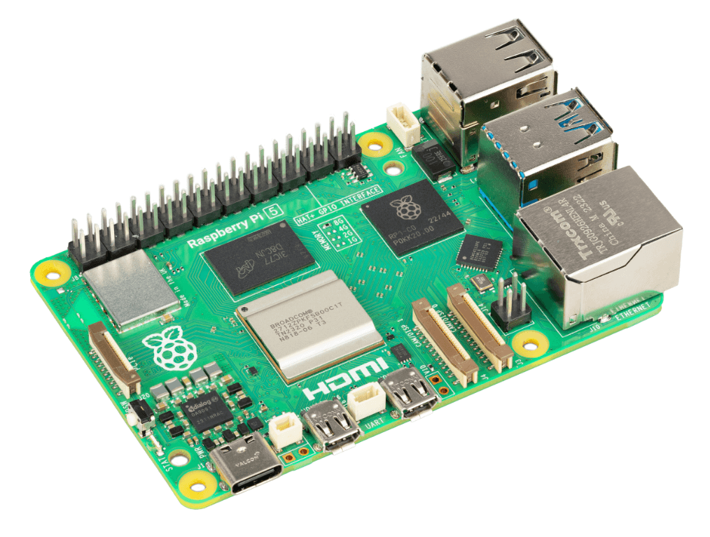
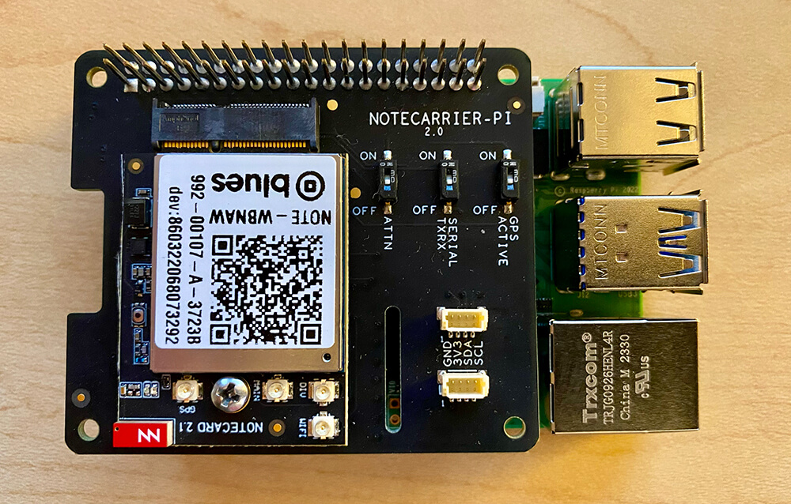

# Hackster Tutorial: Hands-On with Cellular IoT on the Raspberry Pi 5

What is now virtually an annual tradition, our friends at Raspberry Pi have released the latest model of the single board computer we all know and love, the [Raspberry Pi 5](https://www.raspberrypi.com/products/raspberry-pi-5/).

Sporting a new board layout, better performance, and new interfaces, the Pi 5 is an exciting product to behold. There's also (finally) a real-time clock on the Pi that can wake up your Pi from sleep mode - and it's programmable - which makes using the Pi in battery-powered edge deployments *slightly* more realistic.

For example:

- [What’s Destroying My Yard? Pest Detection With Raspberry Pi](https://www.hackster.io/tjvantoll/what-s-destroying-my-yard-pest-detection-with-raspberry-pi-890c3a)
- [Busted! Create an ML-Powered Speed Trap](https://www.hackster.io/rob-lauer/busted-create-an-ml-powered-speed-trap-b1e5d1)
- [Remote Birding with TensorFlow Lite and Raspberry Pi](https://www.hackster.io/rob-lauer/remote-birding-with-tensorflow-lite-and-raspberry-pi-8c4fcc)

In these scenarios, access to Wi-Fi is difficult or impossible and the only valid connectivity options tend to be either cellular or LoRaWAN.

Enter the [Blues Notecard](https://blues.com/products/notecard/). Designed around low-power and low-bandwidth connectivity scenarios, the Notecard provides an easy (yet powerful) way to add wireless connectivity via **prepaid Cellular, Wi-Fi, or LoRa** to virtually any physical device (yes, the Pi included).

## Cellular on the Raspberry Pi 5 in Action

In this project, we will create a Python application that acts as both a **person counter** and a **temperature/pressure/humidity tracker**. We'll use the Blues Notecard to sync data with the cloud. We can then use the [Datacake](https://datacake.co/) platform to generate a cloud-based dashboard of the routed data.

*The app workflow looks something like this:*

1. **Detect a person's face** using the Pi's camera and OpenCV.
2. Keep a count of the **number of faces detected**.
3. Send the count of faces along with **temp/pressure/humidity data** to the cloud every minute.
4. Show a **report of accumulated data** on a cloud-based dashboard.

## View the Project on Hackster

The complete cellular IoT tutorial for the Raspberry Pi is [available here on Hackster](https://www.hackster.io/rob-lauer/hands-on-with-cellular-iot-on-the-raspberry-pi-5-8c9e44).

If you're interested, last year we put together this video on utilizing cellular on the Raspberry Pi 4, Zero, and Pico:

https://www.youtube.com/watch?v=4zE6mM0TX9M

## What's Next?

After reading through the tutorial, you can get your own [Blues Notecarrier Pi hat](https://shop.blues.com/products/carr-pi) and [any Notecard](https://shop.blues.com/collections/notecard) to get started with cellular on the Pi. Just consult the [Blues Quickstart](/quickstart/blues-quickstart/) to get started.

Happy Hacking on the Pi! 🥧