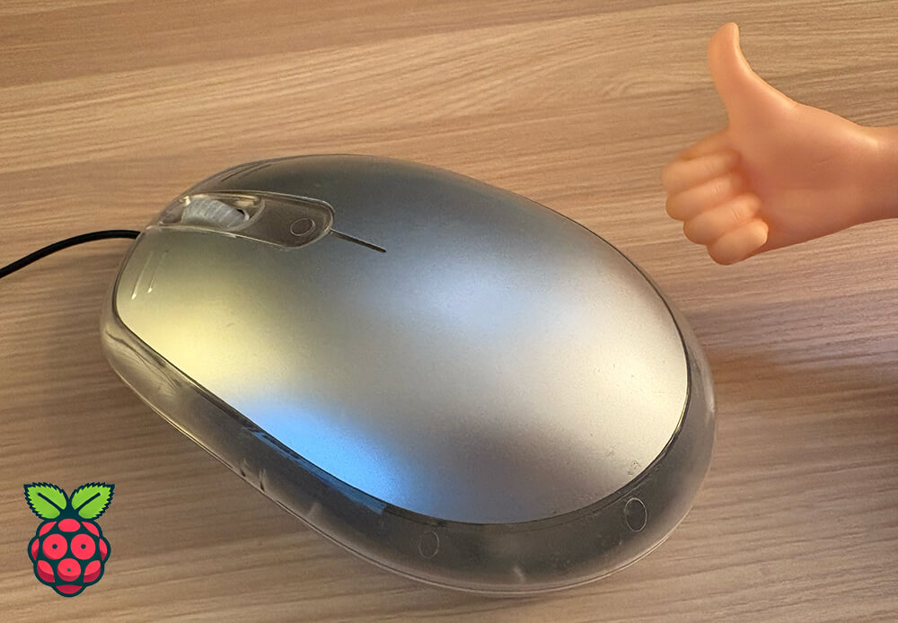

# Announcing the Raspberry Pi 50000: The Future of Computing is Just a Mouse

*Banner image logo most certainly NOT provided by Raspberry Pi!*

Welcome fellow Raspberry Pi nerds - and apologies in advance to the 
[Raspberry Pi Foundation](https://www.raspberrypi.org/) for stealing their 
thunder on [Pi Day](https://en.wikipedia.org/wiki/Pi_Day)!

I am thrilled - no, *honored* - to introduce the next evolution in single-board 
computing: the **Raspberry Pi 50000**.

Many of you are aware of the 
[Raspberry Pi 500](https://www.raspberrypi.com/products/raspberry-pi-500/), the 
groundbreaking device that was literally just a keyboard (well, and the 
equivalent internals of a Raspberry Pi 5).

While I don't know if the Raspberry Pi Foundation heard your feedback after the 
release of the 500, but I certainly did.

You want to go *smaller*. You want to be *less productive*.

So, I dove into my lab and took a long, hard look at what computing really 
means and I made a bold decision. A decision that will redefine innovation. 
**You want...a mouse.**

I give you the Raspberry Pi 50000:

Yes. Just. A. Mouse.

It's 2025. Keyboards and monitors are *barely* used anymore. Remember when Apple 
dropped the headphone jack from the iPhone? **This is like that, but 
even...more.**

**How do you use it?** I assume you'll figure it out. Just like you figured out 
that the Raspberry Pi 500 was not, in fact, a standalone computer. You adapt. 
You evolve. I innovate.

## What's Inside the 50000?

Prying open the "case" of the Raspberry Pi 50000, we can see the internals 
include a Raspberry Pi Pico (literally).

Now, and this is where we really blow 
your socks off, also inside this perfectly normal, borderline disposable 
mouse...is a [Blues Notecard](https://blues.com/products/notecard/) for cellular 
data access.

Yes, cellular. Because in 2025, why would you need a screen or a keyboard or 
even a basic computer when you can have a mouse that has full 4G LTE 
connectivity?

That's right, folks, you can now click your way to the future, no matter where 
you are. Need to record the number of clicks on your mouse? Maybe send the 
temperature inside your mouse to the cloud? Boom. Done.

And let's talk specs. It's a mouse. It clicks. It scrolls. But deep inside this 
unassuming husk, there's a tiny cellular system-on-module that's *actually* 
useful.

## But Seriously, Notecard

While the Raspberry Pi 50000 may have limited utility (or does it?) I can attest 
that the [Blues Notecard](https://blues.com/products/notecard/) is the **easiest 
way to add low-bandwidth cellular connectivity** to any embedded system.

*Cellular, Wi-Fi, LoRa, and Satellite from Blues*

Notecard is a tiny device-to-cloud data pump. Shipping prepaid with 10 years of 
global service, 500MB of data, and a 
[variety of carrier board options](https://blues.com/products/notecarrier/) to 
connect to *your* preferred host MCU 
([or Pi!](https://blues.com/products/notecarrier/notecarrier-pi/)), Notecard is 
kind of a no-brainer in the IoT.

It's also an incredibly **secure device**, as your Notecard won't have a 
publicly-accessible IP address. You use a 
[secure cloud proxy](https://blues.com/notehub/), accessed via private VPN 
tunnels, to communicate between your Notecard and your cloud.

It's cellular connectivity that Just Works™, even with a 
[Pico](https://dev.blues.io/blog/getting-started-with-raspberry-pi-pico-and-blues-notecard/), even with a 
Raspberry Pi 50000 😅.

## So How Does Raspberry Pi 50000 Work?

Now, back to the Raspberry Pi 50000, you might be asking: "How do I use it?"

To which I say: "Why are you looking at me?"

However, to get started with the *Blues Notecard* and your Raspberry Pi, STM32, 
ESP32, or whatever host you're using, check out the 
[Blues Developer Center](https://dev.blues.io/) for quickstarts, guides, and 
example apps.

In the meantime, if the Raspberry Pi 50000 is something you're *actually* 
interested in...well, best of luck to you in all your future endeavors.

> Yes this is satire...I mean come on people did I really just need to write 
> that? 😅
