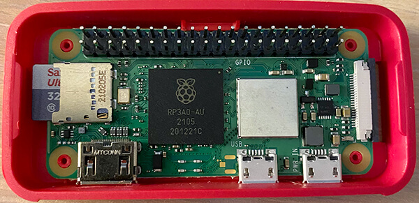
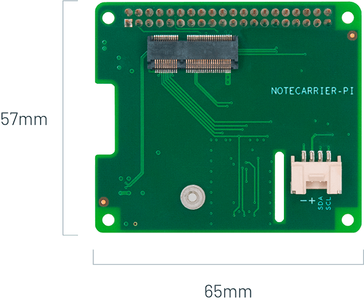
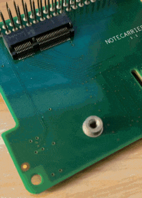
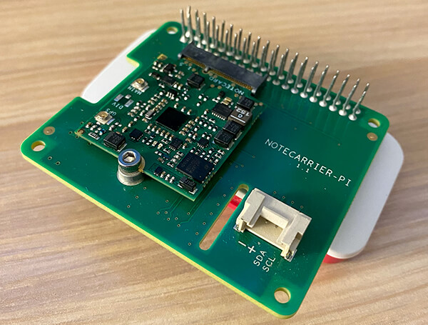
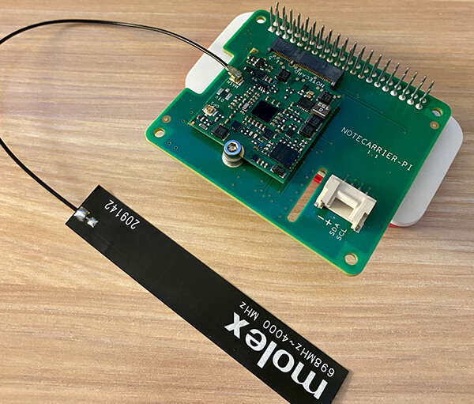
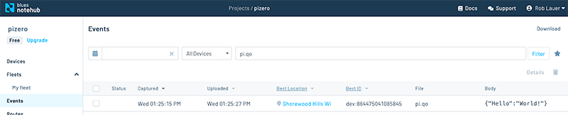

# Easiest Way to Add Cellular to the Raspberry Pi Zero 2

*Learn how to add an affordable cellular option to your Raspberry Pi Zero.*

This holiday season I'm thankful for many things, not the least of which is the fact that I got my hands on the new [Raspberry Pi Zero 2 W](https://www.raspberrypi.com/products/raspberry-pi-zero-2-w/)! And I have to say, it's been an absolute dream to work with.



Building on the foundation of the original Raspberry Pi Zero, the 2 W includes a significantly improved CPU (a quad core Cortex-A53 @ 1 GHz to be precise) and improved wireless performance over its Wi-Fi enabled predecessor.

Now while Wi-Fi is a great connectivity method for the IoT, adding cellular access to the Zero can turn it into a truly "off-grid" Raspberry Pi. You may also want to enable cellular as a fallback connectivity method in case Wi-Fi goes down. Either way, read on for a quick tutorial on the easiest way to add cellular connectivity to the Raspberry Pi Zero (1 or 2!).

### Introducing the Notecard

The key to your success with adding cellular communication capabilities to the Raspberry Pi Zero is the [Notecard](https://blues.io/products/notecard/).


The Notecard is a tiny 30mm x 35mm device-to-cloud data pump. With both cellular and GPS capabilities (and predictable pricing that starts at \$49 for 10 years and 500 MB of data) the Notecard is a no-brainer for when you want to start pushing data to the cloud over LTE-M, NB-IoT, or Cat-1 cellular.

But what about that M.2 edge connector at the bottom of the Notecard? How on earth do you use this with a Raspberry Pi single-board computer (SBC)? The answer comes in the form of a HAT (the Notecarrier-Pi HAT that is).



The [Notecarrier-Pi](https://blues.io/products/notecarrier/notecarrier-pi/) is a HAT (Hardware Attached on Top) that's compatible with every Raspberry Pi SBC. It includes pass-through headers for stacking multiple HATs, a Grove I2C port, and an external antenna.

### Installing the Notecard and Notecarrier-Pi HAT

I'm not here to insult your intelligence, nor do I want to waste your time. I state this because the physical installation steps are about as simple as you might expect when working in the Raspberry Pi ecosystem!

1) Slot the Notecard into the provided M.2 slot and screw the Notecard onto the HAT:



2) Plug the Pi HAT into your Raspberry Pi Zero's 40-pin header:



3) Plug the provided molex antenna into the `MAIN` u.FL connector on the Notecard:



And yes, that's the end of the installation tutorial!

### Get the Raspberry Pi Zero Ready

There are a few one-time configuration steps to make the development experience as seamless as possible.

First, open up the "Raspberry Pi Configuration Tool" with:

```
$ sudo raspi-config
```

...and enable the I2C interface if it isn't already enabled.

Verify that the Pi HAT is correctly installed by using `i2c-tools`:

```
sudo apt-get install -y i2c-tools
sudo i2cdetect -y 1
```

The second command should show the Notecard on the correct I2C address (`0x17`).

Install the `note-python` and `python-periphery` libraries:

```
sudo pip3 install note-python python-periphery
```

And you are good to go!

### Send Some Data to the Cloud Over Cellular

Since the [Notecard API](https://dev.blues.io/reference/notecard-api/introduction/) is 100% JSON-based (literally, everything is JSON in and JSON out), it doesn't matter what programming language you use. But since we are on a Raspberry Pi, we are going to stick with Python.

Open up your preferred text editor ([Thonny](https://thonny.org/) is a nice one for Python development on the Pi) and paste in this entire code block. We'll go through a few important bits afterwards:

	import notecard
	from notecard import hub, card, note
	from periphery import I2C
	
	productUID = "com.gmail.something:pizero"
	port = I2C("/dev/i2c-1")
	nCard = notecard.OpenI2C(port, 0, 0)
	
	# associate Notecard with a project on Notehub.io
	rsp = hub.set(nCard, product=productUID, mode="continuous")
	
    # send a single "note" to the cloud over cellular!
    rsp = note.add(nCard, file="pi.qo", body={"Hello":"World!"})

*Now what's all going on here?*

- We are opening a communication port on the I2C bus (`/dev/i2c-1`).
- We are using the [hub.set](https://dev.blues.io/reference/notecard-api/hub-requests/#hub-set) API to associate the Notecard with a Notehub project (more on Notehub below).
- We are sending the JSON "Hello World!" object to the cloud, over cellular.

### Viewing Your Cellular Data in the Cloud

Yes, we did put the cart before the horse by going through the Python code _prior_ to setting up the cloud service that receives data. So now is a good time to run through what [Notehub](https://blues.io/services/) is all about.

Notehub is a cloud service from Blues Wireless that provides the ability to securely receive, process, and **route data to your cloud endpoint of choice**. This could be AWS, Azure, Google Cloud, or any number of IoT platforms like Datacake or Ubidots (or even your own custom RESTful API).


Notehub also provides OTA firmware update features, fleet management, and [cloud-based environment variables](https://dev.blues.io/notecard/notecard-guides/understanding-environment-variables/) for easily sharing data across fleets of Notecards.

After creating a free account at [Notehub.io](https://notehub.io/) and setting up your first project, you'll want to copy the provided [ProductUID](https://dev.blues.io/reference/glossary/#productuid) and paste that into the `product` parameter in the `hub.set` call in the Python script above.

Upon running the Python script, the `note.add` function will be executed. You can then log into the Notehub project and view related events in the **Event** panel:



From here you can set up routes to start relaying data to any cloud endpoint.

> **TIP:** The Notecard can also _receive_ data as documented in the [Inbound Requests & Shared Data Guide](https://dev.blues.io/notecard/notecard-walkthrough/inbound-requests-and-shared-data/).

### Next Steps with the Pi

Clearly we've only just scratched the surface with the Notecard and Raspberry Pi Zero. Hopefully you've witnessed how ridiculously easy it is to add cellular connectivity and send data to the cloud in a matter of minutes.

If you're looking for some good next steps, I can recommend:

- Grabbing your own [Raspberry Pi Starter Kit](https://shop.blues.io/collections/development-kits/products/raspberry-pi-starter-kit).
- Following the complete [Notecard Quickstart Tutorial](https://dev.blues.io/start/quickstart/notecarrier-pi/).
- Learn how to [route data to your cloud of choice](https://dev.blues.io/start/tutorials/route-tutorial/).

Happy hacking on the Pi Zero! 👩‍💻🥧0️⃣