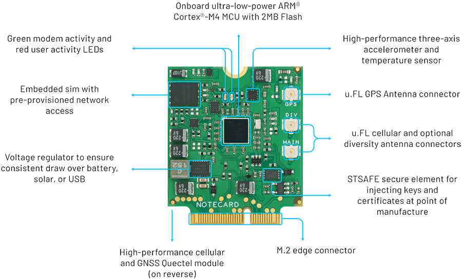
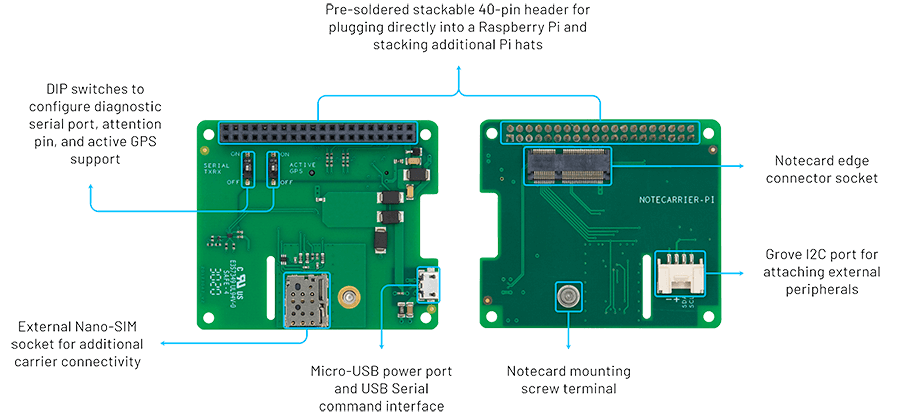
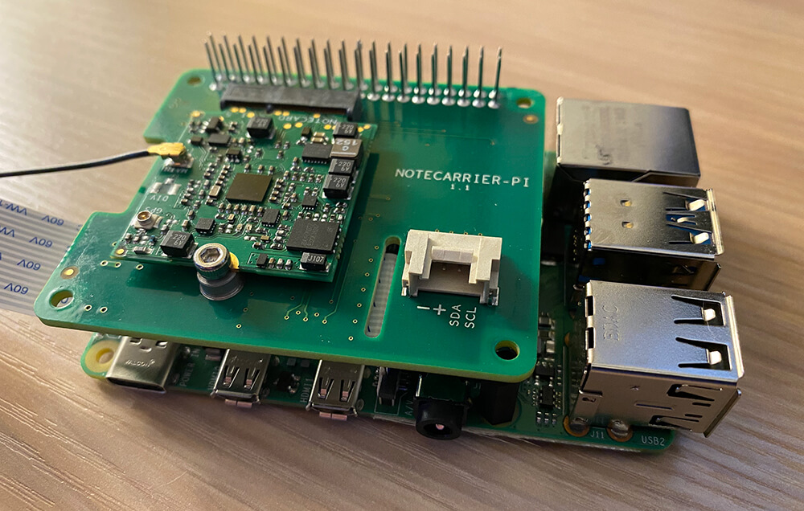

# Remote Birding with TensorFlow Lite and Raspberry Pi

I'm a simple man. All I want in life is to sit on my back porch, sip my coffee, and watch the birds at the feeder.

Alas, I'm not quite there yet. Like many of us, my days are spent in front of a screen instead of gazing upon nature in all its glory. However, I'm not one to give up on my dream entirely. Instead of watching the birds come in, why not be notified when birds are at the feeder (and which birds are showing up)? Great idea Rob! Let's build it!

<blockquote class="twitter-tweet">
And just like that I turned into a person that calls people to come look at the bird feeder.
&mdash; Simon Holland (@simoncholland) <a href="https://twitter.com/simoncholland/status/1366020669788610562?ref_src=twsrc%5Etfw">February 28, 2021</a></blockquote> 

You've likely [seen similar applications](https://coral.ai/projects/bird-feeder/#project-intro) of Machine Learning (ML) in practice. Identifying birds is a fairly [common and fun ML exercise](https://www.hackster.io/agent-hawking-1/observe-your-backyard-birds-with-a-custom-ml-model-cc923c). I'm not here to rehash existing tutorials, but rather to show you a proof-of-concept implementation of this scenario in a **disconnected remote setting**.

For many of us, once we leave the friendly confines of our dwelling our WiFi signals drop. In my case, my bird feeder is well outside the range of not only WiFi, but also electricity (and as much as I'd love to run a 100-foot extension cord through my yard, I think I'll pass).

So in this case by remote, I mean REMOTE. We will need a solution that provides both **cellular connectivity** and **battery power** (backed up by solar).

*We are going to build a remote ML-powered birding solution that is a:*

1. Battery-powered (with a solar charger),
2. Raspberry Pi 4,
3. with a PIR motion sensor,
4. and a Pi Camera,
5. running the TensorFlow Lite runtime (using Python),
6. sending identified bird data over cellular,
7. and notifying us via SMS!

Phew! That's a lot to chew on. What if I told you we could tackle all of this in **about 100 lines of Python**? Let's get started!

Wait.

I know what you're thinking. "A solar-powered RPi 4? Why not just strap a laptop to a tree with a bungee cord?" Valid argument. The RPi 4 is not exactly a power-sipping IoT device. This tutorial is meant to be a proof-of-concept and a relatively simple entry point to ML, so let's have fun with it.

> **SPOILER:** The next iteration is going to pivot to using a Raspberry Pi Pico and focus on power optimization, ML model refinement, and a more sustainable solution. [Stay tuned!](https://www.hackster.io/rob-lauer/projects)

## Machine Learning with TensorFlow Lite

Before we get to the project, let's make sure we're all on the same page regarding Machine Learning, TensorFlow, and TensorFlow Lite.

When people ask me what Machine Learning *really* is, I recall a quote that sums it up quite nicely:

> "Machine Learning is a computer to do something without being programmed to do it."

Arguably the most popular ML platform is [TensorFlow](https://www.tensorflow.org/) from Google. It's developer-friendly, with a rich ecosystem of tools and [pre-built models](https://tfhub.dev/) to choose from.

The full TensorFlow distribution is a bit heavy for MCUs and even SBCs like Raspberry Pi, hence the creation of [TensorFlow Lite](https://www.tensorflow.org/lite/) for edge devices.

TensorFlow Lite allows you to take the same ML models used with TensorFlow (with some tweaks) and deploy them in mobile and IoT edge computing scenarios. There are obvious downsides with minimal compute power and less accurate results. However, what you can accomplish with a tiny processor sipping tiny amounts of power is still quite staggering.

If not slightly imperfect at times.

### Finding a Bird Model

For the purposes of this project I was in no mood to create my own TensorFlow Lite model for bird identification. Instead I left it to the experts and [discovered a pre-built TensorFlow Lite model](https://tfhub.dev/google/lite-model/aiy/vision/classifier/birds_V1/3).

It's licensed under Apache-2.0 👍, but also contains most known birds on the planet 👎 which may lead to some imperfect results. Good enough to proceed though!

## Cellular IoT with Notecard

The next relative unknown for this project is how we are going to add wireless cellular connectivity.

I chose to tackle this with the Notecard from [Blues Wireless](https://blues.io/). The [Notecard](https://blues.io/products/) is a cellular and GPS-enabled device-to-cloud data-pump that comes with 500 MB of data and 10 years of cellular service starting at \$49. No activation charges, no monthly fees.

The Notecard itself is a tiny 30mm x 34mm SoM and ships ready to embed in a project via its m.2 connector. But to make things even easier, Blues Wireless also provides a series of expansion boards (Notecarriers). For this project, I used the [Notecarrier-PI](https://shop.blues.io/products/raspberry-pi-starter-kit), a Pi HAT with pass-through headers.

The Notecard comes preconfigured to securely communicate with [Notehub.io](https://notehub.io/), the Blues Wireless service that enables secure device-to-cloud data flow. Notecards are assigned to a project in Notehub, which then syncs data in those projects for routing to your cloud of choice.

The Notecard is an IoT developer's dream come true due to the baked-in security, automatic provisioning, and developer-friendly programming model.

For instance, all commands to/from the Notecard are just JSON! Should we want to send data in an event (a.k.a. "note") from Notecard to the cloud, this is how it might be composed:

	{
	    "req":"note.add",
	    "body":{
	        "temp":35.5,
	        "humid":56.23
	    }
	}

Enough background, let's get to building our birding solution! 🐦📷

## Project Setup

Assuming that we are starting with a base Raspberry Pi 4, our first step is to update the system packages:

	sudo apt-get update
	sudo apt-get full-upgrade
	
Next, we need create a new directory on the RPi to hold our app assets:

	mkdir /Documents/apps/pibird
	cd /Documents/apps/pibird
	
Download the TensorFlow Lite model and label map (the `birds-model.tflite` and `birds-label.txt` files) [from this GitHub repository](https://github.com/rdlauer/pibird) and drop them in the `pibird` directory.

Finally, create a new file called `bird.py` and a directory called `images` to store captured photos.

Our directory structure should look something like this:

	/pibird
		bird.py
		birds-label.txt
		birds-model.tflite
		/images

## Install Prerequisites

At this point I highly recommend setting up a new [virtual environment](https://docs.python.org/3/tutorial/venv.html). This will prevent conflicts between versions of Python libraries that may already be installed.

If not already available, install `virtualenv` with:

	sudo pip3 install virtualenv
	
Create the `bird-env` virtual environment:

	python3 -m venv bird-env
	
You should now have a new directory within `pibird` called `bird-env`. This will store all of the packages for this environment.

Activate the virtual environment with:

	source bird-env/bin/activate
	
> **NOTE:** You'll need to issue this `source` command every time you open a new terminal window.
	
### Install TensorFlow Lite

Since all we are doing is *interpreting* an existing TensorFlow Lite model, we can get away with only installing the TensorFlow Lite runtime.

Per [the TensorFlow Lite instructions](https://www.tensorflow.org/lite/guide/python), install the package with:

	echo "deb https://packages.cloud.google.com/apt coral-edgetpu-stable main" | sudo tee /etc/apt/sources.list.d/coral-edgetpu.list
	curl https://packages.cloud.google.com/apt/doc/apt-key.gpg | sudo apt-key add -
	sudo apt-get update
	sudo apt-get install python3-tflite-runtime

Open up `bird.py` in your editor of choice and add this first import statement:

	from tflite_runtime.interpreter import Interpreter

### Raspberry Pi Camera

If you're using the default installation of Raspbian, it's more than likely the `picamera` package is already installed. You can check by issuing this command:

	raspistill -v -o test.jpg
	
Did it work? Great! If not, try:

- [Verifying the camera is installed properly](https://projects.raspberrypi.org/en/projects/getting-started-with-picamera)
- Installing the package with `pip3 install picamera`
- Enabling the camera in `raspi-config`

Back to `bird.py`, add another import statement:

	import picamera

### PIR Sensor

We'll dive into the motion sensor later on, so first let's make sure we have the correct package installed:

	pip3 install adafruit-blinka
	
And again, add a couple of imports to `bird.py`:

	import board
	import digitalio

### Notecard

The Notecard uses I2C for communicating with our Raspberry Pi. First, make sure I2C is enabled by:

- Running the `raspi-config` utility
- Navigating to **Interfacing Options**
- Selecting **P5 I2C** and enabling it

If prompted, reboot your RPi and meet us back here.

> **NOTE:** Remember to run the `source` command in your terminal to reconnect to your virtual environment if you had to reboot!

Next, install the `i2c-tools` package, so you can confirm connections to I2C devices:

	sudo apt-get install -y i2c-tools

Later on after the Notecarrier Pi HAT is set up, we can ensure the Notecard is detected by our RPi by running:

	sudo i2cdetect -y 1
	
We should see `17` in the output provided. This means the Notecard responded at `0x17`, which is the I2C address the Notecard uses.

	pi@raspberrypi:~ $ sudo i2cdetect -y 1
	     0  1  2  3  4  5  6  7  8  9  a  b  c  d  e  f
	00:          -- -- -- -- -- -- -- -- -- -- -- -- --
	10: -- -- -- -- -- -- -- 17 -- -- -- -- -- -- -- --
	20: -- -- -- -- -- -- -- -- -- -- -- -- -- -- -- --
	30: -- -- -- -- -- -- -- -- -- -- -- -- -- -- -- --
	40: -- -- -- -- -- -- -- -- -- -- -- -- -- -- -- --
	50: -- -- -- -- -- -- -- -- -- -- -- -- -- -- -- --
	60: -- -- -- -- -- -- -- -- -- -- -- -- -- -- -- --
	70: -- -- -- -- -- -- -- --   

Finally, install `python-periphery` (for interfacing with peripherals) and `note-python` (for interfacing with the Notecard) with:

	pip3 install python-periphery
	pip3 install note-python

Add a few more imports to `bird.py`:

	import json
	import notecard
	from periphery import I2C

### Other Package Imports

We'll be using [NumPy](https://numpy.org/) for some computing functions and [Pillow](https://python-pillow.org/) for image management:

	pip3 install numpy
	pip3 install Pillow

And with that, a few final imports in `bird.py`:

	import numpy as np
	from PIL import Image
	import keys
	
Hey what's that `keys` import above? There are three sensitive pieces of information we'll be dealing with later:

1. Project ID for the Notecard
2. Phone number provided by Twilio
3. Your personal phone number

Create a new file called `keys.py` and add placeholders for all three:

	PRODUCT_UID = "com.your-company.your-name:your_product"
	SMS_FROM = "+18005551234"
	SMS_TO = "+18005551234"

Go ahead and enter your mobile number for the `SMS_TO` value.

### Section Recap

With all of the packages properly installed, your `bird.py` file should start looking something like this:

	import board
	import digitalio
	import time
	import numpy as np
	import picamera
	from PIL import Image
	from tflite_runtime.interpreter import Interpreter
	import json
	import notecard
	from periphery import I2C
	import keys

## Coding the App

With these prerequisites installed, we can proceed with the next step: writing the codez!

> **NOTE:** Want to skip writing code and go directly to the [hardware assembly](LINK)? Check out [this GitHub repository](https://github.com/rdlauer/pibird) for the full source.

### Activate Camera with a PIR Sensor

As previously noted, we aren't exactly putting together a low-power solution here. While we will get to the solar/battery situation, we already know that we don't want streaming video to capture the moment a bird lands on the feeder.

To be a little more conservative, we can use a PIR sensor to only activate the camera when movement is detected.

To the uninitiated, PIR stands for "passive infrared". The sensor detects any infrared radiation present around it. Birds (thankfully) generate a little infrared heat, and as a result, this sensor can pick that up.

In `bird.py` initialize our PIR sensor with:

	pir_sensor = digitalio.DigitalInOut(board.D18)
	pir_sensor.direction = digitalio.Direction.INPUT

Then we can create a `main` function that checks for the `boolean` value returned by the sensor:

	def main():
	    """ check to see if PIR sensor has been triggered """
	    if pir_sensor.value:
	        check_for_bird()
	
	    time.sleep(30)  # only check for motion every 30 seconds!

### Take a Picture (it'll last longer) and Analyze

With the PIR sensor triggered, we'll want to snap a picture with the camera. Let's start by initializing the camera (noticing that we are capturing only a 224x224 image, since that's what our ML model is expecting to receive):

	camera = picamera.PiCamera()
	camera.resolution = (224, 224)
	
We also want to specify where in our filesystem we want the captured image to be saved:

	path_to_image = "images/bird.jpg"

While we're at it, let's specify the location of the ML model and label map used to map the results from the model to an actual bird name (you should have downloaded these from the [GitHub repo](https://github.com/rdlauer/pibird)):

	path_to_labels = "birds-label.txt"
	path_to_model = "birds-model.tflite"
	
Machine Learning models aren't perfect. Far from it in fact.

Therefore, we'll want to specify a *confidence threshold* at which point we deem a notification worthy of being sent to the cloud.

	prob_threshold = 0.4
	
In this case, we are setting the threshold very low (40%). Once we've verified that things are working as expected, we can increase this to at least `0.8`.

Our next function is the one called in `main`, and that is `check_for_bird`:

	def check_for_bird():
	    """ is there a bird at the feeder? """
	    labels = load_labels()
	    interpreter = Interpreter(path_to_model)
	    interpreter.allocate_tensors()
	    _, height, width, _ = interpreter.get_input_details()[0]['shape']
	
	    camera.start_preview()
	    time.sleep(2)  # give the camera 2 seconds to adjust light balance
	    camera.capture(path_to_image)
	    image = Image.open(path_to_image)
	    results = classify_image(interpreter, image)
	    label_id, prob = results[0]
	    # print("bird: " + labels[label_id])
	    # print("prob: " + str(prob))
	    camera.stop_preview()
	
	    if prob > prob_threshold:
	        bird = labels[label_id]
	        bird = bird[bird.find(",") + 1:]
	        prob_pct = str(round(prob * 100, 1)) + "%"
	        send_note(bird, prob_pct)

A lot going on here, so let's walk through it.

The first line of this function calls *another* function, `load_labels`, which is merely taking our `birds-label.txt` file and effectively converting it into an array:

	def load_labels():
	    """ load labels for the ML model from the file specified """
	    with open(path_to_labels, 'r') as f:
	        return {i: line.strip() for i, line in enumerate(f.readlines())}

Continuing on, we then:

1. Initialize the TensorFlow interpreter (which encapsulates our model).
2. Open the camera (letting it adjust light balance for 2 seconds).
3. Snap a picture and save it to the file system.
4. Call the `classify_image` method (see below).
5. And if the confidence of the match is greater than the threshold we set, send the bird to the cloud!

Here is the aforementioned `classify_image` function and a helper function `set_input_tensor ` for the TensorFlow Lite runtime to analyze the image:

	def set_input_tensor(interpreter, image):
	    tensor_index = interpreter.get_input_details()[0]['index']
	    input_tensor = interpreter.tensor(tensor_index)()[0]
	    input_tensor[:, :] = image
	
	def classify_image(interpreter, image, top_k=1):
	    """ return a sorted array of classification results """
	    set_input_tensor(interpreter, image)
	    interpreter.invoke()
	    output_details = interpreter.get_output_details()[0]
	    output = np.squeeze(interpreter.get_tensor(output_details['index']))
	
	    # if model is quantized (uint8 data), then dequantize the results
	    if output_details['dtype'] == np.uint8:
	        scale, zero_point = output_details['quantization']
	        output = scale * (output - zero_point)
	
	    ordered = np.argpartition(-output, top_k)
	    return [(i, output[i]) for i in ordered[:top_k]]

### Send that Bird to the Cloud

To wrap up our Python code, we will want to tell our Notecard that yes, in fact this IS a bird and we would like to send the note to the cloud.

We need to first initialize some Notecard variables:

	productUID = keys.PRODUCT_UID
	port = I2C("/dev/i2c-1")
	card = notecard.OpenI2C(port, 0, 0)
	req = {"req": "hub.set"}
	req["product"] = productUID
	req["mode"] = "periodic"  # "continuous" if battery isn't a concern
	req["outbound"] = 120  # sync every 120 secs (remove line if "continuous")
	rsp = card.Transaction(req)
	
	sms_from = keys.SMS_FROM
	sms_to = keys.SMS_TO

Reading through this code, we are:

1. Configuring an I2C connection to our Notecard, and initializing it using the `OpenI2C` function.
2. Using the `hub.set` request to associate this Notecard with the ProductUID of our project (in the next section)
3. Setting the Notecard to operate in `periodic` mode (indicating the device should make a connection every 120 seconds to save battery).
4. Building a JSON object by adding two string values for product and mode, and finally firing the request off to the Notecard with the `Transaction` function.

We can then **complete our Python code** with the missing `send_note` function:

	def send_note(bird, prob):
	    """ upload the json note to notehub.io """
	    req = {"req": "note.add"}
	    req["file"] = "bird.qo"
	    req["start"] = True
	    req["body"] = {"bird": bird, "prob": prob,
	                   "from": sms_from, "to": sms_to}
	    rsp = card.Transaction(req)

This function is building a JSON object with a request to add a new note (an "event"), specifying the name of the note file, `bird.qo`, and the body of the request.

The body of the JSON object we are sending to Notehub will look like this:

	{
	    "bird": "Black-capped Chickadee",
	    "from": "+1260XXXXXX",
	    "prob": "91.0",
	    "to": "+1608XXXXXX"
	}

**And that's a wrap of our Python code!**

Next up let's see how we configure our cloud provider to not only store birds we've seen at our feeder, but also to *route* that data to another provider (in our case, Twilio for SMS).

> **REMINDER:** If you missed any steps above, you can always [consult this GitHub repository](https://github.com/rdlauer/pibird) for a completed version of the project.

### Configure Notehub

Recall that [notehub.io](https://notehub.io/) is the Notecard-optimized service that enables synchronization of data between the cloud and your Notecard devices.

[Notehub routes](https://dev.blues.io/build/tutorials/route-tutorial/initialstate/) allow you to route (and optionally transform) data to your cloud provider. If you're already invested in AWS, Azure, or GCP (or even IoT platforms like ThingSpeak, InitialState, or Ubidots), Notehub can quickly and securely route your data where you want it.

To get going with a free Notehub account:

1. Navigate to notehub.io and login, or create a new account.
2. Using the **New Project** card, give your project a name and `ProductUID`.
3. Take that `ProductUID` and enter it in `keys.py`.

**That's it!** When we eventually run the app, Notecard will automatically associate itself with this Notehub project. Any notes (events) you send to Notecard will travel over cellular and show up in the **Events** panel when received:

### Send an SMS with Twilio

The power of Notehub certainly doesn't end there. In fact, my favorite feature of Notehub is routing data to your cloud provider of choice.

In our case, every time a bird is logged in Notehub, we'd like to be notified via SMS. Twilio is one of the easiest ways to integrate SMS messaging, so let's start there.

> **NOTE:** You can alternatively follow a much more detailed version of the following guide on the [Blues Wireless developer portal](https://dev.blues.io/build/routing-guides/twilio-route/).

If you don't have one already, create a new (free) [Twilio account](https://www.twilio.com/try-twilio). You'll then need to set up a **Verified Caller ID** number. This is required in order to send SMS messages.

Open your `keys.py` file and add the provided Twilio phone number as the `SMS_FROM` value.

Back in Notehub, navigate to the **Route** creation screen by clicking **Add Route**.

Select the **General HTTP/HTTPS Request/Response** option from the **Route Type** dropdown.

The Twilio API requires two headers to be sent with each request. Select **Additional Headers** and add:

- Name: `Content-Type` Value: `application/x-www-form-urlencoded`
- Name: `Authorization` Value: `Basic [key]`

The `[key]` value is your Twilio Account SID and authentication token together (separated by a colon), and [base 64 encoding](https://www.base64encode.org/) that combined string. You can obtain the Account SID and Token from your Twilio dashboard.

> The `Authorization` value will end up looking something like: "Basic QUMwNW...lYWE2Y2JkYw==".

Next, set the **Route URL** to the Twilio Messages endpoint, likely: `https://api.twilio.com/2010-04-01/Accounts/[twilio_account_sid]/Messages.json`.

Specify which note file should be sent via SMS by updating the **Select Notefiles** field to `bird.qo`.

From the **Transform JSON** dropdown, select "JSONata Expression".

> **TIP:** If you're not familiar with [JSONata](https://jsonata.org/), it's a standard that allows you to transform JSON objects. Notehub uses JSONata to transform your data on the fly.

To send an SMS, Twilio expects to receive `Body`, `From`, and `To` parameters. Therefore, our JSONata expression can be something like this, which is transforming data from the JSON object we created above:

	"&Body=Bird spotted! " & body.bird & " (Probability: " & body.prob  & ")&From=" & body.from & "&To=" & body.to & "&"

Finally, to avoid burning through your Twilio credits prematurely, be sure to update the **Rate Limit** dropdown with the **Limited Request Rate** option. Set **Requests per Second** to `1`.

Make sure the route is enabled, and save!

### Section Recap

That's it! Our Python app is complete, our Notecard sending data to Notehub, and Notehub is routing requests to Twilio.

Let's switch gears now and work on the hardware configuration.

## Hardware Setup

The hardware we are using is a bit, shall we say, bulky.

We are using a Raspberry Pi 4 (not small), a fairly massive 42w solar array, and a chonker of a 30000mAh battery to power the whole thing.

### Remote Power

Heading into this project, it was clear that power consumption was going to be our biggest limiting factor. And while technically speaking we *could* power a RPi 4 directly with solar, it's not a good idea due to the fact that we would need:

- A fairly massive solar array
- To live in an extremely sunny area
- An array that provides a consistent 5V

Given the variables involved, we need to start with an appropriate power bank.

We ideally want to provide a 3.0A (current) output to reliably power our RPi. In practice, I found the power requirements to be lower when idling. But it's best to be safe.

Battery capacities are denoted with mAh (milliamp hours). For example, a 1000mAh battery will provide 1A of power for 1 hour.

🚨Overkill alert!🚨 To play it safe, I chose a 30000mAh(!) battery. Worst case scenario this would give us about 10 hours of service. In reality, with most peripherals disconnected and the device idling most of the time, we could easily see > 24 hours of operation (which is great as we want to charge it during the day!).

> **NOTE:** You can squeeze more savings out of a RPi with `/usr/bin/tvservice -o` to disable HDMI, [turn off all LEDs](https://mlagerberg.gitbooks.io/raspberry-pi/content/5.2-leds.html), and run `rpi-config` to underclock the CPU.

The ROMOSS 30000mAh power bank fit the bill, as it also provides the required **pass-through charging** capability.

To charge our battery during the day we ideally want to supply more juice than the RPi is using (accounting for nighttime idling and cloudy days).

🚨Overkill alert!🚨 I opted to use a 42W solar panel array. Under ideal situations this array could provide enough power (on a sunny day) to keep our battery charged. Even with full sun though, I was only seeing 11W.

There are a lot of variables to consider with solar power (varying consumption rates, changing temps, cloudy conditions, etc). YMMV when it comes to properly powering your RPi!

> **NOTE:** It's outside the scope of what I hoped to accomplish with this project, but ideally we would execute a safe shutdown of the RPi when power supply gets too low.

Thankfully, connecting the Raspberry Pi --> power bank and power bank --> solar is a snap with USB-C and USB-A connectors.

### (Some) Assembly Required

Thankfully, the Raspberry Pi allows for easy assembly of the rest of our components.

The Pi Camera slots into the...Pi Camera slot on the RPi.

The Notecarrier-Pi HAT slides in place and provides pass-through headers for the T-Cobbler.

The T-Cobbler provides an easy (but granted, a bit bulky) means of connecting to our PIR sensor with jumper wires to power, ground, and GPIO pin 18.

### Get Ready for the Outdoors

While I wasn't anticipating this would be a 24/7/365 solution, I did want to provide some amount of weatherproofing for this array of supporting hardware.

A reasonably-priced option turned out to be the Awclub ABS Plastic Junction Box. Secured by six bolts and rubber stripping, it's a nice plastic case providing just enough security from the elements.

After drilling a small hole in the bottom for the solar panel's USB cable, we can thread the camera and PIR sensor wiring through a gap in the seam (avoiding more drilling while still providing just enough weatherproofing for my needs!). Using some double-sided tape we can securely attach the PIR sensor and camera to the feeder.

**And we're done!**

## Remote Birding in Action

By starting our program with `python3 bird.py`, the project is ready to roll out!

While this was a fun project to build, in practice the results are not quite perfect. I really don't think a red junglefowl just showed up at my feeder.

However, it was fantastic to see data coming through from the Notecard to Notehub and getting a text message that allowed me to sprint to the feeder and (sometimes) see that same bird.

## What's Next?

This entire exercise was a proof-of-concept to see how we could leverage established (albeit power-hungry) hardware to perform remote cellular communication outside the range of WiFi and the electrical grid.

In the next phase we will ideally optimize every part of the scenario:

- Switch to a Rasperry Pi Pico
- Use a more appropriate (and accurate) ML model
- Leverage some visual dashboards to see images and a history of collected bird data

Happy (virtual) birding! 🐦
