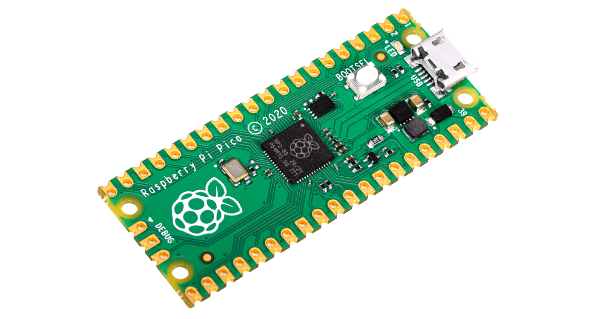
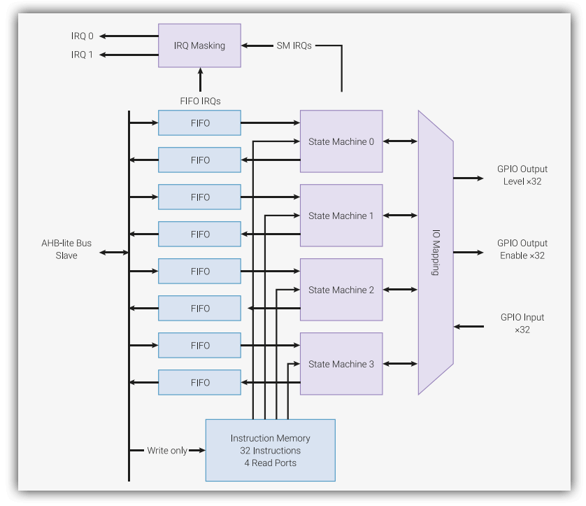
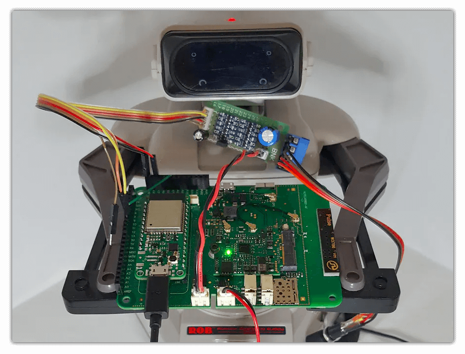
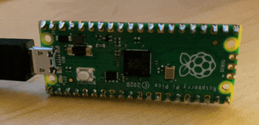

# A Practical Look at PIO on the Raspberry Pi Pico

The [Raspberry Pi Pico](https://www.raspberrypi.org/products/raspberry-pi-pico/) took the microcontroller world by storm when it was released in early 2021. As the first MCU developed and released by the Raspberry Pi Foundation, the world immediately took notice (especially considering the undeniable success of the Raspberry Pi line of single-board computers).

Pulling back the covers on the Pico we quickly learned that it was not just another MCU. Most notably, it included support for a feature called **Programmable I/O (PIO)**. 

Before we dive into PIO on the Raspberry Pi Pico, let's take *one big step back*.

## What is the Raspberry Pi Pico?

Remember when Apple made some noise with their introduction of [Apple Silicon](https://www.apple.com/newsroom/2020/06/apple-announces-mac-transition-to-apple-silicon/)? In what I assume was a tongue-in-cheek move, the Raspberry Pi Foundation matched Apple with the first release of their own internally developed chip under the guise of "Raspberry Silicon". That chip is the RP2040 and the Pico is the official dev kit for the RP2040 from the Raspberry Pi Foundation:



*Image credit Raspberry Pi Foundation.*

Priced at a budget level $4 USD, the Pico is a great microcontroller for beginners and experts alike. Officially known and distributed as the RP2040, the Pico includes hardware and firmware features such as:

- A dual-core Arm Cortex-M0+ processor;
- 264KB of on-chip RAM;
- Built-in support for MicroPython;
- A wide range of I/O options, including this thing called Programmable I/O (PIO).

> Curious about using the Raspberry Pi Pico with cellular connectivity? Check out this Hackster tutorial on [Adding Cellular to the Raspberry Pi Pico](https://www.hackster.io/brandonsatrom/adding-cellular-to-the-raspberry-pi-pico-b8a4b6).

Let's take a high level look at **what** PIO is, **when** you might considering using it, and finally **how** you would actually use it.

## What is Programmable I/O (PIO)?

All MCUs and SBCs include support for communication protocols like I2C and SPI. The RP2040 is no different, with 2 x UART, 2 x SPI, and 2 x I2C controllers. This allows the Pico to easily communicate with a wide variety of common peripherals.

However, many of us have encountered scenarios where we are building a solution around legacy technology or even trying to use multiple SPI devices with a single MCU. This is where the RP2040's PIO support comes in to help.

Using PIO, you can create your own interfaces from scratch. In theory, you could even build completely new interfaces that haven't even been imagined yet!

On a slightly more technical level, an instance of a PIO is comparable to a tiny processor that runs code separately from the main Cortex-M0+. So what was previously accomplished by "bitbanging" protocols (and consuming CPU cycles), PIO does independently of the CPU.

*Here is the diagram for a single PIO block:*



*Image credit RP2040 datasheet.*

On the RP2040, each PIO instance includes four *state machines* that can each run instructions stored in shared instruction memory. This memory can hold 32 instructions, and each state machine can utilize any of said instructions. Each state machine can also control any of the GPIO pins on the Pico.

Programming a PIO instance is easier than you might expect. Since it relies on special assembly instructions, you can write code in any editor (instead of a proprietary "Raspberry Pi Pico" IDE for example).

Speaking of writing code to program a PIO instance, the PIO language consists of nine, and only nine, instructions:

- in()
- out()
- push()
- pull()
- mov()
- irq()
- wait()
- jmp()
- set()

At first glance, this may not seem like many, but they actually provide for a wide variety of features.

Let's switch gears to a more practical issue: when would I actually use PIO? It's a valid question, as in most maker projects, the on-board support for I2C, UART, and SPI will be plenty. However, there are times when PIO can be a critical advantage.

## When would I use PIO?

Ever encounter a scenario where you need more UART connections that are available on a board? What about outputting directly to DVI video? Or maybe you're trying to communicate with a legacy piece of hardware over serial without any supporting libraries available.

These are all valid scenarios for diving deeper into PIO on the Raspberry Pi Pico.

While unrelated to the Raspberry Pi Pico, there is a Hackster project that accomplishes the above without using PIO (but maybe the author wishes they had 🤔). [Remotely control the Nintendo R.O.B. robot over cellular.](https://www.hackster.io/zachary_fields/cellular-r-o-b-with-blues-wireless-38ac41)



*Image credit Zak Fields.*

## How do I use PIO on the Pico?

If you're like me, you can read blog posts all day and not really learn much of anything. And yes, I realize this comment is very meta 😅.

Personally I learn best by doing, and I start "doing" by copying-and-pasting code and working through it line-by-line.

When working with the Pico and MicroPython, I've found an endless amount of use from the [Pico MicroPython Examples repository](https://github.com/raspberrypi/pico-micropython-examples) on GitHub.

Case in point, in the `pio` directory we can find a relatively simple PIO example that:

1. Binds a single GPIO to the `set()` instruction;
2. Uses delays to blink an LED;
3. Instantiates a state machine to run the instructions and blink the on-board LED.

The full example is available here (lightly edited to remove comments):

```
import time
import rp2
from machine import Pin

@rp2.asm_pio(set_init=rp2.PIO.OUT_LOW)
def blink():
    wrap_target()
    set(pins, 1)   [31]
    nop()          [31]
    nop()          [31]
    nop()          [31]
    nop()          [31]
    set(pins, 0)   [31]
    nop()          [31]
    nop()          [31]
    nop()          [31]
    nop()          [31]
    wrap()

sm = rp2.StateMachine(0, blink, freq=2000, set_base=Pin(25))

sm.active(1)
time.sleep(3)
sm.active(0)
```

### What's happening in this code sample?

The PIO program is located within the `blink()` function (and note the `@rp2.asm_pio` decorator).

The `wrap_target()` and `wrap()` methods create a loop. The `set()` function accepts the target (in this case `pins`) and `1` denotes setting the pin high (and `0` low later on).

The `nop()` functions create an artificial delay of about 20 cycles each.

So, we are setting the GPIO pin high (illuminating the LED), pausing for some cycles, and then setting the pin low (turning the LED off). This causes a rapid blink visible to the human eye:



## Conclusion

PIO on the Raspberry Pi Pico can be incredibly useful when you're connecting to non-standard peripherals. That doesn't mean it's for everyone, but if you have a need to connect via communication protocols that are unknown or unavailable you'll quickly fall in love!

Be sure to check out the [RP2040 datasheet](https://datasheets.raspberrypi.org/rp2040/rp2040-datasheet.pdf) for more in-depth learning and this [PIO emulator](https://github.com/soundpaint/rp2040pio) for more advanced development and debugging scenarios.

Happy hacking with the Raspberry Pi Pico! 👩‍💻