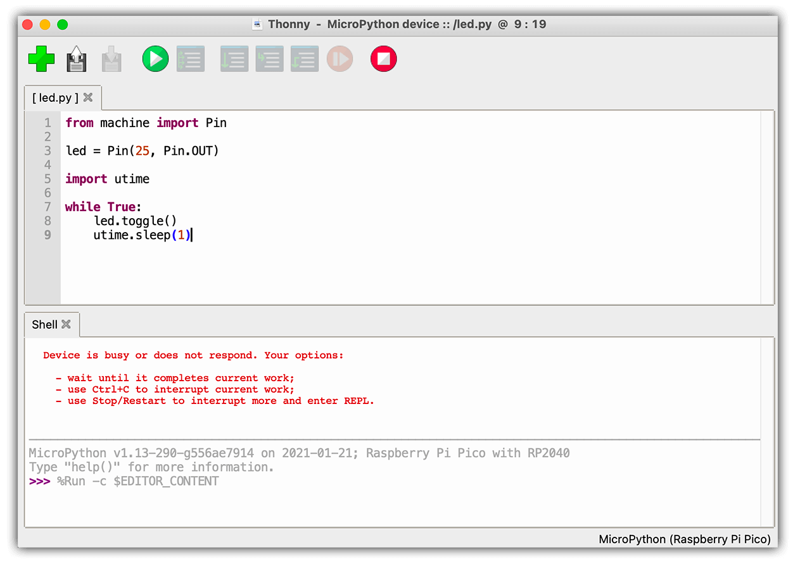
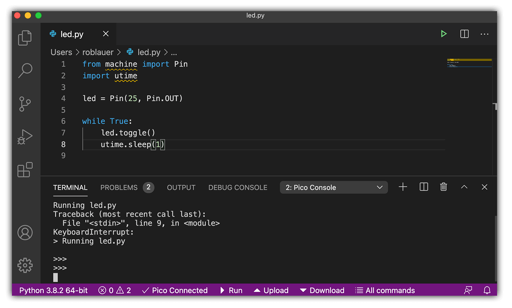
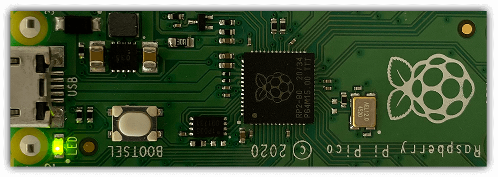
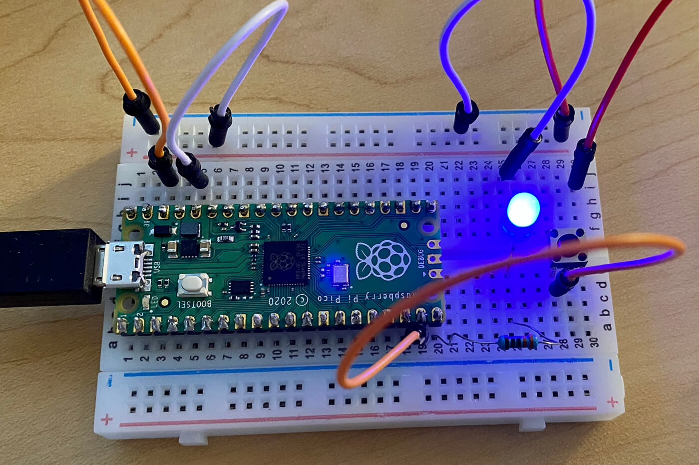

# Your First Steps with Raspberry Pi Pico and Visual Studio Code

The Raspberry Pi Foundation recently released their first microcontroller board, the [Raspberry Pi Pico](https://www.raspberrypi.org/products/raspberry-pi-pico/). This \$4 USD (not a typo!) device is not only a low-cost entry into the Raspberry Pi ecosystem, it's also surprisingly useful for embedded IoT development.     

While Raspberry Pis are best known as single board computers (e.g. the Raspberry Pi 1/2/3/4 models), the Pico was designed for use in a variety of physical computing solutions. Think in terms of controlling motors, reading sensors, [cellular connectivity](https://www.hackster.io/brandonsatrom/adding-cellular-to-the-raspberry-pi-pico-b8a4b6), and even [machine learning](https://github.com/raspberrypi/pico-tflmicro). As with other Raspberry Pi hardware, it's developer-friendly and can be programmed with C/C++ and [MicroPython](https://micropython.org/) (a Python implementation for microcontrollers).

Let's take a look at how we can go from unboxing our Pico to becoming productive IoT developers by utilizing an established language (MicroPython) and a universally adored IDE (Visual Studio Code).

## Why MicroPython?

As just mentioned, you can develop on the Pico MCU using either C/C++ or MicroPython. While I fully admire all of you C developers out there, I gravitate towards higher level languages like Python due to their ease of use and developer experience. The [MicroPython docs](http://docs.micropython.org/en/latest/) do a nice job of explaining what it is:

> MicroPython is a lean and efficient implementation of the Python 3 programming language that includes a small subset of the Python standard library and is optimised to run on microcontrollers and in constrained environments.

And recall, we are working on a \$4 MCU with minimal memory (264KB). MicroPython, being a trimmed down implementation of Python, is a nearly perfect solution for programming your Pico. The Pico port of MicroPython also includes additional modules for accessing Pico-specific hardware.

## Why Visual Studio Code?

If you have previous experience working with Raspberry Pi and MicroPython, your default IDE is probably [Thonny](https://thonny.org/):

Don't get me wrong, Thonny is a super fun little IDE to work with. The problem with Thonny is that it only takes you so far. I'm missing my productivity extensions, syntax autocompletion, error highlighting, and built-in terminal provided by [Visual Studio Code](https://code.visualstudio.com/).

I'm a big fan of meeting developers where they are (via popular languages AND tooling), so leveraging the uber-popular Visual Studio Code for developing on my Pico is where I'm going to start.

Aside from the productivity improvements you get from VS Code out of the box, for Python-specific development there are a few additional extensions I highly recommend:

- [MagicPython](https://marketplace.visualstudio.com/items?itemName=magicstack.MagicPython) - Advanced syntax highlighting for Python 3.
- [Pylance](https://marketplace.visualstudio.com/items?itemName=ms-python.vscode-pylance) - IntelliSense on steroids for Python.
- [Python](https://marketplace.visualstudio.com/items?itemName=ms-python.python) - Linting, debugging, you name it, for Python.

You can get all of these (and more) with the [Python Extension Pack](https://marketplace.visualstudio.com/items?itemName=donjayamanne.python-extension-pack).

Lastly I might recommend installing MicroPython locally to avoid any "missing imports" issues when linting your code in VS Code. You can use Homebrew on macOS `brew install micropython` to do so.

> **NOTE:** As of this writing, Homebrew doesn't support MicroPython installation on Apple Silicon M1 Macs. Also, I couldn't find a reliable way of installing MicroPython on Windows. Sound off in the comments if you have any suggestions!

## Set Up Your Pico for MicroPython

You program your Pico's firmware by holding down the `BOOTSEL` button, connecting it to your computer via USB, and dragging-and-dropping a file on to it. Pretty magical. But...MicroPython isn't supported out of the box.

Thankfully the folks at Raspberry Pi have done the heavily lifting to let us install MicroPython easily.

Navigate to the [Raspberry Pi Pico docs](https://www.raspberrypi.org/documentation/pico/getting-started/) and click on the "Getting started with MicroPython" tab:

 

Follow the instructions provided under "Drag and drop MicroPython" (summarized for you here):

1. Download the MicroPython UF2 file.
2. Push and hold the `BOOTSEL` button and plug your Pico into your computer.
3. Browse available drives and look for "RPI-RP2".
4. Drag-and-drop the downloaded UF2 file onto RPI-RP2.
5. Your Pico will automatically reboot...and now you are running MicroPython on your Pico!

## Visual Studio Code...Meet Pico

The beauty of VS Code is its massive [extension marketplace](https://marketplace.visualstudio.com/). A fine example of this is the [Pico-Go extension](https://marketplace.visualstudio.com/items?itemName=ChrisWood.pico-go) that we will install and use to connect to our Pico from VS Code.

If you've never installed a VS Code extension before (you're missing out!), just head to the Extensions tab and search for `Pico-Go`:

Provided your Pico is still plugged in, the extension will automatically discover any connected boards. You should see the following in the built-in terminal window:

	Searching for boards on serial devices...
	Connecting to COM3...
	
	>>>

> If you're on macOS, instead of connecting to `COM3` you'll see it connecting to `/dev/tty.usbmodem0000000000001`.

The `>>>` prompt tells you that you're in the MicroPython REPL and ready to execute some Python! To test this out, enter the simplest of simple Python commands:

	>>> print("Hello Pico")
	Hello Pico

Now that we know we can communicate with the Pico, let's take the next baby step and interact with on-device hardware.

## LED Goes BLINK!

The only hardware on the Pico that we can visually interact with is a tiny LED. So let's write a simple program that turns the LED on and off.

In VS Code, create a new project directory and a `led.py` file in that directory (file name doesn't matter). In `led.py` we can start by adding this import statement:

	from machine import Pin

The `machine` module is used to control your on-chip hardware. Next, let's set an `led` variable to the GPIO pin 25, where our LED is connected:

	led = Pin(25, Pin.OUT)

Finally, to turn the LED on (where `1` == on and `0` == off):

	led.value(1)

Save the file and look for the "➡️ Run" command at the bottom of your VS Code window. This will run `led.py` on the Pico. You can also use the "⬆️ Upload" command to transfer the open project in VS Code.

Your Pico's LED should now be in a static "on" position:

If you want to get fancier, you can `toggle` the LED to blink on-and-off by putting the command in an infinite loop and updating it every second:

	import utime
	
	while True:
		led.toggle()
		utime.sleep(1)

## Adding External Input and Output

Let's take our Pico journey to another level by integrating it with some external devices. In this section, we will turn an external LED on and off using a push-button.

> Not exactly setting the world on fire here, but it's a good next step for those of us just learning the Pico and Micropython!

To continue along, you'll need a few additional pieces of hardware:

1. Breadboard
2. Jumper wires
3. LED
4. 330 ohm resistor
5. Push-button switch

Our finished circuit will look something like this:

Now when looking at *why* the components are laid out the way they are, it's always helpful to consult the Raspberry Pi Pico pin layout (especially since the labels are *underneath* the board):

Our circuit is completed by connecting:

1. `GND38` to `-` side of the power rail.
2. `3V3` (power) to `+` side of the power rail.
3. `GP15` to the anode (longer) side of LED wire via the 330 ohm resistor.
4. `GP14` to read the press-button.
5. `-` power rail to cathode (shorter) side of LED wire.
6. `+` power rail to power the press-button (make sure it's on the diagonal side from the other connection).

Create a new file in VS Code and, at the top, import the same two modules we did in the previous section (`machine` and `utime`):

	from machine import Pin
	import utime

Create references to our press-button `button` and external LED `led` by referencing the pin locations used above:

	button = Pin(14, Pin.IN)
	led = Pin(15, Pin.OUT)

Finally, create a loop that will match the led value (remember `1` == on and `0` == off) to the value of the button press (`1` == pressed and `0` == not pressed). Finally, we can add a short `sleep` between iterations to prevent flickering when pressing/releasing the button:

	while True:
	    led.value(button.value())
	    utime.sleep(0.1)

And that's it! Now when you hold the button down, the LED should light up. 💡

## Adding a Thread

This is cool and all, but it also requires us to maintain pressure on the button for the LED to remain lit. What if we wanted it to act like a light switch? For instance, press it once to turn the LED on and again to turn it off.

Let's see how we can use Python's `_thread` module to add a thread to our program and enable this scenario.

> **NOTE:** The Python docs provide an [extensive overview of threading](https://docs.python.org/3/library/threading.html) if you're curious.

Building off of our existing code from above, continue by importing the `_thread` module:

	import _thread

Next we'll create a `global` variable that can be set and read by either thread of our program:

	global button_pressed
	button_pressed = False

Delete the existing `while` loop and add this `read_button()` method:

	def read_button():
	    global button_pressed
	    while True:
	        if button.value() == 1:
	            button_pressed = not button_pressed
	            utime.sleep(0.5)

What's going on here? This method is our second thread. The `while` loop will run infinitely to see if the button is being actively pressed. If so, set the `button_pressed` variable to be the *opposite* of what it currently is. If it's `False` it will become `True` and vice versa.

Next, we start the thread with:

	_thread.start_new_thread(read_button, ())

And finally we create another infinite loop that checks the value of our global `button_pressed` variable and turns the light on or off:

	while True:
	    if button_pressed == True:
	        led.value(1)
	    else:
	        led.value(0)

If you got lost along the way, here is the complete source:

	from machine import Pin
	import utime
	import _thread
	
	button = Pin(14, Pin.IN)
	led = Pin(15, Pin.OUT)
	
	global button_pressed
	button_pressed = False
	
	def read_button():
	    global button_pressed
	    while True:
	        if button.value() == 1:
	            button_pressed = not button_pressed
	            utime.sleep(0.5)
	
	_thread.start_new_thread(read_button, ())
	
	while True:
	    if button_pressed == True:
	        led.value(1)
	    else:
	        led.value(0)

## What's Next?

Congratulations! You've taken your first baby steps with Raspberry Pi Pico and Visual Studio Code.

A common next step would be to look at practical applications of what we've started to build here, which often means allowing your device to communicate with the world. How about pumping some sensor data (e.g. GPS location, humidity, temperature, etc) to the cloud and creating engaging data visualizations and dashboards?

The easiest, cheapest, and most reliable way of doing so is with global cellular. Cheapest? Take a look at the [Notecard from Blues Wireless](https://blues.io/) for 10 years of [global cellular](https://dev.blues.io/hardware/notecard-datasheet/note-wbex-500/#cellular-service) starting at \$49. *Full disclaimer: I work for Blues Wireless, but I stand behind what I say here!*

If you want to learn more about cellular + Pico, check out this tutorial on [Adding Cellular to the Raspberry Pi Pico](https://www.hackster.io/brandonsatrom/adding-cellular-to-the-raspberry-pi-pico-b8a4b6).