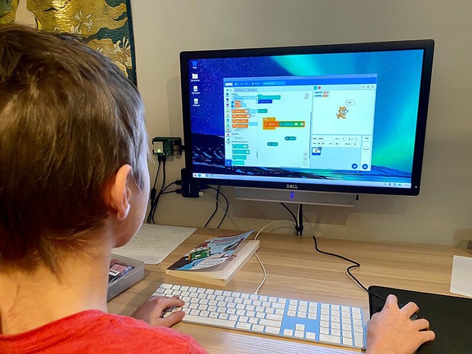
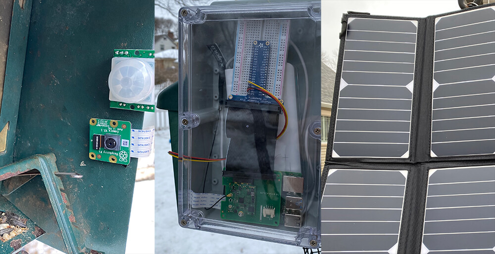
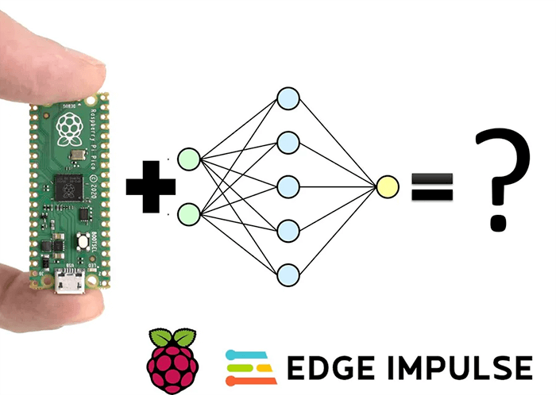
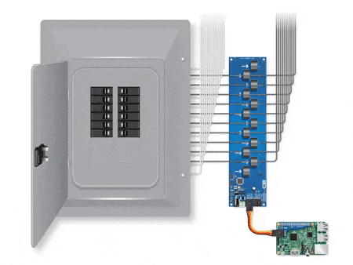

# Our Favorite Raspberry Pi (Day) Projects

Happy Pi Day everyone! 🥧

Let's start off by reciting as many digits of pi as we can, ok? I'll start:

3.1415...9?

So anyway, those of us in the Raspberry Pi community have fully co-opted Pi Day as way to celebrate the best of the RPi ecosystem. From the robust [Raspberry Pi 4](https://www.raspberrypi.org/products/raspberry-pi-4-model-b/) single board computer, all the way to the new [Raspberry Pi Pico](https://www.raspberrypi.org/products/raspberry-pi-pico/) microcontroller board, there are more options than ever to create IoT solutions with RPi hardware.

> **FUN FACT:** Did you know Raspberry Pi *wasn't* in fact named for the number pi? Initially RPi was designed to only run **Py**thon. We've collectively decided to ignore that for Pi Day though!

Like many of you, I have a personal affinity towards the Raspberry Pi as it was key to kicking off my interest in IoT. I was delighted to see it also spark my kid's "aha moment" when using Scratch to program a Sense HAT.

*Totally-not-staged photo of said event:*

## The Best of Raspberry Pi

Needless to say, all of us at [Blues Wireless](https://blues.io/) are massive fans of Raspberry Pi. On day one of our launch, we announced the [Notecarrier-Pi HAT](https://shop.blues.io/products/raspberry-pi-starter-kit), giving your RPi easy access to pre-paid global cellular connectivity.

Without further ado, here are some of our favorite Raspberry Pi projects:

## Vertical Hydroponic Farm 🌱

This elaborate project is an IoT-enabled hydroponic farm, powered by a Raspberry Pi. The system itself is maintained with a series of Arduino controllers, but they are all networked to a Raspberry Pi using I2C. This allows all system parameters to be monitored and updated in real time.

**Check out the full project on [hackster.io](https://www.hackster.io/bltrobotics/vertical-hydroponic-farm-44fef9).**

## Remote ML Bird Identification 🐦

Machine Learning is becoming a killer angle for broad IoT adoption, due to the new opportunities provided in edge computing. While identifying birds is a relatively common ML task, this project tackles the same problem in a remote environment by adding cellular connectivity to send SMS messages with Twilio (and a solar/battery powered option).

Not to mention, the entire code base is about 100 lines of Python!

**View the [complete build instructions](https://www.hackster.io/rob-lauer/remote-birding-with-tensorflow-lite-and-raspberry-pi-8c4fcc) to create your own remote ML solution.**

## Pneumonia Classification & Detection Using EdgeML 🧑‍⚕️

As fun as it is for us to tinker on relatively impractical IoT projects, we are continually impressed by those in the community who are able to address significant real world problems.

Our friend [Arijit Das](https://twitter.com/Arijit_Student) recently released a Raspberry Pi-based project that uses Machine Learning to analyze chest x-rays to help diagnose bacterial vs viral pneumonia.

**Take a look at [an overview of Arijit's project](https://www.hackster.io/arijit_das_student/pneumonia-classification-detection-using-edgeml-991e18).**

## Machine Learning on Raspberry Pi Pico 🤖

As previously mentioned, the Raspberry Pi Pico MCU is the new kid on the block in the Raspberry Pi ecosystem.

In this project, Dmitry Maslov dives into using a neural network trained with [Edge Impulse](https://www.edgeimpulse.com/) on the Pico!

**Read through Dmitry's tutorial [right here](https://www.hackster.io/dmitrywat/machine-learning-inference-on-raspberry-pico-2040-e6e874).**

## Adding Cellular to the Raspberry Pi Pico 📞

And speaking of the Raspberry Pi Pico, how about adding cellular to your next Pico project?

Brandon Satrom provides a beginner-friendly walkthrough of adding cellular connectivity to the Pico using MicroPython and the [Notecard](https://blues.io/products/).

**Follow along with Brandon in his [tutorial](https://www.hackster.io/brandonsatrom/adding-cellular-to-the-raspberry-pi-pico-b8a4b6).**

## Energy Monitoring through a Raspberry Pi ⚡

And finally, the folks from [Control Everything](https://www.hackster.io/ControlEverything) created an extensive walkthrough for setting up a current monitor with a Raspberry Pi and displaying circuit readings in a web UI.

This is a great tutorial as it also covers how to set up Apache on your RPi for serving web content.

**Check out the [complete how-to](https://www.hackster.io/ControlEverything/energy-monitoring-through-a-raspberry-pi-190a2a).**

## Remember: It's Also "Pie" Day

Go get yourself a piece of pie to celebrate, you deserve it. 🥧🥰

