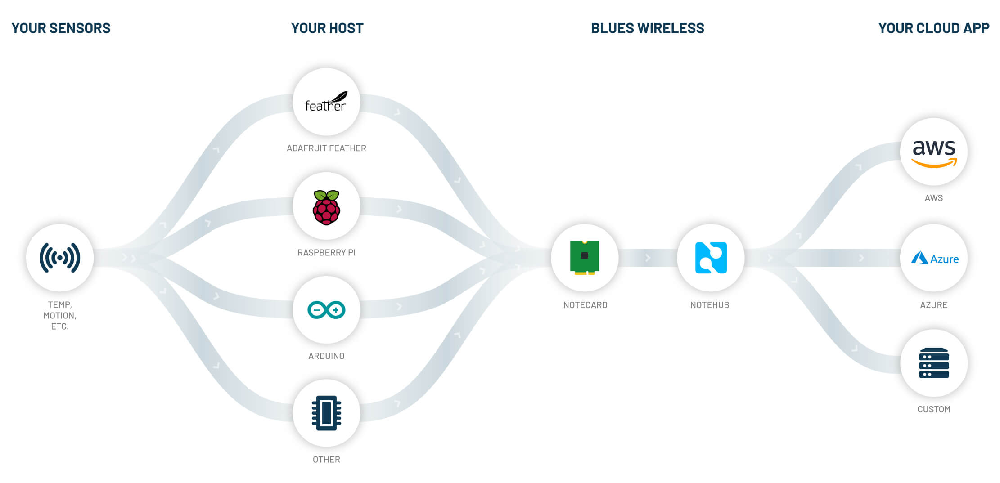
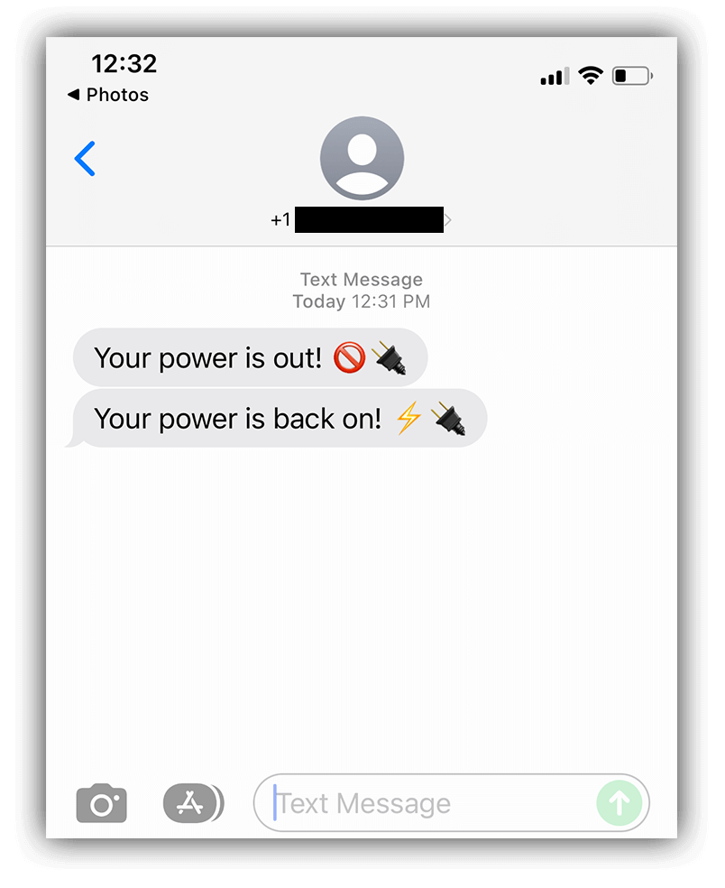

# Cellular-Enabled Power Outage Detector w/ SMS Notifications

It's estimated that [nearly 90% of the world's homes](https://www.who.int/news/item/21-05-2019-more-people-have-access-to-electricity-than-ever-before-but-world-is-falling-short-of-sustainable-energy-goals) have access to electricity, meaning nearly 90% of us inevitably become extremely annoyed when our power goes out. 😖

While most of the time it _is_ merely an annoyance, losing power (especially when we aren't aware of it) can lead to disastrous outcomes. This could mean anything from loss of equipment due to current surges when power is restored, to lives literally being on the line in critical care settings.

In this project, we're going to walk through how to build what I believe is the **simplest globally-available, cellular-enabled, power outage detector**, complete with instant SMS notifications powered by Twilio.


## What's in the Box? 📦

Put away your soldering iron for this project folks, because it doesn't get much easier!

We're going to take a [Blues Wireless Cellular Notecard](https://blues.io/products/notecard/?utm_source=hackster&utm_medium=web&utm_campaign=featured-project&utm_content=power-outage), attach it to a [Blues Wireless Notecarrier-A](https://blues.io/products/notecarrier/notecarrier-a/?utm_source=hackster&utm_medium=web&utm_campaign=featured-project&utm_content=power-outage), and use a newly-released Notecard firmware feature that allows for autonomous reporting of GPIO state changes _without a host microcontroller_.


We'll also need a small LiPo battery with a JST connector (any capacity will do), and a micro USB cable (with a wall outlet adapter).

## Why Cellular? And Why Notecard? 📶

When a power outage occurs, we can't rely on local networking hardware to be up and running (e.g. Wi-Fi). Cellular is the only reliable option in this scenario.

The Blues Wireless Notecard comes in both [Wi-Fi](https://blues.io/products/wifi-notecard/?utm_source=hackster&utm_medium=web&utm_campaign=featured-project&utm_content=power-outage) and [Cellular](https://blues.io/products/notecard/?utm_source=hackster&utm_medium=web&utm_campaign=featured-project&utm_content=power-outage) varieties. The [cellular models work globally](https://dev.blues.io/hardware/notecard-datasheet/note-nbgl-500/?utm_source=hackster&utm_medium=web&utm_campaign=featured-project&utm_content=power-outage#cellular-service) on LTE-M, NB-IoT, and Cat-1protocols and are different from traditional cellular modules as they come **prepaid with 500MB of data and 10 years of global cellular service**.


The secret to the Notecard's success (well, one secret) is the fact that it knows where to go as soon as you power it on. The Notecard doesn't live on the public Internet and only communicates through private VPN tunnels (making it an incredibly secure device). No certificate management or manual key rotations are required.

And what does the Notecard communicate with? It automatically syncs with the [Blues Wireless cloud service, Notehub.io](https://blues.io/services/?utm_source=hackster&utm_medium=web&utm_campaign=featured-project&utm_content=power-outage), which in turn can securely route data to quite literally any cloud service (like AWS, Azure, Google Cloud), RESTful endpoint, or MQTT-enabled service.



You simply power on the Notecard, use one of the commands from the [JSON-based Notecard API](https://dev.blues.io/reference/notecard-api/introduction/?utm_source=hackster&utm_medium=web&utm_campaign=featured-project&utm_content=power-outage), and it is able to communicate with the cloud.

## Let's Build a Power Outage Detector 🛠

As mentioned, we will be using the Notecard along with a Notecarrier-A. [Notecarriers](https://blues.io/products/notecarrier/?utm_source=hackster&utm_medium=web&utm_campaign=featured-project&utm_content=power-outage) are development boards that allow you to easily prototype an IoT solution with the Notecard. The Notecarrier-A provides onboard antennas, JST connectors, Qwiic connectors for peripherals, and exposes access to all the pins on the Notecard.

To begin, we simply slot the Notecard into the M.2 edge connector on the Notecarrier-A:


We then connect the `MAIN` u.fl connector on the Notecarrier-A to the `MAIN` u.fl on the Notecard. This allows use of the onboard cellular antennas on the Notecarrier:


> **NOTE:** You can optionally connect the `GPS` u.fl connector as well, which lets you [utilize the GPS module](https://dev.blues.io/notecard/notecard-walkthrough/time-and-location-requests/?utm_source=hackster&utm_medium=web&utm_campaign=featured-project&utm_content=power-outage) on the cellular Notecard.

Next, we need to run a short jumper wire to connect `VUSB` to `AUX1` on the Notecarrier-A. Why? Well, with the right `card.aux` Notecard API request, the Notecard can _automatically report state changes_ on any `AUX` pin (1-4). By connecting `VUSB` to `AUX1`, we are setting ourselves up to be able to report on a state change of a power loss to `VUSB`:


Connect the LiPo battery to the Notecarrier via the `LIPO` JST connector. Another advantage of the Notecarrier is that it will continually maintain a charge on the connected LiPo battery while it's powered over USB:


Finally, the Notecarrier can be connected to a wall socket you want to monitor, via the micro USB cable.

## Let's Set Up the Notecard 👩‍💻

The Notecard speaks one language: JSON.

All of the [Notecard API commands](https://dev.blues.io/reference/notecard-api/introduction/?utm_source=hackster&utm_medium=web&utm_campaign=featured-project&utm_content=power-outage) are in JSON, which also means that any programming language that can read and write strings can _also_ communicate with the Notecard. If you're working with an MCU or single-board computer, there are [Blues Wireless-supported SDKs](https://dev.blues.io/tools-and-sdks/?utm_source=hackster&utm_medium=web&utm_campaign=featured-project&utm_content=power-outage) for Python, C/C++, Arduino, and Go (and community-supported SDKs for [Rust](https://github.com/gauteh/notecard-rs) and [.NET](https://github.com/bytewizer/blueswireless)).

Using the in-browser terminal provided at [dev.blues.io](https://dev.blues.io/?utm_source=hackster&utm_medium=web&utm_campaign=featured-project&utm_content=power-outage), we can connect directly to our Notecard via the magic of Web Serial and issue JSON-based API commands:


Try issuing a sample command, like `{"req":"card.version"}`, to get some identifying information back from the Notecard:

```
> {"req":"card.version"}
{
 "body": {
  "org": "Blues Wireless",
  "product": "Notecard",
  "version": "notecard-3.3.1",
  "ver_major": 3,
  "ver_minor": 3,
  "ver_patch": 1,
  "ver_build": 14612,
  "built": "May 18 2022 11:21:51"
 },
 "version": "notecard-3.3.1.14612",
 "device": "dev:864475040543182",
 "name": "Blues Wireless Notecard",
 "sku": "NOTE-NBGL-500",
 "board": "1.11",
 "api": 3
}
```

> **NOTE:** This is a good opportunity to check your Notecard's firmware version! The new API feature we are about to use requires at least [firmware v3.3.1](https://dev.blues.io/notecard/notecard-firmware-updates/?utm_source=hackster&utm_medium=web&utm_campaign=featured-project&utm_content=power-outage).

Next up, we can [set up a new (free) account on Notehub.io](https://notehub.io/?utm_source=hackster&utm_medium=web&utm_campaign=featured-project&utm_content=power-outage) and create our first Notehub project.

This Notehub project is where we will see incoming data from the Notecard, and enable us to send SMS messages with Twilio:


Each Notehub account comes with 5,000 [consumption credits](TODO) which are only deducted when an event is routed out of a Notehub project (or if you use the [Notehub API](https://dev.blues.io/reference/notehub-api/api-introduction/?utm_source=hackster&utm_medium=web&utm_campaign=featured-project&utm_content=power-outage) to pull data out of a project). For many scenarios this means you can likely use Notehub for free, forever!

Every month you'll get topped-up to 5,000 events for free, can purchase more if you need them, and you get 5,000 additional one-time consumption credits with the purchase of each Notecard.

With the Notehub project created, we'll need to save the unique identifier (the [ProductUID](https://dev.blues.io/reference/glossary/?utm_source=hackster&utm_medium=web&utm_campaign=featured-project&utm_content=power-outage#productuid)) of the project, like:

```
com.company.name:power_outage
```

Next, head back to the in-browser terminal to associate this Notecard with the Notehub project we just created. To do so we use the [hub.set API](https://dev.blues.io/reference/notecard-api/hub-requests/?utm_source=hackster&utm_medium=web&utm_campaign=featured-project&utm_content=power-outage#hub-set):

```
{
  "req":"hub.set",
  "product":"com.blues.rlauer:power_outage",
  "mode":"continuous"
}
```

We can then quickly test out the cellular connection by using the [hub.sync API](https://dev.blues.io/reference/notecard-api/hub-requests/?utm_source=hackster&utm_medium=web&utm_campaign=featured-project&utm_content=power-outage#hub-sync), like so:

```
{"req": "hub.sync"}
```

In mere seconds, we can return to our Notehub project and see that the Notecard has successfully made a cellular connection:


**Now we get to the good stuff!** We can use a [new feature of the card.aux API](https://dev.blues.io/notecard/notecard-walkthrough/advanced-notecard-configuration/?utm_source=hackster&utm_medium=web&utm_campaign=featured-project&utm_content=power-outage#using-aux-gpio-mode) to enable autonomous reporting of state changes on the AUX pins with this command:

```
{
   "req":"card.aux",
   "mode":"gpio",
   "usage":[
      "input-pulldown",
      "off",
      "off",
      "off"
   ],
   "sync":true,
   "file":"power-outage.qo"
}
```

_What's going on in this request?_

The order of elements in the `usage` array correspond to the AUX pins. So the first item in the array == `AUX1` (to which our jumper wire is attached) and it's using the `input-pulldown` option to set the pin as a _pull-down input_.

The `"sync":true` parameter tells our Notecard to **immediately communicate any state changes** to our Notehub project.

Finally, the `"file":"power-outage.qo"` parameter provides an easy way of identifying/naming these state change events in Notehub.

## Let's Test it Out 🔌

Assuming we have our hardware plugged in and wired up the right way and our Notecard is successfully communicating with Notehub, we're ready to test a power outage! 💡

Simply unplug the micro USB cable from the Notecarrier-A. The LiPo battery will immediately become the active power source for the Notecard and a _state change_ on `AUX1` will be registered. You may notice the Notecard's green LED light up, letting you know that it's communicating with the cloud and sending a Note to Notehub:


This is great! 👍 In the provided JSON, we're seeing the `AUX1` pin state is `low`, meaning USB power has been lost:

```
{"state":[{"low":true},{},{},{}]}
```

We can also **plug the Notecarrier back in** to see what a state change event looks like when power is restored:

```
{"power":true,"state":[{"high":true},{},{},{}]}
```

Seeing this power outage data show up in Notehub, while nice, doesn't really help us to take any action (yet).

Our next step is to **set up SMS messaging** to get a text message within seconds of a power outage. This is accomplished with the _routing_ feature of Notehub.

## Let's Enable SMS Messaging 📲

[Notehub routes](https://dev.blues.io/guides-and-tutorials/routing-data-to-cloud/?utm_source=hackster&utm_medium=web&utm_campaign=featured-project&utm_content=power-outage) let you, well, _route_ data to any 3rd party cloud service. This could be a big cloud like AWS, Azure, or Google Cloud, an IoT platform like Datacake, Ubidots, Adafruit.io, or Losant. It could even be an MQTT service or a generic RESTful HTTP/S service, like what Twilio offers with their Messages endpoint:

```
https://api.twilio.com/2010-04-01/Accounts/[twilio_account_sid]/Messages.json
```

**Important!** Instead of reinventing the wheel here, please [follow the extensive Twilio SMS routing guide provided by Blues Wireless](https://dev.blues.io/guides-and-tutorials/routing-references/twilio-route/?utm_source=hackster&utm_medium=web&utm_campaign=featured-project&utm_content=power-outage) to enable access to Twilio's messaging APIs.

_Take your time going through that guide, we'll wait here until you are finished._


**Done? Great!** As you saw in that guide, there are a couple of small customizations we can make to the Notehub route to alter the SMS message that gets sent.

First, let's make sure we _only_ get notified when those `power-outage.qo` events are sent to Notehub. To do so, make sure to enter `power-outage.qo` in the field provided when configuring the Notehub route:


Second, Notehub allows you to use [JSONata](https://dev.blues.io/guides-and-tutorials/notecard-guides/using-jsonata-to-transform-json/?utm_source=hackster&utm_medium=web&utm_campaign=featured-project&utm_content=power-outage) to _transform_ JSON on the fly. This is outlined in the Twilio guide above, and I'm going to include the JSONata expression that I used:

```
"&Body=" & (body.state.low ? "Your power is out! 🚫🔌" : "Your power is back on! ⚡🔌") & "&From=+15551234567&To=+15551234567&"
```

The `Body` is the body of the text message (using a ternary operator in JSONata to determine which short message to send). `From` and `To` are my Twilio phone number and personal phone number, respectively.

This is applied in the **Data** section of the Notehub route:


With the Notehub route configured, it's time to test our setup (yes, again!) and this time we should now get a text message within moments of **disconnecting AND reconnecting** USB power from the Notecarrier:



## Great Success! 🎉

I hope you've seen how easy it can be to set up and configure a low-cost, globally-functional, cellular-enabled power outage detection solution with the Blues Wireless Notecard.

_Want to build one yourself?_

All you need to get started is:

- [Cellular Notecard](https://shop.blues.io/collections/notecard?utm_source=hackster&utm_medium=web&utm_campaign=featured-project&utm_content=power-outage)
- [Notecarrier-A](https://shop.blues.io/products/carr-al?utm_source=hackster&utm_medium=web&utm_campaign=featured-project&utm_content=power-outage)
- [LiPo battery](https://shop.blues.io/collections/accessories/products/5-000-mah-lipo-battery?utm_source=hackster&utm_medium=web&utm_campaign=featured-project&utm_content=power-outage) (any LiPo will do)
- Micro USB cable (with a wall socket adapter)

Now if you've actually read this entire writeup, we owe you a discount code! Feel free to **take 10% off** your order of a Notecard + Notecarrier-A with [this discount code](https://shop.blues.io/discount/POWER_OUTAGE_10).

Happy Hacking! 👩‍💻🔌💡