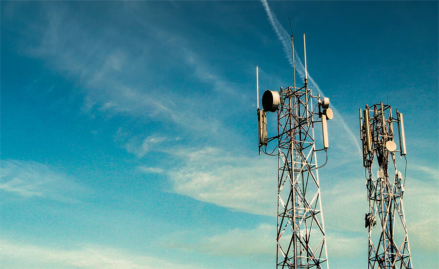
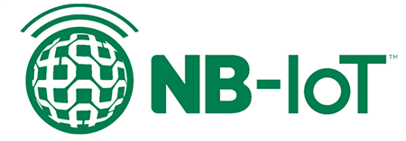
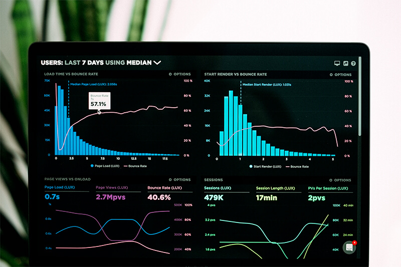
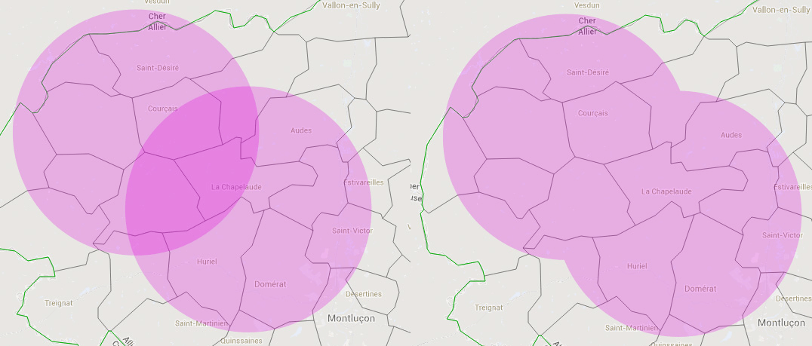

# What is Cellular IoT?

To say we live in a wirelessly connected world feels like a bit of a cliche. Many of us start our days checking smartphones, accessorizing with wearables, and telling Alexa to "play top songs by Nickelback". Ok, maybe not so much that last one.

The tin cans and wire of days gone by have been replaced by communication protocols like Wi-Fi, Bluetooth, and cellular to provide us seamless connectivity from home to work to...anywhere!


*The cellular-enabled [Notecard](https://blues.io/products/) from Blues Wireless. Not to scale.* 😊

IoT developers today have myriad choices when deciding [which network connectivity option is best for them](/blog/network-connectivity/). When you add up all the pros and cons, many are surprised to find cellular as the logical path forward (if not for a primary connection, then as a fallback).

This **mature and ubiquitous means of connecting IoT devices** is prized for its reliability and reach, yet vilified for its traditionally obtuse pricing and relatively low data throughput.

In this blog series we are demystifying cellular and taking a critical look at four key topics related to wireless in the Internet of Things:

- What is Cellular IoT? (that's today)
- The Advantages of Cellular IoT (coming soon!)
- Common Use Cases for Cellular IoT (coming soon!)
- Cellular IoT Network and Infrastructure Redundancy (coming soon!)

## So What is Cellular IoT Anyway?

Cellular IoT technologies allow physical devices (e.g. sensors, actuators, and their host microcontrollers or single-board computers) to connect to a private network or the public Internet for the purpose of transmitting data.

By leveraging the same infrastructure as mobile phones, cellular IoT takes advantage of the broad availability of existing cellular networks, but without the power requirements of traditional cellular applications. With 5G just around the corner, cellular IoT is well-positioned to take advantage of higher bandwidth solutions that would normally be allocated to Wi-Fi or wired Ethernet.



*Image credit [@riiyad](https://unsplash.com/@riiyad) on Unsplash.*

When we think about how cellular relates to the Internet of Things in particular, we stop thinking about just *person-to-device* cellular connections and instead open up to *device-to-device* connections (or device <--> person <--> device and every other iteration in between!).

The opportunities for the IoT then become limitless. Connected IoT solutions can be everything from streetlights that are controlled automatically, to remotely-monitored parking garages, to agricultural applications that optimize irrigation and fertilizer usage, or Machine Learning solutions that predict anomalies in remote settings.

## The Critical Role of LTE-M and NB-IoT

Let's take a closer look at two key technologies underpinning cellular IoT: [LTE-M](https://en.wikipedia.org/wiki/LTE-M) and [NB-IoT](https://en.wikipedia.org/wiki/Narrowband_IoT).

While 2G/3G protocols are perfectly adequate for many IoT applications, modern IoT generally relies on LTE-M or NB-IoT. The rapid proliferation of these wireless standards is setting us up for a new dawn of IoT connectivity.

These standards were designed from the start around low power consumption, embedded security, and reliability. Combining these technical advantages with existing ubiquitous cellular networks has provided the world with an unparalleled choice for remote IoT connectivity.

### What is LTE-M?

You can probably hazard a guess that LTE-M is closely related to the popular LTE (Long-Term Evolution) wireless standard. The [countries that support LTE](https://en.wikipedia.org/wiki/List_of_countries_by_4G_LTE_penetration) encompass a vast list primarily comprised of the Americas and parts of Europe.


LTE-M effectively stands for "Long-Term Evolution for Machines" and allows for IoT devices to piggyback on existing LTE networks. It was designed in a power-conscious manner for applications that require low-to-medium data throughput. With a bandwidth of 1.4 MHz (compared to 20 MHz for LTE), LTE-M provides great range but less throughput than LTE (approximately 375KB down and 300KB up). LTE-M also offers cell tower handoff features, making it a great mobility solution (even across multiple regions).

Asset tracking, wearables, home security, and home/business monitoring are all great examples of use cases for LTE-M in the IoT.

### What is NB-IoT?

Considering the Internet of Things is literally part of the name, NB-IoT was designed for the IoT. NB-IoT stands for "Narrowband-IoT" and is great for areas without robust LTE coverage or when bandwidth requirements are relatively minimal. Again, per its name, NB-IoT uses just a *narrow band* of the full bandwidth available.



Available globally where GSM is the flag-bearer (such as much of Europe, Africa, and Asia), NB-IoT devices consume very little power and provide less data throughout than LTE-M (approximately 60KB down and 30KB up). Compared to LTE-M's bandwidth of 1.4 MHz, NB-IoT operates on 200 KHz, providing **longer range and better indoor penetration**.

Certain use cases like smart cities (e.g. parking meters, utility monitoring), parking garages, indoor deployments, and agricultural settings are great examples of suitable NB-IoT implementations.

### Where Does 5G Fit?

We've all been subject to the hype around 5G. Some of it is warranted, but frankly the rest is a lot of marketing to get us to buy new phones.

Like the other "xG" standards we've gotten used to (2G/3G/4G), 5G is another ladder rung towards faster and stronger network connections. As IoT deployments accelerate in scope and magnitude, one can imagine industrial applications comprised of thousands of devices that are pushing gigabytes of data every day. 5G will likely be our destination come that time.

What about today? Are you likely to be live streaming 4K video with a Raspberry Pi Zero? Probably not, but the opportunity of 5G is intriguing as we look towards the greenfield future of IoT.

## LTE-M and NB-IoT on the Notecard

The [Notecard from Blues Wireless](https://blues.io/products/) provides cellular IoT connectivity in a low-power fashion using LTE-M, NB-IoT, and Cat-1 technologies. In global regions without these capabilities, coverage is supported by UMTS/HSPA+ and GSM/GPRS/EDGE wireless standards.


The Notecard is a secure device-to-cloud data-pump that comes with 500 MB of data and 10 years of cellular service. It's a tiny 30mm x 34mm SoM and ships ready to embed in a project via its M.2 edge connector. To make prototyping IoT projects easier, Blues Wireless provides a series of expansion boards to host the Notecard called [Notecarriers](https://blues.io/products/#notecarrier).

Businesses love the Notecard for its straightforward pricing: **$49 for 10 years of service and 500MB of data**.

Developers love the Notecard for its microcontroller- and single-board computer-agnostic approach (bring your own MCU or SBC!), its open source libraries for [Python](https://github.com/blues/note-python), [C/C++](https://github.com/blues/note-c), and [Arduino](https://github.com/blues/note-arduino), and its friendly JSON-in and JSON-out request/response interface.

*An example of adding a "note", or an event, with the [Notecard API](https://dev.blues.io/reference/complete-api-reference/introduction/):*

```
{
   "req":"note.add",
   "body":{
      "temperature": 35.5,
      "humidity": 56.23
   }
}
```

## Summary

Cellular IoT technologies like LTE-M and NB-IoT introduce significant advantages for remote IoT deployments. Growing to become an ideal option for a wide range of applications, especially those in mobile or otherwise unpredictable locations, cellular is a mature, reliable, and logical choice.

Learn more about how Blues Wireless is making cellular IoT adoption easier for businesses AND developers with the [Notecard and Notecarrier](https://blues.io/products/) (and read the next post in this series on [The Advantages of Cellular IoT](NEED LINK)).

--------------------------------------------------------------------------------

# The Advantages of Cellular IoT

IoT developers and the businesses that support them have a vested interest in using the best network connectivity option available (both from the developer experience _and_ expense angles). For many, Wi-Fi has been an obvious choice when high bandwidth is a requirement. While for others building stationary solutions with easy access to wired Ethernet, that connection method is equally a given.

The rest of us, though, may be actively implementing IoT solutions that:

- are in-motion or occasionally mobile,
- are deployed globally,
- require a redundant offsite network gateway,
- or need a reliable and secure connection.

Building on top of decades of global infrastructure, cellular should be a top
consideration when it comes to [picking the best IoT network connectivity
option](/blog/network-connectivity/).


_Image credit [@jacksloop](https://unsplash.com/@jacksloop) on Unsplash._

In this blog series we are demystifying cellular and taking a critical look at four key topics related to wireless in the Internet of Things:

- [What is Cellular IoT?](/blog/what-is-cellular-iot/)
- The Advantages of Cellular IoT (that's today)
- Common Use Cases for Cellular IoT (coming soon!)
- Cellular IoT Network and Infrastructure Redundancy (coming soon!)

## Cellular IoT Benefits

The advantages of utilizing cellular connectivity with the Internet of Things are extensive:

- **Coverage:** Cellular networks are ubiquitous, mature, and reliable.
- **Global Reach:** There is no other network technology with the reach of cellular.
- **Security:** SIM-based authentication and utilization of VPN tunnels makes cellular the most secure option.
- **Installation:** Works out-of-the-box without requiring local installation or technical expertise.
- **Low/No power:** Cellular modules can consume ~8mA of power and networks are still available should local power be cut.

When it comes to security, coverage, and usability, it's hard to compete with cellular.

_Let's dive into some of these benefits:_

### Global Cellular Coverage

For global IoT deployments, cellular connectivity is widely considered the most logical and reliable connection option. There is no need to build new infrastructure nor add additional network gateways to support remote deployments. You're simply connecting to the cell towers that are already in place.

Cellular _roaming_ is another consideration. Are you providing a solution that may either be deployed to an unknown spot in the world or move between regions? As cellular IoT projects move from location to location, your cellular provider must have agreements with partner carriers to facilitate seamless connectivity across regions without having to change SIMs.

**Example:** The [Notecard](https://blues.io/products/) from Blues Wireless [connects to 135 (and counting) countries globally](https://dev.blues.io/hardware/notecard-datasheet/note-wbex-500/#cellular-service) on LTE-M, NB-IoT, and Cat-1 networks. Where these standards are not available, coverage is supplemented by UMTS/HSPA+ and GSM/GPRS/EDGE.

### Cellular Security

Since cellular networks use SIM cards for authentication, it's exceedingly difficult to spoof the identity of a device. In the case of the Notecard, **the embedded SIM is pre-provisioned to securely communicate** with the Blues Wireless cloud service [Notehub.io](https://blues.io/services/). In addition, the Notecard includes an integrated STSAFE Secure Element with hardware crypto, a hardware random number generator, and a factory-installed ECC P-384 certificate (provisioned at the time of chip manufacturing).

Compare this to Wi-Fi: When connected to a public Wi-Fi network, devices are sharing the connection with all other devices on the network. If any individual device has a security concern, all devices are at-risk. **Cellular keeps every device separate from every other device, ensuring the security of the data being transmitted.**

### Cellular Reliability

Due to the importance of cellular connections today, **cellular IoT protocols can take advantage of existing performance characteristics**. Cellular operates in licensed bands, which dictate the performance and reliability of communication. Cellular also provides for a known number of connections per tower, which are actively managed behind the scenes, thus providing guarantees on service and reliability.

### Low Power Consumption

Historically, a significant limitation for cellular adoption has been power consumption and battery life (or lack thereof!). Modern cellular protocols make it possible for cellular IoT modules to not only save power when not in use, but to also transmit relatively small amounts of data with minimal power usage.

Both **LTE-M and NB-IoT are designed to offer years of operation from a battery-driven power source**. Since data throughput is limited (but often more than enough for relaying sensor data), simpler signal modulation schemes and less complex radio modems are needed, leading to diminished power requirements. Advances in wake/sleep modes on modern hardware only contribute to these benefits.

Case in point, the Notecard was designed from day one to focus on [low-power scenarios](https://dev.blues.io/reference/notecard-walkthrough/low-power-design/). The Notecard operates well on battery power, while being "always-on", maintaining time & location, and typically drawing **less than 8µA** when idle.

## Summary

The advantages of cellular IoT are clear. Unmatched global coverage, embedded device security, "it just works" installation, and exceedingly low power requirements make it an obvious choice for the IoT.

Learn more about how Blues Wireless is making cellular IoT adoption easier for businesses AND developers with the [Notecard and Notecarrier](https://blues.io/products/)] (and read the next post in this series on [Common Use Cases for Cellular IoT](NEED LINK)).

--------------------------------------------------------------------------------

# Common Use Cases for Cellular IoT

If you've been following along in [this blog series](NEED LINK), you've learned what cellular IoT really is and read some advantages for using cellular in your IoT solutions.

But what are some examples of those solutions? Who is using cellular IoT today? There are many valid (and obvious) use cases for cellular IoT, but at the same time there are scenarios where cellular isn't normally considered and should be.

In this blog series we are demystifying cellular and taking a critical look at four key topics related to wireless in the Internet of Things:

- [What is Cellular IoT?](NEED LINK)
- [The Advantages of Cellular IoT](NEED LINK)
- Common Use Cases for Cellular IoT (that's today)
- Cellular IoT Network and Infrastructure Redundancy (coming soon!)

## Monitoring Critical Systems

Imagine power is cut (either purposefully or due to a local power outage). Is your system monitoring critical systems that still need to report on collected data? The answer is likely a resounding "YES!" if you're monitoring security, smoke, fire, or any other systems that require 24/7/365 uptime. Therefore, relying on a network outside of your infrastructure can be a critical necessity.

## Global, Remote, and Outdoor Deployments

Cellular networks are ubiquitous to the extent that they are the only networking option that can be considered truly "global". Whether you are tracking assets from country to country or deploying solutions that are stationary but in unpredictable locations, cellular is the only viable option.


*Image credit [@jxk](https://unsplash.com/@jxk) on Unsplash.*

Likewise, IoT solutions deployed in rural or agricultural settings that only have 2G access often rely on cellular for connectivity.

## Smart Cities

While some cities have tried to set up their own public Wi-Fi networks (with varying degrees of success), most rely upon cellular for their "smart city" initiatives.

A great example of this is utility meters. Normally installed inside or attached to the outside of a home or office, gas, electrical, and water meters need to be read on a regular basis in order to provide the most accurate billing statements. **Cellular provides the best choice for cities** who want to both automate the collection of this data and provide real time access, from city center to the distant suburbs.

## "It Just Works" Deployment

When's the last time you bought a device and then had to figure out how to connect it to your home's Wi-Fi network? Now imagine yourself a non-technical user who doesn't know the SSID or even the password for your Wi-Fi router.

Cellular allows for pre-provisioned network access that "just works" when the end user turns on the device. Numerous consumer-installed IoT sensor-detection devices like smoke, fire, radon, and carbon monoxide can take advantage of providing a friction-free end user experience.

## Cellular as a Fallback

This is not all to say that other connectivity options are "bad". In fact, there are numerous scenarios where Wi-Fi or LoRa make more sense than cellular. This brings up another valid use case for cellular though: as a fallback solution.

What happens if your local network gateway is disabled due to either a power failure or hardware issue? If a Wi-Fi router decides to stop working in the middle of the night, can your deployment recover? Cellular can be enabled as a failsafe network option to ensure no lapses in connectivity.

## The Notecard for All of the Above

The [Notecard from Blues Wireless](https://blues.io/products/) provides wireless connectivity for IoT projects of all types. It checks all the boxes we've referenced above, [and then some](https://dev.blues.io/).


As a secure device-to-cloud data-pump that comes with 500 MB of data and 10 years of cellular service, the Notecard is a 30mm x 34mm SoM and ships ready to embed in a project via its M.2 edge connector. To make prototyping IoT projects easier, Blues Wireless provides a series of expansion boards to host the Notecard called [Notecarriers](https://blues.io/products/#notecarrier).

## Summary

Cellular IoT is often the best choice for a wide range of IoT applications, especially those in varied indoor and outdoor settings. From smart cities with their remotely-monitored lights and parking meters, to critical system monitoring, even to self-driving cars and beyond, the reliability, security, and ubiquity of cellular connections make it the most logical choice for IoT solutions of all types

Learn more about how Blues Wireless is making cellular IoT adoption easier for businesses AND developers with the [Notecard and Notecarrier](https://blues.io/products/) (and read the next post in this series on [Cellular IoT Network and Infrastructure Redundancy](NEED LINK)).

--------------------------------------------------------------------------------

# Cellular IoT Network and Infrastructure Redundancy

If you've been following along [in this blog series](NEED LINK), you've seen how cellular connectivity can be ideal for IoT solutions in logistics, manufacturing, security, asset tracking, and other industries.

Cellular IoT devices can send and receive data from virtually anywhere in the world, utilizing an infrastructure that has been built up over decades.



*Image credit [@lukechesser](https://unsplash.com/@lukechesser) on Unsplash.*

Today we are going to tackle the topic of *redundancy* in relation to cellular IoT network connectivity. How prepared are you for all possible remote deployment scenarios for the lifespan of your IoT device?

In this blog series we are demystifying cellular and taking a critical look at four key topics related to wireless in the Internet of Things:

- [What is Cellular IoT?](NEED LINK)
- [The Advantages of Cellular IoT](NEED LINK)
- [Common Use Cases for Cellular IoT](NEED LINK)
- Cellular IoT Network and Infrastructure Redundancy (that's today)

## Why Redundancy is Critical for the IoT

What *does* happen if your device loses its network connection? Can it still perform the tasks that it was built to do? Does data accumulate in storage until the device is full and then it fails?

Regardless of the *why* of a failure, your end user is less likely to blame their Wi-Fi router and more likely to blame you, the device provider, for not being able to account for all outage scenarios.

This is why **redundancy is a critical component** of proper cellular IoT deployments. With a contingency plan for every predictable failure point, you can maximize availability and reduce the impact of negative network issues. Even if you're banking on Wi-Fi, wired Ethernet, or LoRaWAN, cellular can (and should) be a key consideration when crafting a fallback, or redundant, network solution.

Redundancy is important with the devices themselves, yes, but it's just as important to work with a mobile network operator that considers redundancy at a higher level.

## Cellular Network Redundancy

Many cellular IoT providers offer SIM cards that are limited to a single mobile network operator in a single geographic area. What if your SIM card is limited to a specific network in a single country only? How do you deploy to rural areas with coverage on another network, not to mention other countries entirely?

A proper cellular IoT company will offer solutions that work with highly-regarded cellular providers and their first class partners in neighboring regions. When you can't predict the country of deployment, or if the solution itself is meant to travel between geographic regions, a seamless handoff of signal from network-to-network is critical.

It's also important to factor in which wireless standards your IoT module is using. If you're moving from a region with primarily GSM support to LTE, for example, will your solution gracefully recover?

Case in point, the [Blues Wireless Notecard](https://blues.io/products/) provides cellular IoT connectivity in a low-power fashion using LTE-M, NB-IoT, and Cat-1 technologies. In global regions without access to these standards, coverage is available via UMTS/HSPA+ and GSM/GPRS/EDGE.

## Cellular Infrastructure Redundancy

If you consider a traditional Wi-Fi or wired Ethernet deployment, your network relies on a single node or gateway to function. Your devices will only be connected to the network for as long as that centralized connection point is also live.

Cellular, on the other hand, has a massive advantage in terms of overlapping tower coverage. If access to one cell tower is lost, there is a high probability of another tower taking over (albeit with possibly a weaker signal, but a signal nonetheless).



With this method of overlapping cell tower zones, your devices will always have a fallback connection should a centralized access point go down.

## Cellular Security

There is always an inherent risk with connecting to the Internet. We constantly work to mitigate those risks with SSL certificate verification, robust authentication protocols, VPNs, and the like.

Cellular holds numerous security-related advantages for those of us building in the IoT:

- Mobile networks **securely authenticate** devices via SIM cards.
- Devices don't "share" the network like they do on Wi-Fi, so they **can't interact with each other**.
- Cell network firewalls can **limit device connectivity** to only core functions.
- Device manufacturers can provide a **VPN tunnel** from device to cloud without exposing it to a public Internet connection.

This is where the Blues Wireless Notecard shines. The Notecard comes pre-provisioned to securely communicate with the Blues Wireless cloud service, Notehub.io. Traffic to/from the Notecard travels through VPN tunnels and is **never exposed to the public Internet**.

## Summary

Using an IoT connectivity option with redundant capabilities in terms of network, infrastructure, and security is paramount. Cellular IoT is the best choice for a wide range of IoT applications, and the baked-in advantages provided by utilizing an existing mature network can't be understated.

Learn more about how Blues Wireless is making cellular IoT adoption easier for businesses AND developers with the [Notecard and Notecarrier](https://blues.io/products/).

