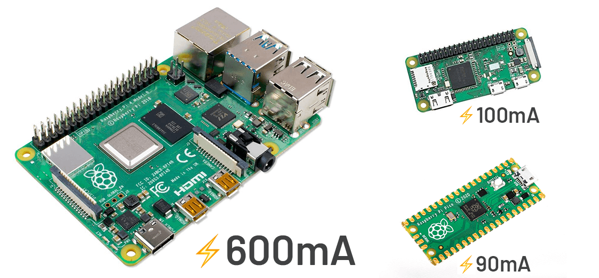

# Optimizing Raspberry Pi Power Consumption

*Tips and tricks for optimizing the power consumption of a Raspberry Pi to make it a candidate for off-grid remote monitoring.*

_Title image credit [@vishnumaiea](https://unsplash.com/@vishnumaiea) on Unsplash._

When the Raspberry Pi single-board computer was [first announced back in 2012](https://raspberrytips.com/raspberry-pi-history/), I doubt few people were considering the utility of a Pi in a truly off-grid setting, especially considering the state of battery technology at the time.

Fast forward to today. While we haven't exactly made at-home nuclear reactors a thing (yet), we do have access to robust battery and solar tech along with new reasons to [deploy Raspberry Pis in edge computing scenarios](https://www.hackster.io/rob-lauer/remote-birding-with-tensorflow-lite-and-raspberry-pi-8c4fcc).


## Why Raspberry Pi?

There are numerous microcontrollers or even stripped-down SBCs like the [Raspberry Pi Zero](https://www.raspberrypi.org/products/raspberry-pi-zero/) that are more energy efficient options than a full Raspberry Pi 4. But that efficiency comes with a cost of its own in terms of a reduction in features and functionality.



Maybe a good first question we should be asking is: *Why on earth would we want to deploy a Raspberry Pi remotely?* And the answer? Admittedly, you normally wouldn't want to!

However, there are some legitimate exceptions to the rule:

### CPU Power

If you're remotely [running Machine Learning models](https://www.hackster.io/brandonsatrom/monitor-the-analog-world-with-tinyml-fd59c4) that need to be processed in near realtime, the ARM Cortex-A72 CPU running at 1.5GHz is tough to beat.

### Ease of Expansion

The Pi HAT ecosystem is mature and provides production-ready expansion options for nearly every scenario. Case in point, the [Notecard and Notecarrier Pi HAT](https://shop.blues.io/products/raspberry-pi-starter-kit) from Blues Wireless allow for drop-in cellular communications (at a **power-sipping 8mA** when idle) for scenarios where remote data relaying is a key requirement.


### Python FTW

The [Raspberry Pi OS](https://www.raspberrypi.org/software/operating-systems/) ships with a full Python distribution. While [CircuitPython](https://circuitpython.org/) and [MicroPython](https://micropython.org/) are fine for the vast majority of IoT projects, there are some Python libraries that don't support those two derivatives.

## Power Optimization Tips

The anchor around the neck of the Raspberry Pi is its estimated [600mA active current consumption](https://www.raspberrypi.org/documentation/hardware/raspberrypi/power/README.md).

Let's see how we can trim that down to a manageable value with some simple configuration tweaks.

### Disable the USB Controller

**Power Saved? Approximately 100mA.**

If you're running your Raspberry Pi in a headless configuration, it's likely you can get away with not powering the onboard USB controller. *Note that even if you aren't using a mouse or keyboard, they are still powered!*

To disable the USB controller:

```
echo '1-1' |sudo tee /sys/bus/usb/drivers/usb/unbind
```

To re-enable the USB controller:

```
echo '1-1' |sudo tee /sys/bus/usb/drivers/usb/bind
```

*After a reboot the USB controller will be enabled automatically.*

### Disable HDMI Output

**Power Saved? Approximately 30mA.**

Again on a headless Pi you, by definition, don't need to hook up a monitor. If that's the case, you can also disable the HDMI output.

To disable HDMI:

```
sudo /opt/vc/bin/tvservice -o
```

To re-enable HDMI:

```
sudo /opt/vc/bin/tvservice -p
```

*Like with disabling USB, HDMI is enabled after a reboot.*

### Disable Wi-Fi and Bluetooth

**Power Saved? Approximately 40mA.**

If your solution isn't using Wi-Fi or Bluetooth, you can likely disable them.

> **IMPORTANT:** If you disable HDMI, USB, and Wi-Fi at the same time you'll have trouble interfacing with your Pi!

To disable Wi-Fi and Bluetooth, open `/boot/config.txt`, add these parameters, and reboot:

```
[all]
dtoverlay=disable-wifi
dtoverlay=disable-bt
```

To re-enable them, simply remove the parameters from the file and reboot.

### Clock Down the CPU

**Power Saved? Varies!**

If you don't require the full power of the Raspberry Pi CPU (which is overkill for many remote monitoring situations anyway), you might save a few mA by "underclocking" the CPU.

For example, to set the CPU clock speed to a maximum of 900MHz, you could update `/boot/config.txt` and change the following parameters:

```
[all]
arm_freq=900
arm_freq_max=900
```

You can also play around with the `core_freq_min`, `over_voltage`, `over_voltage_min`, and many other parameters that are well documented in the [Raspberry Pi overclocking options](https://www.raspberrypi.org/documentation/configuration/config-txt/overclocking.md).

Please note that you may not see power savings in certain scenarios. For example, if you have a process that runs longer at a slower clock speed, versus shorter at a faster clock speed, you're not going to see a net change in power consumption.

### Disable LEDs

**Power Saved? Approximately 10mA.**

We can disable the on-board LEDs on the Pi by again editing the `/boot/config.txt` file, adding the following, and rebooting:

```
[pi4]
# Disable the PWR LED
dtparam=pwr_led_trigger=none
dtparam=pwr_led_activelow=off
# Disable the Activity LED
dtparam=act_led_trigger=none
dtparam=act_led_activelow=off
# Disable ethernet port LEDs
dtparam=eth_led0=4
dtparam=eth_led1=4
```

*Note that these are specific to the Raspberry Pi 4 Model B!*

### Making Changes Permanent (or Resetting to Default)

Any changes made to your `/boot/config.txt` file will persist after a reboot. If you'd like to issue the USB, HDMI, Wi-Fi, and Bluetooth disabling commands upon boot, edit your `.bashrc` file and add those commands.

Likewise, deleting the changes you made to `/boot/config.txt` and rebooting will reset your Raspberry Pi back to its default state.

## Supplemental Power

Maybe the most obvious tip of them all for remote deployments is to source additional power from the sun. By adding a reasonably-sized solar array to your Raspberry Pi, you can significantly extend battery life (even, in theory, making it a sustainable solution in full sun environments!).

Using the [PiJuice HAT](https://uk.pi-supply.com/products/pijuice-standard) is an easy way to add a solar array to your Raspberry Pi. It also provides mechanisms for graceful shutdowns (and boot ups) at pre-defined battery charge levels.

You can see a PiJuice used in this Hackster project: [Solar-Powered Crypto Mining with Raspberry Pi](https://www.hackster.io/rob-lauer/solar-powered-crypto-mining-with-raspberry-pi-64adee).


*PiJuice HAT, solar array, and Notecarrier Pi.*

Alternatively, you can use a USB power bank with pass-through charging. This allows the power bank to power the Pi, and a solar array to charge the battery at the same time.

This arrangement was put to the test in the another Hackster project: [Remote Birding with TensorFlow Lite and Raspberry Pi](https://www.hackster.io/rob-lauer/remote-birding-with-tensorflow-lite-and-raspberry-pi-8c4fcc).

## Power-Optimized Cellular

Remote monitoring solutions are often outside the range of traditional network communication options like Wi-Fi. This is one reason why [Blues Wireless](https://blues.io/) created the developer-friendly [Notecard](https://blues.io/products/) to provide cost-effective cellular for IoT solutions.


The Notecard is a tiny 30mm x 34mm SoM and ships ready to embed in a project via its M.2 connector. To make prototyping easier, Blues Wireless also provides a series of expansion boards (called Notecarriers).

The Notecarrier-Pi acts as a host HAT for the Notecard. It provides an interface between the Raspberry Pi and the Notecard. With pass-through headers, it fits right in with whatever other Pi HATs you are using (like the PiJuice HAT pictured above!).

*The beauty of the Notecard can be boiled down to:*

1. 🧑‍💻 The **simplicity** of the API (JSON in and JSON out).
2. 🤝 The **agnostic nature** of full SBC and MCU compatibility.
3. 💰 The **pricing** ($49 for 10 years and 500MB of data).
4. 🔐 The **baked-in security model** with encrypted traffic traveling through VPN tunnels.
5. ⚡️ The **power-sipping 8mA** when idle.

Learn more about how the Notecard makes a perfect companion to your power-optimized Raspberry Pi by [browsing the documentation](https://dev.blues.io/) or grabbing your own [Raspberry Pi Starter Kit](https://shop.blues.io/products/raspberry-pi-starter-kit). ⚡️