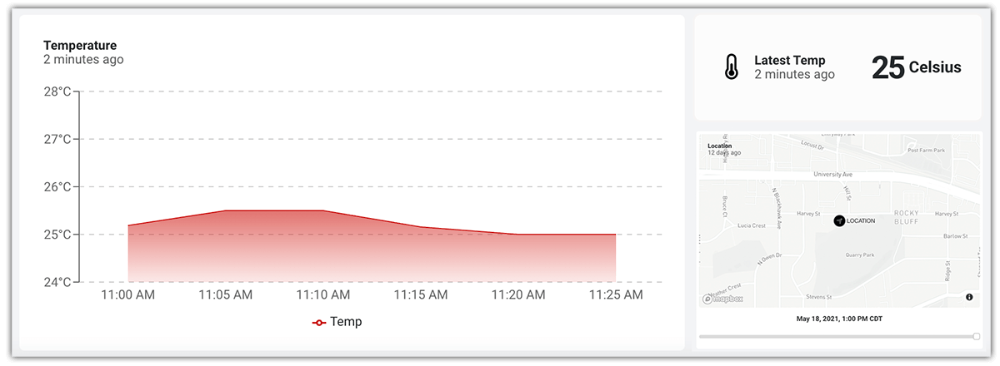

# Is the Raspberry Pi a Practical Solution for Remote Monitoring?

I'm hoping a good portion of you saw the recent [Explaining Computers video](https://youtu.be/lPyDtuzYE5s) comparing various Raspberry Pi models and how long they last on a 12V lead acid battery versus a USB battery pack. If not, it's worth a watch!

This inspired me to think more about how useful a Raspberry Pi 4 Model B could *really* be in a remote, battery-powered setting. I mean it's tempting, right? When developing on a single-board computer (SBC) you get access to the full Python language and all of its libraries. There is a file system that can handle whatever you throw at it (within reason). Virtually anything you want to run on a generic Linux distribution can run on a Pi.

But...the Raspberry Pi 4 wasn't necessarily designed to run off-grid. That's what the [Raspberry Pi Zero](https://www.raspberrypi.org/products/raspberry-pi-zero/) and [Raspberry Pi Pico](https://www.raspberrypi.org/products/raspberry-pi-pico/) are for after all.


However, there are scenarios where, whether it's out of convenience or necessity, using a Raspberry Pi to its fullest extent in the wilds is worth trying.

In this project, I want to measure how long a [Raspberry Pi 4 Model B](https://www.raspberrypi.org/products/raspberry-pi-4-model-b/) will last on a USB power bank in a real world setting as it gathers sensor data and relays it to the cloud. I also want to **run a comparison** between a stock Raspberry Pi configuration and a Pi optimized with a set of [power-optimizing strategies](NEEDLINK).

*I'll tackle this with:*

- Raspberry Pi 4 Model B (of course)
- The largest (affordable) battery pack I could find (a 30,000 mAh beast)
- The [Blues Wireless Notecard](https://blues.io/) (for remote cellular and an onboard temperature sensor)

If you'd like to see a short video summary of the project (and maybe watch me get electrocuted), you can check it out on YouTube:

VIDEO

## My Power Consumption Hypothesis

Let's start with the estimated power consumption of a Raspberry Pi 4 Model B. According to the [Raspberry Pi docs](https://www.raspberrypi.org/documentation/hardware/raspberrypi/power/README.md), we can expect about **600mA** of consumption from an "active" RPi. Obviously this is a rough estimation considering everything an RPi may, or may not, be doing.

To supply power, the ROMOSS 30,000mAh USB power bank fit the bill. Its capacity is ridiculous, it offers pass-through charging (important if you were to add a solar array), and in my opinion, incredibly inexpensive.

IMAGE OF ROMOSS

The only other piece of hardware is the Blues Wireless Notecard for cellular data access. In terms of power consumption, looking at the [Notecard datasheet](https://dev.blues.io/hardware/notecard-datasheet/note-wbex-500/#power-information) we see:

> The Notecard typically sits in an **~8mA idle mode** waiting for a request from the host MCU, however the Notecard current draw increases to the ~250mA range when the modem is active.

Since it's difficult to predict *precisely* how often and for how long the Raspberry Pi will use the cellular capability, the Notecard datasheet additionally specifies:

> Although the Notecard typically draws very little current, this supply should be designed with a **150mA** budget allocated to the Notecard.

*Get out your calculators!*

600mA + 150mA = **750mA** (and even this is probably a wild overestimate!).

*Therefore...*

30,000 mAh battery x 0.75 (assuming we will get about 75% of the advertised capacity) = 22,500 mAh.

22,500/750 = **30 hours** of run time.

At this stage, I'm highly skeptical that the Raspberry Pi + Notecard will actually draw that much current. I also think I might be underselling the battery pack.

Keep in mind, too, that this configuration doesn't optimize any power-related settings on the Raspberry Pi...yet!

## A Bit About the Notecard

I chose to use the Notecard (and its companion Notecarrier-Pi HAT host) as it's the easiest solution I know of to add network connectivity when Wi-Fi or wired Ethernet aren't available.

It also includes an onboard temperature sensor and **consumes a mere 8mA when idle**, making it a great option for battery-powered deployments.


The Notecard is a tiny 30mm x 34mm SoM and ships ready to embed in a project via an M.2 edge connector. To make prototyping easier, Blues Wireless also provides a series of expansion boards called Notecarriers. For example, the Notecarrier-Pi acts as a **host HAT** for the Notecard. It provides an interface between the Raspberry Pi and the Notecard.

*The beauty of the Notecard can be boiled down to:*

1. 🧑‍💻 The **simplicity** of the API (JSON in and JSON out).
2. 🤝 The **agnostic nature** of full SBC and MCU compatibility.
3. 💰 The **pricing** ($49 for 10 years and 500MB of data).
4. 🔐 The **baked-in security model** with encrypted traffic traveling through VPN tunnels.
5. ⚡️ The **power-sipping 8mA** when idle.

You can get started with the Notecard and a Raspberry Pi with the [Raspberry Pi Starter Kit](https://shop.blues.io/products/raspberry-pi-starter-kit).

## Project Setup

Since I am accessorizing my Raspberry Pi with only the Notecard/Notecarrier-Pi HAT and a USB battery pack, the hardware setup is quite simple.

IMAGE OF HARDWARE

To make this as real-world as possible, I'm going to write a Python script that samples temperature data from the Notecard and relays it to the cloud at five minute intervals.

The data will be delivered to the [Blues Wireless cloud service, Notehub.io](https://blues.io/services/) (but only if there is data pending), and **routing** the data to a cloud-based dashboard provider.

By using a *periodic* mode of cellular connectivity, we help to reduce the battery draw that would exist with a continuous cellular connection.

The completed Python script is [available here on GitHub](https://github.com/rdlauer/pibattery). Let's walk through the important sections here:

> **NOTE:** These examples use the fluent API provided by the [note-python library](https://github.com/blues/note-python).

### Initialize the Notecard

The Notecard can communicate over I2C or serial. When working with a Raspberry Pi,  it's pretty easy to open an I2C port and assign a Notecard with a project on Notehub.io:

```
# init the Notecard for cellular
productUID = keys.PRODUCT_UID
port = I2C("/dev/i2c-1")
nCard = notecard.OpenI2C(port, 0, 0)

# associate Notecard with Notehub.io project
rsp = hub.set(nCard,
              product=productUID,
              mode="periodic",
              outbound=5)
```

### Gather Sensor Data

Since the Notecard ships with an onboard temperature sensor, we can simply grab a reading with:

```
rsp = card.temp(nCard)
temp = rsp["value"]
```

### Send Data over Cellular

Finally to queue this data to be sent over cellular to Notehub, we simply add a new note, provide an optional file name identifier, and add the temperature value in a JSON object:

```
note.add(nCard,
         file="temp.qo",
         body={"temp": temp})
```

And we're ready to go! ⚡️

## Cloud Reporting

With my project running I decided to add a simple cloud-based dashboard to visualize this data we are sending. One of the advantages of using Notehub is its **built-in routing capabilities**.

I used Datacake as my cloud dashboard provider as it's easy to securely deliver data to and then create an engaging dashboard report. After following the [Datacake routing guide on the Blues Wireless Developer Portal](https://dev.blues.io/build/tutorials/route-tutorial/datacake/), I was able to create a chart showing the gathered temperature data over time:



## Drumroll Please! (Unoptimized Version)

Recall how I estimated that we'd see about **30 hours of run time**? Well, with this remotely-functioning Raspberry Pi running off of a 30,000 mAh battery pack, I started receiving data in Notehub at:


...and the last proof of life from the Raspberry Pi was at:


That's about **41 hours**, not bad.

**But the story doesn't end there!**

## Drumroll Please (Optimized Version)

Once I completed a full battery cycle with the stock configuration of the Raspberry Pi OS, I implemented the configuration changes documented in this [guide on power optimizing a Raspberry Pi](NEEDLINK).

After disabling the USB controller, HDMI output, LEDs, Wi-Fi, Bluetooth, and so on, I re-ran the entire test from scratch.

*And the results?* 🧐

Starting on:


...I consistently received signals from the Raspberry Pi until:


Leading to a total of **44 hours** (a 7% improvement)!

## What's Your Remote RPi Use Case?

Hopefully this has inspired some of you to use your Raspberry Pi in more remote settings than you might normally consider.

Happy (off-grid) hacking! ⚡️
