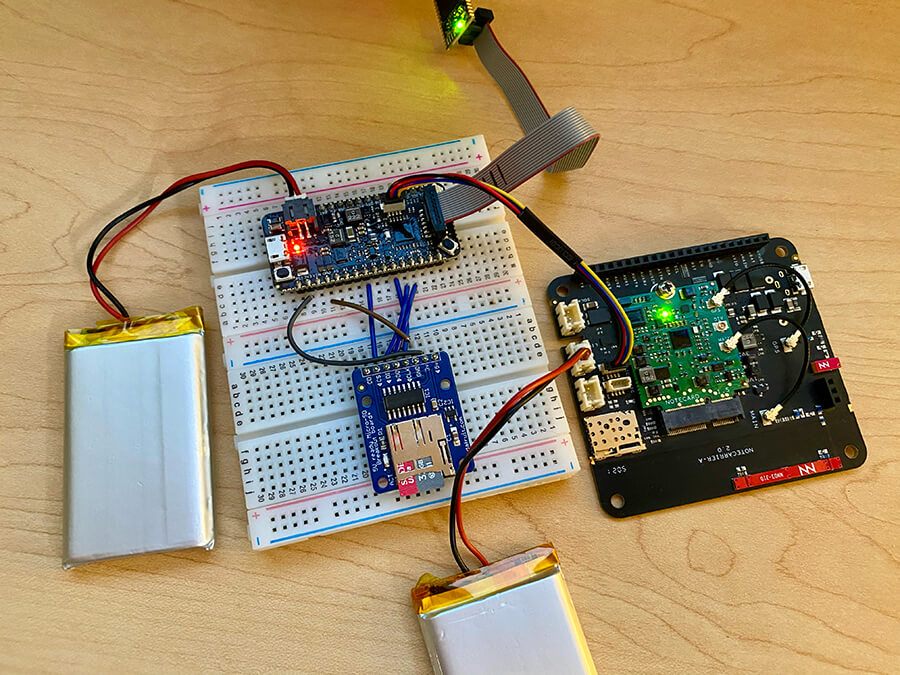
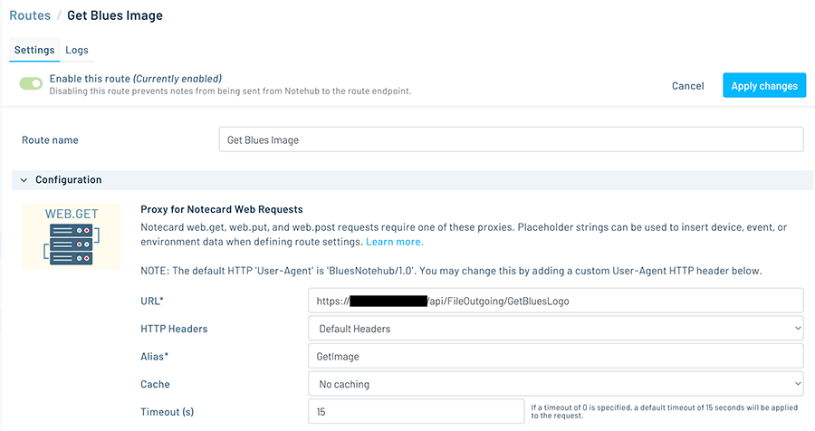
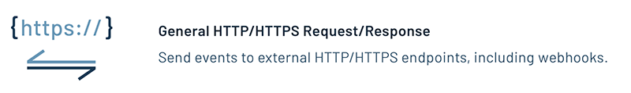
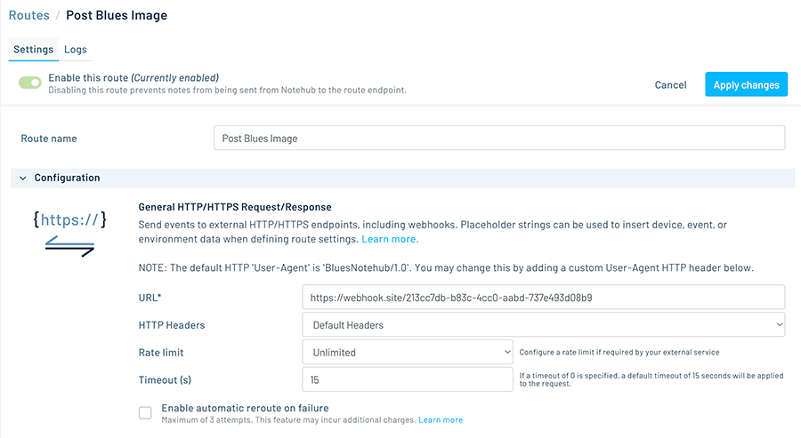
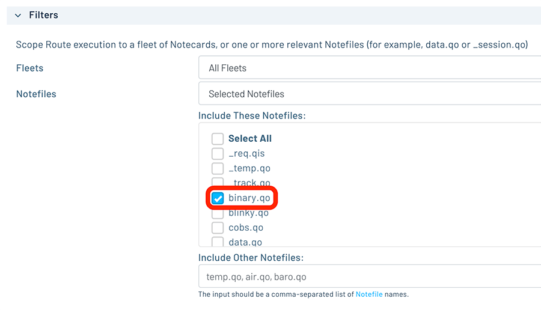
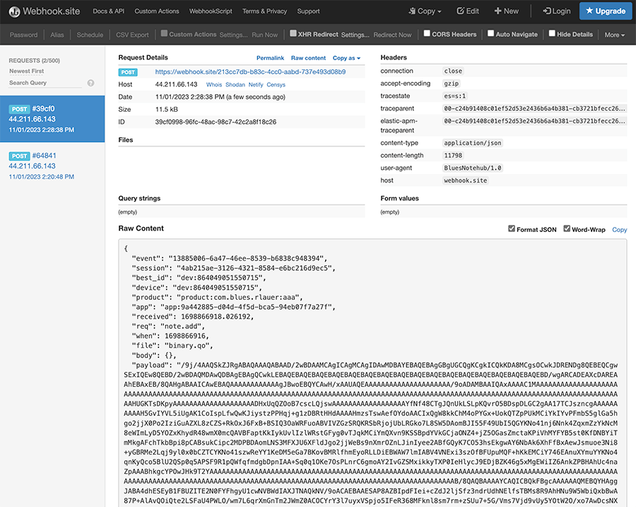

# Sending and Receiving Binary Files with the Notecard and Notehub

*Learn how to use the card.binary APIs to send and receive files from/to a Micro SD card using the Blues Notecard and Notehub.*

The Notecard was originally designed as a [low-bandwidth](https://dev.blues.io/notecard/notecard-walkthrough/low-bandwidth-design/#low-bandwidth-design) and [low-power](https://dev.blues.io/notecard/notecard-walkthrough/low-power-design/#low-power-design) device that effortlessly syncs user-defined JSON payloads (e.g. key/value pairs of strings, booleans, and integers) with any cloud endpoint. However, one of the most-repeated requests we heard from customers is the ability to _also_ sync larger payloads of binary data (most often in the form of images).

With the release of the [Notecard developer firmware release v5.3.1](https://dev.blues.io/notecard/notecard-firmware-updates/#v5-3-1-september-18th-2023), this is now possible using the new [card.binary APIs](https://dev.blues.io/api-reference/notecard-api/card-requests/#card-binary). Even better, our firmware libraries for [Arduino/C](https://dev.blues.io/tools-and-sdks/firmware-libraries/arduino-library/) and [Python](https://dev.blues.io/tools-and-sdks/firmware-libraries/python-library/) abstract away the complexity of the `card.binary` requests for you.

In this article, I'm going to show an example in Arduino/C of how to:

1. Request a JPEG image from a cloud endpoint.
2. Write that JPEG image to a Micro SD card.
3. Send that same JPEG image back to a different cloud endpoint.

## Hardware Setup

For this example, I'm using the following hardware:

- [Blues Swan](https://shop.blues.io/collections/swan/products/swan) (STM32L4-based host MCU)
- [STLINK Programmer/Debugger](https://shop.blues.io/collections/swan/products/stlink-v3mini) (optional, but makes working with STM32-based MCUs more pleasant)
- [Blues Notecard Cellular](https://shop.blues.io/products/notecard) (any Notecard will do!)
- [Blues Notecarrier A](https://shop.blues.io/products/carr-al) (a development board for interfacing with the Notecard)
- [Adafruit's Micro SD breakout board](https://www.adafruit.com/product/254)
- [2 x LiPo batteries](https://shop.blues.io/collections/accessories/products/5-000-mah-lipo-battery)

### Wiring the Micro SD Breakout to the Swan

First, you'll want to wire up the Swan to the Micro SD breakout. The following table outlines the wiring needed to connect the two:

| SD Breakout | Blues Swan |
| ----------- | ---------- |
| GND | GND |
| 3v | 3V3 |
| CLK | CK |
| DO | MI |
| DI | MO |
| CS | A3 |

### Attaching the Notecarrier to the Swan

Next, attach the Notecarrier A to the Swan via a Qwiic cable. Note that the Swan and Notecarrier A *also* need to be powered separately either over Micro USB or an attached LiPo battery, as Qwiic doesn't deliver enough power to boot the Notecard.

Your hardware should look something like the following (with or without the STLINK debugger of course):



## Format the Micro SD Card

If you haven't already, be sure the Micro SD card you're using is already formatted as either FAT16 (if <= 2GB) or FAT32. If not, you can use a USB SD card reader with your PC to format it using the SD Association's Memory Card Formatter (available on [macOS/Win](https://www.sdcard.org/downloads/formatter/) and [Linux](https://www.sdcard.org/downloads/sd-memory-card-formatter-for-linux/)).

Now it's time to write the sketch!

BEGIN NOTE

Looking for a shortcut? [Check out this gist](https://gist.github.com/rdlauer/4f50bbb44a1b10100a0bc62b7cc820b2) to see the completed sketch.

END NOTE

## Setup the Notecard and SD Card Breakout

Include the necessary libraries in your project, including [note-arduino](https://dev.blues.io/tools-and-sdks/firmware-libraries/arduino-library/) for the Notecard and the [Arduino SD Library](https://github.com/arduino-libraries/SD) for the Micro SD breakout board. Also, add the variables needed to interface with the components:

```c
#include <Arduino.h>
#include <Wire.h>
#include <Notecard.h>
#include <SD.h>

Notecard notecard;
File myImageFile;
Sd2Card card;
SdVolume volume;
SdFile root;
const int chipSelect = A3;
HardwareSerial stlinkSerial(PIN_VCP_RX, PIN_VCP_TX);
#define usbSerial Serial

int ledPin = LED_BUILTIN; // references onboard LED on Swan
```

## Initialize the Notecard and Micro SD Breakout

Most everything else occurs in the `setup()` method.

Set the `pinMode` of the Swan's onboard LED to `OUTPUT` so we can blink it later. Also, if you're using the STLINK, be sure to initialize it so you can see output in the serial monitor.

```c
pinMode(ledPin, OUTPUT);

Wire.begin();

// if using STLINK debugger
stlinkSerial.begin(115200);
const size_t usb_timeout_ms = 5000;
for (const size_t start_ms = millis(); !stlinkSerial && (millis() - start_ms) < usb_timeout_ms;)
  ;
  
notecard.setDebugOutputStream(stlinkSerial);
```

Next, initialize the Notecard, **link your Notecard to your project in Notehub** via the `product` key, and reset the Notecard's binary storage area to make sure we have the space required to save an image.

BEGIN NOTE

If you haven't [set up a Notehub account yet](https://notehub.io/), you should, because it's free to use (up to 5,000 events routed per month!) and only takes an email address.

END NOTE

```c
notecard.begin();

J *req = notecard.newRequest("hub.set");
JAddStringToObject(req, "product", "com.your.project:uid");
JAddStringToObject(req, "mode", "continuous");
JAddBoolToObject(req, "sync", true);
notecard.sendRequestWithRetry(req, 5);

// wait until we are connected to notehub
// this is REQUIRED when sending binary data!
bool connected = false;
while (!connected)
{
  req = notecard.newRequest("hub.status");
  J *rsp = notecard.requestAndResponse(req);
  connected = JGetBool(rsp, "connected");
  delay(2000);
}

// Reset the Notecard's binary storage area, so we can start fresh
NoteBinaryStoreReset();
```

Next, initialize the connected Micro SD card:
  
```c
// init the SD card for usage
stlinkSerial.println("Initializing SD card...");

if (!card.init(SPI_HALF_SPEED, chipSelect))
{
  stlinkSerial.println("SD card initialization failed!");
  while (1);
}

// try to open the 'volume'/'partition' - it should be FAT16 or FAT32
if (!volume.init(card))
{
  stlinkSerial.println("Could not find FAT16/FAT32 partition.\nMake sure you've formatted the card");
  while (1);
}
```

That's it for our initialization tasks. Next up, it's time to request an image file!

## Request an Image from the Cloud

For security reasons, the Notecard cannot connect directly to any arbitrary cloud endpoint. It doesn't have a public IP address, nor would you want it to have one. This is where Notehub comes into play, as the Notecard and Notehub work together to form a secure "off the public Internet" link.

To request a binary file from a cloud end point, we'll have to set up a [Notehub Route](https://dev.blues.io/notehub/notehub-walkthrough/#routing-data-with-notehub).

BEGIN NOTE

Routes allow you to send data from Notehub to a public cloud like AWS, Azure, or Google Cloud, a messaging platform like MQTT, or a custom HTTP/HTTPS endpoint. Routes are defined in a Notehub for a single project, and can target any number of Notecard fleets and devices.

END NOTE

Let's say you have a cloud endpoint that will return binary data (i.e. an image file). Make sure you have the URL of the endpoint available.

In Notehub, navigate to the **Routes** menu option, and create a new **Proxy for Notecard Web Requests** route:


Supply an arbitrary **Route Name** and the **URL** that Notehub should use to fetch the image with a `GET`. Also, you'll need to add an arbitrary **Alias** string, which is how you'll reference this Route in the sketch below.



**That's it!**

Back in your sketch, you'll use the [web.get API](https://dev.blues.io/api-reference/notecard-api/web-requests/#web-get) to call the newly-created Notehub Route (called `GetImage`) and store whatever binary data is returned in flash on the Notecard:

```c
J *req = NoteNewRequest("web.get"))
JAddStringToObject(req, "route", "GetImage");
JAddBoolToObject(req, "binary", true);

if (!NoteRequest(req))
{
  notecard.logDebug("Error receiving image\n");
}

uint32_t data_len = 0;
NoteBinaryStoreDecodedLength(&data_len);

uint32_t rx_buffer_len = NoteBinaryCodecMaxEncodedLength(data_len);
uint8_t *rx_buffer = (uint8_t *)malloc(rx_buffer_len);

// Receive the data
NoteBinaryStoreReceive(reinterpret_cast<uint8_t *>(rx_buffer), rx_buffer_len, 0, data_len);
notecard.logDebugf("\n[INFO] Received %d bytes.\n", data_len);
```

## Save the Image to the Micro SD Card

Next, you'll want to write the saved binary buffer from the Notecard to the Micro SD card, using methods provided by the Arduino library:

```c
// save the buffer to the specified file name on the SD card
SD.begin(chipSelect);
SD.remove("logo.jpg"); // remove the file if it already exists
myImageFile = SD.open("logo.jpg", FILE_WRITE);

if (myImageFile)
{
  myImageFile.write(rx_buffer, data_len);
  myImageFile.close();
  stlinkSerial.println("Completed writing the file!\n");
}
```

You can now pull the SD card out of the breakout board and pop it into your PC to see if the file was saved correctly (in my case I downloaded the Blues logo of course).


*Yes you'll just have to take my word that it worked!*

## Send the Image Back to a Cloud Endpoint

So far you've downloaded a file and saved it to SD, but what about uploading it back to another cloud endpoint?

Welcome to the magic of Notehub Routes (yes, they work both ways)!

Back in Notehub, again navigate to the **Routes** menu option, and create a new **General HTTP/HTTPS Request/Response** route (this is different than the **Proxy for Notecard Web Requests** route type, as this time we will be generating a payload locally using [Notes](https://dev.blues.io/api-reference/glossary/#note) to send data from the Notecard to Notehub).



Provide an arbitrary Route Name and the remote URL that Notehub will use to `POST` the binary data. In my case, I used the venerable webhook.site for an easy way to inspect outbound data to the cloud.



Continue to the **Filters** section and be sure that you are only routing data from the Notecard that appears in the `binary.qo` Notefile (this is the name of the Notefile that will contain the binary payload).



**All set?** Back to your sketch!

```c
const uint32_t notecard_binary_area_offset = 0;
NoteBinaryStoreTransmit(reinterpret_cast<uint8_t *>(rx_buffer), data_len, sizeof(rx_buffer), notecard_binary_area_offset);
notecard.logDebugf("\n[INFO] Transmitted %d bytes.\n", data_len);

// Send the binary data to Notehub
if (J *req = notecard.newRequest("note.add"))
{
  JAddStringToObject(req, "file", "binary.qo");
  JAddBoolToObject(req, "binary", true);
  JAddBoolToObject(req, "live", true);
  notecard.sendRequest(req);
}

// Free the receive buffer
free(rx_buffer);

stlinkSerial.println("Completed sending the file!\n");
```

Believe it or not, that's all that is required. In this code block, you are using the saved binary buffer that's already stored in flash on the Notecard (the image file just downloaded previously) and sending it to Notehub using the [note.add API](https://dev.blues.io/api-reference/notecard-api/note-requests/#note-add). Note that you're also supplying the `binary:true` and `live:true` arguments of `note.add` in order to pass the binary data from the Notecard to Notehub!

## Viewing the Binary Payload in the Cloud

Depending on how you set up the Notehub Route that `POST`s data, you should be able to see the binary data delivered. As mentioned earlier, I used webhook.site which lets me inspect delivered payloads. Here is a snippet of the binary file I delivered:



## Wrapping Up with a Blink and a Loop

Since I like to get some visual indication that my sketch has run to completion, in the `loop()` method, I simply flash the Swan's onboard LED on and off:

```c
void loop()
{
  // Finally, blink the Swan's LED when done!
  digitalWrite(ledPin, HIGH);
  delay(1000);
  digitalWrite(ledPin, LOW);
  delay(1000);
}
```

> For a quick view of the full Arduino sketch, [consult this gist](https://gist.github.com/rdlauer/4f50bbb44a1b10100a0bc62b7cc820b2).

## Next Steps

What I've shown here is a relatively simple way of downloading and uploading binary data with the Notecard. More likely you may be dealing with larger binary files that have to be processed in "chunks" that the Notecard can handle. Be sure to consult our [additional example Arduino sketch](https://github.com/blues/note-arduino/tree/master/examples/Example9_BinarySendReceiveChunked) that shows how to accomplish this more advanced scenario.

If you haven't already, [grab your own Blues Starter Kit](https://shop.blues.io/collections/blues-starter-kits) and see how easy it really can be to sync data from a physical device to the cloud (over Cellular, Wi-Fi, or LoRa!).

Happy Hacking! 💙
